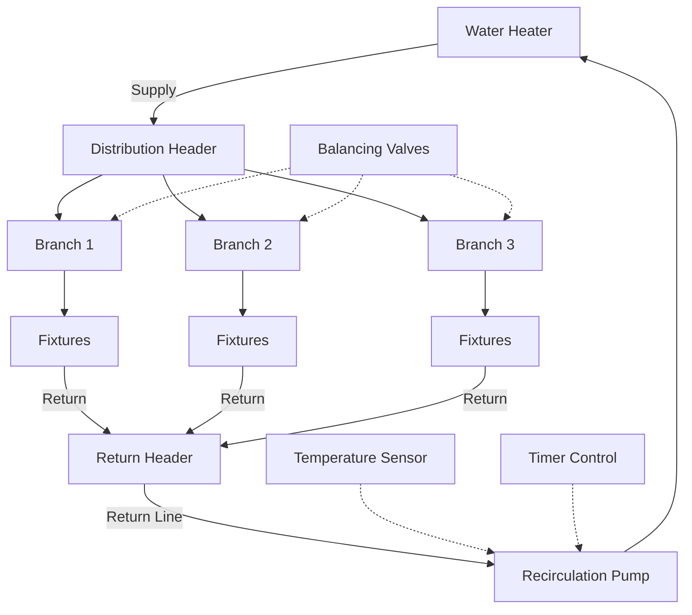

## Обзор

Системы рециркуляции обеспечивают наличие горячей воды в приборах путём непрерывной или периодической циркуляции нагретой воды через контуры подачи и возврата. Эти системы исключают время ожидания подачи горячей воды, но вводят значительные энергетические потери через тепловые потери трубопровода и работу насоса. Надлежащее проектирование требует баланса между удобством, энергоэффективностью и соответствием нормативным требованиям.

## Конфигурации систем

### Типы конфигураций

**Непрерывная циркуляция:** Насос работает круглосуточно, обеспечивая мгновенную подачу горячей воды, но максимальное энергопотребление. Применяется в больницах и коммерческих объектах, где критична немедленная доступность.

**Управление по таймеру:** Насос работает в запланированные периоды занятости. Снижает энергопотребление на 40-60% по сравнению с непрерывной работой при сохранении доступности в период пикового спроса.

**Управление по температуре:** Термостат в самом удалённом приборе активирует насос, когда температура воды обратного трубопровода падает ниже установки (обычно 40,6-43,3°C). Уравновешивает энергосбережение с доступностью по требованию.

**Управление по требованию:** Активация кнопкой или датчиком движения. Наиболее высокая энергоэффективность, но требует взаимодействия пользователя и создаёт короткие времена ожидания.

## Расчёты тепловых потерь трубопровода

Тепловые потери из трубопровода рециркуляции определяют энергопотребление системы. Рассчитайте по формуле:

$$Q_{loss} = U \cdot A \cdot \Delta T$$

Где:
- $Q_{loss}$ = скорость теплопотерь (кДж/ч)
- $U$ = общий коэффициент теплопередачи (кДж/ч·м²·°C)
- $A$ = поверхность трубопровода (м²)
- $\Delta T$ = разность температур между водой и окружающей средой (°C)

Для изолированного трубопровода общий коэффициент теплопередачи:

$$U = \frac{1}{\frac{r_1}{k_{pipe}} \ln\left(\frac{r_2}{r_1}\right) + \frac{r_2}{k_{ins}} \ln\left(\frac{r_3}{r_2}\right) + \frac{1}{h_{air}}}$$

Где:
- $r_1, r_2, r_3$ = внутренний радиус трубопровода, наружный радиус трубопровода, наружный радиус изоляции (м)
- $k_{pipe}, k_{ins}$ = теплопроводность трубопровода и изоляции (кДж/ч·м·°C)
- $h_{air}$ = коэффициент конвективной теплопередачи (кДж/ч·м²·°C)

**Упрощённый подход для стандартной изоляции:**

$$Q_{loss} = L \cdot F_{HL}$$

Где:
- $L$ = общая длина трубопровода (м)
- $F_{HL}$ = коэффициент тепловых потерь из таблиц ASHRAE (кДж/ч·м)

| Размер трубопровода | Без изоляции (кДж/ч·м) | Изоляция 25 мм (кДж/ч·м) | Изоляция 38 мм (кДж/ч·м) |
|---------------------|------------------------|--------------------------|--------------------------|
| 19 мм               | 26,8                   | 8,5                      | 5,6                      |
| 25 мм               | 32,9                   | 9,9                      | 6,5                      |
| 32 мм               | 39,6                   | 11,5                     | 7,6                      |
| 38 мм               | 45,6                   | 12,7                     | 8,3                      |
| 51 мм               | 57,5                   | 15,2                     | 9,7                      |

*Предполагает температуру воды 60°C, температуру окружающей среды 21°C, стекловолоконная изоляция*

## Расчёт мощности рециркуляционного насоса

Насос должен преодолевать потери на трение при сохранении расчётного расхода. Расход определяется по формуле:

$$\dot{m} = \frac{Q_{loss}}{c_p \cdot \Delta T_{drop}}$$

Где:
- $\dot{m}$ = массовый расход (кг/ч)
- $c_p$ = удельная теплоёмкость воды = 4,18 кДж/кг·°C
- $\Delta T_{drop}$ = допустимое снижение температуры в контуре (обычно 2,8-5,6°C)

Преобразование в объёмный расход:

$$Q_{м³/ч} = \frac{\dot{m}}{1000 \cdot \Delta T_{drop} \cdot c_p / 4,18}$$

Для типичных систем расчёт упрощается через эмпирические соотношения расхода и тепловых потерь.

**Расчёт падения давления:**

$$\Delta P = f \cdot \frac{L}{D} \cdot \frac{\rho v^2}{2} + \sum K \cdot \frac{\rho v^2}{2}$$

Где:
- $f$ = коэффициент трения Дарси (0,015-0,025 для типичных потоков)
- $L/D$ = отношение длины к диаметру
- $K$ = коэффициенты потерь в фитингах
- $\rho$ = плотность воды (1000 кг/м³)
- $v$ = скорость (м/с)

**Упрощённый метод с использованием эквивалентной длины:**

$$\Delta P_{кПа} = \frac{(L + L_{eq}) \cdot C \cdot Q^{1.85}}{100 \cdot D^{4.87}}$$

Где $C$ = 0,442 для воды при 60°C, $L_{eq}$ = эквивалентная длина фитингов.

## Требования к балансировке системы

Несбалансированные системы рециркуляции приводят к коротким замыканиям, когда поток предпочтительно идёт по пути наименьшего сопротивления, оставляя удалённые ветви с недостаточным потоком и холодной водой.

### Выбор балансировочного клапана

**Автоматические балансировочные клапаны:** Поддерживают постоянный расход независимо от колебаний давления. Подходят для систем с изменяющимися условиями давления или несколькими зонами.

**Ручные балансировочные клапаны:** Требуют наладки, но обеспечивают надёжное регулирование расхода при более низких затратах. Приемлемы для большинства жилых и малых коммерческих приложений.

**Термостатические балансировочные клапаны:** Саморегулируются в зависимости от температуры возврата. Закрываются, когда ветвь достигает установки, направляя поток к более холодным ветвям. Наиболее распространённый подход.

### Процедура балансировки

1. Рассчитайте требуемый расход для каждой ветви на основе длины трубопровода и тепловых потерь
2. Измерьте или рассчитайте падение давления для каждой ветви
3. Установите балансировочные клапаны на ветви с меньшим сопротивлением
4. Произведите наладку системы путём измерения температуры возврата на всех ветвях
5. Отрегулируйте клапаны для достижения однородной температуры возврата (±1,7°C)

| Тип системы | Метод балансировки | Типичная точность | Требуется наладка |
|-------------|-------------------|-------------------|------------------|
| Ручные клапаны | Измерение расхода | ±10% | Да |
| Автоматические клапаны | Компенсация давления | ±5% | Минимально |
| Термостатические клапаны | Датчик температуры | ±1,7°C | Самобалансировка |
| Пластины с отверстиями | Фиксированное ограничение | ±15% | Да |

## Требования к изоляции

ASHRAE 90.1 предусматривает минимальную толщину изоляции в зависимости от размера трубопровода и рабочей температуры. Для систем рециркуляции, работающих при температуре 48,9-71,1°C:

| Размер трубопровода | Минимальная толщина изоляции | Требуемое значение R |
|---------------------|------------------------------|---------------------|
| < 25 мм             | 25 мм                        | 0,7 м²·°C/Вт        |
| 25-38 мм            | 25 мм                        | 0,7 м²·°C/Вт        |
| 51-102 мм           | 38 мм                        | 1,0 м²·°C/Вт        |
| > 102 мм            | 51 мм                        | 1,3 м²·°C/Вт        |

Требуются пароизолирующие оболочки в местах, подверженных конденсации. Используйте универсальную оболочку (ASJ) в механических помещениях, оболочку из ПВХ в скрытых местах.

## Анализ энергетического воздействия

Системы рециркуляции представляют 15-30% общего энергопотребления водоподготовки в коммерческих зданиях. Годовое энергопотребление:

$$E_{annual} = Q_{loss} \cdot t_{operation} + P_{pump} \cdot t_{operation}$$

Где:
- $E_{annual}$ = годовое энергопотребление (кВт·ч)
- $t_{operation}$ = часы работы в год

**Сравнительное энергопотребление для контура длиной 61 м (трубопровод 25 мм, вода 60°C):**

| Стратегия управления | Часы работы | Потери трубопровода (кВт·ч/год) | Энергия насоса (кВт·ч/год) | Всего (кВт·ч/год) | Стоимость @ 12 руб/кВт·ч |
|---------------------|------------|--------------------------------|---------------------------|------------------|-------------------------|
| Непрерывная         | 8 760      | 10 311                         | 155                       | 10 466           | 125 592                 |
| Таймер (12 ч/день)  | 4 380      | 5 156                          | 78                        | 5 234            | 62 808                  |
| По температуре      | 2 920      | 3 437                          | 52                        | 3 489            | 41 868                  |
| По требованию       | 730        | 859                            | 13                        | 872              | 10 464                  |

*Предполагает изоляцию 38 мм, температуру окружающей среды 21°C, насос 0,037 кВт*

## Требования нормативных документов

**ASHRAE 90.1:** Требует автоматических устройств отключения для систем рециркуляции. Непрерывная работа запрещена, если не обоснована характером занятости. Управление по температуре или времени обязательно.

**Международный сантехнический код (IPC):** Системы рециркуляции должны поддерживать минимум 48,9°C в приборах для контроля легионеллы. Температура возврата не должна превышать 43,3-46,1°C для предотвращения тепловых неудобств.

**Единый сантехнический код (UPC):** Балансировочные устройства требуются на возврате ветвей, когда общая длина системы превышает 30 м или обслуживает более трёх групп приборов.

## Рекомендации по проектированию

1. **Минимизируйте длину контура:** Каждые дополнительные 3 м добавляют 99-152 кДж/ч тепловых потерь
2. **Увеличьте подачу, не возврат:** Используйте трубопровод подачи на один размер больше для снижения скорости и обеспечения будущего расширения
3. **Разделите большие системы на зоны:** Несколько меньших контуров с отдельными насосами упрощают балансировку
4. **Задайте насосы с ЭБУ:** Электронно-коммутируемые двигатели снижают энергопотребление насоса на 50-70%
5. **Интенсивная теплоизоляция:** Увеличение изоляции с 25 мм на 38 мм снижает тепловые потери на 25-35%
6. **Реализуйте управление по времени суток:** Снижайте или останавливайте циркуляцию в периоды низкого спроса
7. **Контролируйте температуру возврата:** Установите термометры в критических точках для диагностики

Надлежащие системы рециркуляции обеспечивают комфорт при минимизации энергопотерь благодаря тщательному расположению контура, надлежащим стратегиям управления и тщательной балансировке при наладке.
