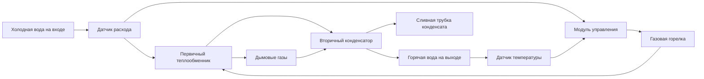

Безбаковые водонагреватели исключают потери тепла в режиме ожидания, нагревая воду только при возникновении спроса. Эти системы пропускают воду через теплообменник, активируемый датчиком расхода, обеспечивая непрерывное горячее водоснабжение без ограничений накопительного резервуара.

## Принципы работы

Проточное отопление основано на дифференциальном переключателе давления или датчике расхода, который обнаруживает движение воды и инициирует последовательность нагрева. Фундаментальный энергетический баланс управляет мгновенным нагревом:

$$Q = \dot{m} c_p \Delta T$$

Где:
- $Q$ = тепловой поток (кДж/ч или кВт)
- $\dot{m}$ = массовый расход (кг/ч или кг/с)
- $c_p$ = удельная теплоёмкость воды (4,186 кДж/кг·К)
- $\Delta T$ = повышение температуры (°C или К)

Преобразование в практические единицы для нагрева воды:

$$Q_{кВт} = \text{л/мин} \times 0.07 \times \Delta T_C$$

$$Q_{кДж/ч} = \text{л/мин} \times 252 \times \Delta T_C$$

Коэффициент 0,07 представляет произведение плотности воды (1 кг/л), удельной теплоёмкости (4,186 кДж/кг·К) и преобразования времени (0,06 ч/мин).

## Газовые безбаковые системы

Газовые установки используют модулирующие горелки, которые регулируют интенсивность горения в зависимости от расхода и температуры на входе. Современные конденсационные модели достигают тепловой эффективности более 95%, извлекая скрытое тепло из продуктов сгорания.

### Конфигурация теплообменника

Первичный теплообменник работает выше точки росы продуктов сгорания (приблизительно 57°C для природного газа), в то время как вторичный конденсатор восстанавливает дополнительную энергию, охлаждая дымовые газы ниже этого порога.

### Характеристики производительности

Пропускная способность газового безбакового нагревателя зависит от мощности горелки и эффективности:

$$\text{л/мин} = \frac{Q_{вход} \times \eta}{252 \times \Delta T}$$

Для установки мощностью 58,4 кВт при эффективности 96% и температуре входа 7°C:

$$\text{л/мин} = \frac{58,4 \times 0.96}{252 \times (49 - 7)} = \frac{56,1}{10,584} = 5,3 \text{ л/мин}$$

| Входная мощность | Эффективность | Повышение температуры | Максимальный расход |
|----------------|------------|------------------|---------------|
| 35,2 кВт | 82% | 42°C | 1,4 л/мин |
| 46,9 кВт | 96% | 42°C | 2,1 л/мин |
| 58,4 кВт | 96% | 42°C | 2,6 л/мин |
| 58,4 кВт | 96% | 25°C | 5,5 л/мин |

## Электрические безбаковые системы

Электрические установки используют резистивные нагревательные элементы, погруженные в проходы потока воды. Несколько элементов активируются последовательно по мере увеличения расхода, обеспечивая модуляцию без управления сгоранием.

### Требования к питанию

Электрические безбаковые системы требуют значительного электрического питания:

$$P_{кВт} = \frac{\text{л/мин} \times 252 \times \Delta T}{3600}$$

Коэффициент преобразования 3600 переводит кДж/ч в кВт. Для 2,6 л/мин при повышении на 39°C:

$$P_{кВт} = \frac{2,6 \times 252 \times 39}{3600} = \frac{25,5}{1} = 25,5 \text{ кВт}$$

Этот уровень мощности требует 240В питания с несколькими цепями:

| Уровень мощности | Напряжение | Ток (A) | Автоматический выключатель | Расход при повышении на 39°C |
|-------------|---------|-------------|-----------------|------------------|
| 12 кВт | 240V | 50A | 60A | 1,3 л/мин |
| 18 кВт | 240V | 75A | 90A | 1,9 л/мин |
| 24 кВт | 240V | 100A | 125A | 2,5 л/мин |
| 36 кВт | 240V | 150A | 175A | 3,8 л/мин |

Электрическая эффективность достигает 99% благодаря прямому резистивному нагреву без потерь при сгорании, однако высокие тарифы на электроэнергию обычно нивелируют это преимущество.

## Расчёты повышения температуры

Температура входящей воды существенно влияет на пропускную способность. Требуемое повышение температуры варьируется географически в зависимости от температуры подземных вод:

| Регион | Температура входа (°C) | Повышение до 49°C | Повышение до 60°C |
|--------|-----------------|---------------|---------------|
| Южная часть | 18°C | 31°C | 42°C |
| Центральная часть | 10°C | 39°C | 50°C |
| Северная часть | 4°C | 45°C | 56°C |

Установка с номинальной мощностью 4,2 л/мин при повышении на 25°C обеспечивает только 2,3 л/мин при повышении на 45°C:

$$\text{л/мин}_2 = \text{л/мин}_1 \times \frac{\Delta T_1}{\Delta T_2} = 4,2 \times \frac{25}{45} = 2,3 \text{ л/мин}$$

## Методология подбора

Надлежащий подбор требует анализа одновременного спроса приборов. ASHRAE устанавливает расходы для приборов:

- Душевая установка: 7,6-9,5 л/мин
- Умывальник: 1,9-3,8 л/мин
- Кухонная раковина: 5,7-7,6 л/мин
- Посудомоечная машина: 3,8-5,7 л/мин
- Стиральная машина: 7,6-11,4 л/мин

При одновременном использовании одной душевой установки и одной раковины (пиковый жилищный спрос):

$$\text{Общий расход} = 9,5 + 5,7 = 15,2 \text{ л/мин}$$

При требуемом повышении на 39°C, минимальная необходимая мощность составляет:

$$Q = 15,2 \times 252 \times 39 = 149,500 \text{ кДж/ч} = 41,5 \text{ кВт}$$

При эффективности 95%, входная мощность горелки должна быть:

$$Q_{вход} = \frac{149,500}{0.95} = 157,400 \text{ кДж/ч} = 43,7 \text{ кВт}$$

## Сравнение газовых и электрических систем

| Параметр | Газовый безбаковый | Электрический безбаковый |
|--------|--------------|-------------------|
| Эффективность | 82-96% (тепловая) | 99% (элемента) |
| Эксплуатационные затраты | Ниже (природный газ) | Выше (электричество) |
| Стоимость установки | Выше (требуется вентиляция) | Ниже (без вентиляции) |
| Требования к обслуживанию | Газопровод 3/4" типовой | Электроснабжение 40-80 А |
| Диапазон мощности | 41-111 кВт (140,000-380,000 Btu/hr) | 12-36 кВт |
| Обслуживание | Ежегодное удаление накипи, проверка сгорания | Минимальное, замена элементов |
| Срок службы | 15-20 лет | 10-15 лет |

## Преимущества в области эффективности

Безбаковые системы исключают потери в режиме ожидания, которые потребляют 10-20% энергии накопительного резервуара. Департамент энергетики США оценивает годовую экономию энергии в 1,100-1,650 кДж для газовых установок и 480-880 кДж для электрических установок по сравнению со стандартными накопительными баками.

Рейтинги Energy Factor (EF) количественно определяют общую эффективность, включая потери при циклировании. Сертифицированные AHRI газовые безбаковые модели достигают значений EF от 0,82 до 0,96, в то время как электрические установки достигают 0,99. Однако Uniform Energy Factor (UEF), который лучше отражает характеристики в реальных условиях, показывает газовые конденсационные безбаковые установки на уровне 0,90-0,96 UEF.

Отсутствие потерь в режиме ожидания резервуара становится более ценным в приложениях с прерывистым характером спроса, где накопительные баки постоянно теряют тепло в период простоя. Наоборот, высокий объём непрерывного спроса может благоприятствовать накопительным системам, которые предварительно нагревают большие количества в часы наименьшего потребления.

## Минимальные требования к расходу

Выключатели расхода обычно активируются при 1,5-2,3 л/мин для предотвращения частых включений и обеспечения достаточной скорости в теплообменнике. Этот порог создаёт эффекты "бутерброда холодной воды" при кратковременных событиях низкого расхода, которые не обеспечивают адекватный нагрев, особенно проблематичны в локальных приложениях с одиночными приборами низкого расхода.

Продвинутые модели используют буферные резервуары или циркуляционные насосы для устранения этого ограничения, хотя эти добавления вновь вводят незначительные потери в режиме ожидания.
