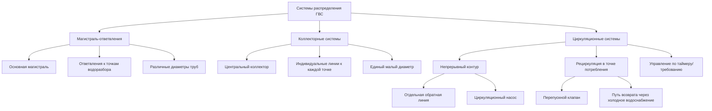

Системы распределения горячего водоснабжения (ГВС) транспортируют нагретую воду от источника тепла к конечным потребителям. Проектирование этих систем кардинально влияет на потери воды, энергопотребление, стоимость монтажа и удовлетворенность пользователей. Выбор зависит от типа здания, количества точек водоразбора, характера использования и применимых требований кодов.

## Типы систем распределения

Системы распределения ГВС подразделяются на три основные категории в зависимости от конфигурации трубопровода и методики управления потоком.

## Расчеты теплопотерь и времени ожидания

Теплопотери неизолированного трубопровода представляют как энергетические потери, так и причину задержки подачи воды. Для горизонтального участка трубопровода:

$$Q_{loss} = \frac{2\pi L (T_w - T_a)}{\frac{1}{h_i r_i} + \frac{\ln(r_o/r_i)}{k_{pipe}} + \frac{\ln(r_{ins}/r_o)}{k_{ins}} + \frac{1}{h_o r_{ins}}}$$

где:
- $Q_{loss}$ = интенсивность теплопотерь (Вт)
- $L$ = длина трубопровода (м)
- $T_w$ = температура воды (°C)
- $T_a$ = температура окружающей среды (°C)
- $r_i$, $r_o$, $r_{ins}$ = внутренний радиус, наружный радиус, наружный радиус изоляции (м)
- $k_{pipe}$, $k_{ins}$ = коэффициент теплопроводности материала трубы и изоляции (Вт/м·K)
- $h_i$, $h_o$ = коэффициенты конвективной теплоотдачи внутри и снаружи (Вт/м²·K)

Объем воды, который необходимо слить перед поступлением горячей воды, определяет потери и время ожидания:

$$V_{waste} = \sum_{i=1}^{n} \frac{\pi d_i^2}{4} L_i$$

$$t_{wait} = \frac{V_{waste}}{\dot{V}_{fixture}}$$

где $d_i$ и $L_i$ — диаметр и длина каждого участка трубопровода, а $\dot{V}_{fixture}$ — расход потребителя.

## Сравнение систем

| Параметр | Магистраль-ответвления | Коллекторная | Циркуляционная |
|-----------|------------------|----------|---------------|
| **Стоимость материала труб** | Низкая | Средняя | Высокая |
| **Трудозатраты на монтаж** | Средние | Низкие | Высокие |
| **Потери воды при одном использовании** | Высокие (3-10 л) | Средние (1-3 л) | Минимальные (<0,5 л) |
| **Энергетические потери (резервное состояние)** | Низкие | Низкие | Высокие (насос + потери труб) |
| **Время подачи** | 30-90 с | 15-45 с | Мгновенно |
| **Независимость точек водоразбора** | Низкая | Высокая | Средняя |
| **Сложность подбора диаметров** | Высокая | Низкая | Высокая |
| **Сложность переоборудования** | Средняя | Высокая | Средняя |
| **Балансировка давления** | Сложная | Отличная | Хорошая |

## Системы типа магистраль-ответвления

Этот традиционный подход использует постепенно уменьшающиеся диаметры труб по мере ответвлений от основной магистрали. Подбор размеров выполняется по методу Hunter (единиц приборов) согласно Международному кодексу по водопроводу (IPC).

**Преимущества:**
- Минимальная стоимость материала трубопровода
- Знакомство монтажников с методом
- Совместимость с традиционными путями прокладки

**Ограничения:**
- Длинные участки трубопровода от нагревателя к удаленным потребителям
- Значительные потери воды перед поступлением горячей воды
- Сложная балансировка давления
- Повышенные теплопотери из-за больших диаметров магистрали

Типичный размер магистрали в жилых зданиях: 19-25 мм медь или PEX для магистрали, переходящей к 13 мм ответвлениям.

## Коллекторные системы

Параллельное распределение передает индивидуальные линии малого диаметра (обычно 10 или 13 мм PEX) от центрального коллектора к каждой точке водоразбора. Эта конфигурация минимизирует объем воды в каждой линии.

**Преимущества:**
- Сниженные потери воды (меньше объемов в линиях)
- Отличная балансировка давления
- Упрощенная схема прокладки
- Меньше соединений (снижено количество мест утечек)

**Ограничения:**
- Повышенная стоимость материалов
- Требует доступного расположения коллектора
- Большая общая длина трубопровода
- Увеличенная совокупная площадь теплопотерь

Рекомендуется для жилых и легких коммерческих объектов с трубопроводами, совместимыми с PEX.

## Циркуляционные системы

Непрерывная или управляемая по требованию циркуляция поддерживает горячую воду у потребителей, исключая задержки подачи. Системы требуют либо отдельной обратной линии, либо использования перепускных клапанов, возвращающих воду через трубопровод холодного водоснабжения.

### Контур с отдельной обратной линией

Насос циркулирует воду от самой удаленной точки водоразбора обратно в водонагреватель. ASHRAE 90.1-2019 раздел 7.4.4.3 предусматривает:
- Автоматическое управление (по температуре, таймер или на основе присутствия)
- Изоляция трубопровода согласно требованиям раздела 6.4.4
- Балансировочные клапаны на ответвлениях обратных линий

Энергопотребление включает мощность насоса (обычно 20-100 Вт) и непрерывные теплопотери от всего контура.

### Рециркуляция в точке потребления

Небольшой насос в точке водоразбора активируется по требованию, возвращая охлажденную воду в водонагреватель через линию холодного водоснабжения посредством термостатического перепускного клапана. Этот подход исключает отдельный трубопровод возврата.

**Требования кодов:**
- IPC раздел 607.2: Защита от обратного потока
- IPC раздел 504.7: Ограничения на максимальную развитую длину
- ASHRAE 90.1 раздел 7.4.4.4: Обязательное управление рециркуляцией по требованию

## Методология подбора диаметров труб

Правильный подбор размеров балансирует потерю давления, скорость потока и риск эрозии:

$$\Delta P = f \frac{L}{D} \frac{\rho v^2}{2} + \sum K \frac{\rho v^2}{2}$$

где:
- $\Delta P$ = потеря давления (Па)
- $f$ = коэффициент трения Дарси (безразмерный)
- $L$ = длина трубопровода (м)
- $D$ = диаметр трубопровода (м)
- $\rho$ = плотность воды (кг/м³)
- $v$ = скорость потока (м/с)
- $K$ = коэффициенты потерь на фитингах (безразмерные)

**Пределы скорости:**
- Максимум: 2,4 м/с для предотвращения эрозии и гидравлических ударов
- Минимум в рециркуляции: 0,3 м/с для надлежащей теплопередачи

IPC таблица 604.3 предоставляет назначения единиц приборов. Используйте ASHRAE Fundamentals глава 22 для подробных расчетов потери давления.

## Критерии выбора проекта

**Выбирайте магистраль-ответвления когда:**
- Бюджетные ограничения предусматривают низкую первоначальную стоимость
- Компоновка здания позволяет короткие трассы к потребителям
- Потери воды не являются основной проблемой

**Выбирайте коллекторную систему когда:**
- Балансировка давления критична
- Трубопровод PEX приемлем
- Приоритизируется экономия воды
- Существует доступное расположение коллектора

**Выбирайте циркуляционную систему когда:**
- Требуется мгновенная подача горячей воды
- Длинные трассы неизбежны
- Операционные затраты оправдывают капитальные вложения
- Коды предусматривают требования к максимальному времени ожидания

## Требования энергоэффективности

ASHRAE 90.1-2019 устанавливает обязательные положения:
- Толщина изоляции труб согласно таблице 6.8.3
- Автоматическое управление рециркуляцией по времени или температуре
- Тепловые задвижки на подключениях к резервуарам накопления
- Максимальное снижение температуры в циркуляционной системе: 5,6°C

Международный кодекс энергосбережения (IECC) аналогично требует изоляции и управления. Здания высокой производительности могут применять дополнительные меры: улучшенная изоляция, управляемое по требованию насосное оборудование или распределенные точечные водонагреватели.

## Рекомендации по монтажу

Критические факторы, влияющие на долгосрочную производительность:

- **Выбор материала труб:** Медь (коррозионно-стойкая, высокая стоимость), PEX (гибкая, низкая стоимость, ограничения по температуре), ХПВХ (экономичная, расстояние опор)
- **Компенсация расширения:** Контуры теплового расширения или гибкие соединители для длинных участков
- **Удаление воздуха:** Воздухоотводчики в верхних точках циркуляционных контуров
- **Расстояние между опорами:** Согласно техническим требованиям производителя для предотвращения провисания
- **Доступность:** Запорные клапаны на ответвлениях для обслуживания

Надлежащий монтаж в соответствии с руководствами производителя и требованиями кодов гарантирует достижение задач проектирования на протяжении всего срока службы системы.
