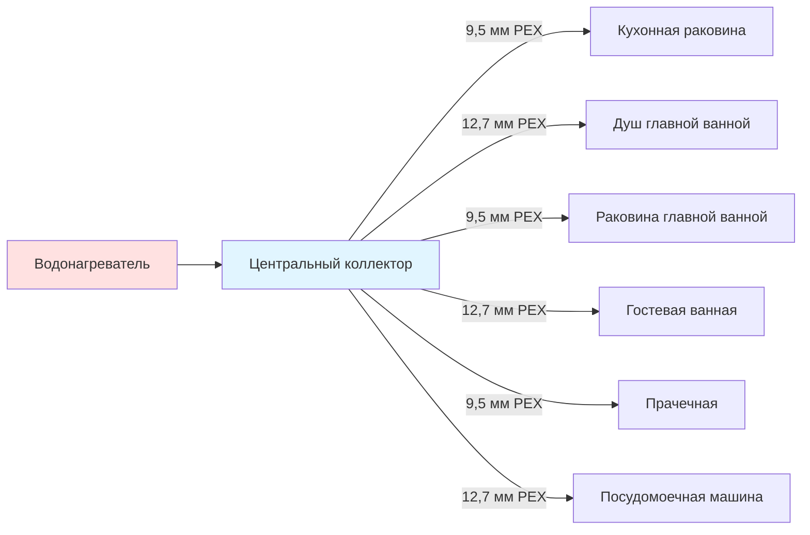

Системы распределения через центральный коллектор представляют собой подход с параллельным распределением, при котором каждая точка водоснабжения получает горячую воду по выделенной линии, идущей непосредственно от центрального коллектора. Эта архитектура исключает сложные разветвленные сети традиционных систем «магистраль-ответвление», обеспечивая превосходное управление, более быструю доставку и упрощенное устранение неисправностей.

## Архитектура системы

Конфигурация центрального коллектора состоит из центральной распределительной точки — коллектора, расположенного рядом с водонагревателем. От этого коллектора отдельные линии подачи проходят без прерывания к каждому прибору по всему зданию. Каждая линия имеет собственный запорный вентиль на коллекторе, обеспечивая полное изолирование прибора без влияния на другие точки отбора.

**Компоненты коллектора:**
- Центральный корпус с 6–12 выходными портами (расширяемый)
- Отдельный шаровой вентиль для каждого выхода
- Манометры и опциональные расходомеры
- Входы горячей и холодной воды с запорными вентилями
- Кронштейн для настенного или напольного монтажа
- Цветовая кодировка или маркировка выходов для идентификации приборов

## Диаметры труб и потери на трение

Системы центрального коллектора обычно используют трубки PEX меньшего диаметра, чем системы «магистраль-ответвление», так как каждая линия обслуживает только один прибор. Потери на трение в этих участках определяются уравнением Дарси-Вейсбаха:

$$h_f = f \frac{L}{D} \frac{v^2}{2g}$$

Где:
- $h_f$ = потеря напора на трение (м)
- $f$ = коэффициент трения (безразмерный, обычно 0,007–0,009 для PEX)
- $L$ = длина трубопровода (м)
- $D$ = внутренний диаметр (м)
- $v$ = скорость потока (м/с)
- $g$ = ускорение свободного падения (9,81 м/с²)

Для типичного участка длиной 15,2 м из PEX 9,5 мм (внутренний диаметр = 8,9 мм) при расходе 0,126 л/с:

$$v = \frac{Q}{A} = \frac{0,126}{π(0,0089/2)^2} = 2,02 \text{ м/с}$$

$$h_f = 0,008 \times \frac{15,2}{0,0089} \times \frac{2,02^2}{2 \times 9,81} = 0,56 \text{ м}$$

Эта потеря напора соответствует примерно 5,5 кПа, что остается приемлемым для большинства жилых приложений. Непрерывные участки без соединений минимизируют падение давления по сравнению с разветвленными системами с несколькими отводами и тройниками.

**Рекомендации по выбору диаметра:**

| Тип прибора | Расход | Рекомендуемый диаметр PEX | Максимальная длина участка |
|------------|--------|---------------------------|---------------------------|
| Раковина ванной комнаты | 0,095 л/с | 9,5 мм | 30,5 м |
| Кухонная раковина | 0,138 л/с | 12,7 мм | 24,4 м |
| Душ | 0,158 л/с | 12,7 мм | 22,9 м |
| Ванна | 0,252 л/с | 12,7 мм | 18,3 м |
| Посудомоечная машина | 0,126 л/с | 9,5 мм | 27,4 м |
| Стиральная машина | 0,221 л/с | 12,7 мм | 19,8 м |

## Преимущества производительности

**Более быстрая доставка горячей воды:**
Меньший объем воды в трубках PEX диаметром 9,5 мм или 12,7 мм требует сброса меньшего количества воды перед поступлением горячей воды к прибору. Участок длиной 15,2 м из PEX 9,5 мм содержит только 0,79 л по сравнению с 2,31 л в магистральной трубе диаметром 19 мм, сокращая время ожидания примерно на 65%.

**Изолирование отдельных приборов:**
Каждый выходной вентиль коллектора позволяет перекрыть подачу воды к конкретному прибору для обслуживания или ремонта без нарушения обслуживания других точек. Это исключает необходимость поиска и управления несколькими встроенными вентилями, разбросанными по стенам и потолкам.

**Уменьшение отказов соединений:**
Непрерывные участки от коллектора к прибору исключают промежуточные соединения — основные точки отказа в сантехнических системах. Типичная установка центрального коллектора использует на 80–90% меньше соединений, чем эквивалентные системы «магистраль-ответвление».

**Упрощенное балансирование:**
Расход к каждому прибору можно индивидуально регулировать на коллекторе, обеспечивая точное балансирование давления без доступа к удаленным встроенным вентилям. Это особенно ценно в системах со значительными перепадами высот или различными длинами участков.

## Сравнение систем

| Характеристика | Центральный коллектор | Магистраль-ответвление |
|----------------|----------------------|----------------------|
| Диаметр трубопровода | 9,5–12,7 мм PEX | 19–25 мм магистраль, 12,7 мм ответвления |
| Количество соединений | Минимальное (только подключения к коллектору) | Большое (тройники, отводы, муфты) |
| Объем воды в трубах | На 40–60% меньше | Базовое значение |
| Трудозатраты на монтаж | Меньше (непрерывные участки) | Больше (многочисленные стыки соединений) |
| Стоимость материалов | На 15–25% выше (больше общей длины трубопровода) | Меньше |
| Доступность для ремонта | Отличная (вентили на коллекторе) | Хорошая (требуются встроенные вентили) |
| Балансирование давления | Простое (регулировка на коллекторе) | Сложное (несколько мест расположения вентилей) |
| Тепловая эффективность | Лучше (меньше объема, быстрая доставка) | Хорошая |
| Совместимость с циркуляцией | Отличная (возможна выделенная обратная линия) | Хорошая |

## Соображения при монтаже

**Расположение коллектора:**
Расположите центральный коллектор в пределах 3–4,5 м от водонагревателя, чтобы минимизировать длину магистральной линии. Установите в доступных местах — механических помещениях, подвалах или технических шкафах — для обеспечения будущего обслуживания. Монтируйте на рабочей высоте (1,2–1,5 м) для комфортного управления вентилями.

**Стратегия прокладки:**
Прокладывайте трубки PEX через балки перекрытия, стойки стен или чердачные пространства с минимальными изгибами. Поддерживайте расстояние 30 см между горячими и холодными линиями для предотвращения теплопередачи. Закрепляйте трубки через каждые 80 см пластиковыми клипсами или скобами, избегая металлических крепежей, способствующих гальванической коррозии.

**Обеспечение расширения:**
Трубки PEX расширяются примерно на 2,8 см на 30,5 м на каждые 5,6°С увеличения температуры. Предусмотрите петли или изгибы в соединениях коллектора для компенсации теплового расширения. Никогда не устанавливайте PEX под натяжением.

**Требования к теплоизоляции:**
Изолируйте все линии подачи горячей воды центрального коллектора до минимума RSI 0,53 согласно требованиям IECC. В неотапливаемых помещениях изолируйте до RSI 1,06 для предотвращения замерзания и снижения потерь в режиме ожидания. Используйте закрытопористую поролоновую теплоизоляцию для труб с паробарьерами во влажном климате.

**Защита от гидравлических ударов:**
Малые диаметры труб и высокие скорости потока в системах центрального коллектора могут усилить эффект гидравлических ударов. Установите амортизаторы гидравлического удара на приборы с быстрозакрывающимися вентилями (посудомоечные машины, стиральные машины) или используйте коллекторы со встроенными поглотителями ударов.

## Применение и ограничения

Системы распределения через центральный коллектор превосходны в новом строительстве, где открытые стены обеспечивают максимальную гибкость прокладки. Одноэтажные жилые здания с централизованными сантехническими ядрами достигают наибольших преимуществ. Многоэтажные здания требуют тщательного выбора расположения коллектора или нескольких коллекторов на этаж для поддержания обоснованных длин участков.

Система становится менее экономически эффективной в приложениях модернизации, где прокладка непрерывных линий через существующие стены требует чрезмерных трудозатрат. Конструкции с широко разбросанными приборами могут потребовать недопустимо длинных участков, увеличивая как стоимость материалов, так и потери на трение за пределы практических пределов.

Для систем с циркуляцией центральные коллекторы позволяют использовать выделенные обратные линии от удаленных приборов, создавая эффективные контуры, которые минимизируют время ожидания при контролировании энергопотребления благодаря точному зональному управлению.
