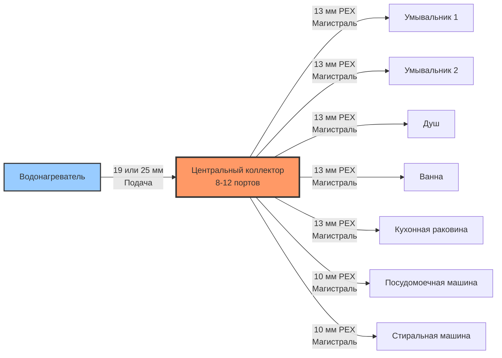

## Обзор

Системы распределения с коллектором представляют собой архитектуру параллельной трубопроводной сети для подачи горячей воды, где отдельные подающие линии (магистральная разводка) проходят от центрального коллектора к каждому прибору. Такая конфигурация устраняет ограничения последовательного потока в системах с магистралью и ответвлениями и обеспечивает превосходные гидравлические характеристики благодаря равномерному распределению давления на всех выходах.

Система состоит из центрального коллектора, обычно установленного в техническом помещении или доступной полости стены, с выделенными трубопроводами PEX диаметром 13 мм или 10 мм, проходящими непосредственно к каждому прибору без промежуточных фитингов. Такой подход сводит к минимуму потери давления и позволяет изолировать отдельные приборы.

## Гидравлические принципы

### Распределение параллельного потока

В системе с коллектором все приборы получают подачу воды через параллельные пути потока. Давление, доступное у каждого прибора, приблизительно одинаково и определяется следующим образом:

$$
\Delta P_{\text{прибор}} = \Delta P_{\text{коллектор}} + f \frac{L}{D} \frac{\rho v^2}{2}
$$

Где:
- $\Delta P_{\text{прибор}}$ = потеря давления от водонагревателя к прибору (Па)
- $\Delta P_{\text{коллектор}}$ = потеря давления в корпусе коллектора (Па)
- $f$ = коэффициент трения Дарси (безразмерный)
- $L$ = длина магистральной разводки (м)
- $D$ = внутренний диаметр трубопровода (м)
- $\rho$ = плотность воды (кг/м³)
- $v$ = скорость потока (м/с)

### Балансировка давления

Поскольку каждая магистральная разводка изолирована, давление у прибора $i$, работающего независимо, составляет:

$$
P_{\text{прибор},i} = P_{\text{подача}} - \Delta P_{\text{коллектор}} - \Delta P_{\text{линия},i}
$$

Когда одновременно работают несколько приборов, давление подачи коллектора остается стабильным, поскольку каждая линия отбирает воду из общего коллектора с достаточным диаметром (обычно 19-25 мм). Потеря давления в каждой магистральной разводке остается независимой:

$$
Q_{\text{всего}} = \sum_{i=1}^{n} Q_i
$$

Такое параллельное расположение предотвращает снижение давления, характерное для последовательно соединенных систем с магистралью и ответвлениями.

## Архитектура системы

## Сравнение с системами магистраль-ответвления

| Параметр | Распределение с коллектором | Магистраль-ответвление |
|-----------|----------------------|------------------|
| **Топология трубопровода** | Параллельные магистрали от центральной точки | Последовательные соединения вдоль главной магистрали |
| **Балансировка давления** | Равное давление у всех приборов | Давление снижается вдоль магистрали |
| **Изоляция прибора** | Индивидуальный кран у коллектора | Краны у каждого прибора или их отсутствие |
| **Эффективность материалов** | Больший общий метраж трубопровода | Меньше общей длины трубопровода |
| **Количество фитингов** | Минимальное (только у коллектора/прибора) | Несколько тройников, отводов на ветку |
| **Обнаружение утечек** | Изолировано в одной магистрали | Может повлиять на несколько нижних приборов |
| **Сложность установки** | Требует доступного расположения коллектора | Традиционная маршрутизация через каркас |
| **Стабильность потока** | Постоянный поток независимо от других приборов | Поток варьируется при одновременном использовании |
| **Совместимость с PEX** | Идеально (непрерывные участки, без фитингов) | Совместимо, но требует больше фитингов |

## Конструктивные соображения

### Выбор размера коллектора

Коллектор подачи должен вмещать общее одновременное потребление. В соответствии с Единым сантехническим кодексом (UPC) и Международным сантехническим кодексом (IPC), выбирайте размер входа коллектора на основе нагрузки по приборам:

$$
\text{Диаметр коллектора} = f(\text{Общие единицы приборов, Давление подачи})
$$

Типичные бытовые коллекторы используют входы диаметром 19-25 мм для 8-12 приборов.

### Ограничения длины магистральной разводки

Производители PEX и коды сантехники рекомендуют ограничивать длину магистральной разводки, чтобы минимизировать потери тепла и падение давления. Для трубопровода PEX-a диаметром 13 мм при скорости потока 1,2 м/с:

$$
\Delta P_{\text{30 м}} \approx 58 \text{ кПа}
$$

Максимально рекомендуемые длины магистральной разводки:
- 13 мм PEX: 24-30 м
- 10 мм PEX: 12-18 м (для приборов в точке использования)

### Индивидуальная изоляция прибора

Каждый порт коллектора имеет шаровой кран или четвертьоборотный кран для отключения, позволяющий изолировать любой прибор без влияния на остальные. Это облегчает обслуживание, обнаружение утечек и замену прибора без отключения всей системы.

При возникновении утечки в магистральной разводке только этот контур теряет давление, сразу же идентифицируя затронутый прибор и ограничивая повреждение от воды.

### Преимущества трубопровода PEX

Системы с коллектором преимущественно изготавливаются из сшитого полиэтилена (PEX) благодаря:

- **Гибкость**: непрерывные участки через полости стен и балки перекрытия без фитингов
- **Стойкость к коррозии**: отсутствие гальванической коррозии или отложений минералов
- **Тепловое расширение**: адаптация к циклам температуры без жесткого крепления
- **Скорость установки**: цветовая разметка красных/синих трубопроводов, опрессовочные или расширительные соединения

PEX-a (метод Энгеля) обеспечивает превосходную гибкость и характеристики при низких температурах по сравнению с PEX-b или PEX-c.

## Соответствие кодам

Системы распределения с коллектором должны соответствовать:

- **IPC раздел 604.10**: проектирование систем распределения воды по давлению и расходу
- **UPC раздел 610.0**: требования максимальной скорости и падения давления
- **ASTM F877**: технические характеристики трубопровода PEX для горячего и холодного водоснабжения
- **NSF/ANSI 61**: сертификация компонентов систем питьевого водоснабжения

Коллекторы должны устанавливаться в доступных местах согласно IPC 305.4, обычно в техническом помещении, подвале или специальных панелях доступа.

## Лучшие практики установки

1. **Установите коллектор в центральном месте** для минимизации средней длины магистральной разводки
2. **Используйте изолированный PEX** для магистралей горячей воды, чтобы снизить потери в режиме ожидания
3. **Обозначьте каждый порт** соответствующим местонахождением прибора для удобства обслуживания
4. **Поддерживайте минимальный зазор 30 см** вокруг коллектора для работы с клапанами
5. **Подпирайте магистрали через каждые 80 см** по горизонтали согласно спецификациям производителя
6. **Избегайте перегибов PEX** ниже минимального радиуса изгиба (обычно 6-8 наружных диаметров)
7. **Испытывайте каждый контур отдельно** под давлением 1030 кПа в течение 15 минут перед скрытием
8. **Установите коллектор после того,** как давление подачи достигнет стабильного рабочего диапазона

## Преимущества производительности

Распределение с коллектором обеспечивает измеримые преимущества в жилых и легких коммерческих приложениях с несколькими приборами:

- **Стабильная температура**: сокращенное время ожидания горячей воды благодаря меньшему объему линий
- **Упрощенная диагностика**: изоляция отдельных контуров ускоряет диагностику
- **Снижение расхода воды**: меньший объем в распределительных линиях по сравнению с увеличенными магистралями
- **Улучшенный комфорт**: стабильное давление при одновременном использовании нескольких приборов (душ)

Параллельная гидравлическая архитектура системы обеспечивает предсказуемую производительность в различных профилях спроса, что делает её предпочтительным выбором для современного распределения горячего водоснабжения, когда затраты на установку и доступность позволяют расположить центральный коллектор.
