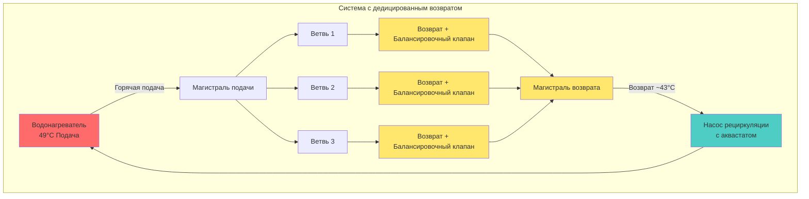

Системы рециркуляции горячей воды для бытовых нужд (DHW) непрерывно или периодически циркулируют нагретую воду через распределительные трубопроводы, устраняя задержку, присущую системам со стоячей водой. Хотя рециркуляция обеспечивает мгновенную горячую воду у приборов, она вводит постоянные тепловые потери и энергопотребление насосов, требующие тщательного проектирования.

## Типы систем и конфигурации

### Системы с дедицированным обратным трубопроводом

Традиционные системы рециркуляции включают дедицированный обратный трубопровод, проходящий параллельно магистралям горячего водоснабжения, создавая замкнутый контур обратно к водонагревателю или теплообменнику. Циркуляционный насос, расположенный у водонагревателя, поддерживает поток через этот контур.

**Основные компоненты:**
- Магистрали подачи (рассчитаны на расход приборов)
- Магистрали возврата (обычно на 1-2 размера трубы меньше, чем подача)
- Насос рециркуляции (подобран по потерям тепла, не по расходу приборов)
- Балансировочные клапаны на концах ветвей
- Управление аквастатом или датчиком температуры

### Системы рециркуляции по требованию

Системы по требованию используют холодную воду в качестве обратного пути, исключая дедицированный обратный трубопровод. Насос, расположенный у самого удалённого прибора, срабатывает по требованию (кнопка или датчик движения) и циркулирует воду до срабатывания датчика пороговой температуры у прибора.

**Характеристики работы:**
- Насос работает только при активации пользователем
- Более низкая стоимость установки (без обратного трубопровода)
- Вводит тёплую воду в холодную магистраль во время циркуляции
- Ограничена жилыми и небольшими коммерческими приложениями

### Конфигурация с обратным возвратом

Для больших систем, требующих сбалансированного потока, обратные трубопроводы обеспечивают равные длины труб ко всем ветвям, улучшая температурную однородность без обширной регулировки балансировочных клапанов.

## Потери тепла и подбор насоса

Насос рециркуляции должен преодолеть перепад давления в системе, перемещая достаточное количество воды для компенсации тепловых потерь от трубопроводной системы.

### Расчет потерь тепла

Общие потери тепла системы зависят от поверхности трубопровода, свойств изоляции и разности температур:

$$Q_{loss} = U \cdot A \cdot \Delta T$$

Где:
- $Q_{loss}$ = скорость потерь тепла (кДж/ч)
- $U$ = общий коэффициент теплопередачи (кДж/ч·м²·°C)
- $A$ = общая поверхность трубопровода (м²)
- $\Delta T$ = разность температур между водой и окружающей средой (°C)

Для изолированного медного трубопровода типичные значения $U$ колеблются от 0,86 до 1,70 кДж/ч·м²·°C в зависимости от толщины и качества изоляции.

### Расход рециркуляции

Требуемый расход циркуляции поддерживает приемлемое падение температуры по контуру:

$$Q_{m} = \frac{Q_{loss}}{4.19 \cdot \Delta T_{loop}}$$

Где:
- $Q_{m}$ = расход рециркуляции (л/мин)
- $Q_{loss}$ = общие потери тепла системы (кДж/ч)
- $\Delta T_{loop}$ = допустимое падение температуры в контуре (°C), обычно 2,8–5,6°C
- $4.19$ = постоянная (кДж/ч на л/мин·°C для воды)

**Пример расчета:**

Для системы с 122 м медного трубопровода диаметром 38 мм, изоляцией 25 мм, работающей при 49°C в окружающей среде 21°C:

- Поверхность трубопровода: $A = \pi \cdot (0.038) \cdot 122 = 14,6 \text{ м}^2$
- Потери тепла: $Q_{loss} = 1,13 \cdot 14,6 \cdot (49-21) = 461 \text{ кДж/ч}$
- Расход на падение 5,6°C: $Q_{m} = 461 / (4.19 \cdot 5.6) = 19,6 \text{ л/мин}$

### Расчет напора насоса

Насос рециркуляции должен обеспечить достаточный напор для преодоления потерь на трение через подающие и обратные трубопроводы, фитинги и клапаны. Используйте стандартные таблицы потерь на трение для горячей воды при рабочей температуре системы.

$$H_{pump} = H_{friction} + H_{fittings} + H_{valves}$$

Типичные жилые системы рециркуляции требуют напора 1,5–4,5 м; более крупные коммерческие системы могут требовать 6–12 м в зависимости от длины трубопровода и конфигурации.

## Стратегии управления

### Непрерывная работа

Самый простой метод управления поддерживает постоянную циркуляцию 24/7. Обеспечивает мгновенную горячую воду, но максимизирует энергопотребление и тепловые потери.

**Энергетический штраф:** Все потери тепла от трубопровода должны непрерывно восполняться водонагревателем, обычно добавляя 10–30% к энергопотреблению DHW в зависимости от размера системы и качества изоляции.

### Управление аквастатом

Датчик температуры, установленный на обратной магистрали, циклирует насос для поддержания температуры возвращаемой воды выше уставки (обычно 35–40°C для подачи 49°C).

**Преимущества:**
- Снижает время работы насоса по сравнению с непрерывной работой
- Поддерживает доступность горячей воды
- Простое и надёжное управление

**Типичный цикл:** Насос работает 30–50% времени при надлежащей изоляции и подборе.

### Управление по расписанию

Запланированная работа во время пиковых периодов спроса (утро, вечер) снижает потери энергии в часы низкого спроса.

**Рассмотрение:**
- Может привести к задержке в часы работы вне пиковой нагрузки
- Эффективно для предсказуемых моделей занятости
- Может комбинироваться с аквастатом для температурной защиты

### Управление по требованию

Датчики движения, кнопки или сигналы активации приборов срабатывают работа насоса только при необходимости горячей воды.

**Оптимально для:**
- Жилых приложений
- Объектов с нерегулярной занятостью
- Максимального снижения энергопотребления (70–90% сокращение в сравнении с непрерывной работой)

## Балансировка и температурная однородность

### Установка балансировочных клапанов

Установите калибровочные балансировочные клапаны на конце каждого контура ветви для регулирования распределения потока. Ветви ближе к насосу испытывают меньшее сопротивление потоку и требуют дросселирования для обеспечения адекватного потока к удалённым ветвям.

**Процедура балансировки:**
1. Полностью откройте все балансировочные клапаны
2. Измерьте температуру возврата в каждой ветви
3. Постепенно закрывайте клапаны на тёплых ветвях
4. Переизмерьте и повторяйте до достижения разницы всех ветвей в пределах 1–1,7°C

### Скорости потока

Поддерживайте скорость потока от 0,6 до 1,2 м/с в магистралях рециркуляции для обеспечения адекватного теплопереноса при минимизации эрозии и шума.

$$V = \frac{0.408 \cdot GPM}{d^2}$$

Где:
- $V$ = скорость (м/с)
- расход в л/мин = расход в л/мин
- $d$ = внутренний диаметр (см)

## Требования ASHRAE 90.1

Стандарт ASHRAE 90.1, раздел 7.4.4.3, предписывает меры энергоэффективности для систем рециркуляции:

**Обязательные положения:**
- Автоматическое управление для отключения или модуляции насоса рециркуляции когда здание неокупировано или в периоды низкого спроса
- Ограничения длины стояков (максимум 15 м для трубы 9 мм, 7,6 м для 12 мм, 3 м для более крупных)
- Минимумы изоляции трубопровода (RSI 0,53 для трубопровода ≤38 мм, RSI 0,70 для более крупных)

**Контуры циркуляции поддержания температуры** должны управляться:
- Таймером с автоматическим переопределением, или
- Модуляцией температуры с ощущением температуры возврата

Эти требования обычно снижают годовое энергопотребление рециркуляции на 30–50% по сравнению с неконтролируемой непрерывной работой.

## Сравнение систем

| Особенность | Дедицированный возврат | Рециркуляция по требованию |
|---------|------------------|----------------------|
| **Стоимость установки** | Выше (требуется обратный трубопровод) | Ниже (использует существующую холодную магистраль) |
| **Эксплуатационные расходы** | Выше (непрерывная или аквастат) | Самые низкие (только по требованию) |
| **Время отклика** | Мгновенное (поддерживаемая циркуляция) | 10–60 секунд (активация насоса) |
| **Температурная однородность** | Отличная (при надлежащей балансировке) | Переменная (зависит от расположения) |
| **Приложение** | Коммерческое, многоэтажное жилое | Одноквартирное, небольшие здания |
| **Загрязнение холодной воды** | Отсутствует | Временное нагревание во время циклов |
| **Техническое обслуживание** | Регулировка балансировки, обслуживание насоса | Минимальное, замена датчика/насоса |
| **Соответствие энергетическому кодексу** | Требует управления per ASHRAE 90.1 | Изначально совместима (по требованию) |

## Рекомендации по проектированию

1. **Минимизируйте длину трубопровода:** Более короткие контуры снижают потери тепла и улучшают эффективность
2. **Изолируйте тщательно:** Превышайте минимумы кодекса, где экономически обоснованно
3. **Правильно подберите насос:** Переразмеренные насосы тратят энергию и вызывают трудности с балансировкой
4. **Внедрите интеллектуальное управление:** Управление на основе температуры и времени обычно обеспечивает лучший баланс производительности и эффективности
5. **Проектируйте с учетом балансировки:** Включите балансировочные клапаны на этапе проектирования, а не переделывайте позже
6. **Контролируйте температуру возврата:** Установите датчики температуры для проверки производительности системы и выявления проблем

## Диаграмма конфигурации трубопровода

Надлежащим образом спроектированные системы рециркуляции уравновешивают комфорт пользователей с энергоэффективностью. Выбор между системами с дедицированным возвратом и системами по требованию зависит от типа здания, моделей занятости, ограничений бюджета и ожиданий производительности. Все системы выигрывают от интеллектуального управления, которое минимизирует работу насоса и потери тепла, поддерживая приемлемые времена подачи горячей воды.
