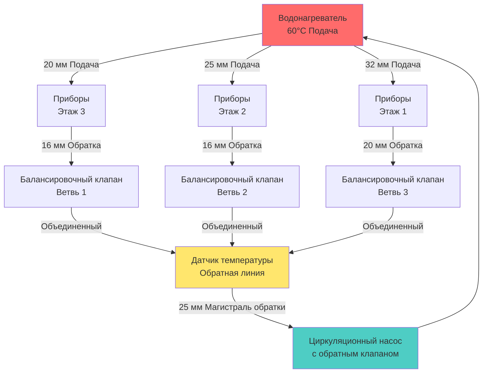

Системы с выделенной обратной трубой представляют наиболее надежный и управляемый метод поддержания температуры горячей воды во всем здании. Эта конфигурация использует отдельную сеть трубопроводов, которая возвращает охлажденную воду от наиболее удаленных приборов обратно к водонагревателю, обеспечивая постоянную доступность горячей воды при минимизации потерь и времени ожидания.

## Конфигурация системы

Система с выделенной обратной трубой состоит из полного вторичного трубопроводного контура, который проходит параллельно линиям подачи горячей воды. Обратная линия собирает воду из нескольких ветвей и доставляет ее обратно во входное отверстие водонагревателя или на выделенное соединение рециркуляции. Циркуляционный насос, расположенный на уровне водонагревателя или рядом с ним, создает поток в этом закрытом контуре.

Основное преимущество выделенного обратного трубопровода — это возможность точно контролировать расходы и балансировать систему с использованием ручных или автоматических балансировочных клапанов. Каждая ветвь может быть отрегулирована независимо для обеспечения равномерного распределения температуры независимо от расстояния от источника тепла или сложности планировки трубопровода.

## Методология расчета размера трубопровода

Расчет размера обратной трубы принципиально отличается от расчета размера трубы подачи, поскольку основное внимание уделяется поддержанию адекватной скорости для сбора тепла, а не доставке пикового расхода при использовании приборов. Диаметр обратной линии рассчитывается на основе требуемого расхода рециркуляции и допустимого перепада давления.

Минимальный расход рециркуляции, требуемый для компенсации потерь тепла:

$$Q_{\text{recirc}} = \frac{q_{\text{loss}}}{c_p \rho \Delta T}$$

где:
- $Q_{\text{recirc}}$ = расход рециркуляции (л/мин)
- $q_{\text{loss}}$ = общие потери тепла системы (кДж/ч)
- $c_p$ = удельная теплоемкость воды = 4.18 кДж/(кг·°C)
- $\rho$ = плотность воды = 1000 кг/м³
- $\Delta T$ = допустимое падение температуры в обратной линии (°C), обычно 3-5°C

Потери тепла из изолированного трубопровода рассчитываются по формуле:

$$q_{\text{loss}} = \frac{2\pi k L (T_w - T_a)}{\ln\left(\frac{r_o}{r_i}\right)}$$

где:
- $k$ = теплопроводность изоляции (Вт/(м·°C))
- $L$ = длина трубы (м)
- $T_w$ = температура воды (°C)
- $T_a$ = температура окружающей среды (°C)
- $r_o$ = внешний радиус изоляции (м)
- $r_i$ = внутренний радиус изоляции (м)

Диаметр обратной трубы затем выбирается для поддержания скорости между 0,6-1,2 м/с, используя:

$$d = \sqrt{\frac{4Q_{\text{recirc}}}{60\pi v}}$$

где:
- $d$ = внутренний диаметр трубы (м)
- $v$ = скорость потока (м/с)
- $Q_{\text{recirc}}$ = расход (л/мин)

Типичная практика предусматривает использование для обратных линий на один-два типоразмера меньше соответствующих линий подачи, но никогда не меньше 12 мм, чтобы предотвратить чрезмерный перепад давления и поддерживать адекватное перемешивание.

## Планировка и маршрутизация трубопровода

## Варианты маршрутизации обратного трубопровода

| Метод маршрутизации | Преимущества | Недостатки | Лучшее применение |
|---|---|---|---|
| **Обратный возврат** | Гидравлически саморегулируемый, равные длины путей | Требует дополнительного трубопровода, выше стоимость установки | Большие здания с симметричной планировкой |
| **Прямой возврат с балансировочными клапанами** | Короткие трубопроводные линии, ниже стоимость материалов | Требует ручной балансировки, более сложный ввод в эксплуатацию | Многоэтажные здания, асимметричные планировки |
| **Зональные возвраты** | Независимый контроль по зонам, более легкое устранение неисправностей | Несколько обратных линий к нагревателю, оборудование большего размера | Здания с отличительными зонами использования |
| **Одна магистраль с отвод-ами** | Простейшая установка, минимальная стоимость | Сложно балансировать удаленные ветви | Небольшие здания, простые планировки |

## Выбор и расположение балансировочных клапанов

Балансировочные клапаны являются существенными компонентами, которые позволяют полевую регулировку распределения потока для достижения равномерного поддержания температуры во всей системе. Каждая обратная ветвь должна включать калибруемый балансировочный клапан, расположенный как можно ближе к соединению с основной обратной линией.

Ручные балансировочные клапаны с упорами памяти и портами измерения потока обеспечивают наиболее точное управление. Расположите эти клапаны в легко доступных местах с достаточным пространством для подключения испытательного оборудования. Полномочия клапана (отношение перепада давления в клапане к перепаду давления в системе) должны превышать 0,3 для эффективного управления.

Процедура балансировки включает измерение температуры возвратной воды на каждой ветви при установившемся режиме работы системы. Дросселируйте клапаны, обслуживающие ветви с более высокой, чем в среднем, температурой возврата, пока все ветви не достигнут однородности температуры в пределах 1-2°C. Это обеспечивает равномерную компенсацию потерь тепла по всей системе распределения.

## Требования к изоляции

Стандарт ASHRAE 90.1 устанавливает минимальную толщину изоляции для рециркулирующих систем горячего водоснабжения на основе размера трубы и рабочей температуры. Для температур воды между 40-60°C требуемая толщина изоляции варьируется от 25 мм для труб диаметром менее 38 мм до 40 мм для труб диаметром 50 мм и более.

Изоляционный материал должен иметь теплопроводность не более 0,04 Вт/(м·°C) при средней температуре 24°C. Обычные материалы, соответствующие этому требованию, включают стекловолоконную изоляцию труб, эластомерную пену и полиизоцианурат.

Паровые ретарданты необходимы в помещениях с высокой влажностью, чтобы предотвратить инфильтрацию влаги, которая ухудшает производительность изоляции. Все соединения, швы и проникновения требуют герметизации парами с использованием указанных производителем клеев и лент.

Обратные линии требуют той же толщины изоляции, что и линии подачи, так как потери тепла из обеих одинаково способствуют энергопотреблению системы. Пренебрежение изоляцией обратной линии представляет одну из наиболее распространенных дефектов установки и прямо увеличивает энергию насоса и потери тепла.

## Мониторинг и управление системой

Эффективные системы с выделенной обратной трубой включают мониторинг температуры на самом удаленном местоположении прибора и на обратной линии, входящей в водонагреватель. Насос рециркуляции должен работать на основе температуры возвратной воды, включаясь при падении температуры ниже уставки (обычно на 3-5°C ниже температуры подачи) и отключаясь при восстановлении температуры.

Расписание по времени суток может снизить рабочие часы в периоды низкого спроса, но чрезмерно длительные циклы отключения нарушают восприятие пользователем и могут способствовать росту легионелл при падении температуры ниже 50°C. Аквастаты или программируемые контроллеры управляют работой насоса для поддержания оптимального баланса между энергоэффективностью и качеством воды.

Балансировка давления во всей системе требует мониторинга перепада давления между подачей и возвратом в ключевых местах. Чрезмерный перепад давления указывает на трубопровод недостаточного размера, загрязненные балансировочные клапаны или недостаточность производительности насоса, требующие расследования и исправления.

## Соответствие кодам и стандартам

Международный сантехнический кодекс (IPC) и Единый сантехнический кодекс (UPC) устанавливают минимальные требования для установки систем рециркуляции, включая материалы трубопровода, расстояние между опорами и приспособления для теплового расширения. Системы должны включать положения для теплового расширения, обычно бак расширения, размер которого соответствует требованиям кодекса.

ASHRAE Standard 90.1 раздел 7.4.4.3 определяет требования к управлению, включая автоматические переключатели времени или управление температурой для ограничения работы насоса. Системы, обслуживающие несколько зданий или зон, должны включать изолирующие клапаны, чтобы обеспечить отключение отдельных участков для обслуживания без нарушения работы всего объекта.

Циркуляционный насос должен включать встроенный обратный клапан или отдельную установку обратного клапана, чтобы предотвратить термосифонирование при отключении насоса. Это предотвращает неконтролируемую циркуляцию, вызванную тепловой плавучестью, которая тратит энергию и затрудняет управление температурой.
