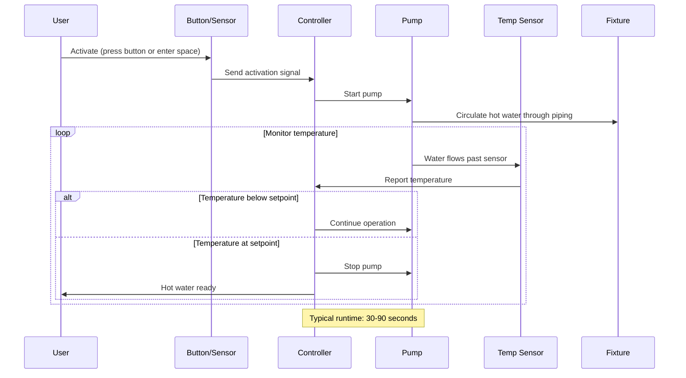

## Обзор

Системы циркуляции по требованию включают циркуляционный насос только когда необходима горячая вода, вместо непрерывной работы. Такой подход обеспечивает быстрое поступление горячей воды к приборам при значительном снижении энергетических потерь, связанных с непрерывной циркуляцией. Насос работает до достижения целевой температуры у прибора или в обратной линии, затем отключается до следующего включения.

Такие системы особенно эффективны в жилых зданиях и небольших коммерческих объектах, где водоразбор горячей воды прерывистый и предсказуемый. Исключая непрерывные потери тепла из распределительного трубопровода, системы по требованию обычно снижают энергопотребление циркуляции на 50-70% по сравнению с непрерывной работой.

## Способы активации

### Кнопочное управление

Наиболее распространенный способ активации использует кнопки мгновенного нажатия, установленные в ключевых точках потребления. Пользователь нажимает кнопку перед использованием горячей воды, и насос работает в течение установленного времени или до момента, когда датчик температуры подтвердит прибытие горячей воды. Типичные места размещения кнопок:

- Умывальники в ванных комнатах
- Кухонные раковины
- Группы удаленных приборов

Установка требует прокладки низковольтной проводки от кнопки к контроллеру насоса. Доступны беспроводные кнопочные системы, исключающие необходимость в проводке.

### Активация датчиком движения

Датчики движения обнаруживают присутствие в ванных комнатах или кухнях и автоматически включают насос циркуляции. Система предвосхищает потребность на основе присутствия, запуская насос до включения прибора пользователем. Ключевые соображения:

- Размещение датчика должно обнаружить присутствие достаточно рано, чтобы подать горячую воду при включении прибора
- Ложные срабатывания (человек входит в помещение без использования горячей воды) тратят энергию
- Наиболее эффективно в помещениях с предсказуемым потреблением горячей воды

### Управление с помощью таймера

Программируемые таймеры включают циркуляцию в периоды высокого потребления (утренние и вечерние часы в жилых приложениях). Хотя это не совсем "по требованию", управление таймером значительно снижает время работы по сравнению с непрерывной работой. Продвинутые контроллеры объединяют операцию таймера с кнопочным переопределением для неожиданного потребления.

## Анализ времени ожидания

Задержка между активацией и поступлением горячей воды зависит от объема трубопровода, расхода и температурного напора. Время ожидания можно рассчитать:

$$t_{\text{wait}} = \frac{V_{\text{pipe}}}{Q_{\text{pump}}}$$

Где:
- $t_{\text{wait}}$ = время ожидания (мин)
- $V_{\text{pipe}}$ = объем трубопровода от водонагревателя до прибора (л)
- $Q_{\text{pump}}$ = расход насоса (л/мин)

Для системы с медным трубопроводом диаметром 19 мм на протяжении 30,5 м:

$$V_{\text{pipe}} = 30,5 \text{ м} \times 0,198 \frac{\text{л}}{\text{м}} = 6,04 \text{ л}$$

При расходе насоса 11,4 л/мин:

$$t_{\text{wait}} = \frac{6,04 \text{ л}}{11,4 \text{ л/мин}} = 0,53 \text{ мин} = 32 \text{ секунды}$$

Это время ожидания должно быть приемлемо для пользователей. Системы с временем ожидания более 60 секунд часто вызывают жалобы, особенно в жилых приложениях.

## Расчет насоса

Циркуляционные насосы по требованию должны перемещать воду достаточно быстро, чтобы минимизировать время ожидания и преодолевать сопротивление системы. Необходимый напор насоса:

$$H_{\text{pump}} = \Delta P_{\text{pipe}} + \Delta P_{\text{fittings}} + \Delta P_{\text{valve}}$$

Где перепады давления рассчитываются с использованием уравнения Дарси-Вейсбаха. Большинство жилых систем по требованию используют малые циркуляционные насосы (15-50 Вт) со следующими типичными характеристиками:

- Расход: 7,6-22,7 л/мин
- Напор: 1,5-4,6 м водного столба
- Энергопотребление: 15-50 Вт

Более высокие расходы сокращают время ожидания, но увеличивают потери давления, требуя больших насосов и больше энергии за цикл активации.

## Диаграмма работы системы

## Сравнение: циркуляция по требованию и непрерывная циркуляция

| Параметр | Циркуляция по требованию | Непрерывная циркуляция |
|-----------|-------------------------|--------------------------|
| **Время работы насоса** | 5-30 мин/сутки типично | 24 часа/сутки |
| **Годовое энергопотребление насоса** | 25-150 кВт⋅ч | 300-800 кВт⋅ч |
| **Потери тепла трубопровода** | Только во время работы | Непрерывно 24/7 |
| **Годовые потери тепла** | 500-2000 кВт⋅ч | 3000-10000 кВт⋅ч |
| **Общая экономия энергии** | 50-70% относительно непрерывной | Базовый уровень |
| **Время ожидания горячей воды** | 30-90 секунд | Мгновенно (0-5 секунд) |
| **Взаимодействие пользователя** | Нажатие кнопки или движение | Не требуется |
| **Стоимость монтажа** | Умеренная (добавляется управление) | Ниже (простой насос) |
| **Обслуживание** | Низкое (сниженное время работы насоса) | Среднее (непрерывная работа) |
| **Лучшее применение** | Жилые, прерывистый спрос | Гостиницы, здравоохранение, постоянный спрос |

## Расчеты экономии энергии

Энергия, сэкономленная при работе по требованию по сравнению с непрерывной циркуляцией, идет из двух источников: сниженное время работы насоса и сниженные потери тепла из трубопровода.

### Экономия энергии насоса

$$E_{\text{pump,saved}} = P_{\text{pump}} \times (t_{\text{continuous}} - t_{\text{on-demand}})$$

Для насоса мощностью 30 Вт при непрерывной работе (8760 часов/год) против работы по требованию (250 часов/год):

$$E_{\text{pump,saved}} = 0,03 \text{ кВ} \times (8760 - 250) \text{ ч} = 255 \text{ кВт⋅ч/год}$$

### Экономия потерь тепла трубопровода

Потери тепла из трубопровода во время остановки циркуляции минимальны в системах по требованию. Потери тепла от непрерывно циркулирующего трубопровода:

$$Q_{\text{pipe}} = U \times A_{\text{pipe}} \times \Delta T \times t$$

Где:
- $U$ = общий коэффициент теплопередачи (Вт/м²⋅К)
- $A_{\text{pipe}}$ = площадь поверхности трубопровода (м²)
- $\Delta T$ = разность температур между трубопроводом и окружающей средой (°C)
- $t$ = время работы (ч)

Для 61 м неизолированного медного трубопровода диаметром 19 мм при температуре 49°C в помещении при температуре 21°C:

- $U \approx 8,5$ Вт/м²⋅К (естественная конвекция + излучение)
- $A_{\text{pipe}} = 61 \text{ м} \times 0,80 \frac{\text{м}^2}{\text{м}} = 48,8 \text{ м}^2$
- $\Delta T = 49 - 21 = 28 \text{°C}$

Годовые потери тепла при непрерывной работе:

$$Q_{\text{continuous}} = 8,5 \times 48,8 \times 28 \times 8760 = 102,8 \times 10^6 \text{ кДж/год}$$

Работа по требованию (250 часов/год циркуляция, трубопровод охлаждается между циклами):

$$Q_{\text{on-demand}} \approx 8,5 \times 48,8 \times 28 \times 250 = 2,94 \times 10^6 \text{ кДж/год}$$

Экономия потерь тепла: $99,9 \times 10^6$ кДж/год = 27,8 МВт⋅ч тепловой эквивалент

## Требования кодексов и норм

### ASHRAE 90.1 (Коммерческие здания)

Раздел 7.4.4.3 требует автоматического управления циркуляционными насосами, включая:
- Расписание по времени суток, снижающее работу в незанятые периоды
- Контроль температуры воды для отключения насосов при отсутствии потребности
- Системы по требованию соответствуют при правильной конфигурации

### Международный код сантехники (IPC)

Раздел 607.2 рассматривает системы циркуляции, но не предписывает работу по требованию против непрерывной. Местные дополнения могут требовать управления энергосбережением.

### Калифорния Title 24

Часть 6 (Энергетический кодекс) и Часть 11 (CALGreen) включают специфические требования:
- Системы циркуляции должны включать управление, ограничивающее работу
- Датчики температуры или таймеры необходимы для предотвращения ненужной работы
- Системы по требованию соответствуют по конструкции

### ASHRAE 90.2 (Жилые здания)

Раздел 9.2.2 рекомендует управление для ограничения работы циркуляционного насоса периодами ожидаемого использования, согласуясь с работой системы по требованию.

## Конструктивные соображения

### Компоновка системы

Системы по требованию работают лучше всего при:
- Выделенных обратных линиях (не через трубопроводы холодной воды)
- Датчиках температуры у самого удаленного прибора или в обратной линии
- Минимальном объеме трубопровода между нагревателем и приборами
- Изолированных распределительных трубопроводах для снижения потерь тепла

### Стратегия управления

Контроллер должен сбалансировать удобство пользователя и экономию энергии:
- **Порог активации**: как долго после последнего использования насос должен остановиться
- **Точка установки температуры**: целевая температура у датчика (обычно 40,6-43,3°C)
- **Максимальное время**: максимальное время работы насоса для предотвращения непрерывной работы, если температура не достигнута
- **Режим обучения**: некоторые контроллеры обучаются схемам использования и предварительно активируют насос

### Обучение пользователей

Системы по требованию требуют понимания пользователем:
- Нажимайте кнопку за 30-60 секунд до использования горячей воды
- Избегайте повторных коротких циклов активации
- Понимайте, что мгновенная горячая вода недоступна (обмен на экономию энергии)

### Размещение датчика

Датчики температуры должны быть размещены там, где они точно обнаруживают прибытие горячей воды:
- У самого удаленного прибора от водонагревателя
- В обратной линии рядом с входом насоса
- Защищены от влияния температуры окружающей среды
- Доступны для обслуживания и проверки

## Преимущества и ограничения

### Преимущества

- **Экономия энергии**: снижение на 50-70% относительно непрерывной циркуляции
- **Более низкая стоимость эксплуатации**: сниженное энергопотребление насоса и нагрева
- **Продленный срок службы насоса**: меньше часов работы
- **Сниженные потери тепла трубопровода**: трубопроводы охлаждаются между циклами активации
- **Гибкость**: можно добавить к существующим системам

### Ограничения

- **Время ожидания**: 30-90 секунд типично, что может быть неприемлемо в некоторых приложениях
- **Взаимодействие пользователя**: требует нажатия кнопки или полагается на датчик движения
- **Сложность управления**: более сложное, чем простая непрерывная работа
- **Начальная стоимость**: выше базовых систем из-за управления
- **Ложные срабатывания**: датчики движения могут срабатывать без необходимости

## Рекомендации по применению

Циркуляция по требованию наиболее целесообразна для:
- Одно- и малосемейных жилых зданий
- Офисных зданий с прерывистым потреблением горячей воды
- Розничных объектов с предсказуемыми схемами использования
- Модернизационных приложений, где экономия энергии оправдывает обновление управления

Непрерывная циркуляция остается предпочтительной для:
- Учреждений здравоохранения, требующих мгновенной доступности горячей воды
- Гостиниц и общежитий с высокой занятостью
- Коммерческих кухонь с постоянной потребностью в горячей воде
- Приложений, где контроль легионеллы требует непрерывно повышенных температур

## Пуск и проверка

Надлежащий пуск обеспечивает работу систем по требованию как предусмотрено:

1. **Проверить активацию**: протестировать все кнопки и датчики
2. **Измерить время ожидания**: измерить время от активации до поступления горячей воды у каждого прибора
3. **Проверить точку установки температуры**: подтвердить отключение насоса при правильной температуре
4. **Протестировать максимальное время**: убедиться, что насос останавливается после максимального времени работы
5. **Подтвердить экономию энергии**: сравнить время работы насоса и энергопотребление нагрева с базовой линией

Документируйте фактические времена ожидания у каждого места прибора и подтвердите их соответствие ожиданиям пользователя перед принятием системы.
