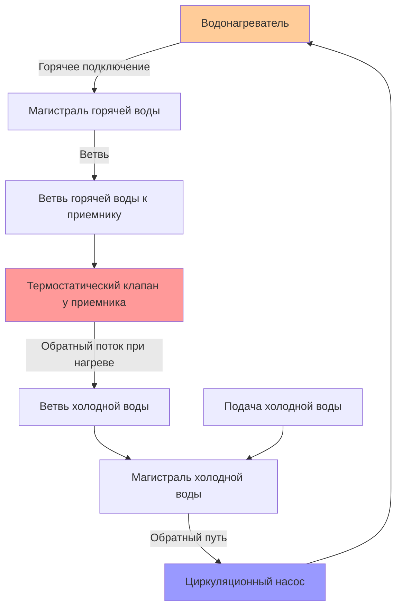

## Обзор

Системы рециркуляции со свободным возвратом представляют экономичную альтернативу выделенным обратным трубопроводам в системах распределения горячего водоснабжения (ГВС). Вместо установки отдельных линий возврата от каждого приемника обратно к водонагревателю, системы со свободным возвратом используют существующие ветви холодного водопровода как обратный путь. Термостатический клапан на конце приемника контролирует, когда горячая вода "возвращается" через линию холодной воды для поддержания циркуляции.

Эта конфигурация снижает затраты на монтаж, но создает технические трудности, связанные с управлением потоком, поддержанием температуры и потенциальным смешиванием горячей и холодной воды.

## Конфигурация системы

Термостатический клапан служит критической точкой управления. Когда температура воды у приемника падает ниже уставки клапана (обычно 35-40°C), клапан открывается, позволяя горячей воде течь через ветвь холодной воды обратно к циркуляционному насосу. После достижения уставки клапан закрывается, предотвращая постоянное смешивание.

## Динамика потока и предотвращение перекрестного смешивания

Перепад давления, приводящий поток через путь свободного возврата, должен преодолеть как потери на трение, так и давление открытия клапана:

$$\Delta P_{available} = P_{hot} - P_{cold} > \Delta P_{friction} + \Delta P_{valve}$$

Где:
- $P_{hot}$ = давление в ветви горячей воды (Па)
- $P_{cold}$ = давление в ветви холодного возврата (Па)
- $\Delta P_{friction}$ = потери на трение в обратном пути (Па)
- $\Delta P_{valve}$ = перепад давления на термостатическом клапане (Па)

Максимальный допустимый расход возврата для предотвращения загрязнения холодной водой определяется следующим образом:

$$Q_{return,max} = \frac{\pi d^2}{4} \cdot v_{max}$$

Где:
- $d$ = диаметр ветви холодной воды (м)
- $v_{max}$ = максимальная скорость для предотвращения обратного потока (обычно 0,3-0,6 м/с)

Обратные клапаны на ветвях холодной воды необходимы для предотвращения попадания горячей воды в приемники холодной воды при низком потреблении холодной воды.

## Требования к компонентам

**Термостатические клапаны рециркуляции:**
- Диапазон уставки температуры: 35-46°C
- Автоматическое закрытие для предотвращения постоянного смешивания
- Обычно устанавливаются под наиболее удаленным приемником от водонагревателя
- Должны быть доступны для техническому обслуживанию и регулировки

**Обратные клапаны:**
- Требуются на всех ветвях холодной воды, не используемых как обратные пути
- Предотвращает миграцию горячей воды к приемникам холодной воды
- Должны быть установлены с правильной ориентацией
- Предпочтителен пружинный тип для надежного закрывания

**Циркуляционный насос:**
- Меньшие расходы, чем в системах с выделенным возвратом
- Рекомендуется переменная скорость работы
- Должен преодолеть сопротивление ветвей плюс перепад давления на клапане

## Сравнение производительности

| Параметр | Система со свободным возвратом | Система с выделенным возвратом |
|----------|--------------------------------|--------------------------------|
| Стоимость монтажа | На 30-50% ниже | Базовый уровень (100%) |
| Материал трубопровода | Использует существующие холодные линии | Требует дополнительные трубопроводы |
| Время отклика | 15-45 секунд | 5-15 секунд |
| Энергоэффективность | Ниже (больший объем воды в контуре) | Выше (оптимизированный объем контура) |
| Стабильность температуры | Умеренная (зависит от качества клапана) | Отличная (изолированный контур) |
| Техническое обслуживание | Требуется периодическая проверка термостатического клапана | Минимальное |
| Соответствие нормам | Ограничено в некоторых юрисдикциях | Универсально принято |
| Риск нагрева холодной воды | Выше (требуются обратные клапаны) | Минимальный |

## Требования норм и ограничения

**Международный сантехнический кодекс (IPC):**
- Раздел 607.2 регулирует системы распределения горячей воды
- Требует защиты от перекрестного смешивания между горячей и холодной подачей
- Требует обратные клапаны при использовании свободного возврата

**Унифицированный сантехнический кодекс (UPC):**
- Раздел 609.3 охватывает требования систем рециркуляции
- Указывает минимальный размер трубопровода для комбинированного потребления/возврата
- Требует термостатические устройства управления для предотвращения постоянной циркуляции

**Ключевые ограничения:**
1. Не разрешены в лечебных учреждениях, где требуется точный контроль температуры
2. Ограничены в высотных зданиях из-за проблем с перепадом давления
3. Могут не соответствовать требованиям быстрого получения горячей воды в премиум-приложениях
4. Некоторые юрисдикции полностью запрещают свободные возвраты из-за опасений загрязнения

## Проектные соображения

**Определение размера ветви холодной воды:**

Линия холодной воды должна вмещать как нормальный поток холодной воды, так и обратный поток. Минимальный диаметр:

$$d_{min} = \sqrt{\frac{4(Q_{cold} + Q_{return})}{\pi v_{max}}}$$

Где $Q_{cold}$ - пиковое потребление холодной воды, а $Q_{return}$ - расход рециркуляции.

**Балансировка системы:**

Несколько точек свободного возврата в здании требуют балансировки потока для обеспечения равномерной подачи тепла. Наиболее удаленный приемник должен первым достичь уставки, с последующим включением более близких приемников. Это может потребовать:
- Различных уставок термостатического клапана в разных местах
- Ограничителей потока на более коротких обратных путях
- Регулируемых балансировочных клапанов в основном возврате

**Влияние на энергию:**

Системы со свободным возвратом циркулируют тепло через больший объем воды (вся ветвь холодной воды) по сравнению с выделенными возвратами. Потери тепла растут пропорционально:

$$Q_{loss,swing} = Q_{loss,dedicated} \cdot \frac{V_{total}}{V_{return}}$$

Где $V_{total}$ - это объем комбинированной горячей и холодной ветви, а $V_{return}$ - объем выделенного обратного трубопровода.

## Лучшие практики монтажа

1. **Размещение клапана:** Установите термостатические клапаны в гидравлически наиболее удаленной точке от водонагревателя, а не в физически наиболее удаленной точке.

2. **Местоположение обратных клапанов:** Разместите обратные клапаны сразу ниже по потоку от тройников ветвей холодной воды для предотвращения миграции горячей воды во время периодов низкого потребления.

3. **Изоляция трубопровода:** Изолируйте как ветви горячей подачи, так и холодного возврата для минимизации потерь тепла и снижения энергопотребления.

4. **Панели доступа:** Обеспечьте доступ к термостатическим клапанам для регулировки температуры и обслуживания без снятия приемников.

5. **Маркировка:** Четко отметьте ветви свободного возврата и местоположение клапанов для будущего персонала по обслуживанию.

## Устранение типичных неисправностей

**Теплая холодная вода у приемников:**
- Указывает на отказ или отсутствие обратного клапана
- Проверьте установку и работу обратного клапана
- Подтвердите правильное направление потока по маркировке

**Недостаточная циркуляция горячей воды:**
- Уставка термостатического клапана слишком высока
- Недостаточное давление насоса
- Чрезмерные потери на трение в обратном пути
- Клапан залипший закрытым из-за отложений

**Постоянная циркуляция:**
- Термостатический клапан неисправно открыт
- Уставка слишком низка
- Температура подачи холодной воды превышает порог клапана

## Применение

Системы со свободным возвратом предлагают экономические преимущества в:
- Жилых проектах модернизации, где установка выделенного возврата экономически нецелесообразна
- Небольших коммерческих зданиях с короткими ветвями
- Одноквартирных домах с 1-2 ванными комнатами
- Проектах с ограниченным доступом к полостям стен

Они неприемлемы для:
- Лечебных учреждений, требующих точного контроля температуры
- Крупномасштабных коммерческих приложений
- Зданий со сложными сетями распределения
- Юрисдикций, где запрещены нормами

Надлежащее проектирование, выбор компонентов и практика монтажа обеспечивают, что системы со свободным возвратом обеспечивают приемлемую производительность при соблюдении норм сантехники и предотвращении перекрестного загрязнения между горячей и холодной водой.
