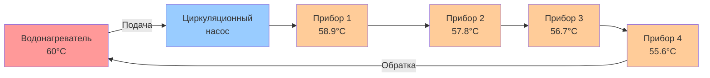

## Обзор

Системы распределения с последовательным контуром направляют горячую воду через непрерывный контур, проходящий последовательно через все приборы перед возвратом в водонагреватель. Циркуляционный насос поддерживает постоянный поток, обеспечивая мгновенную доступность горячей воды на всех точках потребления. Эта конфигурация минимизирует время ожидания, но вызывает прогрессивное падение температуры по контуру и непрерывные тепловые потери.

Последовательный контур представляет самую простую топологию рециркуляции, исторически распространённую в небольших жилых помещениях и по-прежнему используемую, когда количество приборов ограничено и требования к равномерности температуры скромны.

## Конфигурация системы

### Физическая схема

Последовательный контур состоит из:

1. **Трубопровод подачи** - Выходит из водонагревателя при полной температуре подачи
2. **Трубопровод контура** - Непрерывная линия, соединяющая все приборы последовательно
3. **Подключения приборов** - Тройниковые соединения в каждой точке потребления
4. **Трубопровод обратки** - Замыкает цепь обратно к входу водонагревателя или к отдельному обратному подключению
5. **Циркуляционный насос** - Поддерживает непрерывный поток (типично 0,19-0,76 л/ч суммарного потока контура)

## Анализ падения температуры

Температура воды снижается прогрессивно по последовательному контуру из-за тепловых потерь через стенки труб. Температура в любой точке зависит от накопленных тепловых потерь от водонагревателя к этому месту.

### Уравнение падения температуры

Падение температуры от водонагревателя к прибору $n$ равно:

$$\Delta T_n = \sum_{i=1}^{n} \frac{q_i \cdot L_i}{\dot{m} \cdot c_p}$$

Где:
- $\Delta T_n$ = Падение температуры к прибору $n$ (°C)
- $q_i$ = Тепловая потеря на единицу длины для сегмента трубы $i$ (кДж/ч·м)
- $L_i$ = Длина сегмента трубы $i$ (м)
- $\dot{m}$ = Массовый расход (кг/ч)
- $c_p$ = Удельная теплоёмкость воды = 4,18 кДж/кг·°C

### Тепловая потеря на единицу длины

Для изолированной трубы:

$$q = \frac{2\pi \cdot k_{ins} \cdot (T_w - T_a)}{\ln(r_o / r_i)}$$

Где:
- $k_{ins}$ = Теплопроводность изоляции (кДж/ч·м·°C)
- $T_w$ = Температура воды (°C)
- $T_a$ = Температура окружающей среды (°C)
- $r_o$ = Наружный радиус изоляции (м)
- $r_i$ = Внутренний радиус изоляции (наружный радиус трубы) (м)

### Практическое падение температуры

Для типичной жилой установки с трубой из медной трубки 12,7 мм, 12,7 мм стекловолоконной изоляции, окружающая среда 21°C:

| Длина контура (м) | Расход (л/ч) | Падение температуры (°C) |
|------------------|-----------------|----------------------|
| 15,2 | 0,19 | 4,4-6,7 |
| 30,5 | 0,19 | 8,9-13,3 |
| 15,2 | 0,38 | 2,2-3,3 |
| 30,5 | 0,38 | 4,4-6,7 |

Более высокие расходы снижают падение температуры, но увеличивают энергию насоса.

## Подбор диаметров труб

Трубопровод последовательного контура должен вмещать полный расход циркуляции плюс одновременный спрос потребителей. Подбор на основе:

### Ограничение скорости

$$v = \frac{Q}{A} = \frac{Q}{\pi r^2}$$

Поддерживайте скорость ниже 2,4 м/с для ограничения шума и эрозии. Для циркуляции только:

| Диаметр трубы | Максимальный расход (л/ч) | Скорость при макс. (м/с) |
|-----------|-------------------|------------------------|
| 12,7 мм | 1,14 | 2,38 |
| 19,05 мм | 2,27 | 2,29 |
| 25,4 мм | 4,54 | 2,41 |

### Падение давления

Минимизируйте полное падение давления в контуре для снижения энергии насоса:

$$\Delta P = f \cdot \frac{L}{D} \cdot \frac{\rho v^2}{2} + K \cdot \frac{\rho v^2}{2}$$

Целевое полное падение давления в контуре менее 3,05 м напора для жилых приложений.

## Сравнение последовательного и параллельного контуров

| Параметр | Последовательный контур | Параллельный (домовая разводка) |
|-----------|-------------|---------------------|
| **Сложность трубопровода** | Простой непрерывный контур | Множество выделенных линий |
| **Стоимость материала** | Низкая | Высокая |
| **Равномерность температуры** | Плохая (прогрессивное падение) | Отличная (равная подача) |
| **Балансировка потока** | Не требуется | Может требовать балансировочных клапанов |
| **Температура последнего прибора** | Наиболее низкая в системе | Равна первому прибору |
| **Тепловые потери** | Непрерывные от всех трубопроводов | Непрерывные от магистрали + ответвлений |
| **Типичные приложения** | Малые жилые, ≤6 приборов | Большие жилые, коммерческие |
| **Соответствие нормам** | Ограничено требованиями к температуре | Соответствует всем требованиям температуры |

## Приложения и ограничения

### Подходящие приложения

Системы последовательного контура работают эффективно, когда:
- Общая длина контура менее 30,5 м
- Количество приборов менее 6-8
- Падение температуры 5,6-8,3°C приемлемо
- Простота установки приоритетна
- Жилые здания с компактной компоновкой

### Критические ограничения

1. **Прогрессивное падение температуры** - Последний прибор получает наиболее холодную воду, может не соответствовать требованиям норм (ASSE 1070 требует ≥49°C на приборах для контроля легионеллы)
2. **Плохой отклик нагрузки** - Интенсивный отбор у первого прибора снижает температуру в нижних приборах
3. **Отсутствие резервирования** - Отказ одного циркуляционного насоса исключает мгновенную горячую воду на всех приборах
4. **Затруднённое расширение** - Добавление приборов требует модификации контура
5. **Балансировка невозможна** - Невозможно независимо регулировать температуру на разных приборах

## Соображения при проектировании

### Требования к изоляции

Все трубопроводы последовательного контура должны быть изолированы с минимальным RSI 0,7 согласно IECC и ASHRAE 90.1. Более высокая изоляция (RSI 1,1-1,4) значительно снижает:
- Падение температуры по контуру
- Стоимость эксплуатации (сниженные тепловые потери)
- Требуемый расход циркуляции

### Выбор циркуляционного насоса

Выберите насос для обеспечения:
- Расход: 0,19-0,76 л/ч для жилых контуров
- Напор: Преодолеть полное падение давления в контуре (типично 1,5-4,6 м)
- Управление: Таймер или акваstat для управления по требованию
- Эффективность: Двигатель ECM для непрерывной работы

### Соответствие нормам

Проверьте местные нормы сантехники для:
- Минимальная температура на самом удалённом приборе (типично 49°C в разумное время)
- Максимальная температура на приборах (49°C рекомендуется, 60°C максимум согласно IPC)
- Требования защиты от обратного потока
- Смягчение риска легионеллы (ASHRAE 188)

## Характеристики эксплуатации

Последовательные контуры обеспечивают мгновенную доступность горячей воды с непрерывными тепловыми потерями. Годовой штраф на энергию за тепловые потери типично составляет 4380-11700 МДж для жилых установок, представляя 20-40% общего энергопотребления водонагревателя. Управление на основе таймера или активация по требованию снижает этот штраф на 40-70%.

Изменение температуры по контуру создаёт проблемы комфорта пользователя, когда последний прибор испытывает заметно более холодную воду, чем первый. Это ограничение ограничивает применение последовательного контура зданиями, где все приборы находятся в непосредственной близости и общая длина контура остаётся менее 30,5 м.
