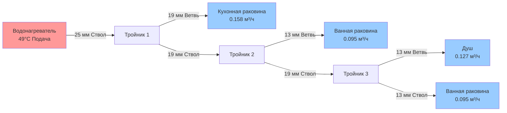

## Обзор

Распределение типа ствол-ветвь представляет традиционный метод доставки горячего водоснабжения (ГВС) в жилых и коммерческих зданиях. Эта архитектура системы использует прогрессивно уменьшающиеся диаметры труб по мере расширения основного ствола к удаленным приборам, с отдельными ветвями, подающими каждую группу приборов. Хотя системы коллекторного типа приобрели популярность при новом строительстве, ствол-ветвь остается доминирующей установленной базой и предлагает конкретные преимущества при реконструкции, приложениях с высокой пропускной способностью и чувствительных к стоимости проектах.

## Архитектура системы

Конфигурация ствол-ветвь состоит из трех иерархических элементов:

**Основной ствол**: Труба большого диаметра (обычно 19–51 мм в жилых приложениях) проходит от водонагревателя по самому длинному пути для обслуживания нескольких приборов. Ствол сохраняет постоянный диаметр до тех пор, пока ветви приборов не снизят нижестоящее потребление достаточно, чтобы оправдать снижение диаметра трубы.

**Линии ветвей**: Отдельные трубы ответвляются от ствола для обслуживания групп приборов или отдельных приборов. Размер ветви зависит от потребления приборов и расстояния от ствола.

**Прогрессивный расчет диаметра**: По мере обслуживания приборов вдоль маршрута ствола потребление уменьшается, что позволяет снизить диаметр трубы. Этот прогрессивный подход минимизирует стоимость материалов при сохранении адекватной пропускной способности потока.

## Методы расчета диаметра трубопровода

### Метод единиц приборов

Международный сантехнический код (IPC) и Единый сантехнический код (UPC) предписывают расчет на основе единиц приборов, которые коррелируют потребление с пропускной способностью трубы:

$$Q_{design} = \sum_{i=1}^{n} FU_i \times C_{simultaneous}$$

Где:
- $Q_{design}$ = расход проектирования (м³/ч)
- $FU_i$ = значение единицы прибора для каждого прибора
- $C_{simultaneous}$ = коэффициент одновременности (обычно 0,6–1,0 для жилых помещений)

Для медных труб типа L при максимальной скорости 1,5 м/с:

| Размер трубы | Максимум единиц приборов | Пропускная способность потока (м³/ч) |
|-----------|----------------------|---------------------|
| 13 мм      | 3                    | 0.254                 |
| 19 мм      | 8                    | 0.509                 |
| 25 мм        | 17                   | 0.955                |
| 32 мм    | 27                   | 1.592                |
| 38 мм    | 39                   | 2.228                |

### Расчет потерь давления

Потери трения в системах ствол-ветвь требуют расчета для каждого сегмента, используя уравнение Хазена-Вильямса:

$$\Delta P = \frac{10.67 \times L \times Q^{1.852}}{C^{1.852} \times d^{4.87}} \, \text{кПа}$$

Где:
- $\Delta P$ = потери давления (кПа)
- $L$ = длина трубы (м)
- $Q$ = расход (м³/ч)
- $C$ = коэффициент шероховатости (150 для меди, 140 для PEX)
- $d$ = внутренний диаметр (мм)

Общие потери давления в системе равны сумме всех сегментов критического пути (самый длинный пробег) плюс потери на фитингах. Остаточное давление на удаленном приборе должно соответствовать минимуму кода (обычно 103–138 кПа динамического).

## Время доставки горячей воды

Критическое ограничение производительности систем ствол-ветвь - это продленное время ожидания доставки горячей воды к удаленным приборам. Объем воды в трубопроводе должен быть вытеснен до того, как горячая вода достигнет прибора.

**Расчет объема:**

$$V_{pipe} = \frac{\pi d^2}{4} \times L \, \text{см}^3$$

**Время ожидания:**

$$t_{wait} = \frac{V_{pipe}}{Q_{fixture} \times 1000} \times 60 \, \text{сек}$$

Для пробега 15 м медной трубы 19 мм (внутренний диаметр 17,5 мм) к раковине с расходом 0,095 м³/ч:

$$V_{pipe} = \frac{\pi (17.5)^2}{4} \times 15000 = 3606 \, \text{см}^3$$

$$t_{wait} = \frac{3606}{95 \times 1000} \times 60 = 2.3 \, \text{сек}$$

Этот расчет представляет лучший сценарий; фактическое время ожидания увеличивается при учете охлаждения между использованиями и потерь тепла в окружающую среду.

## Рассмотрение потерь энергии

Вода, остающаяся в ветвях после закрытия прибора, охлаждается до температуры окружающей среды, представляя потерянную энергию и воду. Для системы с общей длиной 60 м трубопровода горячей воды:

$$E_{waste} = \rho \times V_{total} \times c_p \times (T_{supply} - T_{ambient})$$

Годовые потери энергии зависят от режимов использования, но обычно составляют 5–15% от общей энергии нагрева воды в жилых приложениях без рециркуляции.

## Сравнение: системы ствол-ветвь и коллекторные системы

| Характеристика | Ствол-ветвь | Коллектор (PEX) |
|----------------|------------------|----------------|
| **Диаметр трубы** | Прогрессивный (19–38 мм) | Однородный (13 или 10 мм) |
| **Количество фитингов** | Высокое (несколько тройников) | Низкое (централизованное) |
| **Объем воды** | Выше | Ниже |
| **Время доставки** | 3–12 сек типично | 2–6 сек типично |
| **Потери давления** | Умеренные (потери на фитингах) | Выше (длина, маленький диаметр) |
| **Сложность монтажа** | Умеренная (доступные маршруты) | Низкая (непрерывные пробеги) |
| **Стоимость материала** | Ниже (меньше труб) | Выше (больше общей длины) |
| **Сложность балансировки** | Выше (зависимые ветви) | Ниже (независимые пробеги) |
| **Пропускная способность потока** | Выше (большие трубы) | Ограниченная (маленький диаметр) |
| **Лучшее применение** | Много ванных комнат, высокий спрос на поток | Одноквартирный дом, умеренный спрос |

## Балансировка и рассмотрение потока

Системы ствол-ветвь демонстрируют зависимость давления: когда один прибор открывается, нижестоящие приборы испытывают повышение давления, в то время как восходящие приборы видят снижение давления. Это создает проблемы балансировки в сценариях одновременного использования нескольких приборов, особенно в комбинациях душ/ванна, где стабильность температуры имеет решающее значение.

Надлежащая балансировка требует:
1. Клапанов балансировки давления или термостатических смесительных клапанов на приборах душа
2. Равных потерь трения на приборах, требующих одновременного сбалансированного потока
3. Надлежащего размера основного ствола для минимизации колебания давления, вызванного скоростью

## Требования кодекса

Раздел 604 IPC и раздел 610 UPC регулируют минимальный размер труб. Ключевые требования:

- Минимальный размер ветви к приборам: 10 мм (некоторые коды требуют 13 мм)
- Максимальная скорость: 2,4 м/с (1,5 м/с рекомендуется для снижения шума)
- Минимальное давление прибора: 103 кПа динамического (IPC), 55 кПа (UPC)
- Расстояние между опорами: максимум 1,8 м горизонтально для меди, 0,8 м для PEX

## Лучшие практики установки

1. **Планирование маршрута**: Минимизируйте длину ствола, расположив водонагреватель центрально по отношению к группам приборов
2. **Изоляция**: Изолируйте все трубопроводы горячей воды для снижения потерь на перекачку и времени доставки
3. **Уклон**: Поддерживайте легкий уклон (6 мм на 3 м) для дренажа при техническом обслуживании
4. **Доступ**: Предусмотрите люки доступа на критических тройниках для будущего обслуживания
5. **Расширение**: Установите компенсацию расширения для пробегов, превышающих 15 м в меди или 9 м в CPVC

## Заключение

Распределение ствол-ветвь остается стандартным методом доставки ГВС благодаря его эффективности материалов, высокой пропускной способности потока и совместимости с различными сантехническими материалами. Понимание принципов прогрессивного расчета диаметра, расчета потерь трения и последствий времени доставки позволяет проектировать систему должным образом. Когда время ожидания горячей воды представляет проблему, рассмотрите循环 контуры или переключение на архитектуру коллектора для конкретных групп приборов, сохраняя ствол-ветвь для зон с высоким спросом.
