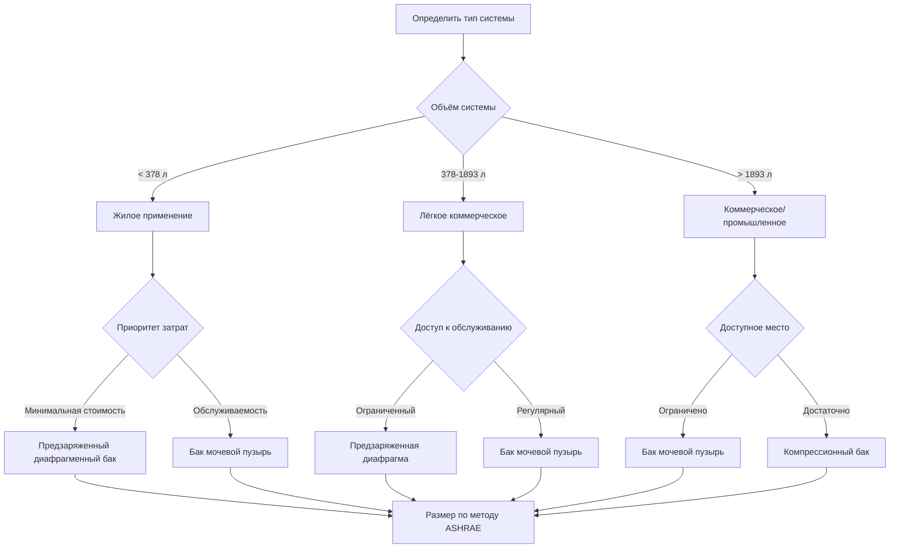
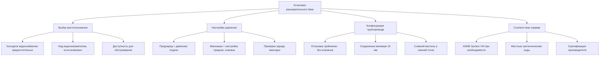

## Обзор

Расширительные баки защищают системы горячего водоснабжения от избыточного давления, вызванного объёмным расширением при нагреве воды. В закрытых системах с обратными клапанами или клапанами обратного потока нагретая вода не может расширяться обратно в магистраль подачи, создавая потенциально опасные условия давления. Расширительные баки поглощают это изменение объёма, поддерживая безопасные рабочие давления и предотвращая срабатывание предохранительного клапана, повреждение оборудования и преждевременный отказ системы.

## Физика теплового расширения

Вода демонстрирует значительное объёмное расширение при нагреве. Коэффициент объёмного расширения воды варьируется с температурой, но в среднем составляет примерно 0,00036 на 1 °C в диапазоне эксплуатации систем горячего водоснабжения.

**Расчёт объёмного расширения:**

$$\Delta V = V_0 \cdot \beta \cdot \Delta T$$

Где:
- $\Delta V$ = объёмное расширение (л)
- $V_0$ = начальный объём воды (л)
- $\beta$ = коэффициент объёмного расширения (1/°C)
- $\Delta T$ = повышение температуры (°C)

**Упрощённый коэффициент расширения:**

$$e = \frac{\Delta V}{V_0} = 0.00036 \cdot \Delta T$$

Для типичных жилых систем, нагреваемых с 4 °C до 60 °C:

$$e = 0.00036 \times (60 - 4) = 0.0202 \text{ или } 2.02\%$$

Водонагреватель объёмом 189 л генерирует примерно 3,8 л объёма расширения в этих условиях.

## Типы баков и их выбор

### Сравнение конструкций расширительных баков

| Тип бака | Конструкция | Диапазон давления | Применение | Преимущества | Ограничения |
|-----------|-------------|-------------------|------------|-------------|-------------|
| Диафрагма (мочевой пузырь) | Резиновая диафрагма разделяет воздух/воду | 172-1034 кПа | Жилые, лёгкие коммерческие | Без поглощения воздуха, компактный | Ограниченный срок службы, чувствителен к температуре |
| Компрессионный (стальной) | Открытый стальной бак, без разделителя | 172-862 кПа | Крупные коммерческие системы | Долговечный, обслуживаемый | Требует заправки воздухом, большие размеры |
| Мочевой пузырь | Сменяемый резиновый мочевой пузырь | 172-1034 кПа | Коммерческие, высокочастотные | Обслуживаемый мочевой пузырь | Выше начальная стоимость |
| Тепловое расширение (предварительно заряженный) | Фиксированная диафрагма, заводская заправка | 276-1034 кПа | Только жилые ГВС | Безуходный, компактный | Необслуживаемый, узкое применение |

### Блок-схема выбора бака

## Расчёт размера расширительного бака

### Метод расчёта ASHRAE

Требуемый объём приёма бака должен вмещать тепловое расширение системы:

$$V_t = \frac{e \cdot V_s \cdot (P_f + 101.3)}{(P_f + 101.3) - (P_i + 101.3)}$$

Где:
- $V_t$ = минимальный объём бака (л)
- $e$ = коэффициент расширения (безразмерный)
- $V_s$ = объём воды в системе (л)
- $P_f$ = максимальное давление в системе (кПа абс.)
- $P_i$ = давление предварительной заправки бака (кПа абс.)

**Упрощённая форма:**

$$V_t = \frac{e \cdot V_s \cdot P_f}{P_f - P_i}$$

### Практический пример расчёта

**Дано:**
- Вместимость водонагревателя: 303 л
- Повышение температуры: 4 °C до 60 °C (ΔT = 56 °C)
- Настройка предохранительного клапана: 1034 кПа
- Давление подачи: 414 кПа
- Давление предварительной заправки: 276 кПа (типичное для жилых систем)

**Решение:**

1. Рассчитать коэффициент расширения:
   $$e = 0.00036 \times 56 = 0.0202$$

2. Рассчитать объём расширения:
   $$\Delta V = 303 \times 0.0202 = 6.12 \text{ л}$$

3. Рассчитать минимальный размер бака:
   $$V_t = \frac{0.0202 \times 303 \times 1034}{1034 - 414} = \frac{6339}{620} = 10.22 \text{ л}$$

**Рекомендация:** Выбрать расширительный бак объёмом 19 л с соответствующим номиналом давления.

## Требования к установке

### Критические параметры установки

### Стандарты и требования норм

**Кодекс ASME по котлам и сосудам под давлением:**
- Section VIII Division 1: Расширительные баки свыше 454 л и более 345 кПа требуют сертификации ASME
- Клейма указывают на проверку третьей стороной и соответствие кодексу
- Устройства сброса давления требуются согласно UG-125 – UG-136

**Справочник приложений ASHRAE:**
- Глава 51 (Снабжение теплой водой): Методология расчёта размера расширительного бака
- Рекомендует коэффициент безопасности 1,1–1,25 от рассчитанного объёма
- Давление предварительной заправки должно равняться статическому давлению заполнения

**Единый сантехнический кодекс (UPC) и Международный сантехнический кодекс (IPC):**
- Обязательная установка расширительного бака в закрытых системах
- Должен быть рассчитан на объём системы и перепад температур
- Установка на стороне холодного водоснабжения рекомендуется, но не всегда требуется

### Оптимизация давления предварительной заправки

Надлежащее давление предварительной заправки максимизирует объём приёма бака:

$$P_i = P_{статическое} + 34.5 \text{ кПа}$$

Где $P_{статическое}$ — статическое давление заполнения в месте установки бака. Для многоэтажных зданий:

$$P_{статическое} = P_{подача} - \frac{h}{0.102}$$

Где:
- $P_{подача}$ = давление подачи (кПа)
- $h$ = высота над подачей (м)
- 0.102 = коэффициент преобразования (м воды на кПа)

## Эксплуатационные соображения

**Режимы отказа и диагностика:**

1. **Заполненный водой бак:** Потеря давления предварительной заправки, отсутствие амортизирующего эффекта, срабатывание предохранительного клапана
2. **Недостаточный размер бака:** Частое срабатывание предохранительного клапана, высокое давление в системе
3. **Отказ диафрагмы:** Вода в воздушной камере, снижение объёма приёма
4. **Неправильная предзаправка:** Неэффективная работа, колебания давления

**Процедура тестирования:**

1. Изолировать систему, слить давление
2. Проверить давление на стороне воздуха манометром при штуцере Шредера
3. Сравнить со спецификацией (обычно 276–345 кПа для жилых систем)
4. Перезаправить при необходимости с использованием стандартного компрессора воздуха
5. Никогда не превышать максимальное номинальное давление

**График обслуживания:**

- Ежегодная проверка давления предварительной заправки
- Квартальный визуальный осмотр утечек, коррозии
- Проверка системного давления во время цикла нагрева
- Замена диафрагменных баков каждые 5–10 лет в зависимости от цикличности

## Безопасность и защита

Расширительные баки работают совместно с клапанами температурной и гидравлической защиты, а не как замену им. Клапан Т&П обеспечивает окончательную защиту от избыточного давления при отказе расширительного бака или его недостаточном размере. Надлежащее проектирование системы включает оба компонента в качестве защиты от катастрофического отказа.

Расширительный бак предотвращает ложное срабатывание предохранительного клапана и потерю воды при одновременном продлении срока службы оборудования путём управления цикличностью давления. В системах питьевого водоснабжения баки должны быть рассчитаны для услуг питьевого водоснабжения с соответствующей сертификацией NSF или эквивалентом.

---

**Связанные темы:**
- Расчёт и выбор клапана сброса давления
- Устройства предотвращения обратного потока
- Проектирование системы водонагревателя
- Управление тепловым расширением в закрытых гидравлических контурах
