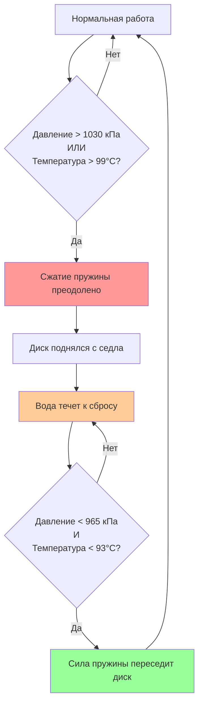
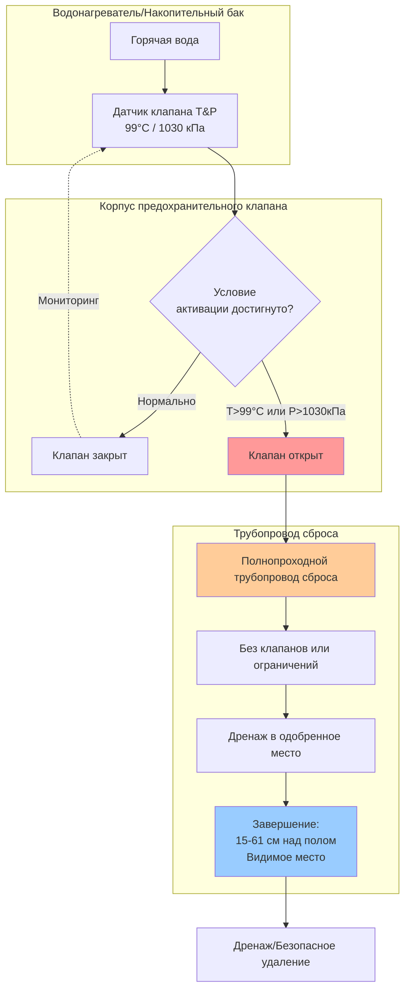
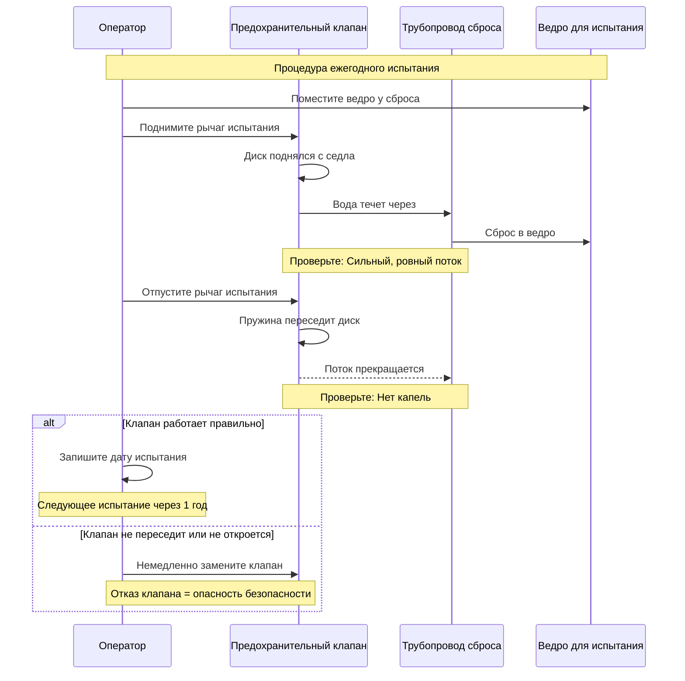

## Обзор

Предохранительные клапаны температуры и давления (T&P) представляют собой основное устройство безопасности, защищающее системы горячего водоснабжения от катастрофического отказа из-за чрезмерного давления или температуры. ASME Section IV и кодексы сантехники требуют установки этих устройств на всех водонагревателях и накопительных баках для предотвращения разрыва сосуда от теплового расширения, повышения давления или отказа систем управления.

Предохранительный клапан работает по двум независимым принципам: открывается при достижении предустановленного давления (обычно 1030 кПа для жилых приложений) или при достижении предустановленной температуры (стандартная 99°C), в зависимости от того, что произойдет первым. Этот двойной функциональный дизайн обеспечивает защиту как от условий избыточного давления в сосуде, так и от сценариев неконтролируемого повышения температуры при отказе систем управления.

## Принципы работы и физика

### Механизм сброса давления

Функция сброса давления работает через механизм со сжатой пружиной, где давление системы воздействует на площадь диска клапана:

$$F_{система} = P_{система} \cdot A_{диск}$$

Когда сила давления системы превышает силу пружины, клапан открывается:

$$P_{система} \cdot A_{диск} > F_{пружина}$$

Клапан откалиброван на открытие при установленном давлении с допуском ±21 кПа согласно стандартам ASME.

### Механизм сброса по температуре

Сброс по температуре использует плавкий элемент или актуатор теплового расширения, установленный для прямого определения температуры бака. Когда температура воды достигает 99°C, тепловое расширение чувствительного элемента преодолевает силу пружины независимо от давления:

$$\Delta L = \alpha \cdot L_0 \cdot \Delta T$$

Где:
- $\Delta L$ = длина расширения элемента
- $\alpha$ = коэффициент теплового расширения
- $L_0$ = первоначальная длина элемента
- $\Delta T$ = повышение температуры выше точки калибровки

## Расчеты емкости сброса

### Требуемая емкость сброса

ASME Section IV указывает минимальную емкость сброса на основе максимальной тепловой мощности:

$$Q_{сброс} = \frac{Q_{вход}}{c \cdot \rho \cdot \Delta T}$$

Где:
- $Q_{сброс}$ = требуемая емкость сброса (кг/ч или л/мин)
- $Q_{вход}$ = максимальная тепловая мощность (кДж/ч)
- $c$ = удельная теплоемкость воды (4.19 кДж/кг·°C)
- $\rho$ = плотность воды (1000 кг/м³)
- $\Delta T$ = повышение температуры (обычно 83°C)

Для водонагревателей минимальная емкость:

$$C_{мин} = \frac{4.0 \text{ кДж/ч на кВт}}{1.0} = 4.0 \text{ кДж/ч на кВт входной мощности}$$

### Расход через предохранительный клапан

Фактический расход через открытый предохранительный клапан следует уравнениям потока через отверстие:

$$Q = K \cdot A \cdot \sqrt{2g \cdot h_{давление}}$$

Преобразование в напор давления:

$$Q = 0.6 \cdot A \cdot \sqrt{\frac{2 \cdot P \cdot 6.895}{\rho}}$$

Где:
- $Q$ = расход (м³/с)
- $A$ = площадь отверстия (м²)
- $P$ = давление сброса (кПа)
- $\rho$ = плотность воды (1000 кг/м³)

## Стандартные параметры давления и температуры

| Приложение | Установка давления | Установка температуры | Рейтинг ASME |
|-------------|------------------|---------------------|-------------|
| Жилой водонагреватель | 1030 кПа | 99°C | Section IV |
| Коммерческий водонагреватель | 1030 кПа | 99°C | Section IV |
| Котел с теплообменником ГВС | 207-862 кПа | 99°C | Section IV |
| Накопительный бак только | 1030 кПа | 99°C | Section IV |
| Высокое многоэтажное здание | 1030-1207 кПа | 99°C | Section IV |

## Требования к определению размера

### Выбор размера клапана

Определение размера предохранительного клапана зависит от тепловой мощности и емкости бака. Минимальные размеры согласно ASME Section IV:

| Тепловая мощность | Минимальный размер клапана | Емкость сброса (кДж/ч) |
|-----------------|-------------------|--------------------------|
| До 585 кДж/ч | 19 мм | 585 кДж/ч |
| 585-880 кДж/ч | 19 мм | 880 кДж/ч |
| 880-1175 кДж/ч | 25 мм | 1175 кДж/ч |
| 1175-1465 кДж/ч | 25 мм | 1465 кДж/ч |
| 1465-2200 кДж/ч | 32 мм | 2200 кДж/ч |
| 2200-2930 кДж/ч | 38 мм | 2930 кДж/ч |

### Проверка емкости

Убедитесь, что емкость предохранительного клапана превышает тепловую мощность:

$$\frac{Q_{клапан}}{Q_{вход}} \geq 1.0$$

Для газовых нагревателей с общей входной мощностью $Q_{газ}$:

$$Q_{клапан} \geq Q_{газ} \times 0.8 \times 1.1$$

Коэффициент 0.8 учитывает эффективность сгорания, 1.1 обеспечивает 10% запас безопасности.

## Требования к трубопроводам сброса

### Определение размера трубопровода

Размер трубопровода сброса должен быть равен или превышать размер выхода клапана. **Никогда не уменьшайте диаметр трубопровода сброса.** Перепад давления через трубопровод сброса не должен превышать 3% установленного давления.

Расчет максимальной длины трубопровода сброса:

$$L_{макс} = \frac{\Delta P_{допуск} \cdot d^5}{f \cdot Q^2 \cdot \rho}$$

Для практических приложений ограничьте длину сброса:

| Размер клапана | Максимальная длина сброса | Минимальный размер трубопровода |
|------------|-------------------------|-------------------|
| 19 мм | 9,1 м | 19 мм |
| 25 мм | 9,1 м | 25 мм |
| 32 мм | 9,1 м | 32 мм |
| 38 мм | 9,1 м | 38 мм |

### Завершение сброса

Кодексы сантехники (IPC, UPC, IRC) требуют специфического завершения сброса:

- **Высота**: 15-61 см над полом или уровнем земли
- **Место**: Видимое место, где сброс можно наблюдать
- **Защита**: Защищено от замерзания в холодных климатических условиях
- **Дренаж**: Не должна создавать опасность скольжения или повреждение имущества
- **Воздушный промежуток**: Нет прямого соединения с системой дренажа
- **Материал**: Одобренный материал трубопровода (медь, CPVC, PEX где одобрено)

## Требования кодексов

### ASME Section IV

- Предохранительный клапан требуется на всех водонагревателях и накопительных баках
- Клапан должен быть клеймен и сертифицирован ASME
- Установленное давление не должно превышать максимальное допустимое рабочее давление (MAWP)
- Температурный элемент должен прямо определять температуру воды
- Между баком и предохранительным клапаном не допускается запорный клапан

### Международный кодекс сантехники (IPC)

Раздел 504.6 устанавливает:
- Предохранительный клапан требуется в системах водоснабжения, превышающих 550 кПа
- Предохранительный клапан T&P требуется на всех водонагревателях
- Сброс в одобренное место, предотвращающее ожоги или повреждение имущества
- Трубопровод сброса того же размера, что и выход клапана, без резьбы на конце завершения

### Единый кодекс сантехники (UPC)

Требования раздела 608.3:
- Емкость предохранительного клапана соответствует или превышает тепловую мощность
- Уклон трубопровода сброса минимум 6 мм на 30 см в сторону завершения
- Материал совместим с водой 99°C
- Нет обратных клапанов или запорных клапанов в линии сброса

## Требования к установке

### Место расположения клапана

Установите предохранительный клапан T&P в верхнюю часть бака в пределах 15 см от верхней части водяной толщи, где происходит наивысшая температура. Для горизонтальных баков установите на конце бака в верхней части.

Чувствительный элемент должен прямо контактировать с водой - не паровое пространство над уровнем воды.

### Подключение трубопроводов

- Используйте диэлектрические переходники, где контактируют разнородные металлы
- Применяйте смазку для труб или ленту PTFE только на наружную резьбу
- Затягивайте в соответствии со спецификациями производителя (обычно 34-41 Н·м для клапана 19 мм)
- Поддерживайте трубопровод сброса независимо - не используйте корпус клапана для поддержки

### Распространенные ошибки при установке

**Никогда:**
- Не устанавливайте клапан боком или вверх ногами
- Не закупоривайте и не затыкайте трубопровод сброса
- Не уменьшайте размер трубопровода сброса ниже размера выхода клапана
- Не устанавливайте переходники, клапаны или тройники в линию сброса
- Не удлиняйте трубопровод сброса сверх максимума по кодексу (обычно 9,1 м)
- Не нарезайте резьбу на конце завершения трубопровода сброса

## Испытания и обслуживание

### Процедура ручного испытания

Ежегодное испытание рекомендуется, требуется некоторыми юрисдикциями:

1. **Поместите ведро** под завершение трубопровода сброса
2. **Медленно поднимите рычаг испытания** в открытое положение
3. **Наблюдайте поток** - вода должна течь свободно из сброса
4. **Отпустите рычаг** - клапан должен полностью переседить без капель
5. **Проверьте утечки** в соединениях корпуса клапана

**Если клапан не работает или не переседит правильно, немедленно замените его.**

### Проверка автоматического испытания

Для критических приложений установите манометр и термометр для проверки:

$$P_{тест} = P_{установ} \pm 21 \text{ кПа}$$

$$T_{тест} = 99°C \pm 3°C$$

Давление испытания должно вызвать открытие клапана в пределах полосы допуска.

### График замены

Замените предохранительные клапаны:
- Каждые 5 лет в областях с высокой жесткостью воды (>180 мг/л CaCO₃)
- Каждые 10 лет при умеренном качестве воды
- Немедленно, если видны минеральные отложения на области седла
- Немедленно, если клапан непрерывно капает (седло повреждено)
- После любого события сброса (тепловое расширение может повредить седло)

## Устранение неполадок

### Непрерывное капание

**Причина**: Минеральные отложения на седле, тепловое расширение слегка поднимающее клапан, повреждено седло

**Решение**:
1. Проверьте давление системы - установите расширительный бак, если >550 кПа
2. Проверьте работу редуктора давления
3. Замените предохранительный клапан, если капание продолжается

### Нет потока при испытании

**Причина**: Клапан заклинен из-за минеральных отложений, неправильная установка, дефектный клапан

**Решение**: Немедленно замените клапан - риск отказа клапана

### Сброс при нормальной работе

**Причина**: Избыточное давление от теплового расширения, отказ RDV, недостаточный размер расширительного бака

**Решение**:
1. Установите или измените размер расширительного бака: $V_{бак} = V_{вода} \times \frac{\Delta T}{T_0} \times \frac{P_{макс}}{P_{приемлемо}}$
2. Проверьте параметр RDV и работу
3. Проверьте источник тепла на перегрев (отказ термостата)

## Соображения безопасности

Сброс предохранительного клапана представляет собой воду при 99°C с высокой скоростью потока - опасность ожога. Направьте сброс в безопасное место:

- Не направляется в зоны пешеходного движения
- Защищена от контакта при сбросе
- Адекватный дренаж для обработки полной емкости сброса
- Видимо, чтобы указать активацию, требующую исследования

**Критически**: Предохранительный клапан защищает сосуд давления от разрыва. 189-литровый водонагреватель при 99°C содержит приблизительно 1318 МДж энергии. Разрыв сосуда высвобождает эту энергию взрывообразно - предохранительный клапан предотвращает этот режим катастрофического отказа.

Убедитесь, что предохранительный клапан остается в работе через регулярные испытания и своевременную замену. Это единственное устройство предотвращает травмы, смертельные исходы и повреждение имущества от взрывов водонагревателя.

## Контрольный список проектирования

- [ ] Предохранительный клапан сертифицирован и клеймен ASME Section IV
- [ ] Установка давления ≤ MAWP бака (обычно 1030 кПа)
- [ ] Установка температуры = 99°C стандартная
- [ ] Емкость клапана ≥ тепловой мощности
- [ ] Клапан расположен в верхних 15 см бака
- [ ] Чувствительный элемент прямо контактирует с водой
- [ ] Размер трубопровода сброса ≥ размер выхода клапана
- [ ] Нет клапанов или ограничений в линии сброса
- [ ] Сброс завершается 15-61 см над полом
- [ ] Место сброса видимо и безопасно
- [ ] Трубопровод сброса защищен от замерзания
- [ ] Нет резьбы на завершении сброса
- [ ] График испытаний установлен
- [ ] Расширительный бак измерен и установлен (закрытые системы)
