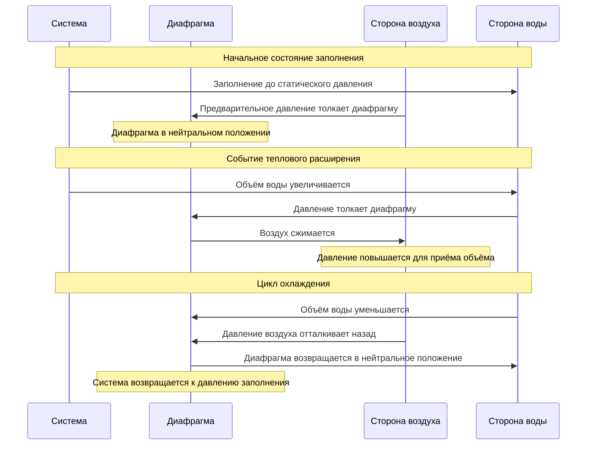

## Обзор

Предварительное давление — это давление воздуха, установленное на стороне воздуха диафрагмы или мембраны расширительного бака перед заполнением системы водой. Надлежащее предварительное давление обеспечивает оптимальную производительность бака, предотвращает заполнение водой и максимизирует объём расширения бака. Предварительное давление должно быть точно согласовано с условиями системы, чтобы предотвратить преждевременное открытие предохранительного клапана или неадекватное компенсирование теплового расширения.

## Основы предварительного давления

### Базовый принцип

Предварительное давление должно равняться статическому давлению воды в точке подключения бака при холодной и заполненной системе. Это соотношение обеспечивает нейтральное положение диафрагмы или мембраны при условиях заполнения, обеспечивая максимально доступный объём расширения.

**Формула предварительного давления:**

$$P_{pc} = P_{static} + P_{atm}$$

Где:
- $P_{pc}$ = предварительное давление (кПа изб.)
- $P_{static}$ = статическое давление воды в месте расположения бака (кПа изб.)
- $P_{atm}$ = атмосферное давление (0 кПа изб. по шкале манометра)

### Расчёт статического давления

Статическое давление в точке подключения бака зависит от вертикального расстояния между точкой заполнения системы и местоположением бака:

$$P_{static} = P_{fill} + \frac{h \cdot \rho \cdot g}{1000}$$

Где:
- $P_{fill}$ = давление заполнения системы (кПа изб.)
- $h$ = вертикальная высота от точки заполнения к баку (м)
- $\rho$ = плотность воды (1000 кг/м³ при 15°C)
- $g$ = ускорение свободного падения (9.81 м/с²)
- 1000 = коэффициент преобразования (Па в кПа)

**Упрощённая форма:**

$$P_{static} = P_{fill} + 9.81 \cdot h$$

Для баков, расположенных ниже точки заполнения, h отрицательна, что снижает статическое давление.

## Типовые предварительные давления

| Применение | Диапазон предварительного давления | Примечания |
|------------|----------------------------------|-----------|
| Частные жилые дома | 275–345 кПа | Соответствует типичному давлению коммунального водопровода |
| Многоэтажные жилые дома | 345–550 кПа | Варьируется по этажам |
| Коммерческие здания малой высоты | 310–415 кПа | Установки на нижних этажах |
| Коммерческие высокие здания | 415–860 кПа | Зависит от уровня, верхние этажи |
| Учреждения | 345–690 кПа | В зависимости от давления в системе |

## Стандарты ASME и требования кодексов

### ASME Section VIII

Расширительные баки, используемые в системах горячего водоснабжения, должны соответствовать Кодексу ASME по котлам и сосудам под давлением Section VIII, Division 1 для неотапливаемых сосудов под давлением. Ключевые требования включают:

- Номинальное максимально допустимое рабочее давление (МДРД)
- Согласованность устройства сброса давления
- Документация на паспортной табличке с давлением конструкции
- Гидростатическое испытательное давление (минимум 1,5× МДРД)

### Коэффициент безопасности предварительного давления

Предварительное давление не должно превышать 80% установленного давления предохранительного клапана для обеспечения надлежащего запаса перед открытием:

$$P_{pc} \leq 0.80 \cdot P_{relief}$$

Для стандартных предохранительных клапанов 1035 кПа в жилых системах:

$$P_{pc} \leq 0.80 \times 1035 = 828 \text{ кПа (максимум)}$$

## Последовательность работы бака

## Особенности диафрагменных и мембранных баков

### Диафрагменные баки

**Характеристики:**
- Неподвижная диафрагма разделяет бак на камеры воздуха и воды
- Предварительное давление воздуха на верхней камере (как правило)
- Вода поступает в нижнюю камеру
- Доступ к предварительному давлению через клапан Шредера на стороне воздуха

**Проверка предварительного давления:**
1. Изолировать бак от системы
2. Полностью слить воду со стороны воды
3. Проверить давление воздуха манометром
4. Отрегулировать до установленного предварительного давления

### Мембранные баки

**Характеристики:**
- Сменная мембрана содержит воду
- Воздух окружает мембрану в корпусе
- Доступ к предварительному давлению через клапан Шредера на корпусе
- Полная изоляция между воздухом и водой

**Проверка предварительного давления:**
1. Система может оставаться под давлением
2. Закрыть запорный клапан
3. Проверить давление воздуха у клапана корпуса
4. Отрегулировать в соответствии со статическим давлением

## Процедура регулировки предварительного давления

### Необходимые инструменты
- Манометр для шин (0–690 кПа минимум)
- Воздушный компрессор или ручной насос
- Манометр системы
- Инструмент для замены сердечника клапана (при необходимости)

### Пошаговая регулировка

**Для новой установки:**

1. **Определение целевого предварительного давления**
   - Измерить вертикальное расстояние от предохранительного клапана к баку
   - Рассчитать статическое давление: $P_{static} = P_{fill} + 9.81h$
   - Установить целевое предварительное давление равным статическому давлению

2. **Предварительное давление в баке перед установкой**
   - Подсоединить манометр к воздушному клапану
   - Добавить воздух до достижения целевого давления
   - Проверить стабилизацию давления
   - Установить бак в систему

3. **Проверка после заполнения**
   - Заполнить систему до расчётного давления
   - Проверить совпадение давления на стороне воды бака с давлением в системе
   - Подтвердить отсутствие выхода воды из воздушного клапана

**Для существующей установки:**

1. **Изолирование и слив**
   - Закрыть запорный клапан бака
   - Открыть сливной клапан на стороне воды
   - Полностью слить (отсутствие воды из воздушного клапана)

2. **Проверка текущего предварительного давления**
   - Подсоединить манометр к воздушному клапану
   - Записать давление
   - Сравнить с рассчитанным целевым значением

3. **Регулировка давления**
   - Добавить воздух, если ниже целевого значения
   - Отпустить воздух, если выше целевого значения
   - Проверить окончательное давление

4. **Повторное заполнение и тестирование**
   - Закрыть сливной клапан
   - Открыть запорный клапан
   - Проверить стабилизацию давления в системе
   - Проверить надлежащую работу

## Таблица установки давления

| Давление заполнения системы | Расположение бака | Разница высот | Требуемое предварительное давление |
|---------------------------|------------------|---------------|-----------------------------------|
| 345 кПа | Выше ПК | +6,1 м | 404 кПа |
| 345 кПа | На уровне ПК | 0 м | 345 кПа |
| 345 кПа | Ниже ПК | -6,1 м | 285 кПа |
| 415 кПа | Выше ПК | +9,1 м | 504 кПа |
| 415 кПа | На уровне ПК | 0 м | 415 кПа |
| 415 кПа | Ниже ПК | -4,6 м | 369 кПа |

## Частые ошибки при предварительном давлении

### Избыточное давление
**Признаки:** Недостаточное принятие расширения, частое открытие предохранительного клапана
**Причина:** Предварительное давление превышает статическое давление
**Решение:** Отпустить воздух до правильного давления

### Недостаточное давление
**Признаки:** Заполнение водой, пониженный объём принятия, колебания давления в системе
**Причина:** Предварительное давление ниже статического давления
**Решение:** Добавить воздух в соответствии со статическим давлением

### Потеря давления с течением времени
**Признаки:** Постепенное снижение производительности
**Причина:** Утечка воздушного клапана, проницаемость диафрагмы
**Решение:** Ежегодная проверка и регулировка предварительного давления

## Методы полевой проверки

### Тест статического давления
1. Записать давление заполнения системы в холодном состоянии в месте расположения бака
2. Изолировать и слить бак
3. Измерить предварительное давление
4. Сравнить значения — должны совпадать в пределах ±14 кПа

### Тест объёма принятия
1. Записать начальное давление в системе (холодное)
2. Нагреть воду до рабочей температуры
3. Записать максимальное давление в системе
4. Рассчитать повышение давления — должно оставаться ниже установленного давления ПК

$$\Delta P = P_{hot} - P_{cold} < (P_{relief} - P_{static})$$

## Требования по техническому обслуживанию

**Ежегодная проверка:**
- Проверить совпадение предварительного давления со статическим давлением системы
- Проверить герметичность воздушного клапана
- Проверить наличие внешней коррозии или повреждений
- Задокументировать показания давления

**Техническое обслуживание раз в 5 лет:**
- Полный слив системы и проверка предварительного давления
- Внутренняя проверка (если доступно)
- Оценка состояния диафрагмы/мембраны
- Замена, если годовая потеря давления превышает 10%

## Резюме

Надлежащая установка предварительного давления критически важна для производительности расширительного бака в системах горячего водоснабжения. Предварительное давление должно равняться статическому давлению воды в месте расположения бака, чтобы обеспечить нейтральное положение диафрагмы при условиях заполнения. Полевая регулировка требует изолирования системы, полного слива стороны воды и точного измерения давления с использованием калибровочных манометров. Соответствие стандартам ASME и регулярная проверка технического обслуживания обеспечивают надёжное компенсирование теплового расширения и защиту системы.
