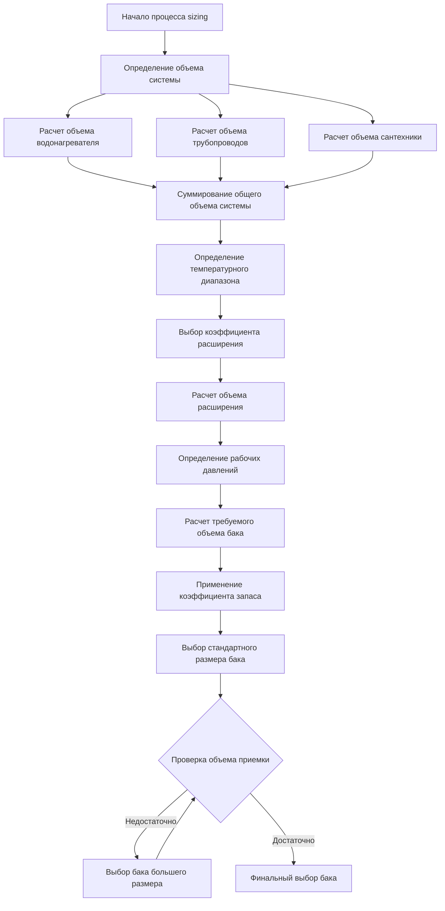

## Обзор

Расчет объема расширительного бака для систем горячего водоснабжения требует точного определения объема теплового расширения и правильного выбора объема приемки бака. Недообъем бака приводит к срабатыванию предохранительного клапана и повреждению системы, тогда как переобъем бака представляет собой неоправданные капитальные затраты.

## Основное уравнение sizing

Основное уравнение sizing расширительного бака согласно разделу IV ASME и рекомендациям ASHRAE:

$$V_t = \frac{V_s \times e}{1 - \frac{P_1}{P_2}}$$

Где:
- $V_t$ = Требуемый объем бака (литры)
- $V_s$ = Общий объем воды в системе (литры)
- $e$ = Коэффициент теплового расширения (безразмерный)
- $P_1$ = Давление заполнения системы (абсолютное, кПа)
- $P_2$ = Максимально допустимое давление (абсолютное, кПа)

## Коэффициент теплового расширения

Изменение плотности воды определяет объем расширения. Коэффициент зависит от повышения температуры:

$$e = \frac{\rho_{cold} - \rho_{hot}}{\rho_{cold}}$$

**Коэффициенты теплового расширения в зависимости от температуры:**

| Начальная температура (°C) | Конечная температура (°C) | Коэффициент расширения (e) | Увеличение объема (%) |
|------|-----------|----|-----------------|
| 4.4 | 60.0 | 0.0247 | 2.47 |
| 10.0 | 60.0 | 0.0225 | 2.25 |
| 15.6 | 60.0 | 0.0204 | 2.04 |
| 4.4 | 71.1 | 0.0322 | 3.22 |
| 10.0 | 71.1 | 0.0301 | 3.01 |
| 15.6 | 71.1 | 0.0280 | 2.80 |
| 4.4 | 82.2 | 0.0393 | 3.93 |

## Определение объема системы

Точный расчет объема системы включает все компоненты, содержащие воду:

1. **Объем бака водонагревателя**: Номинальная емкость по табличке производителя
2. **Объем трубопроводов**: Расчет на основе внутреннего диаметра
3. **Подключения к сантехнике**: Номинальный объем в распределительных трубопроводах

$$V_{pipe} = \frac{\pi d^2 L}{4 \times 231}$$

Где:
- $d$ = Внутренний диаметр трубы (см)
- $L$ = Общая длина трубы (см)
- 231 = Коэффициент пересчета (кубические дюймы на галлон)

**Типичные объемы труб:**

| Номинальный размер | Внутренний диаметр (см) | Объем (л/м) |
|------|----------|------------|
| 1/2" | 1.58 | 0.0157 |
| 3/4" | 2.09 | 0.0277 |
| 1" | 2.66 | 0.0449 |
| 1-1/4" | 3.51 | 0.0778 |
| 1-1/2" | 4.09 | 0.1059 |
| 2" | 5.25 | 0.1744 |

## Расчет объема приемки

Объем приемки бака представляет собой полезную емкость расширения между рабочими давлениями:

$$V_a = V_t \left(1 - \frac{P_1}{P_2}\right)$$

Это значение должно быть равно или превышать объем теплового расширения:

$$V_a \geq V_s \times e$$

## Методология sizing

## Учет давления

**Конвертация абсолютного давления:**

$$P_{absolute} = P_{gauge} + P_{atmospheric}$$

Для стандартных условий: $P_{atmospheric} = 101.3 \text{ кПа}$

**Типичные значения давления:**

| Параметр | Жилое (кПа) | Коммерческое (кПа) |
|------|---|------------|
| Давление заполнения | 276-345 | 345-552 |
| Максимальное рабочее | 862 | 1034 |
| Настройка предохранительного клапана | 1034 | 1034-1379 |
| Расчетное давление | 1034 | 1379-2068 |

## Пример расчета

**Параметры системы:**
- Водонагреватель: 303 литра
- Трубопроводы: 30.5 м меди 3/4"
- Температура: 10.0°C до 60.0°C
- Давление заполнения: 345 кПа
- Максимальное давление: 862 кПа

**Шаги расчета:**

1. **Объем системы:**
   - Водонагреватель: 303 литра
   - Трубопроводы: $30.5 \times 0.0277 = 0.84$ литра
   - Итого: $V_s = 303.84$ литра

2. **Коэффициент расширения:**
   - Из таблицы: $e = 0.0225$

3. **Члены давления:**
   - $P_1 = 345 + 101.3 = 446.3$ кПа
   - $P_2 = 862 + 101.3 = 963.3$ кПа

$$V_t = \frac{82.77 \times 0.0225}{1 - \frac{64.7}{139.7}} = \frac{1.862}{0.537} = 13.13 \text{ л}$$

5. **Коэффициент запаса (1.15):**
   - Требуемый: $13.13 \times 1.15 = 15.10$ л
   - Выбор: стандартный бак на 17.0 л (4.5 галлона)

## Проверка проекта

## Стандарты и требования нормативных документов

**Код котлов и сосудов под давлением ASME:**
- Раздел IV: Котлы отопления (применимо к системам ГВС)
- Раздел VIII: Сосуды под давлением (конструкция расширительного бака)

**Ключевые требования:**
- Баки должны иметь маркировку ASME для расчетного давления системы
- Давление предварительной зарядки должно быть установлено равным давлению заполнения системы
- Монтаж требует установки отсекающего клапана и подключения для слива
- Место установки должно исключать возможность водонасыщения

**Справочник по применению ASHRAE:**
- Глава 50: Нагрев воды для бытовых нужд
- Содержит коэффициенты расширения и методологию sizing
- Рекомендуется коэффициент запаса 10–15% для жилых приложений

## Применение коэффициента запаса

Применять коэффициенты запаса для учета:

| Условие | Рекомендуемый коэффициент |
|------|-----|
| Жилые системы | 1.10–1.15 |
| Коммерческие системы | 1.15–1.25 |
| Системы с высокой температурой (>82°C) | 1.25–1.35 |
| Системы с недостаточными данными по объему | 1.30–1.50 |

## Типичные ошибки при sizing

1. **Использование манометрического давления вместо абсолютного** в расчетах
2. **Игнорирование объема трубопроводов** в крупных распределительных системах
3. **Неправильный коэффициент расширения** для фактического температурного диапазона
4. **Недооценка sizing для установок с высоким статическим давлением**
5. **Игнорирование требований к давлению предварительной зарядки**, приводящее к водонасыщению

---

**Инженерное примечание:** Данная методика sizing применима к закрытым системам ГВС с обратными клапанами или устройствами предотвращения обратного потока, изолирующими систему от муниципального водоснабжения. В открытых системах без изоляции расширительные баки не требуются, так как тепловое расширение компенсируется возвратом в водопроводную сеть.
