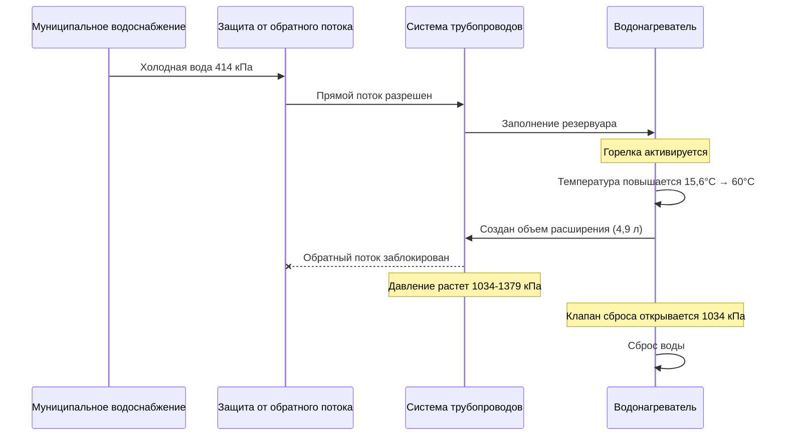
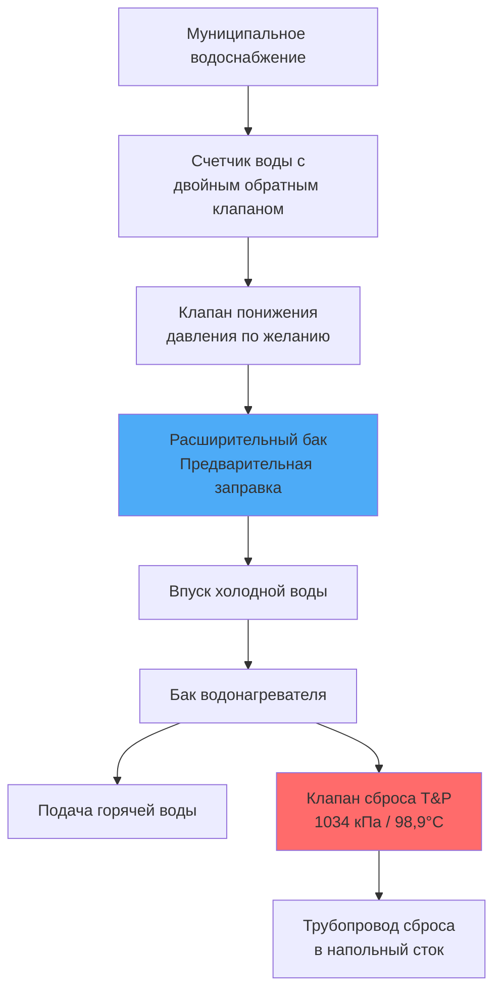

## Физика расширения воды

Вода проявляет объемное расширение при нагревании, создавая существенное повышение давления в закрытых сантехнических системах. Это явление происходит потому, что молекулы воды получают кинетическую энергию и занимают больший объем при повышении температуры.

### Уравнение объемного расширения

Изменение объема нагретой воды следует следующему соотношению:

$$\Delta V = V_0 \beta \Delta T$$

Где:
- $\Delta V$ = увеличение объема (л)
- $V_0$ = начальный объем воды (л)
- $\beta$ = коэффициент объемного расширения (1/°C)
- $\Delta T$ = изменение температуры (°C)

### Коэффициенты расширения воды

| Диапазон температур | β (×10⁻⁴ на °C) | Увеличение объема (%) |
|-------------------|-------------------|---------------------|
| 4,4°C до 60°C | 6,89 | 3,83% |
| 10°C до 60°C | 6,32 | 3,16% |
| 15,6°C до 60°C | 5,76 | 2,56% |
| 4,4°C до 71,1°C | 8,60 | 5,74% |
| 15,6°C до 82,2°C | 9,22 | 6,14% |

Для типичного водонагревателя объемом 189 л, нагреваемого с 15,6°C до 60°C, объем расширения:

$$\Delta V = 189 \text{ л} \times 0,0256 = 4,84 \text{ л}$$

## Повышение давления в закрытой системе

### Соотношение давления и объема

В полностью закрытой системе практическая несжимаемость воды вызывает быстрое повышение давления. Увеличение давления следует:

$$\Delta P = \frac{\beta \Delta T}{k}$$

Где:
- $\Delta P$ = увеличение давления (кПа)
- $k$ = сжимаемость воды (приблизительно 3,0 × 10⁻⁶ на кПа при 37,8°C)
- $\beta$ = коэффициент объемного расширения

**Критический результат**: Нагревание воды с 15,6°C до 60°C в полностью жесткой закрытой системе генерирует давления, превышающие 6895 кПа, что намного превышает номинальное давление 1034 кПа жилых водонагревателей и типичное давление открытия клапана сброса 552 кПа.

### Поток давления в системе

## Влияние защиты от обратного потока

Устройства защиты от обратного потока создают закрытые системы, предотвращая обратный поток в муниципальное водоснабжение. После установки тепловое расширение не может вернуться в трубопровод подачи.

### Типы, создающие закрытые системы

1. **Обратные клапаны** - пружинные или поворотные типы
2. **Двойные узлы обратных клапанов** - счетчики воды в жилых помещениях
3. **Узлы сниженного давления (RPZ)** - коммерческие установки
4. **Вакуумные выключатели давления** - защита от обратного потока для орошения

### Механизм эскалации давления

## Последствия неконтролируемого расширения

### Работа клапана сброса давления

Комбинированные клапаны температуры и давления (клапаны T&P или TPR) с номиналом 1034 кПа и 98,9°C служат устройствами защиты последней линии защиты согласно ASME CSD-1. Частый сброс указывает на недостаточный контроль расширения.

**Проблемы от повторного сброса клапана сброса:**
- Деградация седла клапана, ведущая к утечкам
- Накопление минеральных отложений, препятствующих надлежащему уплотнению
- Преждевременный отказ клапана, требующий замены
- Повреждение водой от утечек в трубопроводе сброса
- Потери энергии от потери горячей воды

### Стресс компонентов системы

Повышенные давления оказывают стресс на:
- Швы и сварные соединения бака водонагревателя
- Резьбовые соединения труб
- Линии и клапаны подачи приборов
- Соединения впускного патрубка приборов
- Долговечность компонентов с номинальным давлением

## Требования кодов

### Требования к расширительным бакам

**Единый кодекс сантехники (UPC) раздел 608.3**: «Когда установлено устройство защиты от обратного потока, обратный клапан или другое устройство, предотвращающее рассеивание давления здания обратно в водопровод, должен быть установлен одобренный внесенный в список расширительный бак или другое одобренное устройство с аналогичной функцией.»

**Международный кодекс сантехники (IPC) раздел 607.3**: Аналогичное требование, предписывающее контроль теплового расширения, когда защита от обратного потока создает закрытые системы.

**ASME раздел IV**: Устанавливает требования безопасности для резервуаров горячего водоснабжения, включая максимальное рабочее давление (1103 кПа для жилых устройств) и обязательную установку устройства сброса давления.

### Расчет размера расширительного бака

Расчет минимального размера бака:

$$V_t = \frac{V_s \times \beta \times \Delta T}{1 - \frac{P_1}{P_2}}$$

Где:
- $V_t$ = объем расширительного бака (л)
- $V_s$ = объем воды в системе (л)
- $\beta$ = коэффициент объемного расширения
- $P_1$ = начальное давление в системе (кПа абсолютное)
- $P_2$ = максимально допустимое давление (кПа абсолютное)

**Типовой расчет размера** для жилых водонагревателей:
- Водонагреватель 151-189 л: расширительный бак 7,5-9,5 л
- Водонагреватель 227-303 л: расширительный бак 17-21 л
- Водонагреватель 379-454 л: расширительный бак 30-38 л

### Требования к установке

1. **Расположение**: Трубопровод холодного водоснабжения между защитой от обратного потока и водонагревателем
2. **Ориентация**: Предпочтительно вертикальное, воздушная камера вверху
3. **Давление предварительной заправки**: Соответствовать статическому давлению воды (обычно 345-414 кПа)
4. **Поддержка**: Надлежащая поддержка трубопроводов для предотвращения нагрузки на соединения
5. **Доступность**: Местоположение, доступное для проверки давления и замены

## Конфигурация системы

## Диагностические процедуры

### Определение условий закрытой системы

1. Наблюдение за сбросом клапана T&P во время циклов нагрева
2. Установка манометра на сливной клапан во время нагрева
3. Проверка наличия устройств защиты от обратного потока на счетчике или главном отключении
4. Проверка наличия расширительного бака и давления предварительной заправки
5. Мониторинг колебаний давления между холодным и нагретым состояниями

### Проверка давления предварительной заправки

Надлежащее давление предварительной заправки расширительного бака равно статическому давлению воды:

1. Отключить подачу воды к водонагревателю
2. Открыть горячий кран для слива давления системы
3. Измерить давление воздуха на клапане Шредера бака
4. Отрегулировать в соответствии со статическим давлением подачи (обычно 345-414 кПа)
5. Восстановить подачу воды и проверить работу

Заполненные водой расширительные баки (отказ диафрагмы) теряют всю функциональность и требуют немедленной замены для предотвращения перепроизводства давления в системе.

## Заключение

Контроль теплового расширения представляет собой критически важное соображение безопасности и долговечности в современных системах подготовки горячей воды. Установка устройств защиты от обратного потока трансформирует открытые системы в закрытые системы, где расширение воды генерирует разрушительные давления. Надлежащий расчет размера расширительного бака, установка и техническое обслуживание согласно требованиям ASME и норм сантехники предотвращают повреждение компонентов, обеспечивают безопасную работу и продлевают срок службы оборудования. Все закрытые системы подготовки горячей воды требуют контроля расширения как инженерной необходимости, так и требования норм.
