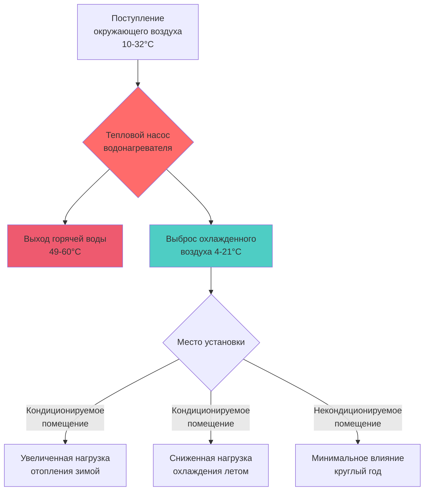

Тепловые насосы для водонагревателей (HPWH) представляют принципиальный отход от традиционного резистивного нагрева, используя парокомпрессионные циклы холодильной машины для передачи тепловой энергии из атмосферного воздуха в бытовую горячую воду. Эта технология достигает значений коэффициента производительности (COP) от 2,0 до 4,0, что означает доставку 2–4 единиц тепловой энергии на единицу потребленной электрической энергии—термодинамическое преимущество, невозможное при резистивном нагреве, где COP ограничен значением 1,0.

## Принцип термодинамического функционирования

HPWH извлекают тепловую энергию из окружающего воздуха, используя тот же парокомпрессионный цикл, применяемый в системах кондиционирования воздуха и холодильных установках, но с конденсатором, настроенным на отвод тепла в накопительный бак с водой, а не наружу.

### Парокомпрессионный цикл для водонагрева

Хладагент поглощает тепло в испарительной катушке, где воздух нагнетается через оребренные трубки. При типичных условиях испарителя хладагент испаряется при температурах -18 до -12°C, намного ниже температуры окружающего воздуха 10–32°C, создавая разность температур, которая обеспечивает теплопередачу в соответствии с:

$$Q_{evap} = \dot{m}_a c_{p,a} (T_{a,in} - T_{a,out})$$

где $\dot{m}_a$ — массовый расход воздуха, $c_{p,a}$ — удельная теплоёмкость воздуха (приблизительно 1,005 кДж/кг·К), и разность температур обычно составляет 5,5–11°C.

Компрессор повышает давление и температуру хладагента, подавая перегретый пар при 60–82°C в конденсаторную катушку, навитую вокруг или погруженную в накопительный бак с водой. Отвод тепла в воду происходит через:

$$Q_{cond} = \dot{m}_w c_{p,w} (T_{w,out} - T_{w,in})$$

Для воды $c_{p,w}$ = 4,186 кДж/кг·К. Для нагрева 151 литра от 12,8°C до 57,2°C требуется:

$$Q_{total} = m_w c_{p,w} \Delta T = (151 \text{ л} \times 1,0 \text{ кг/л}) \times 4,186 \times (57,2 - 12,8) = 28,062 \text{ кДж}$$

При COP = 3,0 требуемая электрическая энергия составляет $28,062 / 3,0 = 9,354$ кДж или 2,6 кВт·ч. Эквивалентный резистивный нагреватель при COP = 1,0 потребил бы 7,8 кВт·ч—в три раза больше энергии.

## Анализ коэффициента производительности

Фактический COP зависит от разности температур между источником тепла (атмосферный воздух) и теплоприёмником (вода):

$$COP_{actual} = \frac{Q_{delivered}}{W_{compressor} + W_{fan}}$$

Теоретическая максимальная эффективность ограничена циклом Карно:

$$COP_{Carnot} = \frac{T_{cond}}{T_{cond} - T_{evap}}$$

где температуры выражены в абсолютных шкалах (Кельвин). Для $T_{evap}$ = 261 K (-12°C) и $T_{cond}$ = 330 K (57,2°C):

$$COP_{Carnot} = \frac{330}{330 - 261} = 4,8$$

Практические HPWH достигают 50–75% эффективности цикла Карно, обеспечивая значения COP от 2,2 до 3,3 при стандартных условиях оценки.

### Сравнение производительности COP

| Технология водонагрева | Типичный COP | Коэффициент энергии (EF) | Годовая стоимость эксплуатации* |
|------------------------|-------------|-------------------------|--------------------------------|
| Электрическое сопротивление | 1,0 | 0,90–0,95 | $550–$600 |
| Стандартный HPWH | 2,5–3,0 | 2,0–2,5 | $200–$250 |
| Высокоэффективный HPWH | 3,5–4,0 | 3,0–3,5 | $150–$180 |
| Гибридный (HP + сопротивление) | 2,2–2,8 | 2,2–2,8 | $220–$270 |

*На основе потребления 242 л/день, тариф электроэнергии $0,12/кВт·ч

Сертификация DOE ENERGY STAR требует равномерного коэффициента энергии (UEF) ≥ 2,0 для тепловых насосов для водонагревателей в режиме среднего потребления, гарантируя как минимум двойную эффективность по сравнению с резистивными установками.

## Требования к установке и пространственные особенности

HPWH имеют уникальные ограничения при установке из-за механизма теплопередачи из воздуха.

### Требования по объёму воздуха и вентиляции

Испаритель извлекает примерно 1,2–1,5 кВт тепла из окружающего воздуха во время работы. Это извлечение тепла вызывает заметное снижение температуры воздуха в помещении:

$$\Delta T_{space} = \frac{Q_{extracted}}{V_{space} \times \rho_a \times c_{p,a} \times ACH}$$

Для замкнутого пространства объёмом 21 м³ (минимальный рекомендуемый), плотность воздуха $\rho_a$ = 1,2 кг/м³, и кратность воздухообмена ACH = 0,5:

$$\Delta T_{space} = \frac{1,500}{21 \times 1,2 \times 1,005 \times 0,5} = 0,12°C \text{ в час}$$

Этот расчёт демонстрирует, почему непрерывная подача свежего воздуха критически важна. Спецификации производителей обычно требуют:

- **Минимальный объём помещения**: 20–28 м³
- **Диапазон температуры окружающей среды**: 7–35°C
- **Адекватная вентиляция**: 330 м³/ч наружного воздуха или канальная конфигурация

### Побочный эффект охлаждения помещения

Тепловая энергия, извлекаемая из атмосферного воздуха, производит эффект дегидратации и охлаждения помещения, эквивалентный приблизительно 1,0–1,3 кВт охлаждения помещения во время работы. Этот побочный эффект приносит преимущества в климатах с преобладанием охлаждения, но представляет потерю тепла в регионах с преобладанием отопления.

Годовой вклад охлаждения в смешанном климате (2 000 часов/год работы):

$$Q_{cooling,annual} = 1,200 \text{ кВт} \times 2,000 \text{ ч} = 2,400 \text{ МВт·ч} = 8,6 \text{ ГДж}$$

При типичном COP охлаждения 3,0 для центральной системы кондиционирования это представляет избежанную энергию компрессора:

$$E_{avoided} = \frac{2,400,000}{3,0} = 800 \text{ кВт·ч}$$

Обратно, в сезон отопления этот эффект охлаждения увеличивает нагрузки на пространственное отопление на ту же величину.

## Варианты конфигурации и гибридное функционирование

Современные HPWH включают несколько режимов работы для уравновешивания эффективности с производительностью восстановления.

### Выбор режима функционирования

1. **Только тепловой насос**: Максимальная эффективность (COP 2,5–4,0), медленное восстановление (обычно 2–3 часа для полного бака)
2. **Гибридный режим**: Автоматическое переключение на резистивные элементы при высокой потребности
3. **Электрический режим**: Резистивное нагревание только для максимальной скорости восстановления
4. **Режим отпуска**: Сниженная уставка температуры при продолжительном отсутствии

Скорость восстановления для режима теплового насоса:

$$\dot{V}_{recovery} = \frac{Q_{HP} \times \eta_{transfer}}{c_{p,w} \times \rho_w \times \Delta T}$$

Для единицы теплового насоса мощностью 1,3 кВт с эффективностью передачи 90%:

$$\dot{V}_{recovery} = \frac{1,300 \times 0.90}{4,186 \times 1,000 \times 44} = 0,0064 \text{ м³/мин} = 6,4 \text{ л/мин}$$

Эта скорость восстановления на 50–70% ниже, чем у резистивных установок (12–18 л/мин), требуя больших ёмкостей бака (обычно 190–300 л против 150–190 л для резистивных).

## Оптимизация места установки

Стратегическое размещение максимизирует эффективность и минимизирует неблагоприятное взаимодействие со строительными системами:

**Оптимальные места:**
- Некондиционируемые подвальные помещения (доступ к воздуху умеренной температуры круглый год)
- Служебные помещения с адекватной вентиляцией наружу
- Гаражи в мягких климатах (требуется дополнительная вентиляция)

**Избегать:**
- Маленькие замкнутые шкафы без вентиляции
- Часто посещаемые жилые помещения (шумовые соображения: 45–55 дBA)
- Крайне холодные среды (<7°C значительно снижают COP)

## Производительность в области энергии и окружающей среды

Сертифицированные ENERGY STAR HPWH снижают потребление энергии для водонагрева на 50–65% в сравнении со стандартными электрическими резистивными установками. Для типичного дома, использующего 242 л/день:

- **Годовая экономия энергии**: 2 000–3 000 кВт·ч
- **Снижение CO₂** (при 0,42 кг CO₂/кВт·ч): 840–1 260 кг/год
- **Простой период окупаемости**: 3–6 лет (включая коммунальные скидки)

DOE оценивает, что широкое внедрение HPWH могло бы снизить национальное жилое потребление энергии для водонагрева на 30%, представляя значительное сокращение первичной энергии и выбросов.
