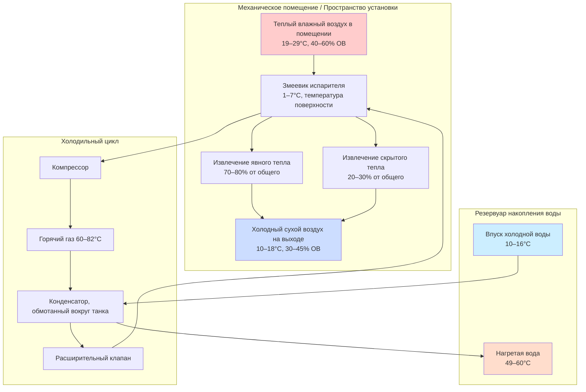

## Принципы работы

Тепловые насосы для нагрева воды с забором тепла из окружающего воздуха извлекают тепловую энергию из воздуха внутри помещения для нагрева санитарной горячей воды. Испаритель поглощает тепло из воздуха помещения, производя холодный, осушенный воздух на выходе. Эта операционная характеристика создает эффект охлаждения помещения от 3,5 до 10,2 кДж/ч в зависимости от производительности агрегата и условий окружающей среды.

Термодинамический цикл работает идентично холодильным системам, при этом конденсатор отводит тепло в резервуар накопления воды. Связь между коэффициентом производительности и температурой окружающей среды следует принципам эффективности Карно, практические значения COP варьируются от 1,8 до 4,2 в зависимости от условий работы.

## Производительность в зависимости от температуры окружающей среды

COP снижается по мере уменьшения температуры окружающей среды из-за сниженного перепада давления хладагента и пониженной эффективности теплопередачи на испарителе. Зависимость аппроксимируется следующим образом:

$$\text{COP}_{\text{actual}} = \text{COP}_{\text{rated}} \times \left(1 - k \cdot \Delta T_{\text{ambient}}\right)$$

Где:
- $k$ = коэффициент температурной коррекции (обычно 0,012–0,018 на °C)
- $\Delta T_{\text{ambient}}$ = отклонение от номинальной температуры (19,4°C)
- $\text{COP}_{\text{rated}}$ = номинальный коэффициент производительности при стандартных условиях

Тепловая производительность также снижается с понижением температуры окружающей среды:

$$Q_{\text{heating}} = Q_{\text{rated}} \times \left(\frac{T_{\text{ambient}} - T_{\text{evap}}}{T_{\text{rated}} - T_{\text{evap}}}\right)^{n}$$

Где $n$ обычно варьируется от 1,2 до 1,5 для систем с воздушным источником, а $T_{\text{evap}}$ представляет рабочую температуру испарителя (приблизительно на 11–17°C ниже окружающей).

### Таблица сравнения производительности

| Температура окружающей среды (°C) | COP | Тепловая производительность (%) | Множитель времени восстановления | Эффект охлаждения помещения (кДж/ч) |
|--------------------------------------|-----|--------------------------------|-------------------------------|-------------------------------|
| 4,4 | 1,8–2,1 | 65–70 | 1,45–1,55 | 3,0–4,7 |
| 10 | 2,2–2,6 | 75–82 | 1,25–1,35 | 3,7–6,0 |
| 15,6 | 2,8–3,3 | 88–95 | 1,08–1,15 | 4,7–8,0 |
| 19,4 (номинальная) | 3,2–3,8 | 100 | 1,00 | 5,3–9,4 |
| 24 | 3,5–4,0 | 105–108 | 0,93–0,96 | 6,3–10,7 |
| 29,4 | 3,8–4,2 | 108–112 | 0,89–0,93 | 7,3–12,0 |

## Процесс извлечения тепла

## Эффекты кондиционирования помещения

Охлаждение и осушение, производимое тепловыми насосами для нагрева воды с забором тепла из окружающего воздуха, создают полезные или вредные эффекты в зависимости от места установки и климата:

**Полезные приложения:**
- Механические помещения в климатах с преобладанием охлаждения снижают нагрузку явного охлаждения на 3,5–10,2 кДж/ч
- Установки в подвалах снижают влажность в сезон охлаждения путем удаления 0,7–1,7 кг/ч влаги
- Места с внутренними тепловыделениями (рядом с холодильным оборудованием, помещениями для стирки) получают пользу от удаления тепла

**Вредные последствия:**
- Климаты с преобладанием отопления испытывают повышенное потребление энергии на обогрев помещения из-за извлечения тепла из кондиционируемых пространств
- Низкие температуры окружающей среды ниже 10°C снижают COP ниже 2,5, что может сделать сопротивлений нагревание более экономичным
- Чрезмерное охлаждение небольших механических помещений может вызвать дискомфорт или проблемы с защитой от замораживания

## Требования к минимальному объему

Стандарты DOE и спецификации производителей устанавливают требования к минимальному объему помещения, чтобы предотвратить чрезмерное снижение температуры и сохранить адекватный COP. Помещение должно обеспечивать достаточную тепловую массу и объем воздуха для непрерывной работы.

Расчет минимального объема:

$$V_{\text{min}} = \frac{Q_{\text{cooling}} \times t_{\text{cycle}}}{\rho \times c_p \times \Delta T_{\text{allowable}}}$$

Где:
- $V_{\text{min}}$ = минимальный объем помещения (м³)
- $Q_{\text{cooling}}$ = эффект охлаждения (кДж/ч)
- $t_{\text{cycle}}$ = продолжительность рабочего цикла (ч)
- $\rho$ = плотность воздуха (1,2 кг/м³ при стандартных условиях)
- $c_p$ = удельная теплоемкость воздуха (1,006 кДж/кг·°C)
- $\Delta T_{\text{allowable}}$ = допустимое снижение температуры (обычно 3–4°C)

Типичные минимальные объемы для жилых агрегатов варьируются от 20 до 28 м³. Помещения меньшего размера требуют вентиляционного воздуха из соседних кондиционируемых пространств или с улицы.

## Требования к вентиляции

При установке в замкнутых пространствах ниже минимального объема механическая или пассивная вентиляция должна подавать приточный воздух. Необходимый расход воздуха:

$$\dot{V}_{\text{vent}} = \frac{Q_{\text{cooling}}}{3600 \times \rho \times c_p \times \Delta T_{\text{max}}}$$

Типичные скорости вентиляции составляют 47–118 CFM (80–200 м³/ч) для жилых HPWH, когда пространство установки не может вместить полный расход блока в режиме рециркуляции.

Стратегии вентиляции включают:
- Переточные решетки в соседние кондиционируемые пространства (минимум 0,065–0,097 м² свободной площади)
- Воздухозаборник с наружным воздухом с управляемым демпфером
- Жалюзийные двери или настенные проемы с обратными клапанами
- Механический вытяжной воздух с путем подачи приточного воздуха

## Акустические соображения

Работа компрессора и вентилятора производит 45–55 дБА на расстоянии 0,9 м, что сопоставимо с холодильником, но заметно в тихой жилой среде. Установка в механических помещениях, подвалах или гаражах, изолированных от занятых помещений, минимизирует передачу шума.

Стратегии снижения шума:
- Виброизоляционные подушки под блоком (снижают передачу через конструкцию)
- Акустическая обработка поверхностей механического помещения
- Гибкие воздуховодные соединения при использовании канальной конфигурации
- Избегание установки прямо под спальнями или тихими помещениями

## Стандарты DOE и требования по эффективности

Министерство энергетики устанавливает минимальные требования к единому коэффициенту энергии (UEF) для тепловых насосов для нагрева воды согласно 10 CFR 430. Действующие стандарты с апреля 2024 года требуют:

| Производительность (л) | Минимальный UEF |
|------------------------|-----------------|
| 189 | 3,30 |
| 208 | 3,35 |
| 246 | 3,45 |
| 303 | 3,55 |

Испытание UEF проводится при стандартизированных условиях: окружающая температура 19,4°C, входящая вода 14,4°C, выходная температура установлена на 51,7°C. Производительность в полевых условиях варьируется в зависимости от фактической температуры окружающей среды, температуры входящей воды и характера использования.

## Требования к установке

Надлежащая установка обеспечивает номинальную производительность и долговечность:

1. **Зазоры:** Соблюдайте указанные производителем зазоры для воздушного потока (обычно 15–30 см с сторон воздухозаборника, 61 см для доступа к обслуживанию)

2. **Дренаж конденсата:** Обеспечьте затворный дренажный трубопровод для удаления 0,7–1,7 кг/ч конденсата с минимальным уклоном 0,6 см на 30 см

3. **Электричество:** Выделенная цепь 30A, 240V для типичных жилых агрегатов (проверьте фактические требования)

4. **Смесительный клапан:** Установите термостатический смесительный клапан ASSE 1017, когда выходная температура превышает 48,9°C, чтобы предотвратить ошпаривание

5. **Водяные соединения:** Используйте диэлектрические муфты между разнородными металлами, установите расширительный бак если требуется кодексом

6. **Условия окружающей среды:** Убедитесь, что место установки поддерживает рабочий диапазон 4–49°C в течение всего года

## Операционные ограничения

Тепловые насосы для нагрева воды с забором тепла из окружающего воздуха испытывают снижение производительности или остановку работы при определенных условиях:

- Температура окружающей среды ниже 4°C запускает циклы разморозки или переключение на сопротивление нагревания
- Температура окружающей среды выше 49°C может вызвать отключение по высокому давлению
- Недостаточный воздушный поток из-за засоренных фильтров или неадекватного объема помещения снижает производительность на 15–30%
- Частые короткие циклы в переразмеренных приложениях снижают эффективность и срок службы компонентов

Сопротивления нагревания обеспечивают резервный нагрев, когда работа теплового насоса не может удовлетворить спрос или условия окружающей среды выходят за пределы приемлемого диапазона. Эта гибридная работа поддерживает доступность горячей воды, но снижает общую эффективность системы до COP 1,0 во время периодов сопротивления нагревания.
