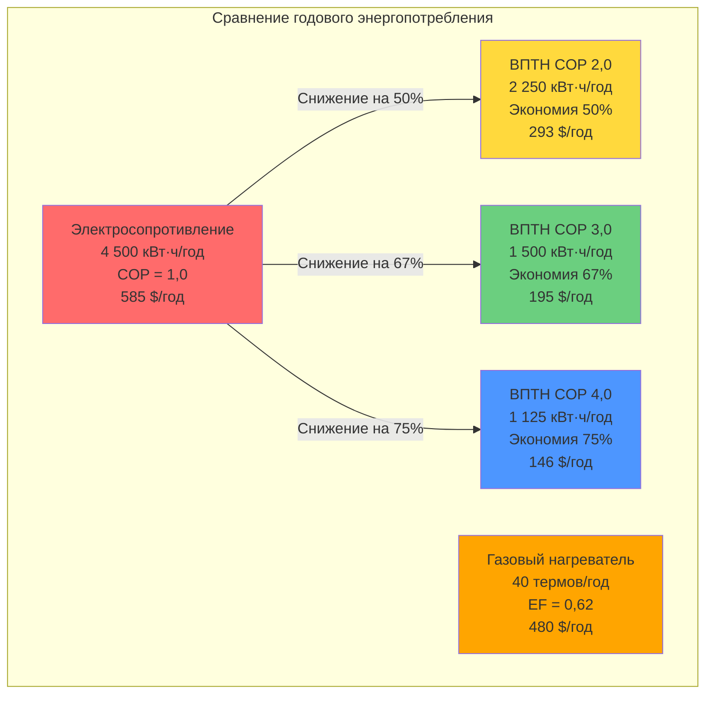

## Диапазон коэффициента производительности

Водонагреватели на тепловых насосах (ВПТН) работают в диапазоне коэффициента производительности (COP) от 2,0 до 4,0, что соответствует эффективности 200–400% по сравнению с электронагревателями сопротивления. Этот диапазон производительности зависит от температуры окружающей среды, уставки температуры воды, технологии компрессора и конструкции теплообменника.

COP количественно определяет отношение переданного тепла к потребленной электрической энергии:

$$\text{COP} = \frac{Q_{\text{delivered}}}{W_{\text{input}}} = \frac{\dot{m} c_p (T_{\text{out}} - T_{\text{in}})}{P_{\text{compressor}} + P_{\text{fans}}}$$

Где:
- $Q_{\text{delivered}}$ = тепло, переданное воде (кДж/ч или кВт)
- $W_{\text{input}}$ = общее электрическое потребление (кВт)
- $\dot{m}$ = массовый расход воды
- $c_p$ = удельная теплоемкость воды
- $T_{\text{out}}, T_{\text{in}}$ = температура воды на выходе и входе

## Пределы эффективности по Карно

Теоретический максимальный COP ограничен эффективностью цикла Карно:

$$\text{COP}_{\text{Carnot}} = \frac{T_{\text{hot}}}{T_{\text{hot}} - T_{\text{cold}}}$$

Для типичного сценария ВПТН с горячей водой 135°F (56,7°C) и ambient air 70°F (21,1°C):

$$\text{COP}_{\text{Carnot}} = \frac{330}{330 - 294} = \frac{330}{36} = 9,17$$

Реальные ВПТН достигают 25–45% от эффективности Карно из-за:
- Неэффективности компрессора (механические потери, потери в двигателе)
- Разницы температур в теплообменнике (подход и точка pinch)
- Перепадов давления хладагента
- Циклов оттайки в холодном климате
- Потребления энергии системой управления

## Диапазоны производительности COP

| Диапазон COP | Категория производительности | Условия эксплуатации | Годовая стоимость энергии* |
|:------------:|:---------------------------:|:---------------------:|:--------------------------:|
| 2,0–2,3      | Минимальное требование      | 10°C ambient, 60°C вода | 165–190 $                 |
| 2,3–2,8      | Стандартная производительность | 19,7°C ambient, 57,2°C вода | 130–165 $                 |
| 2,8–3,5      | Типичная производительность | 21,1°C ambient, 48,9°C вода | 105–130 $                 |
| 3,5–4,0      | Высокая эффективность       | 23,9°C ambient, 48,9°C вода | 90–105 $                  |
| 4,0+         | Премиум-модели              | Оптимальные условия, переменная скорость | 75–90 $                   |

*На основе базового потребления 12 000 кВт·ч/год для электронагревателей сопротивления по цене 0,13 $/кВт·ч

## Корреляция с единым фактором энергоэффективности (UEF)

В 2017 году DOE перешел от фактора энергоэффективности (EF) к единому фактору энергоэффективности (UEF) для обеспечения стандартизированного тестирования. UEF связан с COP следующим образом:

$$\text{UEF} = \frac{\text{COP} \times 3,412 \text{ БТЕ/Вт·ч}}{3,412 \text{ БТЕ/Вт·ч} + \text{Потери в режиме ожидания}}$$

Для хорошо изолированных ВПТН с минимальными потерями в режиме ожидания:

$$\text{UEF} \approx \text{COP} \times 0,90 \text{ до } 0,95$$

Эта конвертация учитывает:
- Потери тепла в баке в режиме ожидания
- Потери при циклировании по шести заранее определенным режимам отбора
- Влияние рейтинга первого часа
- Эффективность восстановления

DOE устанавливает минимальные значения UEF в зависимости от объема бака:
- 55 галлонов: UEF ≥ 2,0 (COP ≈ 2,2)
- 80 галлонов: UEF ≥ 2,2 (COP ≈ 2,4)

## Факторы деградации производительности

**Влияние перепада температур**: COP снижается по мере увеличения разницы температур между источником и стоком. При каждом повышении уставки температуры воды на 10°F (5,6°C) COP обычно падает на 5–8%.

$$\text{COP}_{\text{adjusted}} = \text{COP}_{\text{rated}} \times \left(1 - 0,007 \Delta T_{\text{added}}\right)$$

**Чувствительность к температуре окружающей среды**: Производительность ухудшается в холодных условиях окружающей среды. Ниже 50°F (10°C) эффективность компрессора падает, а циклы оттайки увеличивают потребление энергии на 10–20%.

**Работа при частичной нагрузке**: Потери при циклировании снижают эффективный COP. Компрессоры с одной скоростью работы испытывают штрафы по эффективности 5–10% при частичной нагрузке по сравнению с моделями с переменной скоростью, которые модулируют мощность.

## Сравнение эффективности

## Анализ экономии энергии

Экономия затрат на энергию по сравнению с электрическим резистивным нагревом:

$$\text{Годовая экономия} = \frac{Q_{\text{год}}}{3412} \left(\frac{1}{\text{COP}_{\text{резистивный}}} - \frac{1}{\text{COP}_{\text{HPWH}}}\right) \times \text{Тариф на электроэнергию}$$

Для типичного домохозяйства (базовое потребление 12 000 кВт·ч/год):
- COP 2.0: снижение на 50% = экономия 292 $/год
- COP 3.0: снижение на 67% = экономия 390 $/год
- COP 4.0: снижение на 75% = экономия 439 $/год

Срок окупаемости варьируется от 3 до 7 лет в зависимости от:
- Местных тарифов на электроэнергию
- Климатической зоны (влияет на COP)
- Стоимости монтажа (1 200–2 500 $)
- Скидок от коммунальных служб (типично 300–750 $)

## Максимизация реального COP

**Учет при монтаже**:
- Размещать агрегат в отапливаемом помещении (20–24 °C) для оптимальной производительности
- Обеспечить минимальный объем воздуха 700–1 000 фут³ (19,8–28,3 м³)
- Устанавливать в техническом помещении или подвале, где побочный продукт охлаждения полезен
- Избегать установки в неотапливаемых гаражах в холодных климатических зонах

**Стратегии эксплуатации**:
- Снижать уставку температуры воды до 120 °F (49 °C), когда это возможно (увеличивает COP на 10–15%)
- Использовать режим «отпуск» при длительном отсутствии
- Включать программы управления спросом в часы пикового ценообразования
- Планировать интенсивное использование горячей воды на более теплые части дня

**Требования к техническому обслуживанию**:
- Очищать воздушный фильтр каждые 3 месяца
- Проверять дренаж конденсата ежегодно
- Проверять заряд хладагента каждые 2–3 года
- Осматривать магниевый анод согласно графику производителя

Диапазон COP 2–4 представляет собой практическое окно производительности для текущей технологии HPWH, балансируя термодинамические ограничения с экономической целесообразностью. Компрессоры с регулируемой скоростью и улучшенные теплообменники продолжают продвигать показатели к верхней границе этого диапазона, причем премиальные модели превышают COP 4.0 в оптимальных условиях.
