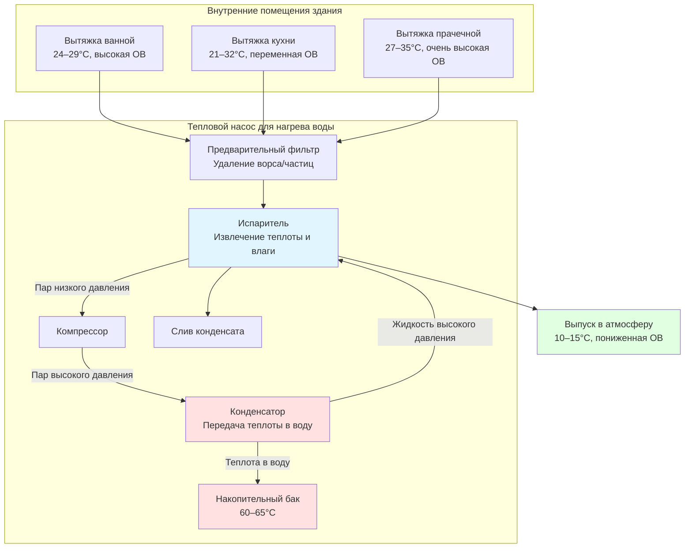

Тепловые насосы для нагрева воды с рекуперацией из вытяжного воздуха извлекают тепловую энергию из потоков вытяжного воздуха здания до их отвода наружу. Такая конфигурация обеспечивает постоянную доступность источника теплоты, одновременно решая требуемые вентиляционные нагрузки. Технология эффективно преобразует вентиляционные потери здания в ресурс для нагрева воды.

## Принцип работы

Испаритель теплового насоса перехватывает воздух вытяжки здания, который в противном случае отводился бы непосредственно наружу. Теплота, извлеченная из потока вытяжного воздуха температурой 21–27°C, предварительно охлаждает и частично осушает этот воздух перед выпуском. Рекуперированная тепловая энергия приводит в действие цикл холодильной машины для нагрева горячей воды потребления.

В отличие от тепловых насосов на основе окружающего воздуха, которые забирают воздух из кондиционируемого пространства, агрегаты на основе вытяжного воздуха обрабатывают воздух, уже предназначенный для удаления. Это исключает штраф на кондиционирование пространства, присущий другим конфигурациям.

## Потенциал рекуперации теплоты

Явная теплота, доступная из потока вытяжного воздуха:

$$Q_{\text{sensible}} = \dot{m} \cdot c_p \cdot (T_{\text{exhaust}} - T_{\text{evap}})$$

Где:
- $Q_{\text{sensible}}$ = скорость рекуперации явной теплоты (кДж/ч)
- $\dot{m}$ = массовый расход вытяжного воздуха (кг/ч)
- $c_p$ = удельная теплоемкость воздуха (1.005 кДж/кг·°C)
- $T_{\text{exhaust}}$ = температура вытяжного воздуха на входе в испаритель (°C)
- $T_{\text{evap}}$ = температура поверхности испарителя (°C)

Для влажных потоков вытяжного воздуха (ванные комнаты, кухни) рекуперация скрытой теплоты от конденсации обеспечивает дополнительную мощность:

$$Q_{\text{latent}} = \dot{m} \cdot (W_{\text{in}} - W_{\text{out}}) \cdot h_{fg}$$

Где:
- $Q_{\text{latent}}$ = скорость рекуперации скрытой теплоты (кДж/ч)
- $W_{\text{in}}$ = входящее влагосодержание (г водяного пара/кг сухого воздуха)
- $W_{\text{out}}$ = выходящее влагосодержание (г водяного пара/кг сухого воздуха)
- $h_{fg}$ = скрытая теплота парообразования (~2454 кДж/кг при типовых условиях)

Полная рекуперация теплоты:

$$Q_{\text{total}} = Q_{\text{sensible}} + Q_{\text{latent}}$$

Коэффициент эффективности для полной системы:

$$\text{COP}_{\text{system}} = \frac{Q_{\text{DHW}}}{W_{\text{compressor}} + W_{\text{fan}}}$$

Где $Q_{\text{DHW}}$ — теплота, подаваемая в горячую воду потребления, а члены $W$ представляют электрическую входную мощность.

## Сравнение источников вытяжного воздуха

| Источник вытяжки | Диапазон температур | Содержание влаги | Режим доступности | Опасения по загрязнению | Расстояние воздуховода |
|----------------|-------------------|------------------|----------------------|----------------------|---------------|
| Вытяжка ванной | 24–29°C | Высокое (50–80% ОВ) | Прерывистая (циклы душа/ванны) | Минимальное, ворс из полотенец | Короткое, обычно смежное |
| Вытяжка кухни | 21–32°C | Умеренно-высокое (переменное) | Несколько раз в день | Жиры, частицы готовки требуют фильтрации | Среднее, центральное расположение |
| Вытяжка прачечной | 27–35°C | Очень высокое (близко к насыщению) | Прерывистая (циклы стирки/сушки) | Значительный ворс требует предварительной фильтрации | Переменное, часто удаленное |
| Общая вентиляция | 21–26°C | Умеренное (внутренняя ОВ) | Непрерывная или по расписанию | Минимальное, общая пыль | Длинное, от центрального возврата |
| Коммерческие помещения | 22–24°C | Низко-умеренное | Непрерывная в период занятости | Зависит от типа помещения | Весьма переменное |

## Конфигурация системы

## Управление конденсацией

Температуры испарителя обычно находятся в диапазоне 4–13°C, значительно ниже точки росы большинства потоков вытяжного воздуха здания. Это обеспечивает постоянную конденсацию.

Скорость образования конденсата:

$$\dot{m}_{\text{condensate}} = \dot{V} \cdot \rho_{\text{air}} \cdot (W_{\text{in}} - W_{\text{out}}) \cdot 60$$

Где:
- $\dot{m}_{\text{condensate}}$ = скорость потока конденсата (кг/ч)
- $\dot{V}$ = объемный расход вытяжки (м³/ч)
- $\rho_{\text{air}}$ = плотность воздуха (~1.2 кг/м³ при стандартных условиях)
- Коэффициент 60 преобразует м³/ч в м³/ч

Критические требования к управлению конденсатом:

- **Проектирование поддона**: Минимальный уклон 1:24 (1 см на каждые 24 см) в направлении слива
- **Глубина сифона**: P-сифон с достаточной глубиной для преодоления отрицательного давления (обычно минимум 5–7,5 см)
- **Размеры сливной линии**: Минимум 1,9 см в диаметре, избегайте горизонтальных участков длиной более 2,4 м без промежуточной опоры
- **Защита от замерзания**: Изолируйте сливные линии в неотапливаемых помещениях, поддерживайте положительный уклон на всей длине
- **Доступ для очистки**: Установите доступные точки очистки на участках с поворотами свыше 45 градусов

## Размер и проектирование воздуховодов

Размер воздуховода вытяжки следует стандартным принципам потерь давления при трении, но должен учитывать падение давления через узел испарителя.

Полное падение давления в системе:

$$\Delta P_{\text{total}} = \Delta P_{\text{duct}} + \Delta P_{\text{filter}} + \Delta P_{\text{coil}} + \Delta P_{\text{fittings}}$$

Типовые параметры проектирования:

- **Скорость воздуха в воздуховоде**: 3–4,5 м/с в жилых приложениях, до 6 м/с в коммерческих
- **Целевые потери на трение**: 0.39–0.49 Па на метр воздуховода
- **Падение давления на испарителе**: 73–196 Па (проверьте данные производителя при рабочем расходе)
- **Падение давления фильтра**: 24–73 Па (чистый), замените при превышении 147 Па

Для требуемого расхода вытяжки $\dot{V}$ м³/ч через круглый воздуховод:

$$D = \sqrt{\frac{4 \cdot \dot{V}}{V_{\text{duct}} \cdot 3600 \cdot \pi}}$$

Где:
- $D$ = диаметр воздуховода (м)
- $V_{\text{duct}}$ = целевая скорость воздуха (м/с)

Преобразуйте в сантиметры: $D_{\text{см}} = D \cdot 100$

**Критические соображения по проектированию воздуховодов**:

- Используйте жесткие металлические воздуховоды (оцинкованную сталь или алюминий) для подвода вытяжного воздуха к испарителю
- Минимизируйте длину воздуховода и фитинги между источником вытяжки и входом HPWH
- Изолируйте воздуховоды вытяжки в неотапливаемых помещениях для предотвращения конденсации на наружной поверхности
- Установите балансировочные заслонки на множественных подключениях источников вытяжки для распределения потока
- Предусмотрите дверцы доступа для замены фильтра без отсоединения воздуховодов
- Поддерживайте зазоры в соответствии со спецификациями производителя (обычно минимум 15–30 см у входного отверстия)

## Рекомендации по применению

**Постоянная доступность источника теплоты**: Тепловые насосы с рекуперацией из вытяжного воздуха работают оптимально, когда доступность вытяжного воздуха совпадает с режимом спроса горячей воды. Системы непрерывной механической вентиляции обеспечивают наиболее стабильную работу.

**Интеграция с вентиляцией**: Тепловой насос становится неотъемлемым компонентом механической вентиляционной системы здания. Отказ вентилятора или остановка агрегата должны включать альтернативные пути вентиляции для поддержания требуемых по коду воздухообменов.

**Коммерческие приложения**: Высокообъемные непрерывные потоки вытяжного воздуха (рестораны, прачечные, фитнес-центры) обеспечивают отличные источники теплоты. Выбирайте мощность HPWH в соответствии с доступным расходом вытяжки, а не полной нагрузкой горячей воды, дополняя обычным нагревом по мере необходимости.

**Иерархия рекуперации энергии**: Сравните производительность HPWH с рекуперацией из вытяжного воздуха с альтернативными технологиями рекуперации энергии (рекуператорами теплоты, системами подачи наружного воздуха с рекуперацией) для конкретных приложений.

**Соответствие коду**: Убедитесь, что выпуск вытяжного воздуха из HPWH соответствует минимальным расстояниям от отверстий здания, границ участка и воздухозаборов согласно разделу 501 IMC.

## Оптимизация производительности

Чтобы максимизировать эффективность рекуперации теплоты:

1. **Приоритет источникам вытяжного воздуха с высокой температурой**: Вытяжки прачечной и кухни обеспечивают больший температурный перепад
2. **Максимизируйте время пребывания вытяжного воздуха**: Выбирайте испаритель с достаточной площадью контакта при проектном расходе
3. **Регулируйте температуру испарителя**: Более низкие температуры испарителя увеличивают извлечение теплоты, но снижают эффективность компрессора; оптимизируйте для полного COP системы
4. **Контролируйте падение давления фильтра**: Поддерживайте чистоту фильтров для обеспечения проектных расходов воздуха
5. **Балансируйте множественные источники вытяжки**: Используйте заслонки для предпочтительного забора из наиболее теплого доступного потока вытяжки

Конфигурация с рекуперацией из вытяжного воздуха преобразует требуемую систему здания (механическую вентиляцию) в энергетический ресурс при обеспечении постоянной, предсказуемой производительности теплового насоса для нагрева воды независимо от условий окружающей среды.

---

**Связанные темы**: [Основы тепловых насосов для нагрева воды](../../), [Канальные конфигурации](../ducted-configurations/), Рекуперация энергии при вентиляции, [Коммерческое водоснабжение для хозяйственных нужд](../../../commercial-applications/)
