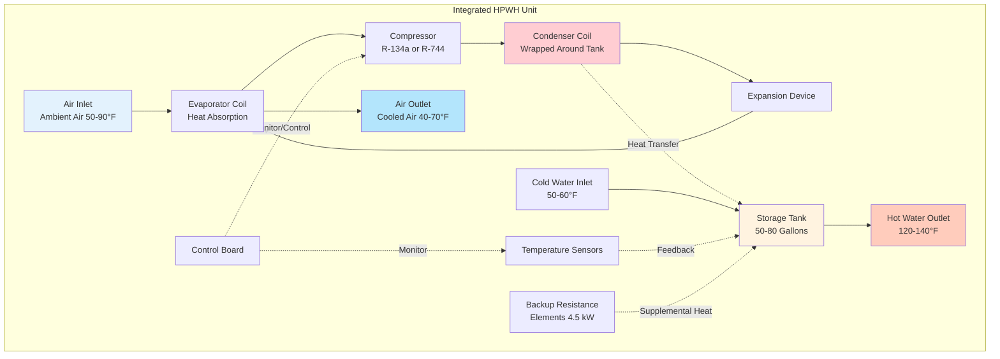

Интегрированные тепловые насосы для горячей воды объединяют модуль теплового насоса с циклом парокомпрессии и бак для хранения воды в одном заводском приборе. Эта конфигурация представляет доминирующую архитектуру в жилых и легких коммерческих приложениях, составляя приблизительно 85% рынка тепловых насосов для горячей воды в Северной Америке. Интегрированный дизайн приоритизирует простоту установки, снижение требований к работе с хладагентом и предсказуемые характеристики производительности благодаря предварительно спроектированному подбору компонентов.

## Архитектура системы и интеграция компонентов

Интегрированный тепловой насос для горячей воды размещает все компоненты цикла парокомпрессии—испаритель, компрессор, конденсатор, расширительный клапан и элементы управления—над или рядом с изолированным баком для хранения внутри единого корпуса.

### Пространственная конфигурация и занимаемая площадь

Вертикальное расположение компонентов теплового насоса над баком для хранения обеспечивает компактную площадь основания, но значительно увеличивает общую высоту по сравнению с традиционными электрическими резистивными баками.

**Сравнение размеров для емкости 189 литров:**

| Тип установки | Диаметр | Высота | Площадь основания | Требуемое расстояние |
|-----------|----------|--------|------------|-------------------|
| Резистивный бак | 51–56 см | 147–157 см | 0.20–0.24 м² | 15 см со всех сторон |
| Интегрированный тепловой насос | 58–66 см | 183–208 см | 0.26–0.34 м² | 30 см по сторонам, 122 см сверху |

Увеличенная высота требует проверки зазора до потолка и размеров дверных проемов при модернизации существующих систем. Минимальный зазор можно рассчитать следующим образом:

$$V_{clearance} = \pi r^2 (H + H_{top}) + 2\pi r w_{side} H$$

где $r$ — радиус установки, $H$ — высота установки, $H_{top}$ — требуемый зазор сверху (обычно 122 см для доступа к техническому обслуживанию), $w_{side}$ — боковой зазор (минимум 30 см).

Для типовой установки диаметром 61 см высотой 193 см:

$$V_{clearance} = \pi (0.305)^2 (1.93 + 1.22) + 2\pi (0.305)(0.305)(1.93) = 0.80 + 0.57 = 1.37 \text{ м}^3$$

Это требование объема зазора влияет на размеры механического помещения и варианты размещения в существующих зданиях.

## Преимущества установки интегрированной конфигурации

### Процесс установки одного прибора

Интегрированный дизайн исключает полевые соединения хладагента, сводя установку только к механическим, электрическим и сантехническим подключениям. Последовательность установки:

1. **Позиционирование и выравнивание установки** (вес: 68–91 кг пусто, 249–340 кг заполнено)
2. **Подключение холодного водопровода** с требуемым клапаном сброса давления и расширительным баком
3. **Подключение горячего выхода** с требуемым смесительным клапаном при уставке >60°C
4. **Подключение электроснабжения** (обычно цепь 30A, 240V)
5. **Настройка слива конденсата** (подключение 19 мм, производство 4–8 л/сутки)
6. **Настройка воздушных путей** (канальная или бесканальная конфигурация)

Для установки не требуется сертификация по хладагентам, что расширяет базу подрядчиков, способных выполнять монтаж, по сравнению с раздельными системами, требующими сертификации EPA 608.

### Заводское тестирование и контроль качества

Интегрированные установки проходят полное заводское испытание под давлением, испытание на герметичность, заправку хладагентом и проверку производительности перед отправкой. Это исключает переменные полевого ввода в эксплуатацию, которые влияют на производительность раздельных систем:

- **Точность заправки хладагентом**: Заводская заправка оптимизирована для пары конденсатор/испаритель
- **Герметичная сборка**: Испытание под давлением минимум 3103 кПа
- **Проверка производительности**: Коэффициент производительности проверен при стандартных условиях рейтинга перед отправкой

Отказы на местах, связанные с недозаправкой или перезаправкой хладагента—распространенные в раздельных системах—полностью исключены.

## Характеристики производительности и эффективность

Интегрированные тепловые насосы для горячей воды достигают рейтингов коэффициента унифицированной энергоэффективности (UEF) от 2.0 до 4.0 согласно процедуре испытаний DOE, что представляет 2–4 кратную эффективность по сравнению с резистивным нагревом.

**Вариация коэффициента производительности с температурой окружающего воздуха:**

$$COP(T_a) = COP_{rated} \times \left(1 - k \cdot (T_{rated} - T_a)\right)$$

где $k$ — температурный коэффициент (обычно 0.015–0.025 на °C) и $T_{rated}$ — номинальная температура рейтинга (19.7°C по стандарту теста DOE).

Для установки с рейтингом COP = 3.2 при 19.7°C, работающей при температуре окружающего воздуха 13°C:

$$COP(13°C) = 3.2 \times \left(1 - 0.02 \times (19.7 - 13)\right) = 3.2 \times 0.75 = 2.4$$

Эта чувствительность к температуре требует рассмотрения профилей температуры в месте установки в течение всего года.

## Сравнение основных производителей

| Производитель | Серия модели | Емкость бака | UEF | Рейтинговый COP | Макс. производительность (л/ч) | Высота | Гарантия бак/компрессор | Розничная цена* |
|--------------|--------------|---------------|-----|-----------|----------------------|---------|-------------------------|--------------|
| Rheem | ProTerra XE80 | 302 л | 4.0 | 3.70 | 25.7 | 192 см | 10 лет / 10 лет | 1800–2200 USD |
| A.O. Smith | Voltex 80 | 302 л | 3.75 | 3.42 | 23.5 | 198 см | 10 лет / 6 лет | 1700–2100 USD |
| Stiebel Eltron | Accelera 300 | 299 л | 3.51 | 3.30 | 22.3 | 197 см | 10 лет / 5 лет | 2300–2800 USD |
| GE | GeoSpring Pro | 246 л | 3.40 | 3.15 | 20.8 | 187 см | 10 лет / 5 лет | 1500–1900 USD |
| Bradford White | AeroTherm S80 | 302 л | 3.42 | 3.20 | 22.0 | 195 см | 6 лет / 6 лет | 1900–2300 USD |

*Цены отражают средние показатели рынка 2024 года до применения льгот или скидок

Все перечисленные модели соответствуют требованиям ENERGY STAR (UEF ≥ 2.0) и подходят для федеральной налоговой льготы в соответствии с Законом о снижении инфляции (до 2000 USD для установленных блоков ENERGY STAR 2023–2032).

## Доступ к техническому обслуживанию и ремонтопригодность

Интегрированная конфигурация упрощает плановое техническое обслуживание за счет консолидации всех обслуживаемых компонентов в верхнем модуле, доступном сверху установки.

**Требования к плановому техническому обслуживанию:**

- **Очистка/замена воздушного фильтра**: Каждые 3–6 месяцев (стандартные моющиеся фильтры на большинстве моделей)
- **Осмотр катушки испарителя**: Ежегодно на предмет накопления пыли и ограничения воздушного потока
- **Проверка слива конденсата**: Каждые 6 месяцев для предотвращения переполнения
- **Осмотр анодного стержня**: Каждые 2–3 года (то же, что и при обслуживании традиционного бака)
- **Испытание клапана сброса давления и температуры**: Ежегодно согласно требованиям ASME

Компрессор, расширительный клапан и герметичный контур хладагента не требуют планового обслуживания. Замена компонентов—когда это необходимо—обычно включает замену модуля на уровне модуля, а не обслуживание отдельных компонентов, что упрощает требования к навыкам техников.

## Варианты конфигурации воздушной стороны

Интегрированные установки поддерживают три основных варианта обработки воздуха:

1. **Бесканальная операция**: Прямой впуск и выпуск из установки (требует минимум 28 м³ объема помещения с адекватной вентиляцией)

2. **Канальный впуск**: Удаленный источник воздуха через гибкий воздуховод (150–200 мм в диаметре, максимальная эквивалентная длина 3 м для сохранения расхода воздуха 200–250 CFM/101–118 м³/ч)

3. **Канальный впуск и выпуск**: Оба впуска и выпуска подведены в воздуховоды для предотвращения снижения температуры в помещении (требует статическое давление <0.5 см вод.ст.)

Падение давления в воздуховоде снижает воздушный поток испарителя, снижая коэффициент производительности согласно:

$$COP_{ducted} = COP_{free} \times \left(\frac{\dot{V}_{ducted}}{\dot{V}_{rated}}\right)^{0.6}$$

При снижении расхода воздуха на 20% из-за сопротивления воздуховода:

$$COP_{ducted} = 3.2 \times (0.80)^{0.6} = 3.2 \times 0.87 = 2.78$$

Этот штраф эффективности 13% подчеркивает важность минимизации длины воздуховода и ограничений.

## Рекомендации по применению и пригодность

**Идеальные приложения для интегрированных тепловых насосов для горячей воды:**

- **Жилая модернизация**: Прямая замена существующих баков электрического резистивного нагрева емкостью 189–302 литра, где позволяет зазор по высоте
- **Новое жилищное строительство**: Приложения для одноквартирных домов и таунхаусов с механическими помещениями в подвале или гараже
- **Легкая коммерция**: Небольшие офисы, розница, ресторан с потреблением горячей воды <379 л/день
- **Умеренный климат**: Места, где температура механического помещения остается в диапазоне 10–32°C в течение всего года

**Менее подходящие приложения:**

- **Ограниченная высота потолка**: Помещения с потолками <2.4 м могут не вместить установку высотой 191–203 см
- **Высокий спрос на горячую воду**: Коммерческие приложения, требующие >302 литра хранения или >38 л/ч непрерывного использования
- **Холодная окружающая среда**: Неотапливаемые помещения с зимними температурами <7°C испытывают значительное снижение коэффициента производительности
- **Места, чувствительные к шуму**: Установка в занятых помещениях с шумом компрессора 45–55 дBA

## Акустические соображения

Интегрированная конфигурация размещает компрессор в занятом или полузанятом помещении, требуя акустической оценки.

**Типовые уровни звуковой мощности:**

- **Работа компрессора**: 50–55 dBA на расстоянии 1 м
- **Работа вентилятора**: 45–50 dBA на расстоянии 1 м
- **Комбинированный рабочий звук**: 52–58 dBA на расстоянии 1 м

Передача звука в соседние помещения следует закону обратных квадратов:

$$L_2 = L_1 - 20 \log_{10}\left(\frac{r_2}{r_1}\right) - \alpha \cdot d$$

где $\alpha$ — коэффициент поглощения воздухом (обычно 0.5 dB/м для частот 500–2000 Гц) и $d$ — расстояние, пройденное через воздух.

На расстоянии 4.6 м в открытом воздухе от источника 55 dBA:

$$L_{4.6м} = 55 - 20 \log_{10}(4.6) - 0.5 \times 4.6 = 55 - 13 - 2.3 = 39.7 \text{ dBA}$$

Стеновые перегородки с рейтингом STC 50+ эффективно изолируют шум теплового насоса для горячей воды от занятых помещений, когда установки расположены в выделенных механических помещениях.

---

**Файл**: `/Users/evgenygantman/Documents/github/gantmane/hvac/content/specialty-applications-testing/specialty-hvac-applications/service-water-heating-domestic-hot-water/heat-pump-water-heaters/integrated-vs-split/integrated-units/_index.md`
