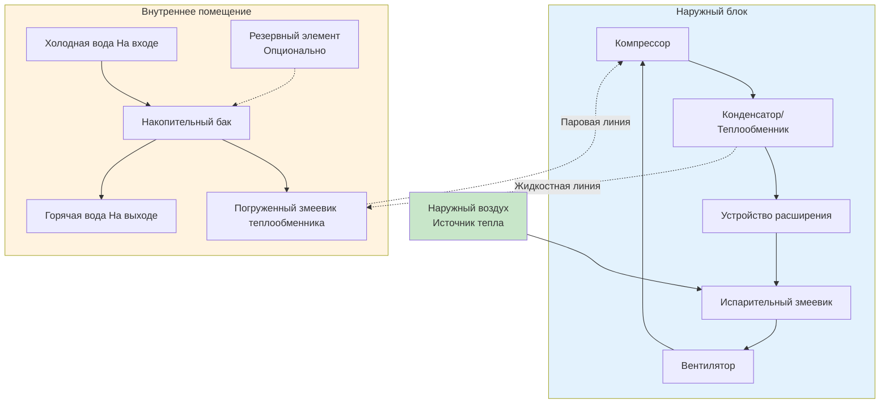

Тепловые насосы для нагрева воды с раздельной системой (ТННВ) отделяют модуль теплового насоса от накопительного бака, соединяя их холодильными трубопроводами. Эта конфигурация размещает компрессор, конденсаторный змеевик и компоненты отвода тепла снаружи, в то время как накопительный бак остается внутри, обеспечивая гибкость установки и преимущества производительности по сравнению с интегрированными устройствами.

## Архитектура системы

Раздельные ТННВ состоят из трех основных компонентов:

**Наружный блок:**
- Компрессор (ротационного или спирального типа)
- Испарительный змеевик воздушного источника
- Устройство расширения
- Системы управления разморозкой
- Вентиляторная сборка

**Внутренний накопительный бак:**
- Емкость для хранения воды (характерный объем 150-450 л)
- Теплообменник холодильник-вода (оборачивающийся или погруженный змеевик)
- Клапан сброса температуры и давления
- Электрические резервные элементы (опционально)

**Холодильные трубопроводы:**
- Жидкостная линия (меньший диаметр)
- Паровая линия (больший диаметр)
- Изоляция для предотвращения потерь тепла и конденсации
- Разъемные соединения для обслуживания

## Калибровка холодильных трубопроводов

Правильная калибровка холодильных трубопроводов имеет решающее значение для эффективности системы и производительности. Диаметр трубопровода зависит от типа холодильного агента, длины трубопровода и производительности.

**Расчет перепада давления:**

Перепад давления в холодильных трубопроводах следует уравнению Дарси-Вейсбаха:

$$\Delta P = f \frac{L}{D} \frac{\rho v^2}{2}$$

Где:
- $\Delta P$ = перепад давления (Па)
- $f$ = коэффициент трения (безразмерный)
- $L$ = длина трубопровода (м)
- $D$ = внутренний диаметр (м)
- $\rho$ = плотность холодильного агента (кг/м³)
- $v$ = скорость (м/с)

**Влияние максимальной длины трубопровода на производительность:**

Снижение производительности из-за длины трубопровода:

$$Q_{actual} = Q_{rated} \times \left(1 - \alpha \frac{L - L_{rated}}{L_{max}}\right)$$

Где:
- $Q_{actual}$ = фактическая производительность (Вт)
- $Q_{rated}$ = номинальная производительность при стандартной длине трубопровода (Вт)
- $\alpha$ = коэффициент снижения (обычно 0,05-0,10)
- $L$ = фактическая длина трубопровода (м)
- $L_{rated}$ = номинальная длина трубопровода (обычно 7,5 м)
- $L_{max}$ = максимально допустимая длина (м)

**Характерная калибровка трубопроводов (R-134a, установка 3 кВт):**

| Длина трубопровода | Наружный диаметр жидкостной линии | Наружный диаметр паровой линии | Потеря производительности |
|-------------|----------------|---------------|---------------|
| 0-4,5 м | 6,35 мм | 9,52 мм | 0% |
| 4,5-7,6 м | 6,35 мм | 12,7 мм | 2-5% |
| 7,6-15 м | 9,52 мм | 15,9 мм | 5-10% |
| 15-23 м | 9,52 мм | 19,0 мм | 10-15% |

## Соображения размещения наружного блока

**Диапазон рабочей температуры:**

Стандартные раздельные ТННВ эффективно работают при температуре окружающего воздуха вниз до 4°C. Модели для холодного климата расширяют этот диапазон:

$$\text{COP}_{ambient} = \text{COP}_{rated} \times \left(1 - \beta \frac{T_{rated} - T_{ambient}}{T_{rated} - T_{min}}\right)$$

Где:
- $\text{COP}_{ambient}$ = коэффициент производительности при температуре окружающего воздуха
- $\text{COP}_{rated}$ = номинальный COP при 13°C
- $\beta$ = коэффициент температурного снижения (0,4-0,6)
- $T_{rated}$ = номинальная температура (13°C)
- $T_{ambient}$ = фактическая температура окружающего воздуха (°C)
- $T_{min}$ = минимальная рабочая температура (°C)

**Производительность в холодном климате:**

Ниже 4°C раздельные ТННВ сталкиваются с проблемами производительности:
- Сниженная производительность испарителя из-за более низкой температуры источника тепла
- Повышенная частота циклов разморозки
- Повышенное потребление мощности компрессором
- Снижение COP на 15-30% на каждые 5,5°C снижения

Модели для холодного климата включают:
- Компрессоры с улучшенной паровой инжекцией (EVI)
- Системы управления разморозкой по требованию
- Увеличенную поверхность испарителя
- Работу компрессора с переменной скоростью

## Сравнение раздельной и интегрированной систем

| Фактор | Раздельная система | Интегрированная система |
|--------|--------------|-------------------|
| **Гибкость установки** | Высокая — отдельные компоненты | Низкая — размещение одного блока |
| **Шум в помещении** | 35-45 дБ (только бак) | 45-55 дБ (компрессор в помещении) |
| **Источник тепла** | Наружный воздух | Кондиционированный воздух в помещении |
| **Эффект охлаждения** | Отсутствует в помещении | 8,8-14,7 кВт охлаждения |
| **Требуемое пространство** | Только бак (0,23-0,28 м²) | Зазор для воздушного потока (1,1-1,4 м²) |
| **Стоимость комплекта трубопроводов** | $150-500 (4,5-15 м) | Отсутствует |
| **Сложность установки** | Выше — работа с холодильным агентом | Ниже — подключи и используй |
| **Климатическая пригодность** | Холодный климат (наружный воздух) | Умеренный климат (воздух в помещении) |
| **Первоначальная стоимость** | $2,500-4,500 | $1,500-2,500 |
| **Рабочая эффективность** | COP 2,0-3,5 (зависит от наружной температуры) | COP 2,5-4,0 (стабильная внутренняя температура) |
| **Доступ для обслуживания** | Наружный блок открыт | Все компоненты доступны |
| **Срок службы** | 12-15 лет | 10-12 лет |

## Руководство по установке

**Маршрутизация холодильных трубопроводов:**

1. Минимизировать вертикальный подъем между наружным блоком и баком (максимум 9 м рекомендуется)
2. Установить ловушку жидкости в наружный блок, если бак находится выше компрессора
3. Изолировать оба трубопровода для предотвращения потерь тепла и конденсации
4. Поддерживать трубопроводы каждые 1,2-1,8 м для предотвращения провисания
5. Избегать острых изгибов (минимальный радиус изгиба 5× диаметр трубки)

**Размещение наружного блока:**

- Зазор: 60 см спереди, 30 см с боков, 120 см выше для воздушного потока
- Возвышенное основание на подставке для предотвращения блокировки снегом
- Защита от преобладающих ветров, если возможно
- Доступ для обслуживания и слива конденсата разморозки
- Рассмотрение шума для соседних объектов

**Электрические требования:**

Раздельные ТННВ обычно требуют:
- Наружный блок: 208-240 В, 15-20 А, выделенная цепь
- Внутренний бак (если резервные элементы): 208-240 В, 20-30 А, цепь
- Защита GFCI согласно NEC 422.5
- Отключение в поле зрения наружного блока

**Вакуумирование и зарядка холодильным агентом:**

1. Эвакуировать систему до 500 микрон или ниже
2. Зарядить согласно спецификации производителя (обычно 0,9-2,7 кг R-134a или R-410A)
3. Проверить переохлаждение (4,4-6,7°C жидкостной линии) и перегрев (5,5-8,3°C паровой линии)
4. Испытание на утечку всех припойных соединений и фитингов

## Оптимизация производительности

**Максимизация эффективности:**

- Установить температуру бака на 49°C для бытовых нужд (60°C для посудомоечных машин без вспомогательного нагревателя)
- Запланировать нагрев в более теплые дневные часы, если применяются тарифы в зависимости от времени
- Изолировать трубопроводы горячего водоснабжения для снижения потерь при стоянии
- Калибровать бак для минимизации работы электрического резервного элемента

**Стратегии для холодного климата:**

- Установить наружный блок на южной стороне стены для получения солнечного света
- Использовать ветровые барьеры или ограждения (сохранять зазоры для воздушного потока)
- Включить режим разморозки по требованию вместо повременной разморозки
- Рассмотреть дополнительный электрический резервный нагрев для температур ниже -7°C

## Преимущества и ограничения

**Преимущества:**

- Отсутствие влияния на кондиционированное пространство в помещении (отсутствие эффекта охлаждения)
- Пониженные уровни шума в помещении
- Гибкое размещение бака независимо от местоположения теплового насоса
- Пригодность для холодного климата с наружным источником тепла воздуха
- Может использовать существующий шкаф водонагревателя

**Ограничения:**

- Более высокая стоимость установки из-за комплекта холодильных трубопроводов
- Требует сертифицированного специалиста HVAC для работы с холодильным агентом
- Производительность снижается с понижением температуры наружного воздуха
- Наружный блок подвергается воздействию погодных условий и возможным повреждениям
- Более длинные холодильные трубопроводы снижают эффективность
- Циклы разморозки снижают производительность в холодную погоду

## Калибровка и выбор

Для жилых применений производительность раздельной ТННВ должна соответствовать рейтингу первого часа (FHR) на основе пиковой нагрузки:

$$\text{FHR} = \text{Объем бака} \times 0,7 + \text{Скорость восстановления} \times 1 \text{ час}$$

Где скорость восстановления для раздельных систем обычно составляет от 7-9,5 л в час при подъеме на 50°C, в зависимости от наружной температуры и производительности установки.

**Стандартная жилая калибровка:**

- 1-2 человека: 150-190 л бак, 2,5 кВт тепловой насос
- 3-4 человека: 190-245 л бак, 3,0 кВт тепловой насос
- 5+ человек: 300-450 л бак, 4,0 кВт тепловой насос или несколько устройств

Раздельные системы ТННВ обеспечивают гибкость установки и снижение шума в помещении по сравнению с интегрированными устройствами, что делает их идеальными для применений, где внутреннее пространство ограничено или наружный воздух обеспечивает более выгодный источник тепла. Правильная калибровка холодильных трубопроводов, размещение наружного блока и соображения холодного климата необходимы для оптимальной производительности и долговечности.
