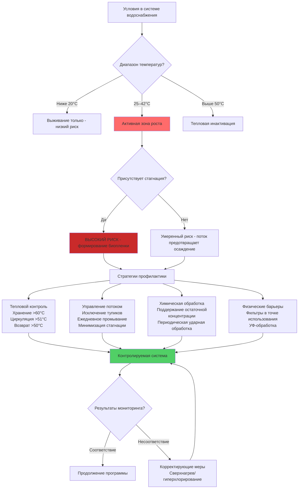

## Обзор

Legionella pneumophila представляет критическое значение для общественного здравоохранения в системах водоснабжения зданий, особенно в установках для подготовки горячей воды для хозяйственных нужд (ГВН). Этот оппортунистический патоген развивается в стоячей воде при температурах от 25°C до 42°C, вызывая болезнь легионеров через вдыхание загрязненных аэрозолей. Эффективная профилактика требует понимания условий роста бактерий и внедрения физических стратегий контроля.

## Принципы контроля на основе температуры

Тепловой контроль остается наиболее фундаментальной стратегией профилактики легионеллы, используя чувствительность бактерии к температуре.

### Критические пороги температуры

**Температуры роста и выживания:**
- Ниже 20°C: Легионелла выживает, но не размножается
- 25–42°C: Оптимальный диапазон роста; популяция удваивается каждые 3–6 часов
- 35–37°C: Пиковая скорость размножения
- Выше 50°C: Рост прекращается; бактерии начинают гибнуть
- 55°C: 90% инактивация за 5–6 часов
- 60°C: 90% инактивация за 2 минуты
- 70°C: Почти мгновенная гибель

### Кинетика тепловой инактивации

Зависимость времени тепловой гибели следует кинетике первого порядка:

$$t_{kill} = \frac{\ln(N_0/N_f)}{k(T)}$$

Где:
- $t_{kill}$ = время, требуемое для указанной инактивации (минуты)
- $N_0$ = начальная концентрация бактерий (КОЕ/мл)
- $N_f$ = конечная концентрация бактерий (КОЕ/мл)
- $k(T)$ = зависящая от температуры константа скорости инактивации (мин$^{-1}$)

Для 99% снижения ($N_f = 0,01 \times N_0$):

$$t_{99} = \frac{4,605}{k(T)}$$

**Практическое время инактивации для 99% снижения:**

| Температура | $t_{99}$ (минуты) | Применение |
|-------------|-------------------|-------------|
| 55°C | 360–480 | Минимальная температура хранения |
| 60°C | 2–3 | Стандартная пастеризация |
| 65°C | 0,3–0,5 | Высокотемпературная дезинфекция |
| 70°C | <0,1 | Аварийная сверхнагрев |

## Программы управления водой по ASHRAE 188

Стандарт ANSI/ASHRAE 188-2018 «Легионеллез: управление риском в системах водоснабжения зданий» устанавливает систематический подход к профилактике легионеллы через программы управления водой (ПУВ).

### Основные компоненты ПУВ

1. **Формирование команды**: Многопрофильная группа, включающая персонал объекта, инфекционный контроль и инженеров
2. **Характеристика системы**: Детальное картирование всех систем водоснабжения, выявление проблемных участков
3. **Анализ опасностей**: Оценка условий, способствующих росту легионеллы
4. **Меры контроля**: Внедрение физических и операционных средств контроля
5. **Мониторинг**: Регулярное тестирование и проверка эффективности контроля
6. **Протоколы ответа**: Процедуры обнаружения и исправления отказов контроля
7. **Документирование**: Полное ведение записей всех видов деятельности и решений

### Признаки высокого риска системы

**Условия, требующие усиленного контроля:**
- Тупиковые участки и зоны с низким потоком и временем стагнации >7 дней
- Температура воды в диапазоне роста (25–42°C)
- Наличие биопленки, отложений или осадка
- Приборы, генерирующие аэрозоли (душевые, градирни, декоративные фонтаны)
- Иммунокомпрометированные жители зданий (лечебно-профилактические учреждения)

## Рост легионеллы и стратегии профилактики

## Сравнение методов профилактики

| Метод | Механизм | Эффективность | Капитальные затраты | Операционные затраты | Ограничения |
|--------|-----------|---------------|--------------|----------------|-------------|
| **Тепловая (пастеризация)** | Денатурация белков при T >60°C | 99,9% снижение за 2 мин при 60°C | Низкие (существующее оборудование) | Умеренные (энергия на нагрев) | Риск ожогов; энергоемко; образование накипи |
| **УФ-дезинфекция** | Повреждение ДНК радиацией 254 нм | 99–99,9% при надлежащей дозе (40 мДж/см²) | Умеренные (5 000–50 000 руб.) | Низкие (замена ламп) | Нет остаточной защиты; чувствительно к мутности; требует предварительной фильтрации |
| **Ионизация медью-серебром** | Олигодинамический эффект нарушает метаболизм | 90–99% снижение | Высокие (10 000–100 000 руб.) | Низкие (замена электродов) | Требуется 6–8 недель для проникновения в биопленку; зависит от pH и жесткости |
| **Диоксид хлора** | Окисление клеточных мембран | 99,9% снижение при 0,5 мг/л | Умеренные (оборудование для генерации) | Умеренные (стоимость химикатов) | Сложное управление; коррозионные проблемы; проблемы с запахом/вкусом |
| **Монохлорамин** | Проникновение в биопленку и окисление | 95–99% снижение при 2–3 мг/л | Умеренные | Умеренные | Требует непрерывной подачи; проблемы нитрификации; необходимо нормативное одобрение |

## Проектирование системы и операционные протоколы

### Конструкция хранения и распределения

**Хранение горячей воды:**
- Поддерживать температуру резервуара хранения ≥60°C
- Обеспечить надлежащую изоляцию для минимизации потерь тепла (минимум RSI 2,1)
- Установить смесительные клапаны в точке использования для предотвращения ожогов (подача 49°C)
- Размер резервуара для оборота <24 часов для минимизации стагнации

**Система циркуляции:**
- Температура на линии возврата должна оставаться ≥50°C на самой дальней точке
- Скорость потока: 0,6–1,2 м/с для предотвращения осаждения и одновременной минимизации эрозии
- Сбалансировать систему для поддержания равномерных температур по всей системе
- Установить термостатические балансировочные клапаны на удаленных ответвлениях

### Протоколы промывания

Регулярное промывание предотвращает стагнацию в мало используемых областях:

**Ежедневное промывание редко используемых выходов:**
- Продолжительность: минимум 5 минут или до стабилизации температуры
- Целевая температура: ≥50°C для горячей воды; ≤20°C для холодной воды
- Применяется к: гостевые комнаты, сезонные объекты, аварийные выходы

**Гиперхлорирование (корректирующая мера):**
- Свободный хлор: 20–50 мг/л по всей системе
- Время контакта: 2–24 часа в зависимости от концентрации
- Промывание до остаточной концентрации <2 мг/л перед восстановлением обслуживания

**Сверхнагрев-и-промывание (тепловой удар):**
1. Повысить температуру хранилища до 71–77°C
2. Промыть каждый выход 5–10 минут до достижения 71°C
3. Повторить еженедельно в течение 3–4 недель при сохранении загрязнения

### Контроль биопленки

Биопленка обеспечивает защиту легионеллы от температуры и дезинфектантов:

**Профилактические меры:**
- Поддерживать скорость воды >0,3 м/с во всех трубопроводах
- Использовать гладкие материалы труб (медь тип L, PEX-b, CPVC)
- Контролировать источники питательных веществ (органический углерод, железо, марганец)
- Предотвращать накопление осадка в резервуарах хранения (годовое дренирование)

**Стратегии удаления:**
- Механическая очистка резервуаров хранения при остановке
- Комбинированная термо-химическая обработка для установившейся биопленки
- Фильтрация в точке использования (0,2 мкм) для критических применений

## Мониторинг и проверка

**Мониторинг температуры:**
- Резервуар хранения: ежедневная проверка ≥60°C
- Линия возврата: еженедельное измерение на самой дальней точке (≥50°C)
- Выход смесительного клапана: ежемесячная проверка 49°C ± 2,8°C

**Микробиологическое тестирование:**
- Плановое наблюдение: ежеквартальные пробы в контрольных местах
- Уровень действия: >1 КОЕ/мл легионеллы в любом месте
- Расширенное тестирование: при превышении уровня действия или при подозрении на вспышку в лечебном учреждении
- Места отбора проб: резервуар хранения, линия возврата, тупики, проблемные выходы

**Проверка системы:**
- Визуальное обследование резервуаров, расширительных резервуаров и тупиков ежегодно
- Проверка манометров/термометров ежеквартально
- Калибровка смесительного клапана ежегодно

## Заключение

Профилактика легионеллы в системах подготовки горячей воды для хозяйственных нужд требует интегрированных инженерных средств контроля, рассчитанных на управление температурой, динамикой потока и профилактику биопленки. Тепловой контроль через поддержание хранения ≥60°C и циркуляции ≥50°C обеспечивает наиболее надежную основную защиту. Программы управления водой по ASHRAE 188 формализуют этот подход через систематический анализ опасностей и проверку. Дополнительная химическая или физическая обработка обеспечивает дополнительные уровни защиты для высокорисковых объектов. Успех зависит от надлежащего проектирования, добросовестного управления и непрерывного мониторинга для обеспечения постоянной эффективности мер контроля.
