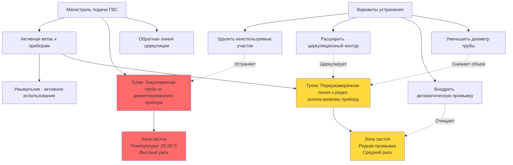

## Обзор

Тупики представляют один из наиболее критических факторов риска колонизации *Legionella* в системах горячего водоснабжения (ГВС). Эти неиспользуемые или редко используемые участки трубопроводов создают зоны застоя воды, где температура падает в диапазон роста (25–45°C) и остаточные дезинфектанты рассеиваются. Стандарт ASHRAE 188 определяет устранение тупиков как основную меру контроля в программах управления водой.

Тупик определяется как любой участок трубопровода с конечной точкой, который не подает воду к приборам при нормальной эксплуатации. Это включает закупоренные ветви, оставшиеся после прошлых ремонтов, переразмеренные участки труб к редко используемым приборам и неправильно спроектированные циркуляционные контуры, которые не достигают концевых ветвей.

## Снижение температуры в тупиках

Температура воды в тупиках снижается в соответствии с законом охлаждения Ньютона, создавая идеальные условия для размножения бактерий. Температура в момент времени $t$ определяется по формуле:

$$T(t) = T_{\infty} + (T_0 - T_{\infty})e^{-kt}$$

Где:
- $T(t)$ = температура воды в момент времени $t$ (°C)
- $T_0$ = начальная температура воды (°C)
- $T_{\infty}$ = температура окружающей среды трубопровода (°C)
- $k$ = константа охлаждения в зависимости от материала трубы, изоляции и диаметра (ч⁻¹)
- $t$ = время застоя (часы)

Для медной трубы, подвергнутой воздействию температуры окружающей среды 21°C, типичные константы охлаждения находятся в диапазоне от 0,15 до 0,35 ч⁻¹ в зависимости от толщины изоляции. Неизолированная медная труба диаметром 2,5 см с начальной температурой воды 49°C падает до 35°C (диапазон, допускающий рост) в течение 2–4 часов застоя.

## Расчет времени застоя

Критическое время застоя — продолжительность, прежде чем вода достигнет температур, допускающих рост, зависит от объема трубы и тепловых характеристик:

$$t_{\text{stagnation}} = \frac{V \rho c_p}{hA} \ln\left(\frac{T_0 - T_{\infty}}{T_{\text{critical}} - T_{\infty}}\right)$$

Где:
- $V$ = объем трубы (м³)
- $\rho$ = плотность воды (1000 кг/м³)
- $c_p$ = удельная теплоемкость воды (4,18 кДж/кг·°C)
- $h$ = общий коэффициент теплопередачи (кДж/ч·м²·°C)
- $A$ = площадь поверхности трубы (м²)
- $T_{\text{critical}}$ = пороговая температура для роста бактерий (45°C)

Этот расчет устанавливает максимально допустимые длины тупиков на основе ожидаемой частоты использования и возможностей поддержания температуры.

## Критерии максимальной длины тупика

Стандарт ASHRAE 188 и различные региональные сантехнические нормы устанавливают максимальные длины тупиков для ограничения объема застоя:

| Диаметр трубы | Максимальная длина тупика | Объем воды | Время промывки (7,6 л/мин) |
|---------------|---------------------------|-----------|---------------------------|
| 1,3 см | 2,4 м | 0,5 л | 4 сек |
| 1,9 см | 3,7 м | 1,3 л | 10 сек |
| 2,5 см | 5,5 м | 2,3 л | 18 сек |
| 3,2 см | 7,3 м | 4,6 л | 37 сек |
| 3,8 см | Не рекомендуется | 6,6 л | 53 сек |
| 5,1 см | Требует циркуляции | 12,3 л | 98 сек |

Некоторые юрисдикции принимают более строгие критерии, ограничивая тупики до 1,8 м для труб диаметром 1,9 см или требуя циркуляции в пределах 3 диаметров трубы от всех приборов в медицинских учреждениях.

## Определение и устранение тупиков

Типичные местоположения тупиков включают:

- Закупоренные ветви от сноса или перемещения приборов
- Переразмеренные распределительные трубопроводы к маломасштабным приборам
- Циркуляционные контуры, которые прерываются до достижения ветвей приборов
- Системы коллекторов с неиспользуемыми или заброшенными отводами
- Аварийные приборы (станции промывки глаз, аварийные душевые) без протоколов промывки

## Стратегии предотвращения тупиков

| Стратегия | Эффективность | Стоимость внедрения | Требование к техническому обслуживанию | Наилучшее применение |
|-----------|---------------|-------------------|----------------------------------|-------------------|
| **Физическое удаление** | Отличная (100%) | Умеренная–высокая | Нет | Постоянно заброшенные приборы |
| **Расширение циркуляции** | Отличная (95–100%) | Высокая | Низкое (обслуживание насоса) | Высокопроизводительные учреждения, медицина |
| **Автоматическая промывка** | Хорошая (80–90%) | Умеренная | Умеренное (обслуживание клапана/таймера) | Редко используемые приборы |
| **Протокол ручной промывки** | Удовлетворительная (60–75%) | Низкая | Высокое (зависит от соблюдения) | Низкорисковые учреждения |
| **Уменьшение диаметра трубы** | Хорошая (85–95%) | Умеренная | Нет | Ситуации переоборудования |
| **Самодренирующаяся конфигурация** | Хорошая (90–95%) | Умеренная | Нет | Специальные применения |

## Проектирование циркуляционного контура

Правильно спроектированные системы циркуляции устраняют тупики путем поддержания непрерывного потока воды. Обратная линия циркуляции должна соединяться в пределах:

$$L_{\text{max}} = \frac{Q_{\text{circ}} \cdot 60}{v \cdot A_{\text{pipe}}}$$

Где:
- $L_{\text{max}}$ = максимальное расстояние от обратной линии циркуляции (м)
- $Q_{\text{circ}}$ = скорость циркуляционного потока (л/мин)
- $v$ = минимальная скорость для предотвращения застоя (0,15 м/с)
- $A_{\text{pipe}}$ = площадь сечения трубы (м²)

Конфигурация с обратным возвратом обеспечивает сбалансированный поток ко всем ветвям, предотвращая предпочтительные пути потока, которые оставляют удаленные участки застойными.

## Протоколы промывки для неизбежных тупиков

Когда тупики не могут быть устранены из-за требуемых нормами аварийных приборов или прерывисто используемого оборудования, установите протоколы промывки:

**Требования к частоте:**
- Высокорисковые учреждения (здравоохранение): ежедневная промывка
- Учреждения среднего риска (гостиницы, офисы): еженедельная промывка
- Низкорисковые учреждения (жилые): ежемесячная промывка

**Продолжительность промывки:**
Рассчитайте время, необходимое для очистки объема тупика при скорости потока прибора:

$$t_{\text{flush}} = \frac{V_{\text{deadleg}} \cdot 3}{Q_{\text{fixture}}}$$

Где коэффициент 3 обеспечивает три полных обмена объема. Например, труба диаметром 1,9 см с 3,7 м тупика (1,3 л) требует 32 секунд промывки при 7,6 л/мин.

**Системы автоматической промывки:**
Электромагнитные клапаны с программируемыми таймерами или интеграцией в систему автоматизации зданий (BAS) обеспечивают надежную промывку без надежды на ручное соблюдение. Датчики температуры могут проверить, что свежая горячая вода достигла прибора.

## Процедуры демонтажа приборов

Когда приборы удаляются во время ремонтов:

1. **Трассируйте ветвь подачи** к ближайшему тройнику или основной распределительной линии
2. **Перережьте и закупорьте в точке соединения**, а не в середине линии
3. **Убедитесь, что нет активных нисходящих ветвей**
4. **Задокументируйте изменение** в чертежах объекта
5. **Проверьте давление** модифицированной системы

Никогда не закупоривайте трубы в середине линии, так как это создает скрытые тупики, которые сложно идентифицировать во время оценок управления водой.

## Документирование и мониторинг

Программы управления водой должны документировать:

- Инвентарь тупиков с местоположением, длиной и диаметром
- Графики промывки и журналы соблюдения
- Мониторинг температуры на конечных точках тупиков
- Корректирующие действия при падении температуры ниже пороговых значений

Ежеквартальные обследования объекта должны выявлять новые тупики, созданные в результате деятельности по техническому обслуживанию или изменений в использовании помещений.

## Ссылки

- ASHRAE Standard 188-2018: *Legionellosis: Risk Management for Building Water Systems*
- ASHRAE Guideline 12-2020: *Managing the Risk of Legionellosis Associated with Building Water Systems*
- CDC *Toolkit for Controlling Legionella in Common Sources of Exposure*
- Uniform Plumbing Code (UPC) Section 609: *Hot Water Distribution Systems*
