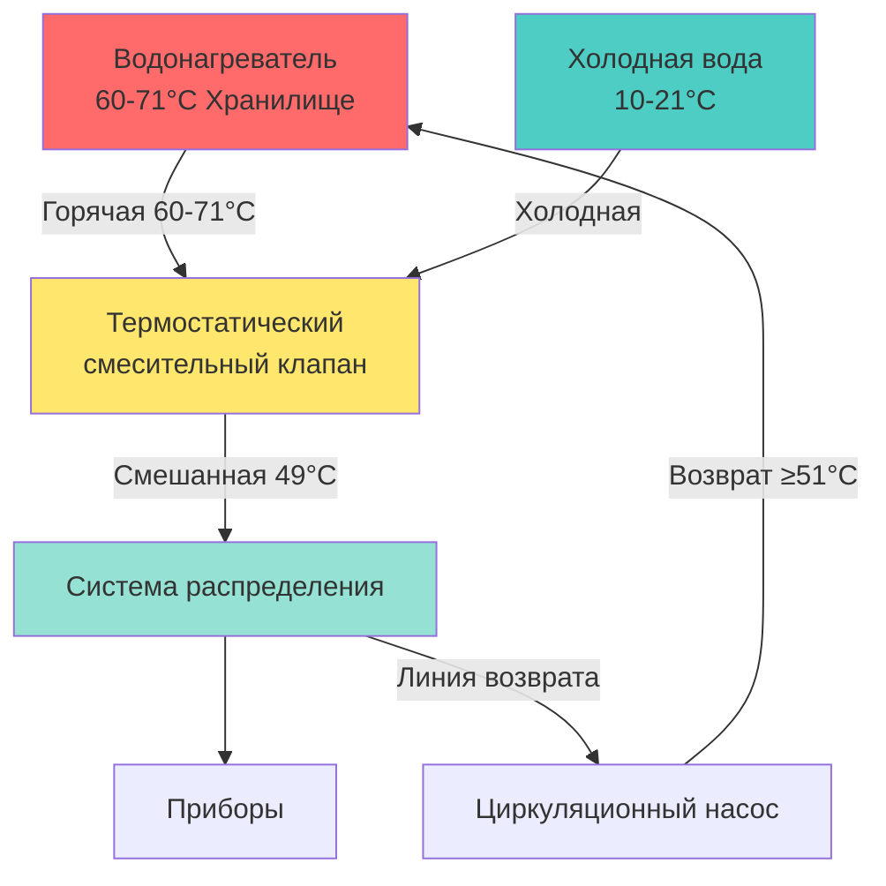

## Высокотемпературное хранилище

Высокотемпературное хранилище представляет собой первичную пассивную защиту от размножения Legionella pneumophila в системах горячего водоснабжения. Данный подход поддерживает температуру хранения воды на уровне 60°C и выше, создавая термически враждебные условия, которые предотвращают колонизацию бактерий и обеспечивают непрерывную пастеризацию.

## Принципы тепловой инактивации

Бактерии Legionella проявляют температурно-зависимые характеристики выживаемости. Скорость теплового уничтожения подчиняется кинетике первого порядка, при которой время, необходимое для инактивации бактерий, экспоненциально снижается с увеличением температуры:

$$
\ln\left(\frac{N}{N_0}\right) = -kt
$$

Где:
- $N/N_0$ = доля выживших бактерий
- $k$ = температурно-зависимая константа скорости гибели (мин⁻¹)
- $t$ = время воздействия (минуты)

Для 90% снижения (1-логарифмическое снижение):

$$
t_{90} = \frac{2.303}{k}
$$

Зависимость между температурой и временем уничтожения демонстрирует эффективность температурного контроля:

| Температура хранилища | Время для 90% уничтожения | Время для 99,9% уничтожения | Практический эффект |
|---------------------|-------------------|---------------------|------------------|
| 50°C | 80-124 мин | 240-372 мин | Возможен рост |
| 55°C | 5-6 мин | 15-18 мин | Частичный контроль |
| 60°C | 32 сек | 96 сек | Эффективный контроль |
| 66°C | 2 сек | 6 сек | Быстрая дезинфекция |
| 70°C | Мгновенно | <2 сек | Полная дезинфекция |

## Конфигурация системы

Системы высокотемпературного хранилища требуют тщательного проектирования для баланса между контролем легионеллеза и профилактикой ожогов:

## Выбор температуры хранилища

**Минимальный стандарт 60°C**

Рекомендации ASHRAE 188 и ВОЗ устанавливают 60°C как минимальную эффективную температуру хранилища для контроля легионеллеза. При этой температуре:

- Уничтожение бактерий происходит в течение 32 секунд
- Системы циркуляции поддерживают бактериостатические условия
- Система обеспечивает запас по отношению к температурной стратификации

**Усиленная защита 66-71°C**

Более высокие температуры хранилища обеспечивают дополнительные коэффициенты безопасности:

- Более быстрое время уничтожения компенсирует падение температуры в распределении
- Большая защита от тупиковых участков и зон с низким расходом
- Учет теплопотерь в крупных объектах

## Энергетические соображения

Высокотемпературное хранилище увеличивает потребление энергии несколькими механизмами:

**Потери теплоты при стоянии**

Теплопотери из резервуаров хранилища подчиняются формуле:

$$
Q_{loss} = UA(T_{storage} - T_{ambient})
$$

Где:
- $U$ = общий коэффициент теплопередачи (кДж/ч·м²·°C)
- $A$ = площадь поверхности резервуара (м²)
- $T_{storage}$ = температура хранилища (°C)
- $T_{ambient}$ = температура окружающей среды (°C)

Увеличение температуры хранилища с 49°C до 60°C в механическом помещении при температуре 21°C увеличивает потери при стоянии приблизительно на 40%.

**Потери распределения**

Более высокие температуры хранилища увеличивают потери в неизолированных или плохо изолированных трубопроводах. Однако эти потери частично компенсируются снижением требуемого расхода при смешивании до температуры подачи.

## Профилактика ожогов

Вода при температуре 60°C вызывает ожоги второй степени за 5 секунд, ожоги третьей степени за 15 секунд. Профилактика ожогов требует:

**Термостатические смесительные клапаны (TMV)**

Сертифицированные смесительные клапаны ASSE 1017 или ASSE 1070, установленные в:
- выходе водонагревателя (основной TMV)
- точке использования для высокорискованных применений (здравоохранение, школы)

**Требования к проектированию**

- установить температуру смешанного выхода максимум 49°C для общего использования
- 40-43°C для площадей ухода за пациентами в здравоохранении
- TMV должен безопасно отключать горячую воду в случае отказа холодного водоснабжения
- обеспечить адекватное давление холодного водоснабжения

**Проверка**

Проверка температуры в приборах:
- начальный ввод в эксплуатацию: измерение на всех типах приборов
- годовая проверка: репрезентативная выборка
- документирование температур между 43-49°C на выходах

## Интеграция системы распределения

Эффективность высокотемпературного хранилища зависит от конструкции системы распределения:

**Требования циркуляции**

Температура линии возврата должна поддерживать ≥51°C для предотвращения роста бактерий. Температура на самом удаленном приборе перед возвратом не должна падать ниже:

$$
T_{return,min} = 51°C + \Delta T_{loss}
$$

**Тупиковые участки**

Неиспользуемые участки трубопровода не получают тепловой пользы от высокотемпературного хранилища. Тупиковые участки, превышающие 8 диаметров труб в длину или содержащие более 0,71 л объема, требуют исключения или периодической промывки.

**Контроль стратификации**

Резервуары хранилища требуют адекватного смешивания или нескольких входных/выходных конструкций для предотвращения тепловой стратификации, при которой более холодные зоны поддерживают рост бактерий.

## Нормативная база

**ASHRAE 188-2018**

Требует анализа опасностей и контроля для систем водоснабжения зданий. Высокотемпературное хранилище представляет первичную меру контроля, когда:
- в здании проживают уязвимые группы населения
- сложность здания создает протяженные трубопроводы
- произошли предыдущие случаи легионеллеза

**Рекомендации ВОЗ**

Рекомендуют хранение горячей воды ≥60°C и температуру распределения, поддерживающую >50°C по всей системе, с падением температуры <2°C от накопителя до точки использования.

**Местные коды**

Многие юрисдикции теперь требуют планов контроля легионеллеза, включающих тепловой контроль. Проверьте местные требования для:
- минимальных температур хранилища
- требований установки TMV
- мониторинга температуры и документирования

## Мониторинг и проверка

Эффективное высокотемпературное хранилище требует постоянной проверки:

- **Температура хранилища**: ежедневная проверка в водонагревателе с автоматической регистрацией
- **Смешанная температура подачи**: еженедельные точечные проверки на TMV
- **Температура линии возврата**: непрерывный мониторинг в самой удаленной точке
- **Температура в приборах**: ежемесячная или ежеквартальная программа проверки

Документирование демонстрирует надлежащее расследование для нормативного соответствия и поддерживает анализ опасностей, требуемый согласно ASHRAE 188.

## Ограничения

Высокотемпературное хранилище не устраняет весь риск легионеллеза:

- тупиковые участки и застойные зоны остаются уязвимыми
- падение температуры в распределении ставит под угрозу эффективность
- накипь и биопленка обеспечивают термическую защиту для бактерий
- системы холодного водоснабжения требуют отдельных мер контроля

Комплексный контроль легионеллеза интегрирует высокотемпературное хранилище с надлежащей конструкцией системы, управлением качеством воды и операционными протоколами.
