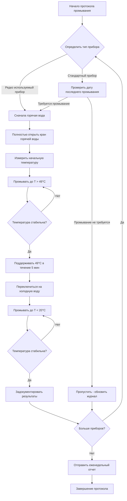

## Обзор

Регулярное промывание устраняет условия застоя воды, способствующие размножению легионеллы в системах горячего водоснабжения жилых зданий. Застой позволяет температуре воды отклоняться в диапазон роста (25–42°C) и истощает остаточные дезинфектанты. Систематические протоколы промывания составляют критический операционный компонент программ управления водой ASHRAE 188.

## Физическая основа промывания

Бактерии легионеллы размножаются в биопленке и стоячей воде, где:

1. **Условия температуры способствуют росту**: температура воды между 25°C и 42°C обеспечивает оптимальные скорости размножения
2. **Накопление питательных веществ**: стоячая вода накапливает органическое вещество и продукты коррозии
3. **Распад остаточных дезинфектантов**: хлор и другие биоциды деградируют со временем без пополнения
4. **Ускорение развития биопленки**: неподвижная вода облегчает присоединение бактерий и образование биопленки

Промывание вытесняет стоячую воду свежей водой из водопровода, восстанавливает температурные профили и вводит остаточный дезинфектант.

## Расчеты объема промывания

Требуемый объем для полного обмена стоячей воды зависит от геометрии трубопровода и характеристик приборов.

### Формула объема трубопровода

$$V_{pipe} = \frac{\pi D^2 L}{4}$$

Где:
- $V_{pipe}$ = объем трубопровода (см³)
- $D$ = внутренний диаметр трубопровода (см)
- $L$ = длина трубопровода от циркуляционного контура к прибору (см)

### Расчет времени промывания

$$t_{flush} = \frac{V_{pipe}}{Q_{fixture}}$$

Где:
- $t_{flush}$ = требуемая продолжительность промывания (мин)
- $V_{pipe}$ = объем трубопровода (л)
- $Q_{fixture}$ = расход прибора (л/мин)

### Критерий стабилизации температуры

Промывание продолжается до стабилизации температуры выхода:

$$\Delta T = T_{outlet} - T_{supply} \leq 1,1°C$$

Где:
- $T_{outlet}$ = измеренная температура выхода прибора (°C)
- $T_{supply}$ = температура подачи у циркуляционного контура (°C)
- $\Delta T$ = допустимое отклонение температуры (°C)

## Частота промывания по типам зданий

| Тип здания | Редко используемые приборы | Стандартные приборы | Зоны высокого риска | Частота документирования |
|---------------|------------------|-------------------|-----------------|-------------------------|
| Лечебные учреждения | Еженедельно | Ежемесячно | Ежедневно | Каждое событие |
| Гостиницы/Общежития | Еженедельно | Два раза в месяц | Еженедельно | Еженедельный отчет |
| Офисные здания | Еженедельно | Ежемесячно | Еженедельно | Еженедельный отчет |
| Школы | Ежедневно (перерывы) | Ежеквартально | Еженедельно | Еженедельный отчет |
| Промышленные | Два раза в месяц | Ежеквартально | Еженедельно | Ежемесячный отчет |
| Жилые многоквартирные | Пустые квартиры: еженедельно | Ежемесячно | N/A | Ежемесячный отчет |

**Редко используемые приборы**: используются менее двух раз в неделю
**Зоны высокого риска**: пациенты с ослабленным иммунитетом, палата интенсивной терапии, отделения трансплантации

## Рабочий процесс процедуры промывания

## Стандартные процедуры промывания

### Еженедельное промывание редко используемых приборов

1. **Фаза идентификации**
   - Определить все приборы, используемые менее двух раз в неделю
   - Включить гостевые комнаты, аварийные душевые, служебные раковины, приборы в комнатах отдыха

2. **Последовательность промывания горячей воды**
   - Полностью открыть вентиль горячей воды
   - Измерить начальную температуру выхода
   - Промывать до достижения температуры выхода 49°C
   - Поддерживать 49°C не менее 5 минут
   - Проверить стабильность температуры (< 1,1°C вариации за 1 минуту)

3. **Последовательность промывания холодной воды**
   - Переключиться только на холодную воду
   - Промывать до температуры выхода ниже 20°C
   - Поддерживать температуру не менее 2 минут
   - Проверить стабильность температуры

4. **Требования к документированию**
   - Идентификатор прибора и место расположения
   - Начальная и конечная температуры (горячая и холодная)
   - Продолжительность промывания для каждой фазы
   - Дата, время и имя оператора

### Ежемесячное промывание системы

Расширенное промывание для приборов в обычном использовании, но с потенциальным застоем в тупиковых ветвях:

1. Промывать все приборы не менее 10 минут (горячая вода)
2. Целевая температура выхода: минимум 51°C на приборе
3. Проверить, что система рециркуляции поддерживает температуру возврата 50°C
4. Задокументировать температурный профиль по всем зонам здания

### Процедура термального шока

Применяется к приборам с подтвержденной или предполагаемой колонизацией легионеллой:

1. **Подготовка**
   - Повысить установку точки регулирования водонагревателя до 60–65°C
   - Проверить, что устройства защиты от ожогов временно обойдены или удалены
   - Разместить предупреждающие знаки для предупреждения жильцов

2. **Выполнение**
   - Промывать каждый прибор водой 60°C в течение минимум 30 минут
   - Поддерживать температуру выхода выше 55°C (время убиения легионеллы 10 минут)
   - Контролировать постоянную температуру во время промывания

3. **Охлаждение и восстановление**
   - Снизить установку точки регулирования водонагревателя до рабочей температуры
   - Переустановить устройства защиты от ожогов
   - Возобновить нормальную работу после стабилизации системы

## Критические соображения для редко используемых приборов

**Приборы высокого приоритета, требующие еженедельного внимания:**
- Аварийные душевые и фонтанчики безопасности
- Пустые гостевые комнаты или палаты пациентов
- Сезонные объекты (закрытые крылья, летние лагеря)
- Резервные или дополнительные приборы
- Тупиковые ветви с минимальным потоком

**Протоколы расширенного отсутствия:**
- Здания закрыты более 1 недели: полное промывание системы перед открытием
- Отдельные приборы неиспользуемы более 2 недель: рекомендуется обработка термальным шоком

## Документирование и ведение записей

ASHRAE 188 требует документированного подтверждения действий по промыванию:

**Минимальные элементы документирования:**
- Система идентификации приборов (номер комнаты, метка или уникальный идентификатор)
- Запланированная частота в сравнении с фактической датой выполнения
- Измерения температуры (начальная и конечная, горячая и холодная)
- Продолжительность промывания
- Оператор, выполнивший процедуру
- Аномалии или отклонения от протокола

**Сохранение записей:**
- Вести журналы промывания минимум 3 года
- Электронные системы логирования предпочтительны для анализа тенденций
- Документировать корректирующие действия для приборов, не соответствующих критериям температуры

## Интеграция в программы управления водой

Регулярное промывание функционирует как одна мера контроля в комплексных программах управления водой ASHRAE 188:

1. **Анализ опасностей определяет** приборы, подверженные застою, и сегменты системы
2. **Контрольные пределы устанавливают** приемлемые температурные диапазоны и максимальное время застоя
3. **Процедуры контроля проверяют** эффективность промывания путем измерения температуры
4. **Корректирующие действия устраняют** приборы, постоянно не достигающие целевых температур
5. **Валидация программы подтверждает** контроль легионеллы путем периодического отбора проб

Протоколы промывания должны быть интегрированы с поддержанием температуры, мониторингом остаточного дезинфектанта и модификациями конструкции системы для решения проблем устойчивого застоя.

## Проверка эффективности

Одна температура не подтверждает уничтожение легионеллы. Проверка требует:

- Периодический микробиологический отбор проб (ежеквартально или как указано командой управления водой)
- Анализ тенденций температур промывания по зонам здания
- Исследование приборов, требующих расширенного времени промывания
- Корреляция соответствия протоколу промывания с уровнями обнаружения легионеллы

Учреждения с последовательным соответствием протоколам промывания демонстрируют значительно сниженную колонизацию легионеллой по сравнению со зданиями со спорадическими или отсутствующими программами промывания.
