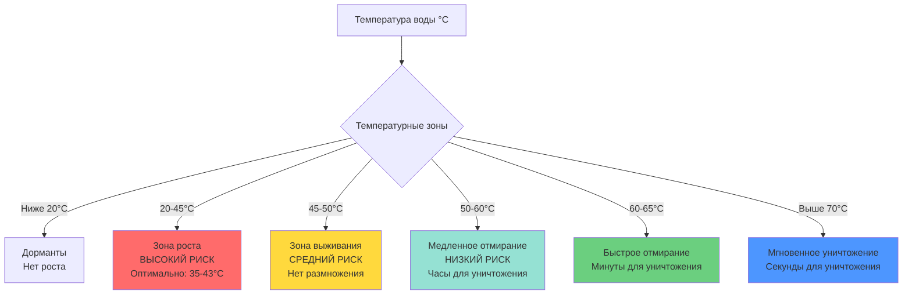

## Обзор

Контроль температуры является наиболее фундаментальной и эффективной стратегией предотвращения легионеллеза в системах горячего водоснабжения. Бактерия *Legionella pneumophila* демонстрирует зависимый от температуры рост, который составляет основу инженерных контролей. Надлежащее управление температурой требует баланса двух конкурирующих рисков: поддержание температуры достаточно высокой для предотвращения бактериального размножения при избежании ожогов в местах потребления.

## Соотношение температуры и роста

Бактерии Legionella демонстрируют четко определенную чувствительность к температуре:

**Зоны роста и выживания:**
- Ниже 20°C: Дорманты, минимальное размножение
- 20°C - 45°C: Диапазон роста, оптимально при 35-43°C
- 45°C - 50°C: Выживание, но нет размножения
- 50°C - 60°C: Постепенное отмирание
- Выше 60°C: Быстрая термическая инактивация

## Кинетика термического уничтожения

Скорость инактивации Legionella следует кинетике первого порядка, описываемой соотношением термического времени смерти:

$$\log_{10}\left(\frac{N}{N_0}\right) = -\frac{t}{D_T}$$

Где:
- $N$ = концентрация бактерий во время $t$
- $N_0$ = начальная концентрация бактерий
- $t$ = время экспозиции (минуты)
- $D_T$ = десятичное время снижения при температуре $T$ (минуты для 90% уничтожения)

**Десятичные времена снижения (D-значения):**

$$D_{60°C} \approx 120 \text{ мин}$$
$$D_{65°C} \approx 2 \text{ мин}$$
$$D_{70°C} \approx 0,33 \text{ мин (20 сек)}$$
$$D_{71°C} \approx 0,08 \text{ мин (5 сек)}$$

Для 99,9% уничтожения (3-логарифмическое снижение):

$$t_{99,9\%} = 3 \times D_T$$

При 60°C это требует примерно 6 часов непрерывного воздействия, тогда как при 70°C требуется только 1 минута.

## Стратегии контроля температуры

### Требования к температуре хранения

**Стандарт ASHRAE 188:**
- Минимальная температура хранения: **60°C**
- Обоснование: Предотвращает размножение Legionella в бойлере
- Реализация: Установить регулятор температуры на поддержание 60-65°C

**Рекомендации ВОЗ:**
- Хранение: **≥60°C** непрерывно
- Распределение: **≥50°C** во всей системе
- Температура возврата: **≥51°C** в циркуляционных линиях

### Температуры распределения и подачи

| Параметр | Температура | Назначение | Стандарт |
|-----------|-------------|-----------|----------|
| Бак хранения | 60-65°C | Предотвращение роста в баке | ASHRAE 188, ВОЗ |
| Подача горячей воды | мин. 60°C | Предотвращение роста в распределении | ASHRAE 188 |
| Возврат циркуляции | мин. 51°C | Поддержание температуры распределения | ВОЗ, ASHRAE 188 |
| Место потребления (с ТСК) | макс. 49°C | Предотвращение ожогов | ASSE 1017, ASSE 1070 |
| Место потребления (здравоохр.) | 40-43°C | Безопасность пациентов | Рекомендации FGI |

### Конфигурация термостатического смесительного клапана

Термостатические смесительные клапаны (ТСК) решают парадокс температуры, позволяя высокие температуры распределения при доставке безопасных температур к приборам.

**Архитектура системы:**
1. Водонагреватель поддерживает 60-65°C хранения
2. Горячая вода распределяется при 60°C во всем здании
3. Главный ТСК или точечные ТСК понижают температуру до 49°C на приборах
4. Подача холодной воды остается изолированной до точки смешивания

**Требования к производительности ТСК:**
- ASSE 1017 (точка потребления): стабильность температуры на выходе ±1,7°C
- ASSE 1070 (главный клапан): стабильность температуры на выходе ±2,8°C
- Максимальная температура на выходе: 49°C жилой, 40-43°C здравоохранение
- Конструкция с отказоустойчивостью: отказ холодной воды должен остановить поток горячей воды

## Риск ожога в сравнении с бактериальным риском

Фундаментальное напряжение в конструкции домашней системы горячего водоснабжения:

**Время ожога:**

$$t_{ожог} = \frac{C}{(T_{вода} - T_{кожа})^n}$$

Где эмпирические данные показывают:
- 60°C: Ожог кожи примерно за 5 секунд (взрослые), <1 секунды (дети)
- 54°C: Ожог кожи примерно за 30 секунд
- 49°C: Ожог кожи примерно за 5 минут
- 43°C: Безопасно при неопределенном воздействии

**Таблица сравнения рисков:**

| Температура | Риск Legionella | Риск ожога | Применение |
|-----------|-----------------|-----------|-------------|
| 49°C | Очень высокий (зона роста) | Низкий (5 мин до ожога) | ❌ Небезопасно для хранения/распределения |
| 54°C | Высокий (зона выживания) | Умеренный (30 сек до ожога) | ❌ Недостаточно для предотвращения |
| 60°C | Очень низкий (зона отмирания) | Очень высокий (<5 сек до ожога) | ✓ Только хранение/распределение |
| 65°C | Минимальный (быстрое уничтожение) | Экстремальный (мгновенный ожог) | ✓ Протокол термической дезинсекции |
| 70-76°C | Нет (мгновенное уничтожение) | Экстремальный (мгновенный тяжелый ожог) | ✓ Только тепловой шок |

## Протоколы термической дезинсекции

При обнаружении загрязнения Legionella термическая дезинсекция (тепловой шок) обеспечивает экстренную обработку:

**Протокол:**
1. Повысить температуру водонагревателя до 71-77°C
2. Последовательно промыть все приборы до достижения воды при 71°C в течение ≥5 минут
3. Поддерживать повышенную температуру в течение 24-48 часов
4. Вернуть температуру хранения к 60-65°C
5. Повторно провести отбор проб системы через 48 часов

**Эффективность дезинсекции:**

При 71°C темп термического уничтожения достигает:

$$\text{Логарифмическое снижение} = \frac{t}{D_{71°C}} = \frac{5 \text{ мин}}{0,08 \text{ мин}} \approx 62,5 \text{ (полная стерилизация)}$$

## Мониторинг и контроль температуры

**Критические контрольные точки:**
- Выход водонагревателя: Непрерывный мониторинг, сигнал тревоги при <60°C
- Возврат циркуляции: Ежедневная проверка, поддержание >51°C
- Тупиковые ветви: Еженедельные проверки температуры
- Точечные ТСК: Ежемесячная проверка калибровки

**Требования к системе контроля:**
- Датчики температуры: Точность ±1,1°C, ежегодная калибровка
- Дифференциал регулятора: Максимум 5,6°C для минимизации циклирования
- Циркуляционный насос: Управление VFD для поддержания температуры возврата
- Сигналы тревоги: Низкая температура (<60°C хранения) и высокая температура (>54°C после ТСК)

## Проектные соображения

**Принципы проектирования системы:**
1. **Исключить тупиковые участки:** Все ветви должны иметь поток или полностью сливаться
2. **Минимизировать объем хранения:** Уменьшает риск застоя, улучшает оборот
3. **Изолировать трубопровод горячей воды:** Поддерживает температуру распределения, снижает тепловые потери
4. **Правильно рассчитать циркуляционные насосы:** Балансировка потока обеспечивает наличие горячей воды во всех ветвях
5. **Установить ТСК стратегически:** Главные клапаны для зон, точечные для высокорисковых областей

**Энергоэффективность в сравнении с безопасностью:**

Поддержание хранения при 60°C увеличивает потери в режиме ожидания. Расчет штрафа за энергию:

$$Q_{потери} = UA(T_{хранения} - T_{окружающей})$$

Увеличение хранения с 49°C до 60°C в типичном баке емкостью 300 л увеличивает потери в режиме ожидания примерно на 15-20%, но это невозможно обойти для предотвращения легионеллеза. Надлежащая изоляция и эффективное оборудование минимизируют штраф за энергию.

## Нормативные требования и коды

- **ASHRAE 188-2018:** Требует письменные программы управления водой, включая мониторинг температуры
- **Рекомендации ВОЗ:** Указывают хранение ≥60°C, распределение ≥50°C
- **Государственные коды водоснабжения:** Многие требуют ТСК при хранении выше 60°C
- **Joint Commission:** Учреждения здравоохранения должны контролировать и документировать температуры
- **Рекомендации FGI:** Требования проектирования здравоохранения для палат пациентов

## Резюме

Эффективное предотвращение легионеллеза через контроль температуры требует поддержания температуры хранения и распределения на уровне или выше 60°C при защите жителей здания от ожогов через надлежащие установленные и обслуживаемые термостатические смесительные клапаны. Эта стратегия двойной температуры—горячая для распределения, безопасная для доставки—представляет инженерный стандарт для баланса микробиологической безопасности и предотвращения ожогов в системах горячего водоснабжения.
