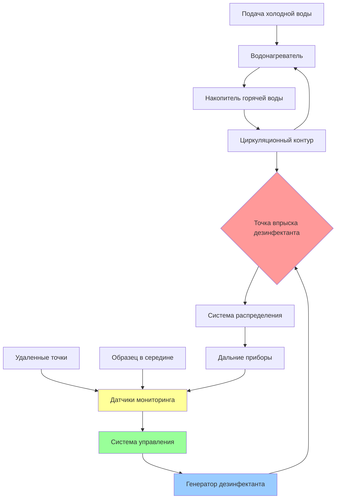

## Методы обработки воды для профилактики легионеллы

Дополнительная дезинфекция представляет критический уровень защиты от Legionella pneumophila в системах горячего водоснабжения. Хотя контроль температуры обеспечивает первичную профилактику, химические и физические методы обработки предлагают непрерывную защиту от образования биопленки и размножения бактерий, особенно в системах, где поддержание оптимальных температур затруднено.

## Основы дополнительной дезинфекции

Эффективная обработка воды решает три критические задачи: инактивация планктонных бактерий, проникновение в биопленку и остаточная защита по всей системе распределения. ASHRAE 188 подчеркивает, что дополнительная дезинфекция служит дополнением к, а не заменой надлежащему проектированию системы и управлению температурой.

Концепция CT (концентрация × время) определяет эффективность дезинфекции:

$$CT = C \cdot t$$

где $C$ — концентрация дезинфектанта (мг/л) и $t$ — время контакта (минуты). Требуемые значения CT для инактивации легионеллы варьируются в зависимости от дезинфектанта и температуры.

## Первичные технологии обработки

### Диоксид хлора

Диоксид хлора (ClO₂) обеспечивает превосходное проникновение в биопленку по сравнению со свободным хлором, избегая при этом образования тригалометанов. Система генерирует ClO₂ на месте посредством реакции хлорита натрия:

$$5NaClO_2 + 4HCl \rightarrow 4ClO_2 + 5NaCl + 2H_2O$$

Целевые остаточные концентрации находятся в диапазоне от 0,4 до 0,8 мг/л в дальних точках системы. Расчет химического спроса следует:

$$D = \frac{Q \cdot C \cdot 1440}{E \cdot 1000}$$

где:
- $D$ = ежедневный спрос на дезинфектант (кг/сутки)
- $Q$ = расход системы (л/мин)
- $C$ = целевая концентрация (мг/л)
- $E$ = эффективность генерации (0,85–0,95 для ClO₂)
- 1440 = минут в сутки

### Ионизация медью и серебром

Электролитическое генерирование ионов меди (Cu²⁺) и серебра (Ag⁺) обеспечивает долгосрочную остаточную дезинфекцию с минимальной оперативной сложностью. Целевые концентрации:
- Медь: 0,2–0,8 мг/л
- Серебро: 0,02–0,08 мг/л

Требуемая скорость ионизации для поддержания целевых уровней:

$$R = \frac{(C_t - C_m) \cdot V}{t \cdot \eta}$$

где:
- $R$ = скорость ионизации (мг/ч)
- $C_t$ = целевая концентрация (мг/л)
- $C_m$ = измеренная концентрация (мг/л)
- $V$ = объем системы (л)
- $t$ = время циркуляции (ч)
- $\eta$ = эффективность выпуска ионов

### Монохлорамин

Образование монохлорамина посредством комбинации аммиака и хлора обеспечивает стабильную остаточную дезинфекцию с пониженной коррозией по сравнению со свободным хлором:

$$NH_3 + HOCl \rightarrow NH_2Cl + H_2O$$

Оптимальное соотношение хлора к аммиаку (по массе) находится в диапазоне от 4:1 до 5:1. Целевая остаточная: 2,0–3,0 мг/л в виде Cl₂.

Расчет скорости подачи химиката:

$$F = \frac{Q \cdot C \cdot 1440}{P \cdot 1000}$$

где:
- $F$ = скорость подачи (л/сутки или кг/сутки)
- $Q$ = расход воды (л/мин)
- $C$ = требуемая доза (мг/л)
- $P$ = чистота продукта (десятичная дробь)

## Интеграция системы обработки

## Сравнение методов обработки

| Параметр | Диоксид хлора | Медь-Серебро | Монохлорамин |
|----------|---------------|--------------|--------------|
| **Целевая остаточная** | 0,4–0,8 мг/л | Cu: 0,2–0,8 мг/л Ag: 0,02–0,08 мг/л | 2,0–3,0 мг/л |
| **Проникновение в биопленку** | Отличное | Очень хорошее | Хорошее |
| **CT₉₉ при 25°C (мин·мг/л)** | 2,5–5,0 | 15–30 | 100–150 |
| **Чувствительность к pH** | Средняя (6,5–8,5) | Низкая (6,0–9,0) | Высокая (7,0–8,5) |
| **Риск коррозии** | Низкий | Средний (гальванический) | Низкий–средний |
| **Капитальные затраты** | Высокие | Средние | Средние–высокие |
| **Операционные затраты** | Средние | Низкие | Средние |
| **Сложность мониторинга** | Средняя | Высокая (2 иона) | Высокая (Cl₂, NH₃) |
| **Одобрение регулятором** | Отличное | Хорошее | Отличное |
| **Стабильность при температуре** | Снижается при >40°C | Отличная | Хорошая |
| **Образование тригалометанов** | Нет | Нет | Минимальное |

## Механизмы контроля биопленки

Эффективный контроль легионеллы требует нарушения биопленки. Глубина проникновения следует:

$$d = \sqrt{\frac{D \cdot t}{k}}$$

где:
- $d$ = глубина проникновения (мкм)
- $D$ = коэффициент диффузии (см²/с)
- $t$ = время контакта (с)
- $k$ = константа реакции биопленки

Ионизация медью-серебром и диоксид хлора демонстрируют превосходное проникновение в биопленку по сравнению с традиционным хлорированием благодаря меньшему размеру молекул и улучшенному окислительному потенциалу.

## Мониторинг и верификация

ASHRAE 188 и рекомендации CDC требуют непрерывного мониторинга в нескольких местах системы:

1. **Первичная точка впрыска**: Проверка выхода генератора
2. **Местоположения в середине системы**: Подтверждение адекватности распределения
3. **Дальние точки**: Валидация защиты на конце
4. **Мертвые ноги и зоны с низким расходом**: Выявление проблемных зон

Частота отбора образцов:
- Ежедневно: Автоматические показания датчиков
- Еженедельно: Образцы ручной проверки
- Ежемесячно: Комплексный аудит системы
- Ежеквартально: Тестирование на культуру легионеллы

Скорость разложения дезинфектанта определяет требуемые корректировки подачи:

$$C(t) = C_0 \cdot e^{-kt}$$

где:
- $C(t)$ = концентрация в момент времени $t$
- $C_0$ = начальная концентрация
- $k$ = константа разложения (1/ч)

## Критические соображения при внедрении

**Совместимость материалов**: Проверьте, чтобы все компоненты системы переносили выбранный дезинфектант. Ионизация медью-серебром требует оценки потенциала гальванической коррозии в системах со смешанными металлами.

**Химия воды**: Качество исходной воды значительно влияет на эффективность обработки. Высокое содержание хлоридов ускоряет коррозию в системах с медью-серебром. Повышенное содержание органических веществ увеличивает спрос на диоксид хлора.

**Гидравлическое время удержания**: Рассчитайте объем системы и расходы, чтобы обеспечить адекватное время контакта перед первым приспособлением:

$$t_c = \frac{V}{Q} \cdot 60$$

где $t_c$ — время контакта (минуты), $V$ — объем трубопровода (л), и $Q$ — расход (л/мин).

**Оборот системы**: Стремитесь к полной замене воды в системе в течение 24 часов для предотвращения застоя, несмотря на дополнительную дезинфекцию.

## Нормативно-правовая база

Рекомендации CDC (июнь 2021) и ASHRAE 188-2018 устанавливают дополнительную дезинфекцию как признанную меру контроля при:
- Поддержание температуры становится непрактичным
- Группы высокого риска требуют усиленной защиты
- Сложность системы создает температурные мертвые зоны
- Произошла историческая колонизация легионеллой

Государственные и местные нормативные акты могут налагать дополнительные требования для медицинских учреждений, градирен и систем коммунального водоснабжения. Перед внедрением проконсультируйтесь с нормативно-правовыми актами конкретной юрисдикции.

## Передовые операционные практики

1. Установите исходное качество воды посредством комплексного тестирования
2. Рассчитайте химический спрос на основе объема системы и расхода
3. Установите оборудование впрыска с надлежащей защитой от обратного потока
4. Разверните многоточечный мониторинг с автоматическим оповещением
5. Внедрите письменные операционные процедуры и графики обслуживания
6. Обучите операторов работе генератора и протоколам безопасности
7. Ведите подробные логи обработки и записи остаточных значений
8. Проводите ежеквартальную валидацию посредством микробиологического тестирования

Эффективность дополнительной дезинфекции зависит от надлежащего проектирования, постоянной эксплуатации и бдительного мониторинга. Ни одна технология не устраняет полностью риск легионеллы; комплексные программы управления водой, включающие множество мер контроля, обеспечивают оптимальную защиту.
