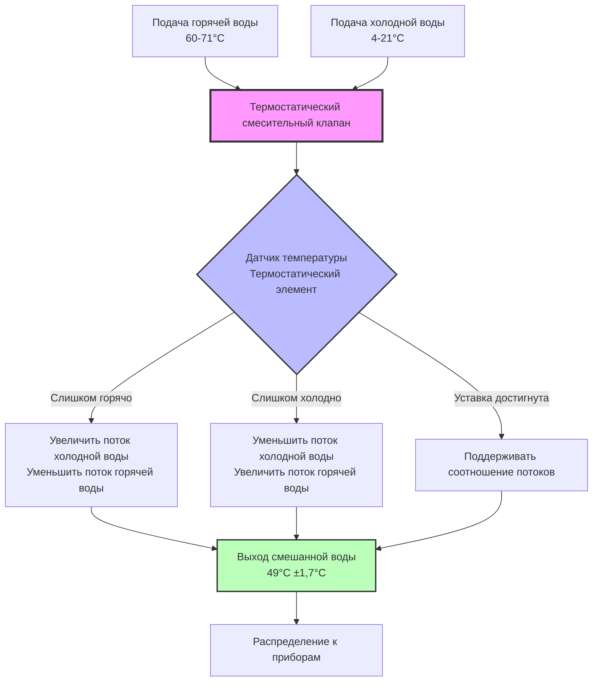
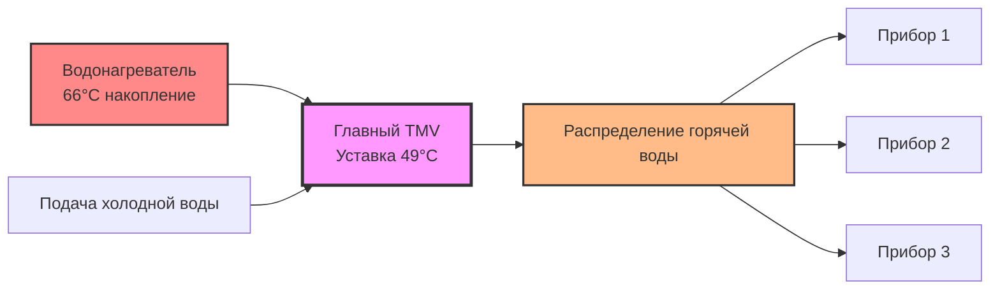
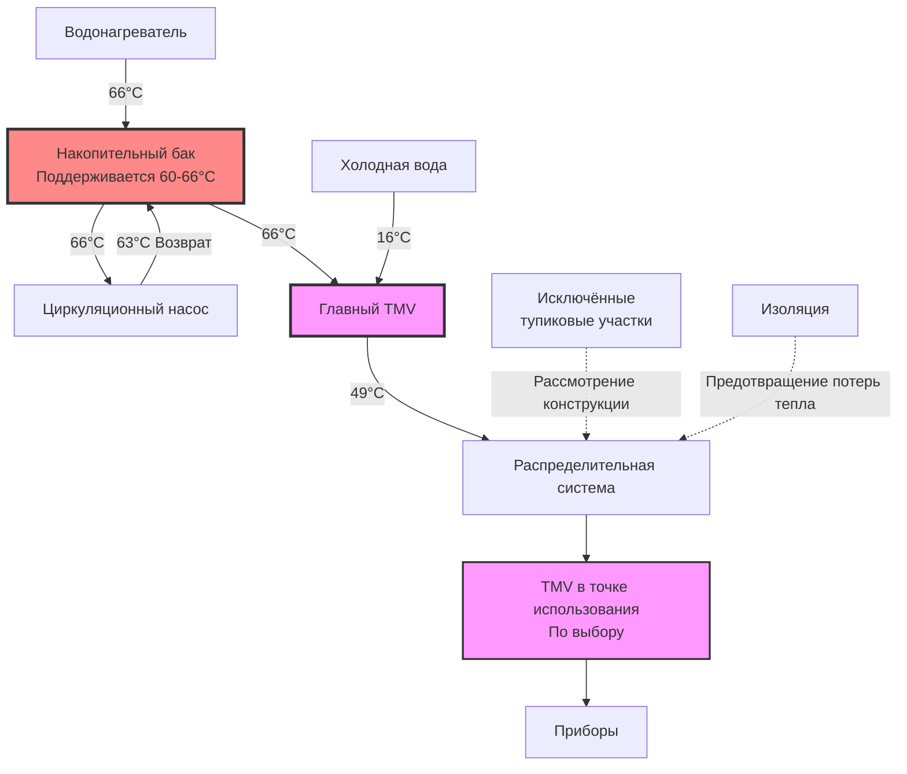

## Обзор

Термостатические смесительные клапаны (TMV) смешивают горячую воду из накопительных баков с холодной водой для подачи безопасных регулируемых температур к приборам, одновременно позволяя сохранять воду в накопителе при повышенных температурах для контроля легионеллы. Эти клапаны функционируют как автоматические регуляторы температуры, динамически реагируя на колебания входных давлений и температур для поддержания стабильной подачи смешанной воды.

Фундаментальная проблема в системах горячего водоснабжения сосредоточена на конфликтующих требованиях к температуре: накопление воды выше 60°C подавляет рост бактерий Legionella pneumophila, тогда как температуры подачи выше 49°C представляют опасность ожогов. Термостатические смесительные клапаны разрешают этот конфликт благодаря прецизионному контролю температуры в точке смешивания.

## Принципы работы

### Механика термостатического элемента

Сердцем TMV является термостатический элемент, содержащий парафин или жидкость с высокими коэффициентами теплового расширения. Этот элемент расширяется или сжимается в ответ на изменения температуры смешанной воды, механически перемещая внутренние каналы для регулирования соотношения потоков горячей и холодной воды.

Соотношение управления температурой выглядит следующим образом:

$$Q_{mixed} = Q_{hot} + Q_{cold}$$

Где температура смешанной воды становится:

$$T_{mixed} = \frac{\dot{m}_{hot} c_p T_{hot} + \dot{m}_{cold} c_p T_{cold}}{\dot{m}_{hot} c_p + \dot{m}_{cold} c_p}$$

Упрощая при постоянной удельной теплоёмкости:

$$T_{mixed} = \frac{\dot{m}_{hot} T_{hot} + \dot{m}_{cold} T_{cold}}{\dot{m}_{hot} + \dot{m}_{cold}}$$

Смесительный клапан непрерывно регулирует $\dot{m}_{hot}$ и $\dot{m}_{cold}$ для поддержания уставки $T_{mixed}$.

### Характеристики отклика

Отклик TMV зависит от тепловой массы термостатического элемента и скоростей теплопередачи. Постоянная времени регулирования клапана обычно варьируется от 2–5 секунд, рассчитываемая как:

$$\tau = \frac{m_{element} c_{p,element}}{hA}$$

Где:
- $m_{element}$ = масса термостатического элемента (кг)
- $c_{p,element}$ = удельная теплоёмкость материала элемента (Дж/кг·К)
- $h$ = коэффициент конвективной теплопередачи (Вт/м²·К)
- $A$ = площадь поверхности элемента (м²)

Более быстрый отклик требует меньшей тепловой массы и более высоких соотношений площади поверхности к объёму.

## Требования стандарта ASSE 1017

Стандарт Американского общества инженеров санитарии 1017 устанавливает требования производительности для активируемых температурой смесительных клапанов для систем распределения горячей воды.

### Критерии производительности

| Требование | Спецификация | Условие испытания |
|------------|--------------|-------------------|
| Максимальная температура выхода | ≤ Уставка + 1,7°C | При всех расходах |
| Стопор верхнего предела | Требуется | Заводская установка или регулируемая на месте |
| Отклик при отказе холодной воды | Полное перекрытие горячей воды | В течение 5 секунд |
| Отклик при отказе горячей воды | Полный проход холодной воды | Немедленное прохождение |
| Компенсация колебаний давления | ±6,1°C максимум изменения | 50% изменение давления |
| Стабильность температуры | ±1,7°C от уставки | Непрерывная работа |
| Диапазон расхода | 0,5 до номинального л/мин | Спецификация производителя |

### Отказоустойчивая работа

ASSE 1017 требует отказоустойчивых устройств:

**Отказ подачи холодной воды**: Клапан должен предотвратить поток горячей воды для защиты от ожогов. Пружинный внутренний механизм принудительно закрывает отверстие горячей воды, когда давление холодной воды падает ниже рабочих пороговых значений.

**Отказ подачи горячей воды**: Холодная вода должна течь свободно для сохранения обслуживания, даже при пониженных температурах. Это предотвращает прерывание системы из-за отказов нагревателя.

## Конфигурации установки

### Конфигурация главного смесительного клапана

Главный TMV, установленный на выходе водонагревателя, обеспечивает регулирование температуры по всей системе:

**Преимущества:**
- Единая точка управления для всей системы
- Снижение количества клапанов и технического обслуживания
- Консистентная температура по всему распределению
- Меньшие затраты на установку для больших систем

**Недостатки:**
- Вся система ограничена одной температурой
- Отсутствие приспособления для различных требований использования
- Требуется клапан большей производительности
- Система циркуляции всё ещё подвергается воздействию повышенных температур без смешивания в точке использования

### Конфигурация смешивания в точке использования

Отдельные TMV у каждого прибора или группы приборов обеспечивают локальное управление:

**Приложения:**
- Медицинские учреждения, требующие конкретных температур по применению
- Учреждения с различными демографическими группами (уход за пожилыми при более низких температурах)
- Системы, требующие различных температур для мытья рук (40-43°C) в сравнении с мытьём посуды (49-60°C)
- Переоборудование установок, где трубопровод распределения не может быть изменён для системных решений

### Гибридный подход

Комбинированный главный клапан с локальным темпированием для критических приборов:

1. Главный клапан снижает распределение системы до 54-57°C
2. Клапаны в точке использования дополнительно снижают до 40-49°C у приборов
3. Некоторые приборы получают воду 54-57°C для требований санитизации

## Подбор размера и выбор

### Расчёты расхода

Подбор размера TMV требует определения пикового одновременного спроса на расход. Клапан должен подавать требуемый расход при поддержании точности температуры по всему диапазону работы.

$$\dot{V}_{mixed} = \frac{T_{hot} - T_{mixed}}{T_{hot} - T_{cold}} \times \dot{V}_{total}$$

Пример расчёта:
- Подача горячей воды: 66°C
- Подача холодной воды: 16°C
- Целевая температура смешанной воды: 49°C
- Требуемый общий расход: 38 л/мин

$$\dot{V}_{hot} = \frac{49 - 16}{66 - 16} \times 38 = \frac{33}{50} \times 38 = 25,3 \text{ л/мин}$$

$$\dot{V}_{cold} = 38 - 25,3 = 12,7 \text{ л/мин}$$

Клапан должен обрабатывать 25,3 л/мин горячей воды и 12,7 л/мин холодной воды на входе для подачи 38 л/мин смешанного потока на выходе.

### Рассмотрения падения давления

TMV вводит дополнительное падение давления в распределительную систему:

$$\Delta P = K \frac{\rho v^2}{2}$$

Типичные значения K для TMV варьируются от 5–15 в зависимости от конструкции клапана и положения. При 38 л/мин через клапан 19 мм (v ≈ 3 м/с):

$$\Delta P = 10 \times \frac{1000 \times 3^2}{2} = 45 \text{ кПа}$$

Это значительное падение давления должно быть учтено в гидравлических расчётах системы.

## Интеграция контроля легионеллы

### Стратегия высокотемпературного накопления

Термостатические смесительные клапаны позволяют использовать оптимальный подход к контролю легионеллы:

**Температура накопления**: 60-66°C
- Полное уничтожение легионеллы при 60°C в течение 32 минут
- Более быстрое уничтожение при 66°C (2 минуты воздействия)
- Рост не происходит выше 50°C

**Температура подачи**: 49°C или ниже
- Значительно снижает риск ожогов
- Время ожога первой степени: 5 минут при 49°C против 5 секунд при 60°C
- Соответствует требованиям сантехнических кодексов для бытовых приборов

Дифференциальная температурная эффективность:

| Температура | Статус легионеллы | Время ожога (взрослый) |
|------------|------------------|----------------------|
| 66°C (150°F) | Уничтожена за 2 мин | Мгновенно (1 сек) |
| 60°C (140°F) | Уничтожена за 32 мин | 5 секунд |
| 54°C (130°F) | Рост прекращается | 30 секунд |
| 49°C (120°F) | Медленный рост | 5 минут |
| 43°C (110°F) | Оптимальный рост | Нет риска ожога |

### Проектирование системы для контроля легионеллы

**Критические элементы конструкции:**

1. **Температура бака**: Постоянно поддерживается на уровне 60-66°C
2. **Возврат циркуляции**: Минимум 60°C в самой удалённой точке
3. **Главное смешивание**: Снижает до безопасной температуры подачи
4. **Исключение тупиковых участков**: Отсутствие застойных зон с водой
5. **Изоляция**: Поддерживает температуру в распределении

## Требования кодексов и стандарты

### Модельные сантехнические кодексы

**Международный сантехнический кодекс (IPC)**:
- Раздел 607.3: Максимальная температура 60°C у источника
- Раздел 416.5: Требует главный TMV, когда источник превышает 60°C
- Темпирующие клапаны должны соответствовать ASSE 1017

**Единый сантехнический кодекс (UPC)**:
- Раздел 608.3: Ограничение температуры 49°C у приборов
- Медицинские учреждения: 43°C максимум у приборов, доступных пациентам
- Требуется соответствие ASSE 1017 или ASSE 1070

### Требования по конкретным применениям

| Применение | Максимальная температура | Стандарт | Примечания |
|-----------|--------------------------|----------|-----------|
| Бытовые приборы | 49°C | IPC/UPC | Некоторые юрисдикции 43°C |
| Общественные раковины | 43°C | Руководства ADA | Приоритет предотвращения ожогов |
| Медицина (пациенты) | 43°C | Руководства FGI | Уязвимое население |
| Медицина (обслуживание) | 60°C | Коды санитизации | Мытьё посуды, стирка |
| Школы/Дошкольные учреждения | 43°C | Раздел IPC 416.5 | Защита детей |
| Общественные душевые | 49°C максимум | Раздел IPC 424 | С индивидуальными регуляторами |

## Техническое обслуживание и испытания

### Периодическая проверка

TMV требуют регулярных испытаний для проверки точного управления температурой:

**Протокол ежеквартального испытания:**
1. Проверка температуры подачи с помощью откалиброванного термометра
2. Проверка на отклонение ±1,7°C от уставки
3. Измерение входных температур горячей и холодной воды
4. Запись расходов во время испытания
5. Проверка на наличие утечек или коррозии

**Протокол ежегодного испытания:**
1. Полная разборка и проверка термостатического элемента
2. Чистка внутренних компонентов
3. Замена уплотнений и прокладок
4. Проверка калибровки по всему диапазону расходов
5. Испытание отказоустойчивости при отказе холодной воды
6. Испытание колебания давления

### Типовые режимы отказа

| Режим отказа | Симптом | Причина | Решение |
|--------------|---------|--------|--------|
| Смещение температуры | Отклонение уставки > 2,8°C | Деградация элемента | Замена термостатического элемента |
| Неполное смешивание | Колебания температуры | Накопление накипи | Очистка или замена внутренних деталей |
| Снижение расхода | Низкое выходное давление | Внутреннее ограничение | Чистка фильтров, проверка каналов |
| Неработающий отказоустойчив | Нет перекрытия при отказе холода | Отказ пружины | Замена отказоустойчивого механизма |
| Утечка | Внешняя утечка воды | Деградация уплотнения | Замена прокладок/уплотнений |

### Влияние накипи и осадков

Условия жёсткой воды ускоряют требования к обслуживанию TMV. Осаждение карбоната кальция резко возрастает выше 60°C:

$$\text{Тенденция накипи} \propto [Ca^{2+}][CO_3^{2-}] \times T$$

Системы с жёсткостью выше 120 мг/л (в пересчёте на CaCO₃) получают преимущества от:
- Умягчения воды выше по потоку от нагревателя
- Регулярных процедур удаления накипи
- Термостатических элементов с увеличенными зазорами
- Ежегодного профилактического обслуживания вместо двухгодичного

## Энергетические рассмотрения

### Потери при простое

Повышенные температуры накопления увеличивают потери при простое через стенки бака:

$$Q_{loss} = UA(T_{tank} - T_{ambient})$$

Для бака на 190 л с U = 2,84 Вт/м²·К и площадью поверхности 2,3 м²:

При накоплении 66°C в пространстве 21°C:
$$Q_{loss} = 2,84 \times 2,3 \times (66-21) = 293 \text{ Вт}$$

При накоплении 49°C в пространстве 21°C:
$$Q_{loss} = 2,84 \times 2,3 \times (49-21) = 183 \text{ Вт}$$

Увеличение на 110 Вт представляет примерно 60% более высокие потери при простое, или примерно 963 кВт·ч/год дополнительной энергии для электрических нагревателей.

### Потери в распределительной системе

Более высокие температуры распределения также увеличивают потери трубопровода:

$$Q_{pipe} = \frac{2\pi L}{\frac{1}{h_i r_i} + \frac{\ln(r_o/r_i)}{k} + \frac{1}{h_o r_o}}(T_{water} - T_{ambient})$$

Поддержание распределения при 49°C (через главное смешивание) в сравнении с 66°C снижает эти потери примерно на 25% в типичных установках.

## Продвинутые применения

### Электронные термостатические смесительные клапаны

Современные электронные TMV включают:
- Цифровые датчики температуры с точностью ±0,3°C
- Моторизованные исполнительные механизмы для точного управления потоком
- Интеграция с системами автоматизации зданий
- Удалённый мониторинг и возможность регулировки
- Логирование исторической температуры
- Оповещения об упреждающем обслуживании

Эти системы достигают точности ±0,6°C в сравнении с ±1,7°C для механических клапанов, но требуют электропитания и интеграции элементов управления.

### Системы с несколькими температурами

Сложные объекты могут требовать несколько температур подачи:

**Пример больницы:**
- Пациентские душевые: 40°C (приоритет противоожогового)
- Мытьё рук персоналом: 43°C (комфорт)
- Санитизация кухни: 82°C (без TMV)
- Стирка: 60°C (прямо из накопления)
- Общие приборы: 49°C (главный TMV)

Это требует тщательного зонирования, несколько станций TMV и чёткую маркировку для предотвращения перекрёстных соединений.

## Заключение

Термостатические смесительные клапаны представляют собой важные устройства безопасности в современных системах горячего водоснабжения, обеспечивая одновременного достижения контроля легионеллы благодаря повышенным температурам накопления и предотвращение ожогов через регулируемые температуры подачи. Правильный подбор, установка согласно стандартам ASSE 1017 и регулярное обслуживание обеспечивают надёжную защиту для жильцов здания при сохранении качества воды и эффективности системы.

Двойная температурная стратегия—накоплять горячо, подавать безопасно—обеспечивает наиболее эффективный подход к комплексной безопасности системы горячего водоснабжения, делая TMV незаменимыми компонентами в медицинских, институциональных, коммерческих и всё более частых жилых приложениях.
