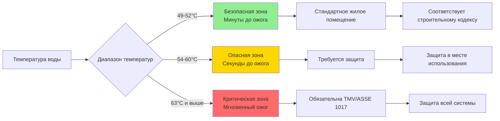
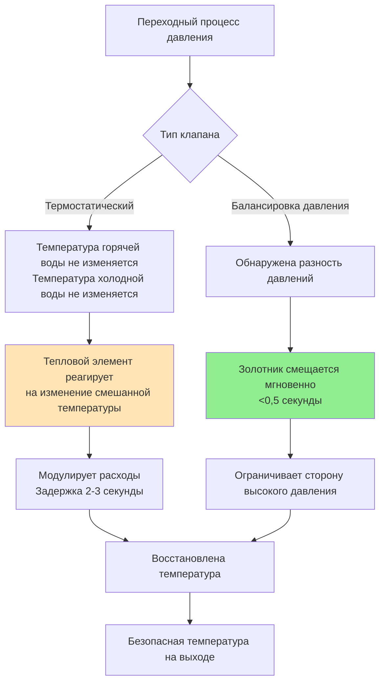

Устройства противоожоговой защиты предотвращают термические травмы путем ограничения температуры подачи горячей воды для бытовых нужд с использованием термостатических или механизмов компенсации давления. Понимание физики теплопередачи в ткани и экспоненциальной зависимости между температурой и временем образования ожога критично для надлежащего проектирования системы и соответствия кодексам.

## Теплопередача в ткани и механизмы ожогов

Термическая травма человеческой ткани возникает, когда тепловой поток превышает способность организма рассеивать энергию через перфузию крови и теплопроводность. Тяжесть ожогов зависит как от температуры, так и от продолжительности воздействия, определяемой тепловой дозой:

$$\Omega = \int_0^t \exp\left(\frac{E_a}{R}\left(\frac{1}{T_{ref}} - \frac{1}{T(t)}\right)\right) dt$$

Где $\Omega$ — интегральный показатель повреждения (безразмерный), $E_a$ — энергия активации денатурации белка (примерно 627 кДж/моль для эпидермиса), $R$ — универсальная газовая постоянная (8,314 Дж/моль·К), $T_{ref}$ — эталонная температура (311 К или 37,8°C), $T(t)$ — температура ткани как функция времени.

Для практических приложений эмпирические соотношения связывают температуру воды с временем образования ожогов третьей степени. Тепловой ответ кожи следует одномерной нестационарной теплопроводности при начальном контакте:

$$q'' = \frac{k_{tissue}(T_{water} - T_{skin})}{\sqrt{\pi \alpha_{tissue} t}}$$

Где $q''$ — тепловой поток (Вт/м²), $k_{tissue}$ — теплопроводность (~0,5 Вт/м·К), $\alpha_{tissue}$ — температуропроводность (~1,4×10⁻⁷ м²/с), $t$ — время воздействия.

## Соотношения время-температура при ожогах

Экспериментальные данные устанавливают критические пороги воздействия для кожи взрослого:

| Температура воды | Время образания ожога третьей степени | Скорость тепловой дозы |
|---|---|---|
| 49°C | >10 минут | Низкий риск |
| 52°C | 2 минуты | Умеренный |
| 54°C | 30 секунд | Высокий |
| 57°C | 10 секунд | Критический |
| 60°C | 3-5 секунд | Тяжелый |
| 63°C | 2 секунды | Экстремальный |
| 66°C | 1 секунда | Немедленный |
| 68°C | <1 секунды | Мгновенный |
| 71°C | Мгновенно | Вспышка ожога |

Зависимость приблизительно экспоненциальная, с уменьшением времени образования ожога на ~50% при каждом увеличении температуры на 2,8°C выше 54°C. Дети младше 5 лет и взрослые старше 65 лет получают ожоги в 2–3 раза быстрее из-за более тонкого эпидермиса и сниженной тепловой толерантности.

## Требования к максимальной температуре подачи

### Стандарты сантехнических кодексов

Международный кодекс по сантехнике (IPC) и Единый кодекс по сантехнике (UPC) устанавливают максимальные температуры для различных типов помещений:

**IPC Раздел 607.1** — контроль температуры для общественных умывальников:
- Максимум 49°C на кранах общественных раковин
- Максимум 43°C в учреждениях здравоохранения
- Измеряется на выходе смесителя при расчетном расходе

**UPC Раздел 608.4** — требования к смешанной воде:
- Душевые и комбинированные ванна/душ: максимум 49°C
- Общественные смесители: максимум 49°C
- Смесители для личного пользования: максимум 60°C при наличии утверждения

### Стандарты ASSE для устройств защиты

**ASSE 1017** — Термостатические смесительные клапаны для систем распределения горячей воды:
- Поддерживает температуру на выходе в пределах ±1,7°C от установленного значения
- Реагирует на изменения входной температуры в течение 3 секунд
- Конструкция с отказоустойчивостью закрывает горячий вход при отказе холодной воды
- Сертифицирован для непрерывной работы при температуре подачи 82°C

**ASSE 1016** — Автоматические компенсирующие клапаны для отдельных смесителей:
- Работа с балансировкой давления или термостатическая
- Ограничивает повышение температуры максимум 1,7°C выше установленного значения во время переходных процессов давления
- Требуется для институциональных душевых установок

**ASSE 1070** — Устройства ограничения температуры воды для отдельных смесителей:
- Противоожоговая защита в месте использования
- Максимальная температура на выходе 49°C независимо от входных условий
- Используется, когда централизованное смешивание непрактично

## Работа термостатических смесительных клапанов

Термостатические смесительные клапаны (TMV) модулируют расходы горячей и холодной воды для поддержания постоянной температуры на выходе с использованием тепловых приводов, чувствительных к температуре смешанной воды.

### Физика теплового привода

Привод содержит воскозаполненный элемент, который расширяется с температурой согласно:

$$\Delta V = V_0 \beta \Delta T$$

Где $\beta$ — коэффициент объемного расширения (~0,0002/°C для парафинового воска). Это расширение смещает поршень, который модулирует положение клапана. Управляющий ответ следует:

$$\frac{dm_h}{dt} = K_p(T_{set} - T_{outlet}) + K_i\int(T_{set} - T_{outlet})dt$$

Где $m_h$ — расход горячей воды по массе, $K_p$, $K_i$ — коэффициенты пропорционального и интегрального управления.

### Расчет смешанной температуры

Для установившегося смешивания с пренебрежимыми потерями тепла:

$$T_{mixed} = \frac{\dot{m}_h c_p T_h + \dot{m}_c c_p T_c}{(\dot{m}_h + \dot{m}_c) c_p} = \frac{\dot{m}_h T_h + \dot{m}_c T_c}{\dot{m}_h + \dot{m}_c}$$

Отношение смешивания для желаемой температуры на выходе:

$$\frac{\dot{m}_h}{\dot{m}_c} = \frac{T_{mixed} - T_c}{T_h - T_{mixed}}$$

Для подачи 49°C из горячей воды 60°C и холодной воды 10°C:

$$\frac{\dot{m}_h}{\dot{m}_c} = \frac{49 - 10}{60 - 49} = \frac{39}{11} = 3,5$$

Для этого требуется 77,8% горячей воды и 22,2% холодной воды по расходу массы.

## Клапаны балансировки давления

Клапаны балансировки давления поддерживают постоянную температуру путем уравнивания давлений на входе горячей и холодной воды, предотвращая температурный скачок при переходных процессах давления (слив унитаза, работа соседнего смесителя).

### Механизм балансировки давления

Клапан использует скользящий золотник или диафрагму, которые реагируют на разность давлений:

$$\Delta P = P_{cold} - P_{hot}$$

Когда $\Delta P > 0$ (давление холодной воды увеличивается), золотник ограничивает расход холодной воды пропорционально. Баланс сил на диафрагме:

$$F_{net} = A_{cold}P_{cold} - A_{hot}P_{hot} - F_{spring}$$

Где $F_{net}$ приводит в движение положение золотника. Правильно подобранные клапаны поддерживают температуру в пределах ±1,7°C при снижении давления на 50% в любой подаче.

### Сравнение: Термостатические против Балансировки давления

| Функция | Термостатические (ASSE 1017) | Балансировка давления (ASSE 1016) |
|---|---|---|
| Метод управления | Восковой элемент реагирует на температуру | Диафрагма реагирует на давление |
| Время отклика | 2-3 секунды | <0,5 секунды |
| Точность | ±1,1°C типично | ±1,7°C типично |
| Защита от изменения входной температуры | Отличная | Хорошая |
| Защита от переходных процессов давления | Хорошая | Отличная |
| Стоимость | Выше (8000-24000 руб) | Ниже (3200-10000 руб) |
| Приложения | Здравоохранение, централизованные системы | Жилые душевые |
| Пропускная способность | 0,31-1,58 л/с | 0,095-0,31 л/с |

## Требования учреждений здравоохранения

Учреждения здравоохранения сталкиваются с повышенным риском ожогов из-за уязвимых групп населения (педиатрические, гериатрические, пациенты с ограниченной мобильностью) и требований контроля легионеллы, требующих высоких температур хранения.

### Разрешение конфликта температур

Учреждения здравоохранения должны сбалансировать два конкурирующих требования:
- **Предотвращение ожогов**: максимум 49°C (в идеале 43°C) на смесителях
- **Контроль легионеллы**: минимум 60°C хранения и рециркуляции

Решение предполагает центральные термостатические смесительные клапаны сразу после водонагревателей, создавая двухтемпературную систему:

**Распределение высокой температуры** (60-66°C):
- Оборудование, требующее высоких температур
- Центральные стерилизаторы
- Посудомоечные машины
- Прачечные

**Распределение смешанной воды** (43-49°C):
- Доступные пациентам смесители
- Раковины для мытья рук персоналом
- Душевые и ванны
- Оборудование гидротерапии

### Руководящие принципы FGI для здравоохранения

Руководящие принципы Института рекомендаций по объектам (FGI) *Рекомендации по проектированию и строительству больниц* устанавливают:

- **Палаты пациентов**: максимум 43°C на смесителях, доступных пациентам
- **Зоны персонала**: максимум 49°C на смесителях только для персонала
- **Аварийные смесители**: максимум 38°C на станциях промывания глаз/лица
- **Педиатрические зоны**: максимум 40°C во всех смесителях ванн/душа для пациентов
- **Требуются клапаны ASSE 1017** в месте генерации при хранении 60°C и выше

### Проектирование системы для здравоохранения

Эффективные системы горячего водоснабжения здравоохранения включают:

1. **Генерация высокой температуры**: хранилище 60–66°C с выделенным контуром рециркуляции
2. **Главное термостатическое смешивание**: клапаны ASSE 1017, создающие вторичный контур 43–49°C
3. **Вторичная рециркуляция**: поддерживает температуру смешанной воды во всей системе распределения
4. **Ограничители в месте использования**: клапаны ASSE 1070 на высокорисковых смесителях (педиатрия, отделения для пациентов с деменцией)
5. **Система мониторинга**: непрерывное логирование температуры в критических точках

### Рассмотрение аварийных душей

Аварийные безопасные души (ANSI Z358.1) требуют теплой воды (16–38°C) для обеспечения 15-минутной дезактивации:

$$Q = \dot{m} c_p \Delta T = \rho V c_p (T_{body} - T_{water})$$

Вода холоднее 16°C вызывает риск гипотермии; вода выше 38°C вызывает тепловой стресс. Требуются выделенные термостатические смесительные клапаны с отказоустойчивым обходом холодной воды.

## Рассмотрения при установке и обслуживании

Правильная установка обеспечивает надежную противоожоговую защиту:

- **Требования к давлению**: минимум 103 кПа перепада через клапан, равные давления подачи горячей/холодной воды ±10%
- **Скорость потока**: максимум 2,4 м/с для предотвращения эрозии внутренних компонентов
- **Фильтры**: требуются экраны с ячейкой 100 микрон на входной трубопроводе для предотвращения заклинивания мусором
- **Тепловое расширение**: установите расширительные баки для предотвращения скачков давления, повреждающих тепловые элементы
- **Доступ**: обеспечьте зазор для обслуживания внутренних картриджей без опорожнения системы

Годовое тестирование согласно требованиям сертификации ASSE 1017:
1. Измерьте температуру на выходе при расчетном расходе
2. Проверьте время отклика: измените входную температуру на 11°C, измерьте время восстановления до 95%
3. Тест отказа холодной воды: закройте подачу холодной воды, проверьте отключение горячей воды в течение 3 секунд
4. Тест переходного процесса давления: моделируйте снижение давления на 50%, проверьте изменение выходной температуры <1,7°C

Надлежащая противоожоговая защита — это вопрос безопасности жизнедеятельности, особенно в учреждениях здравоохранения, образовательных и гостиничных заведениях, обслуживающих уязвимые группы населения. Проектирование системы должно интегрировать термостатическую смесительную технологию с надлежащим соответствием кодексам и протоколами обслуживания.
