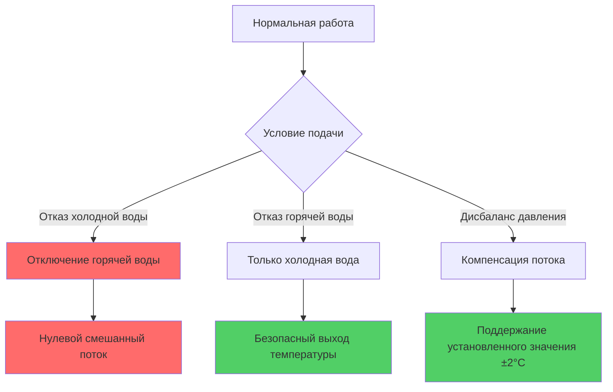
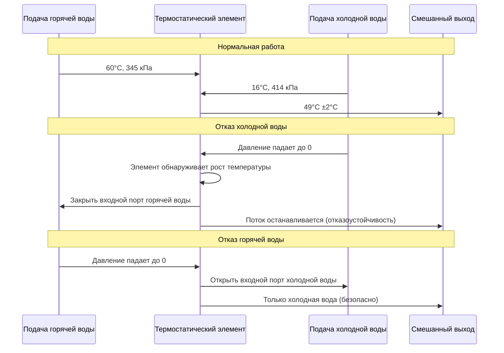

## Обзор стандарта ASSE 1017

ASSE 1017 устанавливает требования производительности для термостатических смесительных клапанов (TMV), предназначенных для обеспечения защиты от ожогов в системах горячего водоснабжения бытового назначения. Эти клапаны автоматически смешивают горячую и холодную воду, обеспечивая безопасную температуру на выходе, обеспечивая критическую защиту от термических ударов и ожоговых травм. Стандарт предусматривает стабильность температуры, отказоустойчивую работу и характеристики отклика в условиях изменяющихся входных параметров.

## Принципы защиты от ожогов

Термостатические смесительные клапаны работают по принципу управления потоком, активируемого температурой. Термостатический элемент реагирует на температуру воды на выходе, модулируя входные отверстия горячей и холодной воды для поддержания заданных условий.

### Уравнение смешивания температур

Основной энергетический баланс для работы смесительного клапана:

$$Q_{mixed} = Q_{hot} + Q_{cold}$$

$$\dot{m}_{mixed} c_p T_{mixed} = \dot{m}_{hot} c_p T_{hot} + \dot{m}_{cold} c_p T_{cold}$$

Упрощение при постоянной удельной теплоемкости:

$$T_{mixed} = \frac{\dot{m}_{hot} T_{hot} + \dot{m}_{cold} T_{cold}}{\dot{m}_{hot} + \dot{m}_{cold}}$$

Коэффициент смешивания для желаемой температуры на выходе:

$$\frac{\dot{m}_{hot}}{\dot{m}_{cold}} = \frac{T_{mixed} - T_{cold}}{T_{hot} - T_{mixed}}$$

### Максимальные безопасные пределы температуры

| Применение | Максимальная температура | Ссылка на код |
|-------------|--------------------------|---------------|
| Общественные раковины | 43°C | IPC 607.3 |
| Душевые и ванны | 49°C | ASSE 1016/1017 |
| Жилые здания, общее | 49–52°C | ASHRAE Guideline 12 |
| Медицинские учреждения | 43°C | FGI Guidelines |
| Школы и детские сады | 41–43°C | Местные коды |

## Требования производительности ASSE 1017

### Критерии стабильности температуры

ASSE 1017 указывает максимальное отклонение температуры при нормальных условиях и условиях отказа:

**Нормальная работа:**
- Температура на выходе должна оставаться в пределах ±2°C от установленного значения
- Время отклика на изменения температуры входного потока: менее 5 секунд
- Максимальное изменение температуры при изменении расхода: ±3°C

**Защита при отказе:**
- Отказ холодной воды: клапан должен перекрыть подачу горячей воды
- Потеря давления горячей воды: клапан должен снизить или остановить поток
- Максимальная температура на выходе при отказе холодной воды: +3°C выше установленного значения перед отключением

### Требования отказоустойчивой работы

Механизм отказоустойчивости работает через:

1. **Расширение термостатического элемента:** Воск или датчик, наполненный жидкостью, расширяется/сжимается в зависимости от температуры
2. **Механическое отключение:** движение элемента прямо закрывает входной порт горячей воды
3. **Возврат пружины:** отказ элемента приводит к позиции холодной воды
4. **Не требует внешнего питания:** Чисто механическая работа обеспечивает надежность

## Требования и протоколы испытаний

### Испытания производительности на заводе

ASSE 1017 предусматривает следующую последовательность испытаний:

| Параметр испытания | Условие | Критерии приемки |
|-------------------|---------|------------------|
| Стабильность температуры | Дифференциал давления подачи 138 кПа | Изменение ±2°C |
| Отказ холодной воды | Холодная подача отключена | Отключение горячей воды в течение 5 секунд, макс. +3°C |
| Отказ горячей воды | Горячая подача отключена | Только холодная вода |
| Колебание давления | Давление входа 69–862 кПа | Изменение ±3°C |
| Изменение расхода | От 25% до 100% номинального потока | Изменение ±3°C |
| Предел высокой температуры | Подача горячей воды 60°C | Выход ≤ установленное значение + допуск |
| Выносливость цикла | 150 000 тепловых циклов | Без снижения производительности |

### Процедуры полевой проверки

Проверка установки должна подтвердить:

1. **Проверка температуры входа:** Горячая подача ≥ 60°C, холодная подача ≤ 27°C
2. **Измерение температуры на выходе:** Цифровой термометр, стабилизация на 60 секунд
3. **Испытание расхода:** Измерение при условиях проектного потока
4. **Испытание отказоустойчивости:** Изолировать подачу холодной воды, убедиться, что происходит отключение
5. **Проверка дифференциала давления:** Требуется минимум 21 кПа для работы

### Отклик термостатического элемента

Характеристика времени отклика следует динамике первого порядка:

$$T(t) = T_{final} + (T_{initial} - T_{final}) e^{-t/\tau}$$

Где:
- $\tau$ = постоянная времени (обычно 2–4 секунды для клапанов ASSE 1017)
- $t$ = прошедшее время
- $T$ = температура на выходе

## Применение и требования к установке

### Основные применения

**Объекты высокого риска:**
- Медицинские учреждения: зоны мытья пациентов, терапевтические бассейны
- Школы и детские сады: станции мытья рук, душевые
- Учреждения для престарелых: все точки использования приборов
- Общественные помещения: инсталляции, соответствующие ADA

**Защита на уровне системы:**
- Основной смесительный клапан для систем распределения по ветвям
- Контроль температуры рециркуляционного контура
- Темперирование резервуара для снижения температуры распределения

### Соображения при установке

**Требования размещения:**
1. Установить как можно ближе к точке использования (минимизировать время отклика)
2. Обеспечить адекватный зазор для обслуживания и замены элемента
3. Предпочтительна вертикальная ориентация для оптимального отклика термостатического элемента
4. Установить после устройств предотвращения обратного потока

**Требования гидравлики:**
- Минимальное давление входа: 104 кПа (обе подачи)
- Максимальный дифференциал давления: 1034 кПа (горячая к холодной)
- Пропускная способность потока: 0,03–1,26 м³/ч в зависимости от размера клапана
- Перепад давления при номинальном потоке: обычно 34–69 кПа

**График обслуживания:**
- Ежегодная проверка верификации температуры
- Замена элемента каждые 5–7 лет (профилактическая)
- Удаление накипи в областях с жесткой водой (по мере необходимости)
- Проверка калибровки после любых изменений температуры подачи

## Соответствие коду и сертификация

Клапаны ASSE 1017 должны быть сертифицированы третьей стороной и иметь постоянную идентификацию. Номера моделей и отметки сертификации должны быть видны после установки. Международный сантехнический код (IPC раздел 607) и Единый сантехнический код (UPC раздел 607) ссылаются на ASSE 1017 для применения с автоматическим ограничением температуры.

Проектировщики должны указывать сертифицированные клапаны ASSE 1017, где код требует автоматического ограничения температуры. Клапан сам по себе не исключает необходимость надлежащего проектирования системы, включая адекватную температуру хранения горячей воды (≥60°C для контроля легионеллы) и надлежащую конфигурацию системы распределения.

## Ключевые параметры проектирования

Эффективный тепловой отклик установки клапана ASSE 1017 зависит от тепловой массы системы:

$$\tau_{system} = \frac{\rho V c_p}{UA + \dot{m} c_p}$$

Где:
- $\rho$ = плотность воды
- $V$ = объем между клапаном и выходом
- $U$ = общий коэффициент теплопередачи
- $A$ = площадь поверхности трубы
- $\dot{m}$ = массовый расход

Минимизируйте объем нисходящих трубопроводов для снижения времени отклика и улучшения отклика защиты от ожогов.
