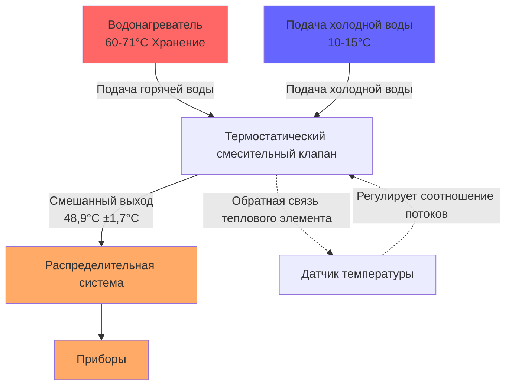
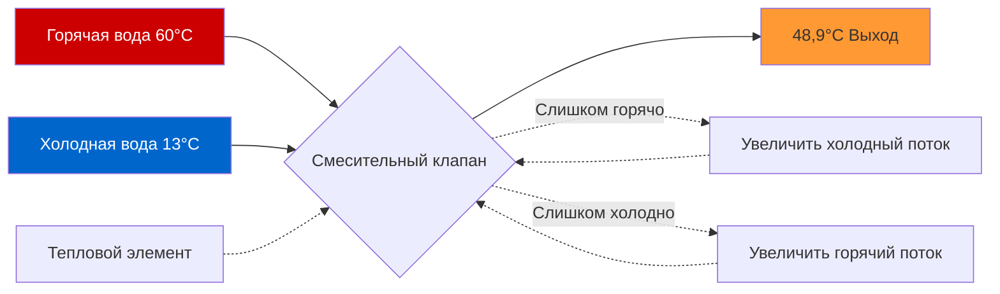

## Максимальная температура подачи 48,9°C

Температура подачи 48,9°C представляет максимально безопасную температуру горячей воды на приборах, балансируя предотвращение ожогов с эффективной очисткой и санитизацией. Термостатические смесительные клапаны (TMV) позволяют системам хранить воду при более высоких температурах для контроля легионеллеза, при этом подавая воду при температурах, соответствующих нормам.

## Физические принципы предотвращения ожогов

Повреждение кожи человека следует экспоненциальным зависимостям от температуры и времени воздействия. Передача тепловой энергии на кожу следует уравнению:

$$Q = hA(T_w - T_s)t$$

Где:
- $Q$ = тепло, передаваемое на кожу (Дж)
- $h$ = коэффициент конвективной теплопередачи (Вт/м²·К)
- $A$ = площадь поверхности кожи (м²)
- $T_w$ = температура воды (°C)
- $T_s$ = температура поверхности кожи (~34°C)
- $t$ = время воздействия (с)

### Зависимость времени до ожога от температуры воды

| Температура воды | Время до серьезного ожога |
|-------------------|---------------------------|
| 48,9°C | 5-10 минут |
| 54,4°C | 30 секунд |
| 60°C | 5 секунд |
| 65,6°C | 1,5 секунды |
| 71,1°C | 0,5 секунды |

При 48,9°C продолжительное время до ожога обеспечивает критический запас безопасности для уязвимых групп населения, включая детей, пожилых людей и лиц с ограниченной подвижностью.

## Требования норм и стандарты

### Стандарт ASSE 1017

Сертифицированные по ASSE 1017 термостатические смесительные клапаны должны:
- Поддерживать температуру на выходе ±1,7°C от установки
- Реагировать на изменения температуры подачи в течение 3 секунд
- Безопасно отключаться при отказе подачи холодной воды
- Включать механизм ограничения температуры с регулировкой

### Требования сантехнических норм

**Международный сантехнический кодекс (IPC) раздел 607.1:**
- Максимум 48,9°C на приборах, используемых для личной гигиены
- Применяется к раковинам, душам, ванным, биде
- Исключение: клинические применения, требующие более высоких температур

**Единый сантехнический кодекс (UPC) раздел 607.2:**
- Максимум 48,9°C на приборах, доступных детям, пожилым, инвалидам
- Требуется точечный или центральный смесительный клапан
- Требуется годовая проверка температуры

## Стратегия температуры хранения и подачи

### Обоснование хранения при высокой температуре

Водонагреватели должны поддерживать температуру хранения минимум 60°C для предотвращения роста Legionella pneumophila:

$$\text{Скорость роста легионеллы} = f(T, t, \text{биопленка}, \text{застой})$$

**Зависимый от температуры ответ легионеллы:**

| Температура хранения | Статус легионеллы |
|----------------------|------------------|
| 20-50°C | Оптимальный диапазон роста |
| 50-60°C | Выживают, но не размножаются |
| 60-66°C | Погибают в течение 32 минут при 60°C |
| 66-70°C | Погибают в течение 2 минут |
| >70°C | Погибают почти мгновенно |

### Установка смесительного клапана

Термостатические смесительные клапаны, установленные сразу ниже по потоку от водонагревателя, обеспечивают:

1. **Контроль легионеллеза** через хранение при высокой температуре
2. **Предотвращение ожогов** через контролируемую температуру подачи
3. **Энергетическую эффективность** за счет возможности снижения температуры резервуара
4. **Соответствие нормам** без температурных ограничителей на приборах

## Работа термостатического смесительного клапана

Смесительный клапан балансирует потоки горячей и холодной воды для поддержания установки:

$$\dot{m}_{\text{mix}}T_{\text{mix}} = \dot{m}_h T_h + \dot{m}_c T_c$$

Где:
- $\dot{m}_{\text{mix}}$ = расход смешанной воды (кг/с)
- $T_{\text{mix}}$ = температура смешанного выхода (°C) = 48,9°C
- $\dot{m}_h$ = расход горячей воды (кг/с)
- $T_h$ = температура подачи горячей воды (°C) = 60°C
- $\dot{m}_c$ = расход холодной воды (кг/с)
- $T_c$ = температура подачи холодной воды (°C) = 10-15°C

## Регулировка установки и калибровка

### Типичный диапазон регулировки

TMV обеспечивают регулируемые установки в ограниченных диапазонах:

| Применение | Диапазон установки | Типичная установка |
|------------|-------------------|------------------|
| Жилые раковины | 40-48,9°C | 43-48,9°C |
| Жилые души | 43-48,9°C | 43-48°C |
| Коммерческие применения | 40-48,9°C | 40-46°C |
| Здравоохранение (не пациенты) | 40-43°C | 40-42°C |

### Процедура калибровки

1. **Проверить температуры подачи:** Горячая ≥60°C, холодная 10-15°C
2. **Отрегулировать винт установки:** По часовой стрелке увеличивает температуру
3. **Дать стабилизироваться:** 30-60 секунд после регулировки
4. **Измерить выход:** Цифровой термометр в потоке
5. **Точная настройка:** Допуск ±1,7°C приемлем
6. **Заблокировать регулировку:** Установка защитного колпачка от несанкционированного доступа
7. **Документировать:** Записать температуры и дату

## Балансировка конкурирующих требований

### Энергетические соображения

Более низкие температуры хранения снижают потери в режиме ожидания:

$$Q_{\text{loss}} = UA(T_{\text{tank}} - T_{\text{ambient}})$$

Однако минимальная температура хранения 60°C является неуклонным требованием для контроля легионеллеза в коммерческих и многоквартирных применениях.

### Компромиссные решения

Для жилых помещений на одну семью, где риск легионеллеза ниже:
- **Вариант 1:** Хранение при 48,9°C с периодической термической дезинфекцией (ежемесячное повышение до 60°C)
- **Вариант 2:** Хранение при 60°C с главным TMV (предпочтительно)
- **Вариант 3:** Точечные TMV на критических приборах

## Лучшие практики установки

1. **Местоположение:** Установить TMV непосредственно ниже по потоку от водонагревателя
2. **Доступ:** Обеспечить доступ для обслуживания для калибровки и обслуживания
3. **Фильтры:** Установить входные фильтры для предотвращения засорения мусором
4. **Балансировка давления:** Обеспечить достаточное давление холодной воды (в пределах 15% горячей)
5. **Контроль расширения:** Учесть термическое расширение в закрытых системах
6. **Маркировка:** Четко обозначить установку и дату калибровки

## Обслуживание и тестирование

### Требования годовой проверки

ASSE 1017 и сантехнические нормы требуют годового тестирования:
- Измерить температуру на выходе при наличии потока
- Проверить ±2,8°C от установки (повторная калибровка, если вне допуска)
- Протестировать функцию безопасного отключения холодной воды
- Проверить утечки, коррозию и накопление отложений
- Документировать результаты в журнал обслуживания объекта

### Устранение неисправностей распространенных проблем

| Симптом | Вероятная причина | Решение |
|---------|------------------|--------|
| Выход слишком горячий | Ограничение холодной подачи | Проверить клапан холодной воды, фильтр |
| Выход слишком холодный | Недостаточная подача горячей воды | Проверить установку нагревателя ≥60°C |
| Колебание температуры | Дисбаланс давления | Установить клапан балансировки давления |
| Отсутствие потока | Засорение мусором | Очистить фильтры, промыть клапан |
| Медленная реакция | Отказ теплового элемента | Заменить в сборе |

## Резюме

Стандарт температуры подачи 48,9°C представляет критический баланс между предотвращением ожогов и функциональностью системы. Термостатические смесительные клапаны позволяют высокотемпературное хранилище (60-71°C) для контроля легионеллеза, при этом обеспечивая соответствующие нормам температуры подачи. Правильная установка, калибровка и годовое тестирование обеспечивают безопасность системы и соответствие требованиям ASSE 1017, IPC и UPC.

**Ключевые выводы:**
- Хранить горячую воду для внутреннего водоснабжения при минимум 60°C для контроля легионеллеза
- Подавать воду при максимум 48,9°C для предотвращения ожогов
- Использовать сертифицированные по ASSE 1017 термостатические смесительные клапаны
- Калибровать до ±1,7°C от установки при установке
- Тестировать ежегодно и документировать результаты
- Обеспечить функциональность безопасного отключения холодной воды
