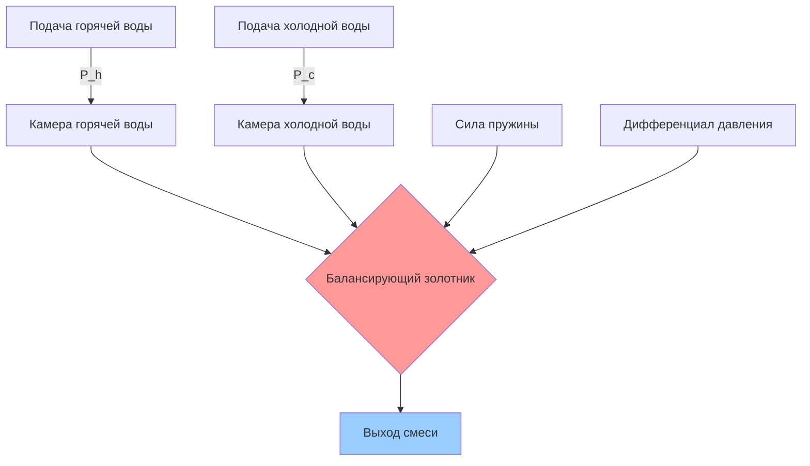
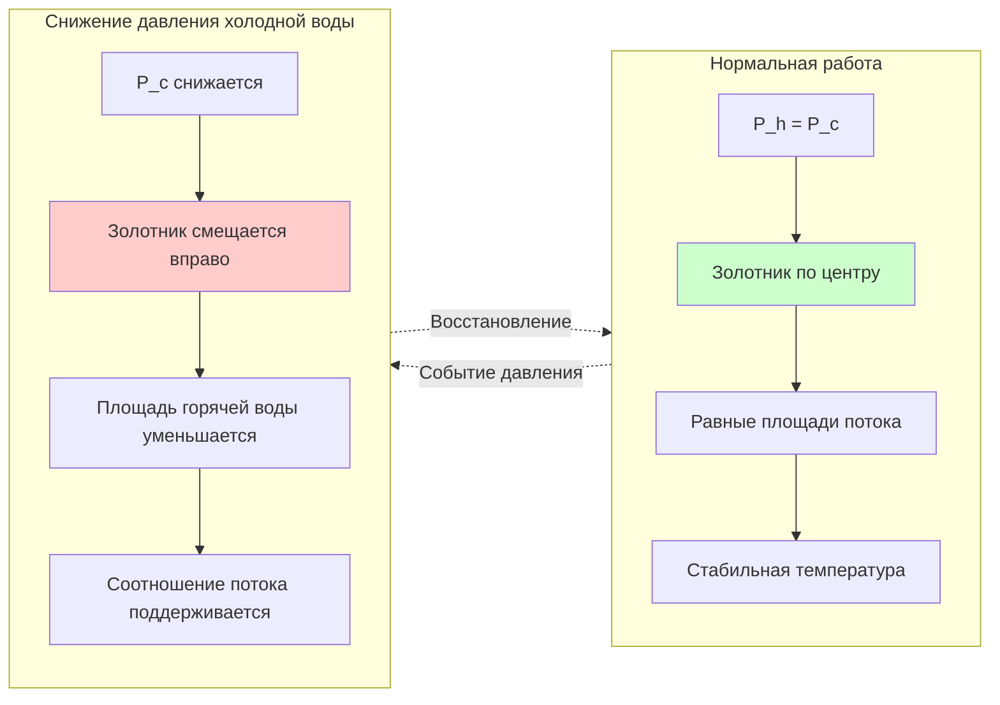

## Механизм уравновешивания давления

Клапаны уравновешивания давления поддерживают стабильность температуры путём компенсации изменений давления подачи, а не прямого измерения температуры. Механический балансирующий элемент реагирует на изменения дифференциального давления между подачей горячей и холодной воды, регулируя отверстия клапана для поддержания пропорционального потока.

Фундаментальный принцип работы основан на равновесии давлений:

$$\Delta P_h - \Delta P_c = 0$$

Где:
- $\Delta P_h$ = Падение давления горячей воды в элементе клапана (кПа)
- $\Delta P_c$ = Падение давления холодной воды в элементе клапана (кПа)

Когда давление холодной воды снижается (спуск унитаза, заполнение стиральной машины), балансирующий золотник смещается для пропорционального снижения потока горячей воды, предотвращая тепловой удар.

## Принципы компенсации потока

Балансирующий золотник позиционируется на основе противодействующих сил пружины и дифференциалов давления:

$$F_{spring} + F_{P_c} = F_{P_h}$$

Результирующее соотношение потоков:

$$\frac{Q_h}{Q_c} = \sqrt{\frac{P_h}{P_c}} \cdot \frac{A_h}{A_c}$$

Где:
- $Q_h$, $Q_c$ = Расходы горячей и холодной воды (м³/ч)
- $P_h$, $P_c$ = Давления подачи горячей и холодной воды (кПа)
- $A_h$, $A_c$ = Эффективные площади отверстий клапана (см²)

Золотник регулирует $A_h$ и $A_c$ для поддержания постоянной температуры несмотря на колебания давления.

## Работа механизма клапана

## Предотвращение теплового удара

Тепловой удар возникает при резких изменениях давления, вызывающих непропорциональный поток горячей/холодной воды:

$$\Delta T_{shock} = T_{supply} - T_{desired}$$

Максимально допустимый тепловой удар согласно ASSE 1016:

$$|\Delta T_{shock}| \leq 2°C$$

Клапан уравновешивания давления предотвращает удар механическим временем отклика:

$$t_{response} < 1.0 \text{ сек}$$

Клапаны уравновешивания давления жертвуют расходом для поддержания температуры. При снижении давления на входе:

$$Q_{outlet} = Q_{min}(P_{lower})$$

Поток снижается пропорционально меньшему давлению подачи, предотвращая ожоги или тепловой удар.

## Характеристики производительности

| Параметр | Уравновешивание давления | Термостатический | Ручное смешивание |
|----------|-------------------------|------------------|-------------------|
| Механизм отклика | Дифференциал давления | Расширение воскового элемента | Регулировка пользователем |
| Защита от ожогов | Отличная | Превосходная | Отсутствует |
| Точность температуры | ±2°C | ±1.1°C | Переменная |
| Снижение расхода | Да (значительное) | Минимальное | Отсутствует |
| Требование давления | 103-552 кПа уравновешено | 138-862 кПа | Любое |
| Отказ холодной воды | Автоматическое отключение | Автоматическое отключение | Риск ожога |
| Отказ горячей воды | Только холодная вода | Только холодная вода | Только холодная вода |
| Стоимость | Низкая | Средняя–высокая | Очень низкая |
| Применение | Душевые, ванны | Все приборы | Некритичные только |

## Критерии выбора клапана

### Требования по давлению

Минимальный дифференциал давления на входе для работы:

$$\Delta P_{min} = 103 \text{ кПа}$$

Максимальное рекомендуемое статическое давление:

$$P_{static,max} = 552 \text{ кПа}$$

Для давлений, превышающих 552 кПа, установите редукторы давления выше по потоку.

### Пропускная способность

Клапаны уравновешивания давления испытывают снижение расхода в несбалансированных условиях:

$$Q_{actual} = C_v \sqrt{\Delta P_{lower}}$$

Где:
- $C_v$ = Коэффициент пропускной способности клапана
- $\Delta P_{lower}$ = Меньшее из давлений подачи горячей или холодной воды

Типичные требования расхода жилого душа:

$$Q_{shower} = 0.126-0.158 \text{ м³/ч (максимум согласно строительным нормам)}$$

### Диапазон температур

Пределы температуры подачи согласно ASSE 1016:

| Подача | Диапазон температур |
|--------|-------------------|
| Горячая вода | 49–71°C |
| Холодная вода | 4–27°C |
| Выход смеси | 32–49°C |

### Пригодность применения

**Оптимальные применения:**
- Жилые душевые и комбинированные ванна/душ
- Гостиницы, общежития, раздевалки
- Учреждения, где допускается снижение расхода
- Модернизация в существующих зданиях
- Проекты с ограниченным бюджетом

**Неподходящие применения:**
- Медицинские раковины (снижение расхода проблематично)
- Коммерческие кухни (предпочтителен термостатический)
- Технологическая вода, требующая точной температуры
- Применения, требующие высокого расхода при всех условиях

## Требования кодов и стандартов

### Стандарт ASSE 1016

Клапаны уравновешивания давления для отдельных душевых и комбинированных ванна/душ должны соответствовать:

- Предел вариации температуры: максимум ±2°C
- Тест вариации давления: изменение давления на входе ±50%
- Отказ холодной воды: автоматическое отключение
- Максимальная температура выхода: на 1.1°C выше установки при отказе
- Испытание на выносливость: минимум 40 000 циклов

### Соответствие сантехническому кодексу

International Plumbing Code (IPC) и Uniform Plumbing Code (UPC) требуют:

**Раздел 424.3 (IPC) / 607.3 (UPC):** Отдельные душевые и комбинированные ванна/душ клапаны должны быть типом уравновешивания давления (ASSE 1016), термостатическим (ASSE 1070) или комбинированным (ASSE 1069/1070).

**Максимальная температура выхода:**

$$T_{max} = 49°C$$

Медицинские учреждения часто требуют:

$$T_{max} = 43°C$$

### Требования к установке

**Уравновешивание давления:**
- Подачи горячей и холодной воды из одной зоны давления
- Равные диаметры и длины труб к клапану (в пределах 10%)
- Установите изолирующие клапаны с встроенными стоп-кранами
- Минимум 15 см зазора позади готовой стены для доступа обслуживания

**Системное дифференциальное давление проектирования:**

$$|\Delta P_h - \Delta P_c| \leq 10\% \text{ номинального давления подачи}$$

Чрезмерный статический дисбаланс вызывает работу клапана в экстремальных положениях, снижая эффективность.

## Выбор между уравновешиванием давления и термостатическим

| Фактор | Выберите уравновешивание давления | Выберите термостатический |
|--------|-----------------------------------|--------------------------|
| Бюджет | Ограниченный | Адекватный для премиума |
| Приоритет расхода | Температура > Расход | Расход + Температура |
| Вариация давления | Умеренная (±207 кПа) | Тяжёлая (±345 кПа) или непостоянная |
| Точность температуры | ±2°C приемлемо | ±1.1°C требуется |
| Установка | Модернизация, простая | Новое строительство |
| Доступ к обслуживанию | Ограниченный | Хороший доступ имеется |
| Пользовательская группа | Широкая публика | Пожилые, дети, инвалиды |

## Заключение

Клапаны уравновешивания давления обеспечивают экономичную защиту от ожогов для душевых и ванных приложений посредством механической компенсации давления. Балансирующий золотник быстро реагирует на изменения давления, поддерживая стабильность температуры в ущерб расходу. Правильный выбор клапана требует анализа динамики давления подачи, требований расхода и потребностей точности температуры, специфичных для приложения. Хотя термостатические клапаны обеспечивают превосходную производительность, клапаны уравновешивания давления соответствуют требованиям кодов для большинства жилых и лёгких коммерческих применений, где существуют бюджетные ограничения и допустимо умеренное снижение расхода.

## Ссылки

- ASSE 1016: Requirements for Performance of Automatic Compensating Valves for Individual Showers and Tub/Shower Combinations
- International Plumbing Code (IPC), Section 424: Shower and Tub Valves
- Uniform Plumbing Code (UPC), Section 607: Temperature and Pressure Relief Devices
- ASHRAE Handbook—HVAC Applications, Chapter 50: Water Heating
