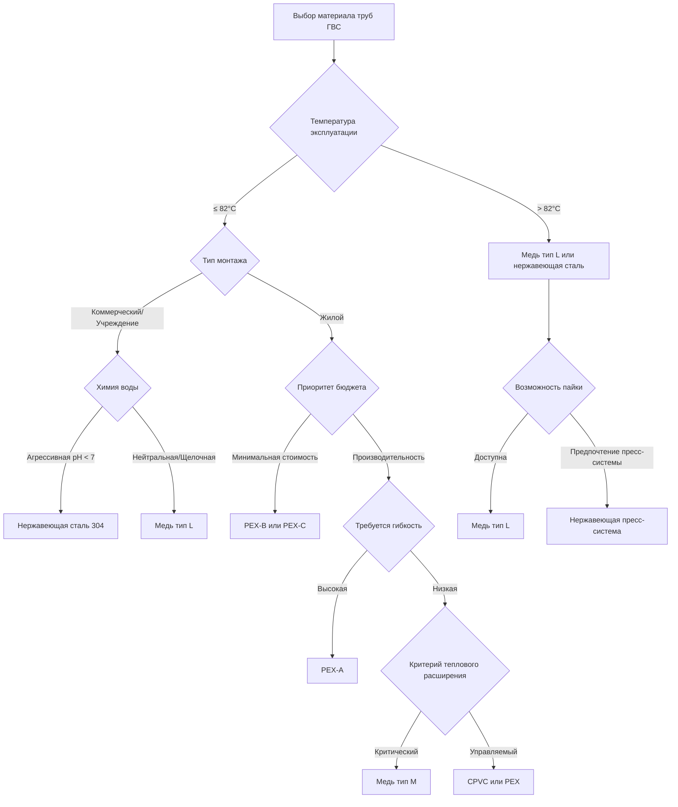

# Материалы труб для систем горячего водоснабжения

Выбор материалов для систем распределения горячего водоснабжения (ГВС) требует анализа температур эксплуатации, рейтингов давления, химической совместимости, сложности монтажа и долгосрочной надежности. Международный сантехнический кодекс (IPC) и Единый сантехнический кодекс (UPC) устанавливают минимальные требования к материалам для систем питьевого водоснабжения, а стандарт ASHRAE 90.1 рассматривает вопросы теплового характеристик.

## Критерии выбора материалов

Системы ГВС работают при температурах от 49°C до 60°C в точках распределения, при этом температура хранения достигает 71°C для контроля легионеллы. Материалы труб должны сохранять конструктивную целостность при этих тепловых и барических условиях, одновременно сопротивляясь коррозии и образованию отложений.

### Учет теплового расширения

Линейное тепловое расширение в трубопроводных системах описывается формулой:

$$\Delta L = L_0 \cdot \alpha \cdot \Delta T$$

где $\Delta L$ — изменение длины (м), $L_0$ — первоначальная длина (м), $\alpha$ — коэффициент линейного расширения (м/м·°C), а $\Delta T$ — изменение температуры (°C).

Для участка медной трубы длиной 30,5 м с повышением температуры на 39°C:

$$\Delta L = 30,5 \text{ м} \times 1,67 \times 10^{-5} \text{ м/м·°C} \times 39°C = 0,020 \text{ м}$$

PEX имеет значительно более высокие коэффициенты расширения (примерно 1,7 × 10⁻⁴ м/м·°C), требующие петель расширения или смещений на длинных участках.

### Зависимость давления от температуры

Максимальное допустимое рабочее давление снижается с повышением температуры. Для медной трубы типа L при 82°C номинальное давление составляет примерно:

$$P_T = P_{ref} \times \frac{S_T}{S_{ref}}$$

где $P_T$ — давление при повышенной температуре, $P_{ref}$ — номинальное давление при нормальных условиях, а $S$ — допустимые величины напряжений.

## Сравнение материалов

| Материал | Макс. темп. (°C) | Рейтинг давления | Коэф. расширения (×10⁻⁶ м/м·°C) | Устойчивость к коррозии | Коэф. стоимости |
|----------|------------------|-----------------|-----------------------------------|---------------------|-------------|
| Медь тип L | 121 | 1034 кПа @ 82°C | 16,7 | Отличная (pH > 7) | 1,0× |
| Медь тип M | 121 | 862 кПа @ 82°C | 16,7 | Отличная (pH > 7) | 0,8× |
| CPVC SCH 40 | 82 | 690 кПа @ 82°C | 59,4 | Отличная | 0,5× |
| PEX-A | 93 | 1103 кПа @ 82°C | 170 | Отличная | 0,4× |
| PEX-B | 93 | 1103 кПа @ 82°C | 170 | Отличная | 0,3× |
| PEX-C | 93 | 1103 кПа @ 82°C | 170 | Отличная | 0,3× |
| Нержавеющая сталь 304 | 204+ | 2068+ кПа @ 82°C | 16,3 | Превосходная | 3,5× |

## Медные трубы

Медь остается доминирующим материалом для коммерческих систем ГВС. Тип L обеспечивает более толстую стенку, подходящую для давлений, превышающих 1034 кПа, тогда как тип M обеспечивает адекватные характеристики для большинства жилых приложений. Медь демонстрирует превосходную теплопроводность (0,385 кДж/с·м·°C), хотя это увеличивает потери тепла в неизолированных участках.

IPC раздел 605.3 и UPC раздел 604.1 разрешают использование меди для питьевой воды при температурах до 121°C. Паяные соединения с использованием сплава BCuP (медь-фосфор) обеспечивают герметичные соединения с номинальным давлением во всей системе.

Химия воды влияет на долговечность меди. Агрессивная вода (pH < 7,0, низкая щелочность) ускоряет коррозию. Стандарт ASHRAE 188 рекомендует обработку воды для систем, в которых наблюдаются голубовато-зеленые пятна или точечная коррозия.

## Системы CPVC

Хлорированный поливинилхлорид (CPVC) предлагает более низкие материальные и монтажные расходы. ASTM F441 CPVC SCH 40 сохраняет конструктивную целостность до 82°C с рейтингом давления, снижающимся с 2758 кПа при 23°C до 690 кПа при 82°C.

Растворная сварка создает однородные соединения, которые затвердевают в течение 24 часов. CPVC имеет низкую теплопроводность (0,0014 кДж/с·м·°C), снижая потери тепла примерно на 72% по сравнению с открытой медью. Высокий коэффициент расширения требует надлежащего расстояния между опорами (максимум 0,9 м) и компенсации расширения каждые 9 м.

## Трубки PEX

Сшитый полиэтилен (PEX) доминирует в распределении жилого ГВС благодаря гибкости, устойчивости к замерзанию и снижению трудозатрат при монтаже. Три метода производства обеспечивают различные характеристики:

- **PEX-A (метод пероксида)**: Максимальная гибкость, лучшая термическая память для восстановления после перегиба
- **PEX-B (метод силана)**: Умеренная гибкость, наиболее распространен в Северной Америке
- **PEX-C (метод радиации)**: Наименьшая стоимость, сниженная гибкость

ASTM F876 и F877 устанавливают требования к производительности. PEX работает непрерывно при 82°C с рейтингом 93°C для кратковременного воздействия. PEX с кислородным барьером (ASTM F876) предотвращает диффузию в гидравлические системы.

Методы соединения включают опрессовочные кольца (ASTM F1807), муфты расширения (ASTM F1960) и пресс-фитинги. Муфты расширения обеспечивают полный проход потока, но требуют специализированные инструменты.

## Нержавеющая сталь

Нержавеющая сталь типа 304 обеспечивает исключительную устойчивость к коррозии в условиях агрессивной воды. Системы с пресс-фитингами с использованием уплотнительных колец из EPDM упрощают монтаж при сохранении рейтинга давления выше 2068 кПа при повышенных температурах.

Нержавеющая сталь сопротивляется хлору, хлораминам и условиям с низким pH, которые повреждают другие материалы. Применение включает учреждения с вторичной дезинфекцией хлором и прибрежные установки с высоким содержанием хлорида.

## Дерево решений выбора материала

## Соответствие нормативам и монтаж

IPC таблица 605.3 и UPC таблица 6-1 содержат списки одобренных материалов с максимальными пределами температуры и давления. Все трубы должны соответствовать стандарту NSF/ANSI 61 для контакта с питьевой водой.

Расстояние между опорами в соответствии со спецификациями материалов:

- Медь: 1,8 м горизонтально, 3 м вертикально
- CPVC: 0,9 м горизонтально, 1,5 м вертикально
- PEX: 0,81 м горизонтально, 3 м вертикально (с непрерывным основанием)

Требования к изоляции согласно ASHRAE 90.1 раздел 6.4.4.1.1 предусматривают минимум RSI 0,53 для труб ≤ 38 мм и RSI 0,70 для больших диаметров в кондиционируемых помещениях.

## Заключение

Выбор материалов уравновешивает первоначальные затраты, сложность монтажа, тепловые характеристики и срок службы. Медь обеспечивает доказанную надежность в коммерческих приложениях, в то время как PEX доминирует в жилом строительстве. CPVC обеспечивает промежуточные характеристики, а нержавеющая сталь решает проблемы агрессивной химии воды. Надлежащее управление тепловым расширением и монтаж в соответствии с нормативами обеспечивают долгосрочную целостность системы.
