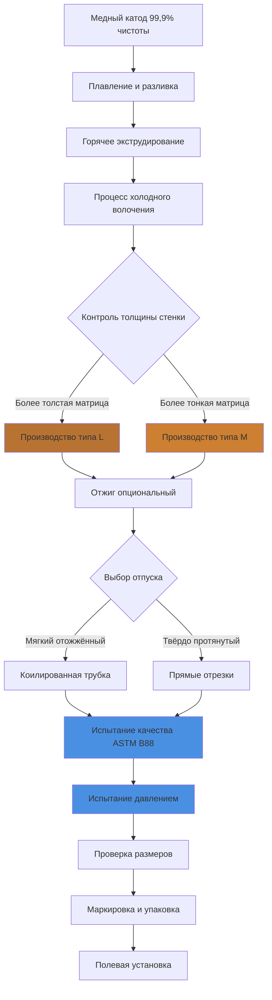

# Медь тип L и тип M для систем горячего водоснабжения

Медные трубки тип L и тип M представляют две наиболее распространённые классификации медных труб для систем распределения горячего водоснабжения (ГВС) в Северной Америке. Обе соответствуют спецификациям ASTM B88 для бесшовных медных водопроводных трубок, но значительно отличаются по толщине стенок, номинальному давлению и пригодности к применению. Понимание этих различий критически важно для надлежащего проектирования системы, соответствия нормам и надёжности в долгосрочной перспективе.

## Классификации ASTM B88 и толщина стенок

ASTM B88 определяет медные трубки по номинальному размеру и типу толщины стенки. Ключевое различие между типом L и типом M заключается в толщине стенки, что прямо влияет на способность к давлению и механическую прочность.

**Соотношение толщины стенок:**

$$t_L = t_M \times 1,5$$

где $t_L$ – толщина стенки типа L и $t_M$ – толщина стенки типа M (приблизительное соотношение для общепринятых размеров).

Для номинальной медной трубы диаметром 25 мм:
- **Тип L:** толщина стенки = 1,27 мм
- **Тип M:** толщина стенки = 0,89 мм

Это увеличение толщины стенки на 43% обеспечивает типу L существенно более высокую способность к давлению и механическую долговечность.

## Расчёты номинального давления

Максимальное рабочее давление для медных трубок зависит от толщины стенки, диаметра, предела текучести материала и рабочей температуры. Используя формулу Барлоу для тонкостенных сосудов давления:

$$P_{max} = \frac{2 \times S \times t \times E}{D_o}$$

где:
- $P_{max}$ = максимально допустимое давление (кПа)
- $S$ = допустимое напряжение для меди (обычно 48 МПа для сервиса ГВС)
- $t$ = толщина стенки (мм)
- $E$ = коэффициент эффективности соединения (0,9–1,0 для паяных соединений)
- $D_o$ = наружный диаметр (мм)

**Пример расчёта для медной трубы диаметром 25 мм при 60°C:**

Тип L: $P_{max} = \frac{2 \times 48 \times 1,27 \times 0,95}{28,6} = 4 059$ кПа

Тип M: $P_{max} = \frac{2 \times 48 \times 0,89 \times 0,95}{28,6} = 2 841$ кПа

Эти расчёты демонстрируют на 43% более высокую способность типа L к давлению, что делает его пригодным для приложений с скачками давления или более высокими рабочими давлениями.

## Сравнение типа L и типа M

| Параметр | Тип L | Тип M | Примечания |
|----------|-------|-------|-----------|
| **Толщина стенки (номинал 25 мм)** | 1,27 мм | 0,89 мм | Тип L на 43% толще |
| **Номинальное давление (60°C)** | 4 059 кПа | 2 841 кПа | На основе ASTM B88 |
| **Масса (номинал 25 мм, на 1 м)** | 0,297 кг | 0,210 кг | Тип L на 41% тяжелее |
| **Типичные применения** | Подземные, коммерческие, высотные | Жилые, наземные | Зависит от норм |
| **Соответствие IPC/UPC** | Все приложения ГВС | Наземные жилые | Проверьте местные нормы |
| **Относительная стоимость** | На 30–40% выше | Базовая | Разница в стоимости материала |
| **Допуск на коррозию** | Больший | Меньший | Лучше для агрессивной воды |
| **Устойчивость к механическим повреждениям** | Превосходная | Адекватная | Рассмотрение при установке |

## Требования норм и рекомендации по применению

**Международный сантехнический кодекс (IPC) и унифицированный сантехнический кодекс (UPC):**
- **Тип L:** Одобрен для всех приложений ГВС, включая подземную установку
- **Тип M:** Одобрен для наземных жилых ГВС при разрешении местными нормами
- **Подземное обслуживание:** Тип L требуется большинством юрисдикций из-за нагрузок грунта и потенциального повреждения

**Пределы давления и температуры:**
- Максимальная температура ГВС: 82°C (по ASSE 1016/ASME A112.1016)
- Типичная жилая ГВС: 49–60°C
- Давление системы: обычно 276–552 кПа статического давления, с допуском скачка до 1 034 кПа

Много юрисдикций требуют тип L для:
- Коммерческих и учреждений зданий
- Подземных трубопроводов (линии подачи от улицы к конструкции)
- Высотных зданий (>3 этажей)
- Систем с рабочим давлением >552 кПа

## Методы присоединения: пайка и припой твёрдый

### Пайка (наиболее распространена)

**Типы припоя:**
- **Припой без свинца** (требуется для питьевой воды согласно закону о безопасности питьевой воды)
- Припой оловянный 95/5 с сурьмой или серебряный припой
- Температура плавления: 221–232°C

**Процесс пайки:**
1. Очистите трубу и фитинг наждачной тканью или щёткой
2. Нанесите флюс на обе поверхности
3. Соберите соединение
4. Нагревайте равномерно, пока флюс не начнёт пузыриться, затем добавьте припой
5. Дайте остыть естественным образом (без охлаждения водой)

**Прочность соединения:** Правильно спаянные соединения достигают прочности на растяжение 20,7–27,6 МПа, превышая давление разрыва трубы.

### Припой твёрдый

**Применение припоя твёрдого:**
- Приложения при более высокой температуре (>121°C)
- Соединения системы пожаротушения
- Системы медицинских газов

**Припои твёрдые:**
- BCuP (медь-фосфор): диапазон плавления 704–816°C
- BAg (припой с серебром): диапазон плавления 649–760°C

Припой твёрдый создаёт более прочные соединения (>138 МПа), но требует более высокого уровня квалификации и контролируемой атмосферы для предотвращения окисления.

## Процесс производства и калибровка

## Устойчивость к коррозии и химия воды

Медь проявляет отличную устойчивость к коррозии в большинстве сред питьевой воды благодаря образованию защитных оксидных слоёв. Однако определённые условия химии воды требуют рассмотрения:

**Коррозионные условия:**
- pH <6,5 (кислая вода)
- Растворённый кислород >5 мг/л в сочетании с высокой температурой
- Высокое содержание хлорида (>250 мг/л)
- Высокая скорость потока (>2,4 м/с вызывающая эрозионно-коррозийное воздействие)

**Преимущество типа L:** Увеличенная толщина стенки обеспечивает больший допуск на коррозию, продлевая срок службы в маргинально агрессивной воде на 30–50% по сравнению с типом M.

**Защита от разцинкования:** Современные медные сплавы соответствуют требованиям ASTM B88 по устойчивости к разцинкованию, критической для сервиса горячей воды выше 60°C.

## Матрица решения по выбору материала

**Указывайте тип L когда:**
- Требуется подземная установка
- Коммерческое или учреждение здание
- Давление системы >552 кПа
- Химия воды показывает pH <7,0 или хлориды >150 мг/л
- Местная норма требует (проверьте юрисдикцию)
- Надёжность в долгосрочной перспективе приоритизирована над первоначальной стоимостью

**Тип M приемлем когда:**
- Наземное жилое приложение
- Местная норма разрешает для предполагаемого использования
- Давление системы <552 кПа с минимальными скачками
- Защищённая среда установки
- Оптимизация стоимости критична

## Лучшие практики установки

1. **Расстояние опор:** Максимум 1,8 м горизонтально, 3 м вертикально (по таблице IPC 305.5)
2. **Компенсация теплового расширения:** Рассчитайте тепловое расширение: $\Delta L = \alpha \times L \times \Delta T$ где $\alpha = 1,76 \times 10^{-5}$ м/м·°C для меди
3. **Изоляция:** Установите диэлектрические муфты там, где медь подсоединяется к диссimilярным металлам (предотвращает гальваническую коррозию)
4. **Испытание давлением:** Испытание при 1,5-кратном рабочему давлению в течение минимум 15 минут перед скрытием
5. **Теплоизоляция:** Минимум RSI 0,53 для трубопроводов ГВС согласно энергетическим нормам (IECC, Title 24)

## Заключение

Медные трубки тип L и тип M обе обеспечивают надёжное распределение ГВС при надлежащем применении. Тип L предлагает превосходную способность к давлению, механическую прочность и допуск на коррозию, обосновывая его использование в требовательных приложениях и подземных установках. Тип M обеспечивает экономичную производительность для защищённых жилых наземных систем, где нормы это разрешают. Надлежащий выбор материала требует анализа давления системы, среды установки, химии воды, требований норм и рассмотрения стоимости жизненного цикла.
