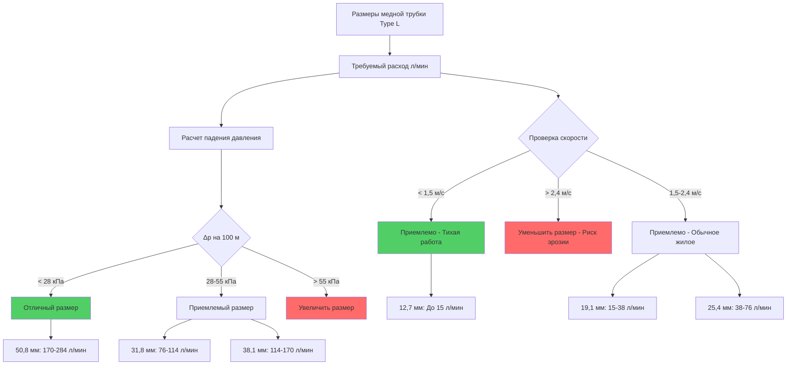

## Обзор

Медная трубка Type L представляет собой стандарт средней толщины стенки для систем распределения горячего водоснабжения (ГВС), обеспечивая превосходную способность выдерживать давление и долговечность по сравнению с медной трубкой Type M. Изготовленная в соответствии со спецификациями ASTM B88, медная трубка Type L является предпочтительным выбором для подземных установок, приложений с более высоким давлением и сред, требующих повышенной коррозионной стойкости.

Основной отличительной характеристикой медной трубки Type L является толщина её стенки, которая варьируется от 1,14 мм для номинального диаметра 12,7 мм до 1,78 мм для больших размеров. Эта увеличенная толщина материала обеспечивает:

- Повышенную способность выдерживать давление
- Превосходную механическую прочность при подземной прокладке
- Улучшенную устойчивость к гидравлическим ударам и переходным процессам давления
- Увеличенный срок службы в агрессивных условиях воды
- Лучшую защиту от физических повреждений при установке

## Толщина стенки и номинальные давления

Толщина стенки медной трубки Type L определяется ASTM B88 и варьируется в зависимости от номинального размера трубки. Связь между номинальным внутренним давлением и толщиной стенки следует формуле Барлоу:

$$P = \frac{2 \cdot S \cdot t}{D}$$

Где:
- $P$ = допустимое внутреннее давление (кПа)
- $S$ = допустимое напряжение для меди (типично 41 МПа для отожженной, 69 МПа для протянутого состояния)
- $t$ = толщина стенки (мм)
- $D$ = наружный диаметр (мм)

Для медной трубки Type L типичные рабочие номинальные давления при комнатной температуре составляют:

| Номинальный размер | Толщина стенки | Наружный диаметр | Рабочее давление (кПа) |
|-------------------|----------------|------------------|------------------------|
| 12,7 мм | 1,02 мм | 15,9 мм | 1930 |
| 19,1 мм | 1,14 мм | 22,2 мм | 1930 |
| 25,4 мм | 1,27 мм | 28,6 мм | 1930 |
| 31,8 мм | 1,40 мм | 34,9 мм | 1720 |
| 38,1 мм | 1,52 мм | 41,3 мм | 1655 |
| 50,8 мм | 1,78 мм | 54,0 мм | 1720 |

При повышенных температурах ГВС (60°C) номинальные давления снижаются примерно на 20% из-за термической деградации прочности материала.

## Type L vs Type M приложения

Выбор между медной трубкой Type L и Type M зависит от условий установки, требований местных норм и параметров работы системы:

| Фактор применения | Медная трубка Type L | Медная трубка Type M |
|-------------------|----------------------|----------------------|
| Подземная установка | **Требуется** в большинстве норм | Запрещена в большинстве юрисдикций |
| Мягкая вода | Рекомендуется | Приемлемо для надземной |
| Жесткая вода (>150 мг/л CaCO₃) | Рекомендуется | Приемлемо |
| Давление > 550 кПа | **Предпочтительно** | Приемлемо при одобрении |
| Подверженность физическому повреждению | **Требуется** | Не рекомендуется |
| Дифференциал стоимости | +15-25% vs Type M | Базовая |
| Толщина стенки | 1,14-1,78 мм | 0,64-0,81 мм |
| Ожидаемый срок службы | 50+ лет | 30-40 лет |

## Приложения подземного водоснабжения

Медная трубка Type L является стандартной спецификацией для подземного водоснабжения по нескольким критическим причинам:

**Условия грунта**: Подземная трубка подвергается нагрузкам от грунта, возможным оседаниям и силам уплотнения засыпки. Более толстая стенка Type L обеспечивает необходимое сопротивление раздавливанию и деформации.

**Коррозионная среда**: Химический состав грунта значительно варьируется. Дополнительный материал Type L обеспечивает допуск на коррозию, гарантируя адекватную остаточную толщину стенки даже после локализованной коррозии.

**Требования норм**: Международный код сантехники (IPC) раздел 605.4 и Единый сантехнический код (UPC) раздел 604.1 обычно требуют Type L для подземных установок. Type M явно запрещена под землей в большинстве юрисдикций.

**Защита при установке**: Медная трубка Type L должна быть установлена с:
- Минимальной глубиной захоронения 0,3 м ниже линии промерзания
- Песчаной подушкой и засыпкой (без острых камней и мусора)
- Непрерывной опорой (без точечных нагрузок или перекрытий)
- Надлежащей идентификационной лентой, расположенной 15-30 см выше трубки

## Методы соединения

Медная трубка Type L для систем ГВС использует несколько одобренных методов соединения:

**Паяные соединения** (ASTM B828):
- Припой оловянно-сурьмяной 95-5 для питьевой воды (без свинца)
- Температура соединения: 177-232°C
- Остаток флюса должен быть растворимым в воде и некоррозионным
- Обеспечивает прочность на растяжение: 17-21 МПа

**Твердопаяные соединения** (AWS A5.8):
- Фосфорно-медные сплавы серии BCuP (обычно BCuP-3 или BCuP-5)
- Температура соединения: 704-816°C
- Флюс не требуется для медь-медь соединений
- Обеспечивает прочность на растяжение: 172-276 МПа
- Требуется для медицинских газов и критических систем

**Механические соединения**:
- Системы пресс-фитингов (Viega ProPress, Ridgid MegaPress)
- Компрессионные фитинги для меньших диаметров (≤50,8 мм)
- Канавные механические муфты для больших размеров

## Таблица размеров Type L

Следующая диаграмма иллюстрирует взаимосвязь между размерами медной трубки Type L, скоростью потока и соображениями падения давления:

## Свойства материала и коррозионная стойкость

Медная трубка Type L демонстрирует отличную коррозионную стойкость в большинстве условий питьевой воды. Состав материала в соответствии с ASTM B88 требует:

- Содержание меди: минимум 99,9%
- Фосфор: 0,015-0,040% (дезоксидированный сорт)
- Теплопроводность: 388 Вт/(м·K) при 20°C
- Коэффициент теплового расширения: $9,8 \times 10^{-6}$ на °C

Содержание фосфора обеспечивает дезоксидацию, предотвращая водородное охрупчивание и улучшая устойчивость к кислородной коррозии при использовании в воде.

**Рассмотрения химии воды**:

Скорость коррозии зависит от характеристик воды:

$$\text{Скорость коррозии} \propto \frac{[\text{Растворённый кислород}] \cdot [\text{Хлориды}]}{\text{pH} \cdot [\text{Щёлочность}]}$$

Медная трубка Type L хорошо работает при:
- Диапазон pH: 6,5-8,5
- Общее растворённое твёрдое вещество: <500 мг/л
- Содержание хлоридов: <250 мг/л
- Содержание сульфатов: <250 мг/л

Вода за пределами этих параметров может требовать обработки воды или альтернативных материалов трубопровода.

## Установка и срок службы

Надлежащие методы установки максимизируют срок службы медной трубки Type L:

1. **Хранение и обращение**: Защитите концы трубки пластиковыми колпачками. Храните на стеллажах над землёй. Избегайте загрязнения.

2. **Резка**: Используйте трубные резаки (не ножовки). Полностью удалите все заусенцы.

3. **Очистка**: Очистите и нанесите флюс в течение 4 часов после резки. Используйте надлежащий флюс для типа припоя.

4. **Расстояние между опорами**:
   - Горизонтальные участки: 1,8 м для 25,4 мм и меньше, 2,4 м для 31,8 мм и больше
   - Вертикальные участки: максимальное расстояние 3 м

5. **Допуск на расширение**: Обеспечьте расширение при $9,8 \times 10^{-6}$ мм/мм/°C. Участок в 30 м испытывает расширение 35 мм при изменении от 4°C до 82°C.

Ожидаемый срок службы надлежащо установленной медной трубки Type L в приложениях ГВС превышает 50 лет в нормальных условиях воды, многие установки надёжно работают 75+ лет.

## Соответствие нормам

Установки медной трубки Type L должны соответствовать:

- **ASTM B88**: Стандартная спецификация для бесшовной медной водопроводной трубки
- **IPC раздел 605**: Материалы для распределения воды
- **UPC раздел 604**: Материалы и соединения для водопровода
- **NSF/ANSI 61**: Компоненты систем питьевой воды
- **Местные поправки**: Всегда проверяйте требования местных норм

Медная трубка Type L универсально принимается всеми моделями сантехнических норм как для надземного, так и для подземного питьевого водоснабжения.
