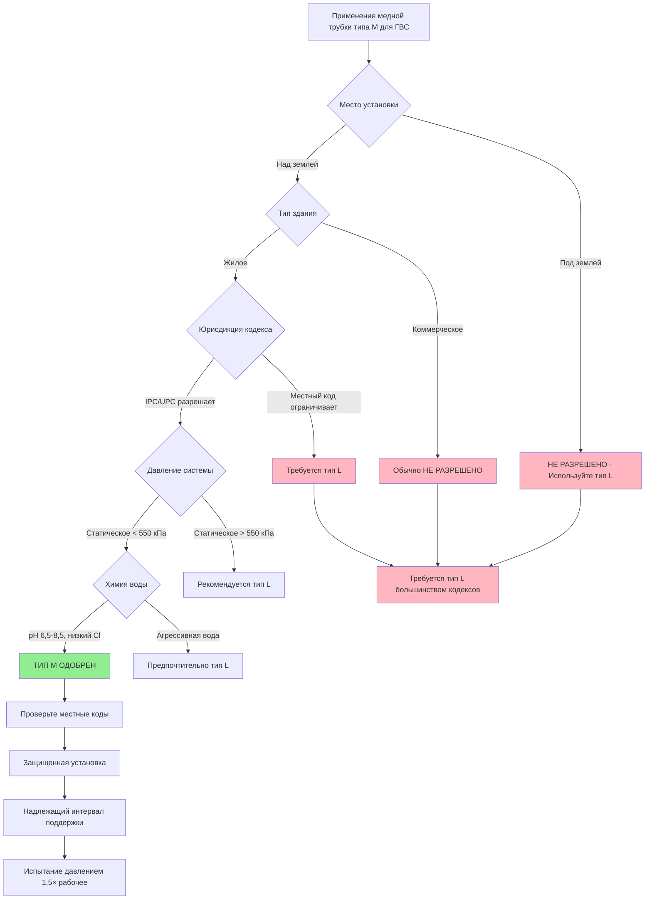

# Медная труба типа M для систем горячего водоснабжения

Медная трубка типа M представляет самую легкую классификацию жестких медных труб, одобренных для питьевого водоснабжения в соответствии с ASTM B88. При толщине стенки примерно на 30% тоньше, чем у типа L, тип M предлагает значительную экономию затрат на материал для жилых и легких коммерческих приложений горячего водоснабжения (ГВС), где условия установки это позволяют. Однако эта уменьшенная толщина стенки налагает конкретные ограничения на грузоподъемность, механическую прочность и одобренные кодексом приложения, которые требуют тщательного рассмотрения при проектировании системы.

## Спецификации медной трубки ASTM B88 типа M

ASTM B88 определяет медь типа M как бесшовную медную трубку для водоснабжения с минимальными значениями толщины стенки, которые варьируются в зависимости от номинального размера трубы. Обозначение "M" исторически означало "средняя" толщина стенки, когда более тяжелый тип K был более распространен, хотя тип M теперь является самым тонким обычно используемым классификацией для службы ГВС.

**Толщина стенки по номинальному размеру:**

| Номинальный размер | Наружный диаметр | Толщина стенки типа M | Внутренний диаметр |
|-------------------|------------------|----------------------|-------------------|
| 12,7 мм | 15,88 мм | 0,71 мм | 14,45 мм |
| 19,05 мм | 22,23 мм | 0,81 мм | 20,60 мм |
| 25,4 мм | 28,58 мм | 0,89 мм | 26,80 мм |
| 31,75 мм | 34,93 мм | 1,07 мм | 32,79 мм |
| 38,1 мм | 41,28 мм | 1,24 мм | 38,81 мм |
| 50,8 мм | 53,98 мм | 1,47 мм | 51,03 мм |

**Формула толщины стенки:**

Минимальная толщина стенки медной трубки типа M соответствует связи ASTM B88:

$$t_M = 0,635 \times D_o + 0,305$$

где:
- $t_M$ = минимальная толщина стенки типа M (мм)
- $D_o$ = наружный диаметр (мм)

Эта формула применяется к размерам от 6,35 мм до 305 мм номиналу.

## Расчеты номинального давления

Уменьшенная толщина стенки медной трубки типа M прямо ограничивает максимальное допустимое рабочее давление. Используя формулу Барлоу для тонкостенных цилиндров:

$$P_{max} = \frac{2 \times S \times t \times E \times SF}{D_o}$$

где:
- $P_{max}$ = максимальное рабочее давление (кПа)
- $S$ = допустимое напряжение (48,3 МПа для меди при температурах ГВС)
- $t$ = толщина стенки (мм)
- $E$ = эффективность соединения (0,95 для надлежащим образом паяных швов)
- $SF$ = коэффициент безопасности (обычно 0,5 для рабочего давления в зависимости от разрыва)
- $D_o$ = наружный диаметр (мм)

**Пример: 25,4 мм типа M при 60°C обслуживание ГВС:**

$$P_{max} = \frac{2 \times 48,3 \times 0,89 \times 0,95 \times 0,5}{28,58} = 1420 \text{ кПа (рабочее давление)}$$

**Номиналы давления при рабочей температуре:**

| Температура | Допустимое напряжение | Рабочее давление 25,4 мм типа M | Запас безопасности при 550 кПа |
|-------------|----------------------|--------------------------------|------------------------------|
| 37,8°C | 51,7 МПа | 1520 кПа | 2,8× |
| 60°C | 48,3 МПа | 1420 кПа | 2,6× |
| 82,2°C | 41,4 МПа | 1221 кПа | 2,2× |
| 93,3°C | 37,9 МПа | 1117 кПа | 2,0× |

Переклассификация давления при повышенной температуре имеет решающее значение для приложений ГВС. При 82,2°C (близкой к максимальной температуре ГВС), тип M обеспечивает только 2,2-кратный коэффициент безопасности по сравнению с типичным типичным жилым давлением воды 550 кПа.

## Области применения типа M и ограничения

## Соответствие кодексу и ограничения

**Международный сантехнический кодекс (IPC) - Требования типа M:**
- Разрешено для надземных трубопроводов питьевого водоснабжения в зданиях высотой до трех этажей
- НЕ разрешено для подземных трубопроводов водоснабжения здания
- Может быть ограничено в коммерческих или учреждениях (проверьте местные поправки)
- Должна соответствовать минимальным требованиям рабочего давления для проектирования системы

**Единообразный сантехнический кодекс (UPC) - Требования типа M:**
- Одобрено для надземной установки, когда давление воды не превышает 1034 кПа
- НЕ одобрено для подземного водоснабжения или распределения
- Отдельные юрисдикции часто принимают более строгие требования

**Вариации местного кодекса:**
Многие юрисдикции налагают дополнительные ограничения помимо типовых кодексов:
- Калифорния: Многие муниципалитеты требуют тип L для всех приложений
- Нью-Йорк: Требуется тип L для всех систем питьевого водоснабжения
- Чикаго: Тип L обязателен для многоквартирных и коммерческих
- Флорида: Тип M разрешен только для одноквартирных жилых помещений

**Всегда проверяйте поправки к местному сантехническому кодексу перед указанием медной трубки типа M.**

## Сравнение ограничений типа M

| Фактор ограничения | Ограничение типа M | Преимущество типа L | Влияние на применение |
|-------------------|-------------------|-------------------|---------------------|
| **Подземное использование** | Запрещено кодексом | Одобрено всеми юрисдикциями | Тип M не может использоваться для служебных линий или подземного распределения |
| **Грузоподъемность (25,4 мм)** | 1420 кПа при 60°C | 2028 кПа при 60°C | Тип M непригоден для высокого давления системах или скачках давления |
| **Механическое повреждение** | Тонкая стенка уязвима | На 43% больше материала | Тип M требует защищенной установки, более подвержен повреждениям на месте работы |
| **Запас коррозии** | Максимум 0,89 мм | 1,27 мм доступно | Жизнь типа M сокращена на 30-50% при агрессивной химии воды |
| **Повреждение от замерзания** | Разрыв более вероятен | Большая прочность | Тип M более уязвим в некондиционных помещениях |
| **Коммерческие здания** | Часто запрещено | Соответствие кодексу | Тип M ограничивается жилыми и легкими коммерческими разрешениями |
| **Многоэтажные (>3 этажа)** | Не разрешено | Одобрено | Тип M непригоден для зданий, превышающих пределы кодекса высоты |
| **Сейсмические зоны** | Более низкая устойчивость к повреждениям | Лучшие характеристики | Тип M требует дополнительной поддержки и раскосов в сейсмических регионах |

## Анализ затрат и выгод

**Экономия затрат на материал:**

Медная трубка типа M обеспечивает снижение стоимости материала на 25-35% по сравнению с типом L из-за уменьшенного содержания меди:

$$C_M = C_{Cu} \times \pi \times (D_o - t_M) \times t_M \times \rho_{Cu}$$

где:
- $C_M$ = стоимость материала типа M на погонный метр
- $C_{Cu}$ = цена меди (руб./кг)
- $\rho_{Cu}$ = плотность меди (0,00895 кг/см³)

**Пример расчета затрат (25,4 мм номинал):**
- Вес типа M: 0,211 кг/м
- Вес типа L: 0,297 кг/м
- Экономия материала: На 29% меньше меди
- При цене 25 руб./кг меди: Экономия 2,15 руб./м

**Соображения жизненного цикла:**
- Экономия первоначальной стоимости: 25-35% только для материала (труд не изменяется)
- Сокращенный срок службы при агрессивной воде: 15-20 лет в сравнении с 25-30 годами для типа L
- Повышенный риск утечки в течение срока службы системы
- Потенциальное несоответствие кодексу, требующее замены
- Более низкая стоимость при утилизации, если здание подвергается переоборудованию

**Надлежащие варианты использования для типа M:**
- Одноквартирное жилое надземное распределение ГВС
- Защищенная установка в кондиционируемом пространстве
- Низкоэтажные здания (1-2 этажа)
- Давление в системе надежно ниже 550 кПа статического
- Нейтральная химия воды (pH 7,0-8,5, <100 мг/л хлоридов)
- Проекты с ограниченным бюджетом, где кодекс разрешает

## Требования к установке и надлежащая практика

**Интервал поддержки:**

Уменьшенная толщина стенки типа M требует более частой поддержки, чем тип L, для предотвращения провисания и вибрации:

| Номинальный размер | Интервал горизонтальной поддержки | Интервал вертикальной поддержки |
|-------------------|----------------------------------|--------------------------------|
| 12,7-19,05 мм | 1,22 м максимум | 2,44 м максимум |
| 25,4-31,75 мм | 1,52 м максимум | 3,05 м максимум |
| 38,1-50,8 мм | 1,83 м максимум | 3,05 м максимум |

Сравните с типом L, который может перекрывать 1,83 м горизонтально независимо от размера.

**Обработка и хранение:**
- Храните на плоской, хорошо поддерживаемой поверхности, чтобы предотвратить деформацию
- Тонкие стенки легко вмятины при транспортировке - проверьте перед установкой
- Держите фитинги и концы труб чистыми и защищенными
- Избегайте падения или удара, который может вызвать состояние не-круглого сечения

**Пайка медной трубки типа M:**

Тип M требует тщательной техники пайки из-за тонких стенок:

1. **Очистка:** Удалите окисление наждачной бумагой зернистостью 220 или одобренной проволочной щеткой
2. **Применение флюса:** Используйте водорастворимый флюс (в соответствии с ASTM B813) экономно
3. **Контроль нагрева:** Применяйте тепло равномерно вокруг соединения - тип M перегревается быстрее
4. **Подача припоя:** Используйте припой без свинца (95/5 оловянно-сурьмяной или серебросодержащий в соответствии с NSF/ANSI 61)
5. **Охлаждение:** Дайте естественное охлаждение воздухом - никогда не закаляйте водой (вызывает трещины напряжения)

**Критическое:** Перегрев медной трубки типа M при пайке может дополнительно снизить толщину стенки на 0,051-0,102 мм за счет роста зерна, компрометируя грузоподъемность давления.

**Испытание давлением:**

Испытайте установки типа M под давлением 1,5× рабочего давления (минимум 1034 кПа для жилых) в течение как минимум 15 минут:

$$P_{test} = 1,5 \times P_{working}$$

Контролируйте падение давления, превышающее 34 кПа, что указывает на утечку. Тонкие стенки типа M показывают утечки более охотно, чем тип L, делая тщательное тестирование существенным.

**Тепловое расширение:**

Рассчитайте расширение ГВС, используя коэффициент линейного расширения меди:

$$\Delta L = \alpha \times L \times (T_{hot} - T_{ambient})$$

где:
- $\alpha = 1,76 \times 10^{-5}$ мм/мм·°C для меди
- $L$ = длина трубы (мм)
- Изменение температуры обычно 26,7-37,8°C для ГВС

Для 12,19 м медной трубки типа M ГВС:
$$\Delta L = 1,76 \times 10^{-5} \times (12190) \times 33,3 = 7,15 \text{ мм}$$

Установите петли расширения или смещения каждые 15,24-18,29 м для размещения теплового движения. Сниженная жесткость типа M требует тщательного внимания к расположению опор рядом с смещениями расширения.

## Совместимость химии воды

Тонкие стенки типа M обеспечивают минимальный запас коррозии. Агрессивные условия воды, которые снижают срок службы типа L до 25-30 лет, могут ограничить тип M до 15-20 лет.

**Коррозионные условия, которых следует избегать с типом M:**
- pH ниже 6,8 (кислая вода вызывает равномерную коррозию)
- Концентрация хлоридов выше 150 мг/л (ускоряет точечную коррозию)
- Высокое растворенное кислород (>5 мг/л) в сочетании с температурой >60°C
- Скорость воды, превышающая 1,83 м/с (эрозионная коррозия на фитингах)
- Высокий общий растворенный твердый (>500 мг/л)

**Рекомендации по обработке воды:**
- Установите нейтрализатор кислоты для pH <7,0
- Рассмотрите ингибитор коррозии фосфата в умеренно агрессивной воде
- Поддерживайте температуру ГВС на уровне 48,9-54,4°C, где риск Легионеллы позволяет
- Используйте диэлектрические союзы при переходах на несовместимые металлы

## Рассмотрение альтернативных материалов

Когда медная трубка типа M оказывается непригодной из-за ограничений кодекса или требований приложения, рассмотрите эти альтернативы:

**Медная трубка типа L:**
- Стенки на 43% толще обеспечивают необходимую грузоподъемность и долговечность
- Соответствие кодексу для всех жилых и коммерческих приложений ГВС
- Надбавка 25-35% затрат оправдана долгосрочной надежностью

**PEX (Сшитый полиэтилен):**
- Одобрено для обслуживания ГВС (ASTM F876, ASTM F877)
- Более низкая стоимость материала, чем либо тип M, либо тип L
- Гибкая установка снижает количество фитингов и работу
- Непригоден для открытых мест УФ или приложений высокой температуры (>82,2°C)

**CPVC (Хлорированный поливинилхлорид):**
- Самая низкая первоначальная стоимость для распределения ГВС
- Максимальный предел температуры 82,2°C
- Требует специального цементного соединения растворителем
- Хрупкий по сравнению с медью, подвержен ударам

## Заключение

Медная трубка типа M предоставляет экономичное распределение ГВС для надземных жилых приложений, где местные коды разрешают и условия установки поддерживают его ограничения. Экономия материальных затрат на 25-35% по сравнению с типом L делает тип M привлекательным для проектов с ограниченным бюджетом, но эту экономию необходимо взвесить против снижения грузоподъемности, ограниченного запаса коррозии, ограничений кодекса и более короткого срока службы в требовательных условиях.

Надлежащее применение типа M требует проверки соответствия местному кодексу, анализа давления системы, оценки химии воды и установки в защищенных пространствах здания. Когда какой-либо из этих факторов становится маргинальным, медная трубка типа L представляет более надежный выбор несмотря на более высокую первоначальную стоимость. Решение между типом M и типом L следует основывать на комплексном анализе стоимости жизненного цикла, а не только на начальной стоимости материала.

Для подземных служебных линий, коммерческих зданий, высокоэтажных приложений, агрессивной химии воды или давления системы, превышающего 550 кПа, должны быть указаны медная трубка типа L или альтернативные материалы трубопроводов. Ниша типа M остается одноквартирным жилым надземным распределением ГВС в низконапорных системах с благоприятной качеством воды - более узкий диапазон приложения, чем тип L, но тот, в котором он работает адекватно при надлежащей установке.
