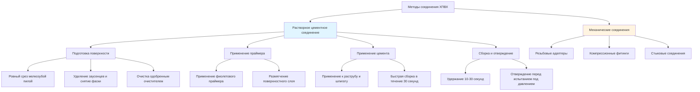

## Обзор

Хлорированный поливинилхлорид (ХПВХ) стал широко распространенным материалом для систем распределения горячего водоснабжения благодаря его устойчивости к коррозии, простоте монтажа и экономичности по сравнению с традиционными металлическими трубопроводами. ХПВХ производится путем постхлорирования смолы ПВХ, увеличивая содержание хлора примерно с 57% до 63-69%, что значительно улучшает устойчивость к температуре и механическую прочность.

Системы трубопроводов из ХПВХ регулируются стандартами ASTM D2846 (распределение горячей и холодной воды) и ASTM F441/F442 (трубопроводы и фитинги ХПВХ сортамента 40 и 80). Эти стандарты устанавливают минимальные требования к материалам, размерам, давлению разрыва и производительности при устойчивом давлении.

## Свойства материала и характеристики производительности

### Рейтинги температуры и давления

ХПВХ демонстрирует зависящие от температуры механические свойства. Стандартная максимальная рабочая температура составляет 93°C при сниженном давлении, хотя непрерывная работа при 82°C рекомендуется для максимального срока службы.

Рейтинг давления снижается с повышением температуры в соответствии с соотношением:

$$P_T = P_{23} \times f_T$$

Где:
- $P_T$ = допустимое давление при температуре T
- $P_{23}$ = рейтинг давления при 23°C (стандартное условие)
- $f_T$ = коэффициент снижения давления в зависимости от температуры

**Коэффициенты снижения давления для ХПВХ:**

| Температура (°C) | Коэффициент снижения | Рейтинг давления (кПа) для SDR 11 |
|------------------|---------------------|-----------------------------------|
| 23 | 1.00 | 2758 |
| 38 | 0.88 | 2427 |
| 49 | 0.75 | 2068 |
| 60 | 0.62 | 1709 |
| 71 | 0.50 | 1379 |
| 82 | 0.40 | 1103 |
| 93 | 0.29 | 800 |

### Химическая совместимость

ХПВХ демонстрирует отличную устойчивость к хлору, хлораминам и колебаниям pH, типичным для муниципальных водоснабжений. В отличие от меди, ХПВХ невосприимчив к коррозии от агрессивной химии воды (низкий pH, высокое содержание хлоридов). Однако несовместимость существует с продуктами на основе нефти, ароматическими углеводородами и хлорированными растворителями.

## Характеристики теплового расширения

ХПВХ имеет значительно более высокий коэффициент линейного теплового расширения по сравнению с системами металлических трубопроводов:

$$\Delta L = \alpha \times L_0 \times \Delta T$$

Где:
- $\Delta L$ = изменение длины
- $\alpha$ = коэффициент линейного расширения = $6.12 \times 10^{-5}$ м/м/°C
- $L_0$ = исходная длина при установочной температуре
- $\Delta T$ = изменение температуры

**Пример расчета:**

Для 15-метрового участка ХПВХ, установленного при 21°C и работающего при 60°C:

$$\Delta L = 6.12 \times 10^{-5} \times 15 \times (60 - 21) = 0.036 \text{ м} = 36 \text{ мм}$$

Это расширение должно быть компенсировано с помощью расширительных петель, смещений или механических компенсаторов расширения, чтобы предотвратить отказ соединения и чрезмерное напряжение подключенного оборудования.

## Методы установки и типы соединений

### Процесс растворного соединения

Растворное цементное соединение создает молекулярную связь между трубопроводом и фитингом путем временного растворения поверхности ХПВХ. Правильная техника критична для герметичных соединений:

1. **Резание:** Используйте мелкозубую пилу или пластиковый труборез; поддерживайте перпендикулярность в пределах 0,5 градуса
2. **Подготовка:** Удалите заусенцы внутри и снаружи кромок; снимите фаску на наружной кромке под углом 10-15 градусов
3. **Сухая посадка:** Проверьте правильность натяга (трубопровод должен входить на 1/3-2/3 глубины раструба)
4. **Грунтовка:** Нанесите одобренный фиолетовый праймер на обе поверхности; праймер содержит агрессивные растворители, которые подготавливают поверхности
5. **Цементирование:** Нанесите цемент щедро на обе поверхности, пока они еще влажные от праймера
6. **Сборка:** Вставьте на полную глубину с поворотом на 1/4; крепко держите в течение 10-30 секунд
7. **Отверждение:** Дайте минимальное время отверждения перед испытанием под давлением (варьируется в зависимости от температуры и диаметра)

**Минимальное время отверждения при 16-38°C:**

- 13-25 мм: 15 минут для обработки, 2 часа для испытания
- 32-50 мм: 30 минут для обработки, 4 часа для испытания
- 63-100 мм: 2 часа для обработки, 6 часов для испытания

Холодные температуры (ниже 4°C) значительно продлевают время отверждения и могут потребовать нагрева рабочей зоны.

## Сравнение материалов

| Свойство | ХПВХ | Медь (тип L) | PEX |
|----------|------|--------------|-----|
| **Макс. рабочая температура** | 93°C | 204°C | 82-93°C |
| **Рабочее давление при 82°C** | 690-1103 кПа | 1034+ кПа | 552-690 кПа |
| **Коэффициент теплового расширения** | $6.12 \times 10^{-5}$ м/м/°C | $1.68 \times 10^{-5}$ м/м/°C | $1.40 \times 10^{-4}$ м/м/°C |
| **Теплопроводность** | 0.145 Вт/(м·K) | 390 Вт/(м·K) | 0.40 Вт/(м·K) |
| **Устойчивость к коррозии** | Отличная | Умеренная (зависит от химии воды) | Отличная |
| **Устойчивость к хлору** | Отличная (до 5 мг/л непрерывно) | Не применимо | Хорошая (варьируется в зависимости от формулировки) |
| **Устойчивость к УФ** | Плохая (деградирует при воздействии) | Отличная | Плохая (требует защиты) |
| **Способ соединения** | Растворный цемент | Паяние свинцом, прессование, компрессия | Обжим, хомут, расширение, прессование |
| **Затраты на установку** | Низкие | Умеренные до высоких | Низкие до умеренных |
| **Стоимость материала (относительная)** | 1.0× | 3.0-4.0× | 1.5-2.0× |
| **Расстояние между опорами при 82°C** | 0.91 м горизонтально | 1.83 м горизонтально | 0.81 м горизонтально |

## Требования к опорам и крепежам

Из-за более низкого модуля упругости ХПВХ (особенно при повышенных температурах) требуется более частое расстояние между опорами по сравнению с металлическими системами. В соответствии с рекомендациями производителя и правилами водопровода:

**Горизонтальные участки:**
- Холодная вода (≤27°C): максимум 1,2 метра
- Горячая вода (60-82°C): максимум 0,9 метра

**Вертикальные участки:**
- Опора на каждом уровне этажа
- Максимальное расстояние 3 метра

Крепежи должны быть разработаны для обеспечения осевого движения при вертикальной поддержке. Жесткие зажимы могут вызвать концентрацию напряжений и преждевременный отказ.

## Соответствие кодексам и стандартам

**Применимые стандарты:**
- **ASTM D2846:** Стандартная спецификация для хлорированного поли(винилхлорида) (ХПВХ) систем распределения горячей и холодной воды
- **ASTM F441:** Стандартная спецификация для пластиковых трубопроводов ХПВХ, сортамент 40 и 80
- **ASTM F442:** Стандартная спецификация для пластиковых фитингов ХПВХ, сортамент 40 и 80
- **ASTM D1784:** Стандартная спецификация для жестких соединений поли(винилхлорида) (ПВХ) и хлорированного поли(винилхлорида) (ХПВХ)
- **NSF/ANSI 61:** Компоненты системы питьевой воды – воздействие на здоровье

**Одобрение типовых кодексов:**
- Международный кодекс сантехники (IPC): одобрено для распределения воды
- Единый код сантехники (UPC): одобрено для распределения воды
- Национальный код сантехники Канады: одобрено с ограничениями по температуре

Все системы ХПВХ должны иметь сертификацию NSF-61 для контакта с питьевой водой и постоянные маркировки, указывающие соответствие применимым стандартам ASTM, рейтинг давления и SDR (стандартное соотношение размеров).

## Преимущества и ограничения

**Преимущества:**
- Превосходная устойчивость к коррозии и накипи
- Более низкая стоимость материала, чем медь
- Снижение теплопотерь по сравнению с металлическим трубопроводом
- Упрощенная установка (не требуется открытый огонь)
- Меньший вес облегчает обработку
- Невосприимчив к электролитической коррозии

**Ограничения:**
- Более высокое тепловое расширение требует осторожного проектирования
- Не может подвергаться воздействию УФ-излучения (наружные/открытые установки)
- Несовместим с определенными химическими веществами и растворителями
- Более низкая температурная способность, чем медь
- Более восприимчив к повреждениям от ударов
- Не может быть согнут или деформирован на месте
- Требует тщательного соблюдения процедур установки

## Заключение

ХПВХ представляет собой жизнеспособную, экономически эффективную альтернативу традиционному металлическому трубопроводу для систем горячего водоснабжения, работающих в пределах его ограничений по температуре и давлению. Успешное применение требует понимания поведения теплового расширения, надлежащих методов растворного соединения, надлежащего проектирования поддерживающих конструкций и соответствия применимым кодексам и стандартам. При надлежащем проектировании и установке в соответствии со спецификациями производителя и требованиями ASTM системы ХПВХ обеспечивают долгосрочное, надежное обслуживание в жилых и легких коммерческих приложениях.
