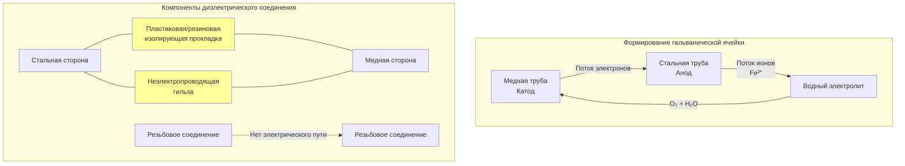

## Обзор

Диэлектрические фитинги обеспечивают электрическую изоляцию между разнородными металлами в системах трубопроводов горячего водоснабжения для предотвращения гальванической коррозии. Когда два металла с разными электродными потенциалами соединены в электролитном растворе (вода), более анодный металл подвергается предпочтительной коррозии. Диэлектрические фитинги прерывают электрическую цепь, сохраняя при этом механическое соединение и целостность под давлением.

**Основные области применения:**
- Соединения водонагревателей (стальной бак к распределению из меди)
- Переходы от латунного вентиля к стальной трубе
- Соединения медь-оцинкованная сталь
- Смешанные циркуляционные контуры

## Основы гальванической коррозии

### Электрохимический потенциал

Движущей силой гальванической коррозии является разность потенциалов между металлами в гальваническом ряду. Гальванический потенциал $E_{galv}$ между двумя металлами определяет скорость коррозии:

$$E_{galv} = E_{cathode} - E_{anode}$$

где $E_{cathode}$ — благородный (менее активный) металл и $E_{anode}$ — более активный металл. Более высокие разности потенциалов ускоряют коррозию.

**Типичные пары металлов ГВС (в морской воде, В относительно насыщенного каломельного электрода):**
| Металл | Потенциал (В) | Роль в Cu-сталь |
|--------|---------------|-----------------|
| Медь | -0,30 | Катод |
| Латунь | -0,35 | Катод |
| Углеродистая сталь | -0,61 до -0,72 | Анод |
| Оцинкованная сталь | -1,03 | Анод |

### Ток коррозии

Плотность тока коррозии $i_{corr}$ между разнородными металлами приблизительно определяется по формуле:

$$i_{corr} = \frac{E_{galv}}{R_{total}} \cdot A_{effective}$$

где:
- $R_{total}$ = общее сопротивление цепи (металл + электролит)
- $A_{effective}$ = эффективная площадь контакта

Скорость потери массы $\dot{m}$ на аноде следует закону Фарадея:

$$\dot{m} = \frac{i_{corr} \cdot M}{n \cdot F}$$

где:
- $M$ = атомная масса коррозирующего металла (г/моль)
- $n$ = число передаваемых электронов (обычно 2 для Fe)
- $F$ = постоянная Фарадея (96 485 Кл/моль)

## Процесс гальванической коррозии

## Типы диэлектрических фитингов

### Диэлектрические соединения

Диэлектрические соединения состоят из:
1. **Изолирующей прокладки** — уплотнение, разделяющее металлические поверхности (EPDM, неопрен или волокно)
2. **Неэлектропроводящей гильзы** — изолирует резьбовое соединение
3. **Гайки соединения** — позволяет разборку

**Преимущества:**
- Обслуживаются в полевых условиях (могут быть разобраны)
- Возможна визуальная проверка
- Подходят для соединений заменяемого оборудования

**Требования к установке:**
- Максимальная температура обслуживания 82°C для стандартных прокладок EPDM
- Установите в доступных местах
- Не используйте герметик для труб на изолирующих компонентах
- Убедитесь в отсутствии контакта металл-металл при сборке

### Диэлектрические ниппели

Предварительно собранные ниппели с интегральной диэлектрической изоляцией, обычно из латунного корпуса с пластиковой гильзой.

**Преимущества:**
- Более компактны, чем соединения
- Отсутствие ошибок сборки в полевых условиях
- Более высокие температурные рейтинги (некоторые до 204°C)
- Часто более низкая стоимость

**Ограничения:**
- Не обслуживаются в полевых условиях
- Не могут быть разобраны для проверки

### Сравнение

| Характеристика | Диэлектрическое соединение | Диэлектрический ниппель |
|--|--|--|
| Обслуживаемость | Съемное | Постоянное |
| Сложность установки | Выше (сборка) | Ниже (предсобранное) |
| Температурный предел | 82°C (станд. EPDM) | До 204°C |
| Рейтинг давления | 1035-2070 кПа | 1035-2070 кПа |
| Проверка | Визуальная при открытии | Невозможна |
| Типичная стоимость | 240-750 руб. | 150-450 руб. |
| Режим отказа | Деградация прокладки | Растрескивание гильзы |
| Признание кодом | Универсальное | Проверить местные органы |

## Требования нормативных документов

### Международный сантехнический кодекс (IPC)

**Раздел IPC 605.23:** Диэлектрические фитинги требуются при соединении разнородных металлов в системах питьевого водоснабжения. Одобренные диэлектрические фитинги включают:
- Диэлектрические соединения
- Диэлектрические ниппели
- Неэлектропроводящие гибкие соединители
- Облицованные переходники медь-сталь

### Единый сантехнический кодекс (UPC)

**Раздел UPC 605.25:** Требует диэлектрических фитингов или изолирующих материалов для предотвращения гальванического воздействия между разнородными металлами. Указывает:
- Фитинги должны соответствовать ASSE 1012 или эквиваленту
- Установка согласно инструкциям производителя
- Не требуется для соединений латунь-медь (схожая благородность)

### Конкретные области применения

**Соединения водонагревателя (IPC 504.6, UPC 510.4):**
- Диэлектрические фитинги обязательны на водонагревателях со стальным баком с распределением из меди
- Установите в пределах первых 46 см от выхода и входа водонагревателя
- Не требуется на водонагревателях с бронзовой или латунной облицовкой

## Лучшие практики установки

### Правильная последовательность установки

1. **Очистите резьбу** — удалите мусор и старый герметик из обоих металлических компонентов
2. **Нанесите герметик** — используйте герметик для труб или ленту PTFE ТОЛЬКО на металлические резьбы (не на изолятор)
3. **Соберите компоненты** — слегка затяните соединение сначала со стороны стали
4. **Проверьте изоляцию** — убедитесь, что изолирующая прокладка и гильза правильно установлены
5. **Окончательное затягивание** — затяните гаечным ключом согласно спецификациям крутящего момента производителя
6. **Проверка непрерывности** — используйте мультиметр для проверки отсутствия электрического соединения

### Типичные ошибки установки

**Контакт металл-металл:**
- Чрезмерное затягивание раздавливает изолирующую прокладку
- Неправильно выровненные резьбы позволяют обойти гильзу
- Мусор перекрывает изолирующий зазор

**Деградация прокладки:**
- Чрезмерная температура выше номинальной
- Несовместимый герметик для труб разрушает резину
- Воздействие химических веществ (хлор, агрессивная вода)

**Проблемы ориентации:**
- Установка диэлектрического соединения в обратном порядке (катод/анод в обратном порядке не влияет на изоляцию, но может повлиять на срок службы прокладки)
- Недостаточный зазор для будущего обслуживания

### Водохимические соображения

Диэлектрические фитинги не устраняют всю коррозию — они предотвращают только гальваническую коррозию. Другие режимы коррозии требуют дополнительного контроля:

**Питтинг-коррозия:** Высокое содержание хлоридов атакует нержавеющую сталь и медь. Контроль через водоподготовку.

**Эрозионная коррозия:** Высокая скорость потока (>2,4 м/с в меди) вызывает механический износ. Контроль через надлежащий размер.

**Равномерная коррозия:** Низкий pH (<6,5) атакует все металлы. Контроль через регулировку pH.

## Соображения проектирования системы

### Защита от помех и заземление

Диэлектрические фитинги прерывают электрическую непрерывность. Если трубопроводы служат в качестве пути электрического заземления:
- Установите отдельный провод заземления через диэлектрический фитинг
- Выберите сечение согласно Национальному электротехническому кодексу (NEC статья 250)
- Часто встречается в старых зданиях, использующих водопроводы для электрического заземления

### Системы циркуляции

В циркуляционных контурах ГВС со смешанными металлами:
- Установите диэлектрические фитинги ВО ВСЕХ соединениях разнородных металлов
- Повышенная температура (49-60°C непрерывно) ускоряет гальваническую коррозию
- Рассмотрите конструкцию с одним металлом, чтобы исключить необходимость диэлектрической изоляции

### Иерархия выбора материалов

**Предпочтительный подход (от наиболее к наименее предпочтительному):**

1. **Система из одного металла** — вся медь или вся сталь (диэлектрические фитинги не требуются)
2. **Металлы схожей благородности** — медь к латуни (минимальная разность потенциалов)
3. **Диэлектрическое разделение** — правильные фитинги на всех соединениях разнородных металлов
4. **Катодная защита** — жертвенные аноды в неизбежных системах со смешанными металлами

## Производительность и долговечность

Ожидаемый срок службы диэлектрических фитингов зависит от качества установки и условий эксплуатации:

**Оптимальные условия (холодная вода, надлежащая установка):** 20-30 лет

**Типичное обслуживание ГВС (49°C, средняя жесткость):** 10-15 лет

**Агрессивные условия (высокая температура, плохое качество воды):** 5-10 лет

**Показатели отказа:**
- Видимые продукты коррозии в месте соединения
- Микротечи возле фитинга
- Снижение расхода (накопление обломков коррозии)
- Изменение цвета воды после долгого застоя

## Итоговая информация

Диэлектрические фитинги являются важными компонентами в системах ГВС со смешанными металлами, предотвращая дорогостоящую гальваническую коррозию путем электрической изоляции. Правильный выбор, установка согласно требованиям нормативов и внимание к условиям обслуживания обеспечивают надежную долгосрочную производительность. Когда конструкция системы это позволяет, применение унифицированных трубопроводных материалов исключает необходимость в диэлектрических фитингах и представляет собой наиболее надежную стратегию предотвращения коррозии.
