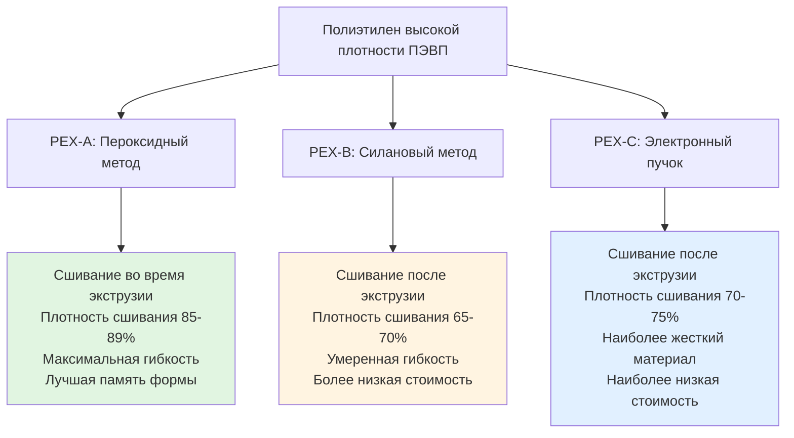

## Обзор

Трубопроводы из сшитого полиэтилена (PEX) представляют значительный прогресс в системах распределения горячего водоснабжения (ГВС). Процесс сшивания создает трехмерные молекулярные связи, которые трансформируют стандартный полиэтилен в материал, способный выдерживать повышенные температуры и давления. PEX обеспечивает гибкость, сокращает время монтажа и обладает устойчивостью к замерзанию по сравнению с жесткими трубопроводными материалами.

## Методы производства и типы PEX

Три различных метода сшивания производят разные характеристики производительности:

**PEX-A (пероксидный метод Энгеля)**: Сшивание происходит во время экструзии при повышенных температурах с использованием пероксидных катализаторов. Это производит равномерную плотность сшивания по всему материалу, что обеспечивает высокую гибкость и памяти формы. При излома PEX-A можно восстановить с помощью тепла.

**PEX-B (силановый метод влажного отверждения)**: Полиэтилен экструдируется с силановыми соединениями, затем подвергается воздействию влаги и катализаторов. Сшивание происходит от внешней стороны к центру, создавая немного менее однородные свойства. Этот метод доминирует на североамериканском рынке благодаря экономической эффективности.

**PEX-C (электронный пучок/холодное сшивание)**: Экструдированный полиэтилен проходит через поле излучения электронного пучка. Глубина сшивания зависит от проникновения пучка, что затрудняет равномерную обработку толстостенных труб. Это наиболее экономичный метод производства.

## Сравнение типов PEX

| Свойство | PEX-A | PEX-B | PEX-C |
|----------|-------|-------|-------|
| Плотность сшивания | 85-89% | 65-70% | 70-75% |
| Гибкость | Максимальная | Умеренная | Минимальная |
| Память формы | Отличная | Хорошая | Удовлетворительная |
| Устойчивость к перегибам | Лучшая | Хорошая | Средняя |
| Номинальная температура | 93°C | 82°C | 82°C |
| Номинальное давление при 23°C | 1100 кПа | 1100 кПа | 1100 кПа |
| Номинальное давление при 82°C | 690 кПа | 550 кПа | 550 кПа |
| Совместимость с расширительными фитингами | Да | Ограниченная | Нет |
| Стоимость | Максимальная | Средняя | Минимальная |
| Основные применения | Премиум жилищный, лучистое отопление | Жилищный, коммерческий | Бюджетный жилищный |

## Характеристики теплового расширения

PEX проявляет значительно более высокое тепловое расширение, чем металлические трубопроводы. Коэффициент линейного теплового расширения PEX составляет примерно $\alpha = 1.98 \times 10^{-4}$ на °C.

Изменение длины вследствие изменения температуры:

$$\Delta L = L_0 \cdot \alpha \cdot \Delta T$$

Где:
- $\Delta L$ = изменение длины (мм)
- $L_0$ = первоначальная длина (мм)
- $\alpha$ = коэффициент линейного теплового расширения (на °C)
- $\Delta T$ = изменение температуры (°C)

**Пример**: Участок PEX длиной 15 м, установленный при 21°C и работающий при 60°C:

$$\Delta L = 15 \text{ м} \times 1000 \text{ мм/м} \times 1.98 \times 10^{-4} \text{ на °C} \times (60-21)\text{°C} = 117 \text{ мм}$$

Это расширение должно быть учтено через гибкость трубы, изменения направления или петли расширения. Врожденная гибкость PEX обычно поглощает это движение без дополнительных мер в большинстве жилых установок.

## Соотношение давления и температуры

Номиналы давления PEX снижаются с повышением температуры согласно стандартам ASTM F876 и ASTM F877. Соотношение следует:

$$P_T = P_{23} \cdot \left(\frac{T_{макс} - T_{раб}}{T_{макс} - 23}\right)^n$$

Где:
- $P_T$ = номинальное давление при рабочей температуре (кПа)
- $P_{23}$ = номинальное давление при 23°C, обычно 1100 кПа (кПа)
- $T_{макс}$ = максимальная номинальная температура (°C)
- $T_{раб}$ = рабочая температура (°C)
- $n$ = зависящий от материала показатель (примерно 2,0 для PEX)

Для системы, работающей при 60°C с PEX-A, номинированным на максимум 93°C:

$$P_{60} = 1100 \text{ кПа} \cdot \left(\frac{93 - 60}{93 - 23}\right)^{2.0} = 1100 \times 0.222 = 244 \text{ кПа}$$

Это расчетная грузоподъемность давления должна превышать рабочее давление системы плюс допуски на гидравлический удар.

## Методы соединения

**Обжимные фитинги**: Медные обжимные кольца сжимаются на PEX и барбы фитингов с помощью специализированных обжимных инструментов. Этот метод работает со всеми типами PEX и обеспечивает надежные, одобренные кодексом соединения. Калибры go/no-go проверяют надлежащие размеры обжима.

**Зажимные фитинги**: Зажимы из нержавеющей стали с интегральным механизмом зажима крепят PEX к барбовым фитингам. Это позволяет исправить ошибки при неправильной установке и не требует откалиброванных инструментов.

**Расширительные фитинги**: Используются исключительно с PEX-A, труба расширяется с помощью специального инструмента, затем надевается на увеличенный фитинг. По мере сужения PEX создается прочное, герметичное уплотнение. Этот метод исключает ограничения потока в соединениях.

**Прессовые фитинги**: Металлические фитинги с уплотнительными кольцами из EPDM прессуют на PEX гидравлическими инструментами, создавая постоянные соединения, совместимые с PEX-A и PEX-B.

## Соображения относительно долговечности материала

**Устойчивость к хлору**: PEX демонстрирует хорошую устойчивость к хлорированной воде до 0,28 мг/л свободного хлора при температурах ниже 60°C. Более высокие температуры или концентрации хлора ускоряют окислительную деградацию в течение десятилетий. ASTM F2023 обеспечивает протоколы испытаний устойчивости к хлору.

**Чувствительность к УФ**: Все типы PEX разлагаются под воздействием ультрафиолетового излучения. Производители обычно указывают максимум 30-60 дней прямого солнечного воздействия до установки. Поверхностная деградация УФ создает хрупкость, требующую срезания пораженных участков перед соединением. PEX должен быть защищен от солнечного света во всех открытых применениях.

**Проницаемость кислородом**: Стандартный PEX позволяет диффузии кислорода в воду, проблематичной для закрытых гидравлических систем с ферросодержащими компонентами. PEX с кислородным барьерным покрытием EVOH (этилвинилалкоголь) снижает проницаемость до <0,1 г/м³·день согласно DIN 4726, обеспечивая защиту от коррозии в приложениях лучистого отопления.

## Соответствие кодексам и стандартам

Установка PEX должна соответствовать:

- **ASTM F876**: Стандартная спецификация для сшитого полиэтилена (PEX)
- **ASTM F877**: Стандартная спецификация для систем распределения горячей и холодной воды из сшитого полиэтилена (PEX)
- **ASTM F2023**: Стандартный метод испытания оценки окислительной устойчивости трубопровода, трубок и систем из сшитого полиэтилена (PEX) к горячей хлорированной воде
- **NSF/ANSI 61**: Компоненты систем питьевого водоснабжения - эффекты на здоровье
- **Международный сантехнический кодекс (IPC)**: Раздел 605.17 разрешает PEX для распределения воды
- **Унифицированный сантехнический кодекс (UPC)**: Раздел 604.0 рассматривает системы трубопроводов PEX

Обозначение размера следует номинальным размерам (CTS - размер медной трубы), при этом 12,7 мм и 19,05 мм являются наиболее распространенными для жилых разветвлений. Максимальная рекомендуемая скорость потока составляет 2,4 м/с для минимизации эрозии и эффектов гидравлического удара.

## Преимущества установки

PEX снижает рабочую силу монтажа благодаря:
- Непрерывным участкам от коллектора к прибору минимизирует фитинги
- Гибкость исключает несколько жестких соединений и изменений направления
- Сниженный риск повреждения от замерзания из-за способности к расширению
- Более низкая теплопроводность (k = 0,23 кДж/ч·м·°C) снижает потери тепла
- Более тихая работа с уменьшенной передачей гидравлического удара

Цветовое кодирование (красный для горячей, синий для холодной, белый для любой) упрощает установку и идентификацию при обслуживании, хотя все цвета обладают идентичными физическими свойствами в классификации того же типа PEX.
