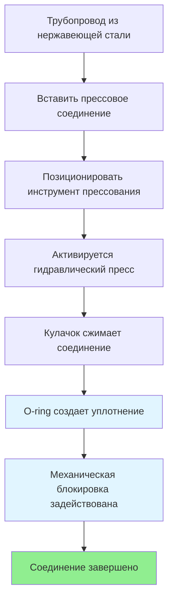

## Обзор

Трубопроводы из нержавеющей стали представляют собой премиальное решение для систем горячего водоснабжения (ГВС), обеспечивая исключительную коррозионную стойкость, срок службы более 50 лет и механическую прочность. На рынке доминируют две основные конфигурации: жесткие трубопроводы из нержавеющей стали с прессовыми или резьбовыми соединениями и гофрированные трубки из нержавеющей стали (CSST) для гибких монтажных систем. Оксидный слой хрома материала обеспечивает присущую ему устойчивость к окислению и образованию накипи, что делает его идеальным для условий с неблагоприятной химией воды.

## Выбор материала: Тип 304 в сравнении с типом 316

Выбор между аустенитными сортами нержавеющей стали зависит от концентрации хлоридов и рабочей температуры.

| Параметр | Тип 304 (18-8) | Тип 316 (18-10-2) | Примечания |
|-----------|-----------------|---------------------|-------|
| Содержание хрома | 18% | 16-18% | Формирование пассивного слоя |
| Содержание никеля | 8% | 10-14% | Стабилизация аустенита |
| Содержание молибдена | 0% | 2-3% | Устойчивость к питтингу |
| Предел хлоридов | <50 мг/л | <200 мг/л | При 60°C |
| Макс. температура | 82°C | 93°C | Непрерывная работа |
| Относительная стоимость | 1,0× | 1,4-1,6× | Только материал |
| Устойчивость к питтингу | Хорошая | Отличная | PREN = 18 vs 25 |

Число, эквивалентное устойчивости к питтингу (PREN), количественно характеризует устойчивость к локальной коррозии:

$$\text{PREN} = \%\text{Cr} + 3,3 \times \%\text{Mo} + 16 \times \%\text{N}$$

Тип 316 достигает PREN ≈ 25 по сравнению с типом 304 при PREN ≈ 18, обеспечивая превосходную устойчивость к питтингу и щелевой коррозии, вызванной хлоридами, в прибрежных установках или объектах, использующих хлорированную очистку воды.

## Коррозионное растрескивание под напряжением, вызванное хлоридами

Аустенитные нержавеющие стали восприимчивы к коррозионному растрескиванию под напряжением, вызванному хлоридами (CSCC), когда одновременно возникают три условия:

1. Растягивающее напряжение (остаточное или приложенное) > 30% предела текучести
2. Концентрация хлоридов > пороговое значение (зависит от температуры)
3. Температура > 60°C

Пороговая концентрация хлоридов экспоненциально снижается с повышением температуры:

$$C_{\text{threshold}} = C_0 \exp\left(-\frac{E_a}{RT}\right)$$

где $C_0$ — эталонная концентрация, $E_a$ = 40 кДж/моль (энергия активации), $R$ — газовая постоянная и $T$ — абсолютная температура.

**Стратегии смягчения:**

- Использовать тип 316L (низкоуглеродистый) для уменьшения сенсибилизации
- Ограничить рабочую температуру <71°C в хлорированной воде
- Указать раствор-отожженное состояние для минимизации остаточного напряжения
- Избегать щелей и застойных зон, где концентрируются хлориды
- Поддерживать скорость потока воды >0,9 м/с для предотвращения концентрационной поляризации

## Рейтинг давления и толщина стенки

Рейтинг давления трубопроводов из нержавеющей стали следует уравнению Барлоу для тонкостенных цилиндров:

$$P = \frac{2St}{D}$$

где $P$ — допустимое давление (кПа), $S$ — допустимое напряжение (кПа), $t$ — толщина стенки (см), $D$ — внешний диаметр (см).

Для Schedule 5S из нержавеющей стали (распространенный в прессовых системах):

- Трубопровод диаметром 25 мм: OD = 3,34 см, стенка = 0,165 см
- Допустимое напряжение при 82°C: $S$ = 103,4 МПа (тип 316)
- Максимальное давление: $P = \frac{2 \times 103,4 \times 0,165}{3,34} = 10,2$ МПа

Рабочее давление для приложений ГВС обычно ограничивается 1,0-1,4 МПа с соответствующими коэффициентами безопасности.

## Технология прессовых соединений

Прессовые механические соединения произвели революцию в установках ГВС из нержавеющей стали, снизив затраты на рабочую силу на 40-60% по сравнению со сварными или резьбовыми стыками.

**Компоненты прессовой системы:**

1. **Корпус прессового соединения из нержавеющей стали** — обычно 316L с зоной прессования
2. **O-ring из EPDM или FKM** — обеспечивает гидравлическое уплотнение, рассчитан на 121°C
3. **Профиль прессования** — геометрия, характерная для производителя (профиль M, V или TH)
4. **Индикатор визуального течения** — выявляет непрессованные соединения при испытании давлением

Операция прессования создает радиальное сжатие, которое создает как механическое натяжение, так и эластомерное уплотнение:

$$F_{\text{seal}} = P \times A_{\text{contact}} \times \mu$$

где $P$ — давление сжатия (обычно 13,8-20,7 МПа), $A_{\text{contact}}$ — площадь контакта O-ring, $\mu$ — коэффициент трения.

## Гофрированные трубки из нержавеющей стали (CSST)

CSST обеспечивает гибкость для сложной прокладки при сохранении коррозионной стойкости нержавеющей стали. Кольцевые гофры позволяют изгибать без перегибов:

**Преимущества:**
- Сокращает количество соединений на 60-80% по сравнению с жесткой трубой
- Рабочая сила на 50% меньше, чем медь
- Гашение вибрации от соответствия гофр
- Подходит для сейсмических зон (гибкость обеспечивает амортизацию движения)

**Ограничения:**
- Сниженная пропускная способность из-за трения гофр (коэффициент C ≈ 120 vs 140 гладкой)
- Ограничено скрытыми приложениями согласно IPC 605.23
- Требует специфичные для производителя концевые соединения
- Более высокая стоимость материала на погонный метр, чем Schedule 5S

## Соответствие кодексам и стандартам

**Применимые кодексы:**
- **International Plumbing Code (IPC)** раздел 605: требует соответствия нержавеющей стали ASTM A312
- **Uniform Plumbing Code (UPC)** раздел 604: разрешает типы 304/316 для питьевой воды
- **NSF/ANSI 61** сертификация требуется для всех компонентов в контакте с водой
- **ASME B16.9** соединения для сварных систем
- **ASTM A312** спецификация бесшовной и сварной трубы

**Требования к установке:**
- Расстояние между опорами: максимум 3 м по горизонтали, 4,5 м по вертикали (IPC таблица 308.5)
- Компенсация расширения: $\Delta L = \alpha L \Delta T$ где $\alpha$ = 1,73 × 10⁻⁵ см/см/°C
- Методы соединения: прессовое согласно инструкции производителя, орбитальная сварка или резьбовое (только Schedule 40)
- Изоляция: минимум R-0,53 м²·°C/Вт для магистралей рециркуляции согласно IECC C404.5

## Экономический анализ

Сравнение начальной установленной стоимости (на 30 м, диаметр 25 мм):

| Материал | Стоимость материала | Стоимость рабочей силы | Общая установленная | Срок службы |
|----------|--------------|------------|-----------------|--------------|
| Медь тип L | 1 070 | 1 555 | 2 625 | 20-30 лет |
| Нержавеющая сталь тип 316 Schedule 5S | 2 330 | 972 | 3 302 | 50+ лет |
| CSST из нержавеющей стали | 2 720 | 778 | 3 498 | 50+ лет |

Анализ стоимости жизненного цикла в течение 50 лет демонстрирует экономическую жизнеспособность нержавеющей стали, несмотря на 25-35% более высокую первоначальную стоимость. Исключение сбоев, связанных с коррозией, и затрат на техническое обслуживание обеспечивает паритет или преимущество общей стоимости владения в агрессивных условиях воды.

## Лучшие практики

**Управление химией воды:**
- Контролировать уровень хлоридов ежеквартально; ограничить <100 мг/л для типа 304, <200 мг/л для типа 316
- Поддерживать pH 6,5-8,5 для сохранения пассивного слоя
- Контролировать растворенный кислород <8 мг/л для минимизации инициирования питтинга
- Тщательно промыть системы после строительства для удаления частиц

**Качество установки:**
- Проверить все прессовые соединения с использованием краски для обнаружения утечек или испытания давлением при 150% рабочего давления
- Использовать непрессованное соединение в качестве преднамеренной точки утечки при вводе в эксплуатацию
- Удалить заусенцы на всех срезанных концах для предотвращения турбулентности и эрозии
- Поддерживать минимум 15 см разделения от разнородных металлов

**Проектирование системы:**
- Размеры для скорости 1,2-2,4 м/с; избегать <0,9 м/с (образование накипи) и >3 м/с (эрозия)
- Предусмотреть петли расширения или смещения для участков >15 м
- Уклонять дренируемые участки минимум 0,6 см на 30 см
- Установить диэлектрические переходники при переходе на медь или сталь

## Заключение

Трубопроводы из нержавеющей стали обеспечивают непревзойденную долговечность и коррозионную стойкость для систем горячего водоснабжения в сложных приложениях. Тип 316 предлагает превосходные характеристики в хлорированной или прибрежной среде, в то время как тип 304 достаточен для условий с контролируемой химией воды. Технология прессовых соединений преобразовала экономику установки, сделав нержавеющую сталь конкурентоспособной с традиционными медными системами при оценке затрат на жизненный цикл. Надлежащий выбор материала, установка согласно инструкциям производителя и управление химией воды обеспечивают оптимальную производительность системы в течение многолетнего срока эксплуатации.
