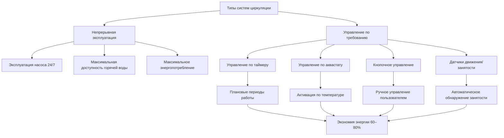
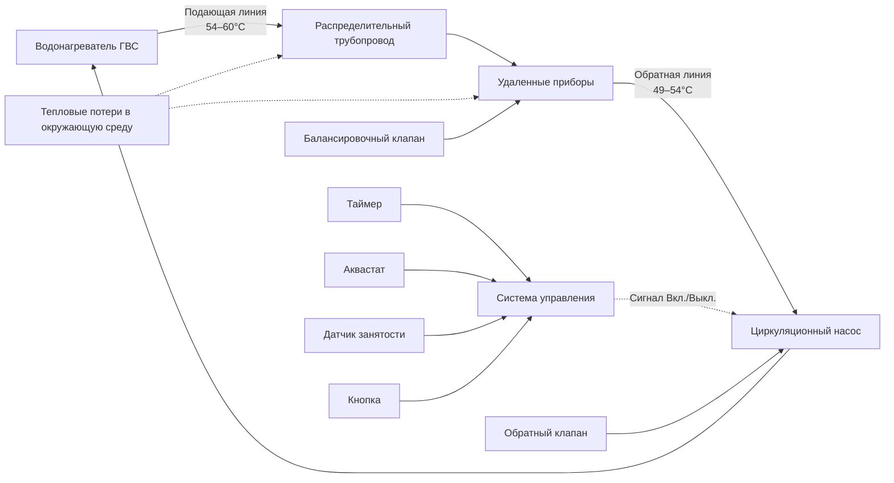

Системы циркуляционного насоса поддерживают температуру горячей воды во всей сети распределения путем непрерывной или периодической циркуляции воды от удаленных приборов обратно к водонагревателю. Эти системы исключают время ожидания горячей воды, но вводят паразитные тепловые потери и энергопотребление насоса, требующие тщательного инженерного анализа.

## Физика тепловых потерь в системах циркуляции

Основным фактором, определяющим работу системы циркуляции, являются тепловые потери из распределительного трубопровода в окружающий воздух. Скорость теплопотерь из открытого или изолированного трубопровода определяется следующим образом:

$$Q_{loss} = U \cdot A \cdot \Delta T = U \cdot (\pi D L) \cdot (T_{water} - T_{ambient})$$

где $U$ — коэффициент общей теплопередачи (кВт/м²·К), $A$ — площадь внешней поверхности трубопровода, $D$ — внешний диаметр, $L$ — длина трубопровода и $\Delta T$ — разница температур.

Для изолированного трубопровода коэффициент общей теплопередачи зависит от теплопроводности через изоляцию и конвекции на внешней поверхности:

$$\frac{1}{U} = \frac{r_{out}}{r_{pipe}} \cdot \frac{1}{h_{inner}} + \frac{r_{out} \ln(r_{ins}/r_{pipe})}{k_{ins}} + \frac{1}{h_{outer}}$$

Циркуляционный насос должен обеспечивать достаточный расход для компенсации этих тепловых потерь и поддержания минимальной температуры контура, обычно 49–60°C у самого удаленного прибора.

## Непрерывная и потребительская циркуляция

### Непрерывная эксплуатация

Непрерывная циркуляция поддерживает доступность горячей воды круглосуточно за счет постоянной работы циркуляционного насоса. Требуемая тепловая энергия:

$$Q_{annual} = Q_{loss} \times 8760 \text{ ч/год}$$

Для типичного 61-метрового контура с медным трубопроводом диаметром 19 мм, изолированным слоем стекловолокна толщиной 25 мм ($k$ = 0,043 Вт/м·К), поддерживающим 54°C воды при окружающей температуре 21°C:

- Тепловые потери на линейный метр: 33–50 Вт/м
- Общие потери контура: 6,5–10,2 кВт
- Годовая тепловая энергия: 57–84 ГДж/год

### Циркуляция с управлением по требованию

Системы с управлением по требованию включают циркуляционный насос только при необходимости, используя управление по таймеру, кнопочное управление, датчики температуры (аквастаты) или датчики движения. График работы обычно соответствует режимам занятости здания.

**Расчет энергосбережения:**

Если непрерывная система работает 8 760 ч/год, но управление по требованию снижает эксплуатацию до 2 920 ч/год (8 ч/день, 365 дней):

$$\text{Коэффициент экономии} = \frac{8760 - 2920}{8760} = 67\%$$

Фактическое сбережение немного ниже из-за увеличенных тепловых потерь в периоды остановки насоса, требующих дополнительной энергии при восстановлении.

## Подбор и проектирование системы

### Расход циркуляционного насоса

Требуемый расход циркуляционного насоса должен обеспечивать компенсацию тепловых потерь:

$$\dot{m} = \frac{Q_{loss}}{c_p \Delta T_{loop}}$$

где $c_p$ = 4,18 кДж/кг·К для воды и $\Delta T_{loop}$ — допустимый перепад температуры по контуру (обычно 2,8–5,6°C).

Для системы с потерями 10,2 кВт и допустимым перепадом 5,6°C:

$$\dot{m} = \frac{10200}{4.18 \times 5.6} = 435 \text{ кг/ч} = 0,12 \text{ л/с}$$

### Требования к напору насоса

Общий напор насоса должен преодолевать потери трения в подающем и обратном трубопроводах, а также потери в фитингах и клапанах:

$$H_{total} = H_{friction} + H_{fittings} + H_{valves}$$

Используя уравнение Дарси–Вейсбаха для потерь напора на трение:

$$H_{friction} = f \cdot \frac{L}{D} \cdot \frac{v^2}{2g}$$

Для трубопроводов малого диаметра при низких расходах потери трения обычно составляют 3–15 кПа на 30 метров трубопровода.

| Диаметр трубы | Расход | Скорость | Потери на трение |
|-----------|-----------|----------|---------------|
| 12,7 мм | 0,063 л/с | 0,73 м/с | 2,6 кПа/30 м |
| 19 мм | 0,126 л/с | 0,95 м/с | 2,8 кПа/30 м |
| 25 мм | 0,189 л/с | 0,85 м/с | 1,5 кПа/30 м |
| 31,8 мм | 0,315 л/с | 1,07 м/с | 1,6 кПа/30 м |

### Энергопотребление насоса

Электрическое энергопотребление циркуляционного насоса:

$$P_{pump} = \frac{\rho g Q H}{3600 \eta_{pump}}$$

где $P_{pump}$ — в ваттах, $Q$ — расход в л/с, $H$ — общий напор в кПа, и $\eta_{pump}$ — КПД насоса (обычно 15–30% для малых циркуляторов).

Типичный малый циркуляционный насос (0,063 л/с, 3,5 кПа, КПД 20%) потребляет:

$$P_{pump} = \frac{1 \times 3,5}{3,6 \times 0,20} = 4,9 \text{ Вт}$$

Годовое энергопотребление насоса при непрерывной эксплуатации:

$$E_{annual} = 4,9 \text{ Вт} \times 8760 \text{ ч} = 43 \text{ кВт·ч/год}$$

## Стратегии управления и оптимизация

### Управление по аквастату

Аквастаты измеряют температуру воды в обратной линии и включают насос, когда температура падает ниже уставки (обычно 35–40°C). Это уравновешивает доступность горячей воды с энергопотреблением:

$$\text{Доля времени работы} = \frac{Q_{loss,avg}}{Q_{pump,capacity}}$$

где средние тепловые потери зависят от колебаний окружающей температуры и эффективности изоляции.

### Управление по температуре и времени

Комбинированное управление по таймеру и аквастату обеспечивает превосходные характеристики:

- Таймеры ограничивают работу периодами занятости
- Аквастаты предотвращают ненужную работу насоса, когда температура контура адекватна
- Типичное энергосбережение: 70–85% по сравнению с непрерывной эксплуатацией

### Балансировочные клапаны

Балансировочные клапаны в обратной линии обеспечивают равномерное распределение расхода по нескольким циркуляционным контурам:

$$\Delta P_{valve} = K \cdot \frac{\rho v^2}{2}$$

Правильная балансировка поддерживает единообразную температуру по всей распределительной системе и предотвращает коротко-замыкание потока.

## Преимущества для сохранения воды

Системы циркуляции исключают потери воды во время ожидания доставки горячей воды. Для прибора в 15 метрах от водонагревателя:

**Без циркуляции:**
- Объем трубопровода: 1,9 л (трубопровод 12,7 мм, 15 м)
- Потери воды при использовании: 1,9 л
- Типичное использование домохозяйством: 20/день
- Годовые потери воды: 13 870 л/год

**С циркуляцией:**
- Потери воды: минимальны
- Годовая экономия воды: 13 870 л/год

Экологические и экономические выгоды необходимо взвешивать против увеличенного потребления тепловой энергии от тепловых потерь в трубопроводах.

## Требования норм и стандартов

**ASHRAE 90.1-2019:**
- Автоматическое отключение насоса при прекращении требования горячей воды
- Минимальная изоляция трубопровода: RSI 0,53 для труб ≤38 мм, RSI 0,70 для труб большего диаметра
- Максимальный перепад температуры циркуляционного контура: 5,6°C

**Единый код сантехники (UPC):**
- Температура в обратной линии циркуляции ≥35°C у самого удаленного прибора
- Обратный клапан требуется в обратной линии
- Предусмотрено рассредоточение давления в закрытых контурах

**Международный код сантехники (IPC):**
- Циркуляционные насосы рассчитаны на минимум 82°C
- Конструкция из бронзы или нержавеющей стали для защиты от коррозии
- Установка предохранительного клапана в закрытых контурах

## Сравнение производительности систем

| Параметр | Непрерывная | Управление по таймеру | Аквастат | Таймер + Аквастат |
|-----------|-----------|---------------|----------|------------------|
| Время ожидания горячей воды | 0 с | 0–30 с | 10–45 с | 10–30 с |
| Годовое время работы | 8 760 ч | 2 920 ч | 3 500 ч | 2 200 ч |
| Энергосбережение | Базовая | 67% | 60% | 75% |
| Сбережение воды | 100% | 95% | 100% | 95% |
| Сложность управления | Низкая | Средняя | Средняя | Высокая |
| Начальные затраты | Низкие | Средние | Средние | Высокие |

Оптимальный проект системы циркуляции уравновешивает доступность горячей воды, энергетическую эффективность, сохранение воды и капитальные затраты через правильный подбор насоса, выбор стратегии управления и спецификацию изоляции. Энергетическое моделирование должно учитывать как тепловые потери, так и мощность насоса для точной оценки затрат жизненного цикла и воздействия на окружающую среду.
