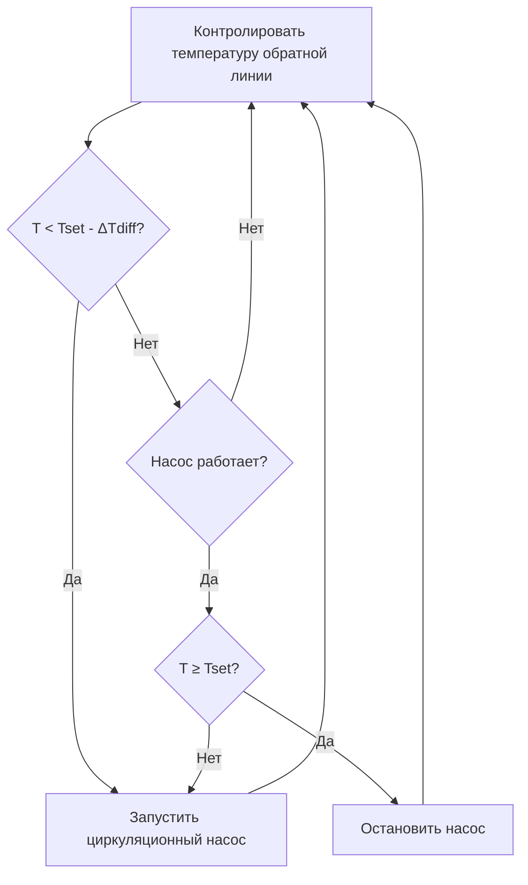
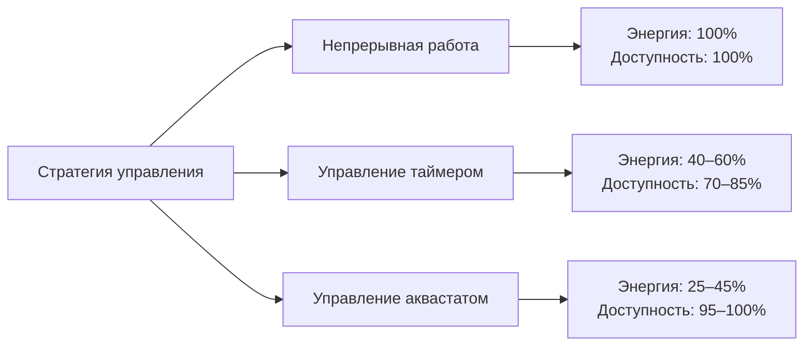

## Основы управления аквастатом

Управление аквастатом представляет наиболее энергоэффективный метод работы систем циркуляции горячего водоснабжения (ГВС). В отличие от непрерывной работы, которая приводит к значительным потерям энергии насоса и увеличению теплопотерь, управление аквастатом циклирует циркуляционный насос на основе фактической температуры обратной линии, поддерживая доступность горячей воды при минимизации потребления энергии.

Стратегия управления использует датчик температуры в обратной линии — самой холодной точке циркуляционного контура — для определения необходимости циркуляции. Когда температура обратной линии падает ниже уставки управления, насос активируется для восстановления горячей воды по всей системе распределения.

## Принцип работы и логика управления

Аквастат работает на основе дифференциального управления, определяемого двумя критическими параметрами:

**Температура уставки ($T_{set}$):** минимально приемлемая температура обратной линии, обычно 49–54°C

**Дифференциал ($\Delta T_{diff}$):** температурный диапазон, предотвращающий быстрое циклирование, обычно 3–6°C

Логика управления насосом следует следующей последовательности:

$$T_{start} = T_{set} - \Delta T_{diff}$$

$$T_{stop} = T_{set}$$

Когда температура обратной линии падает до $T_{start}$, насос включается. Он продолжает работу до повышения температуры до $T_{stop}$, затем отключается до следующего цикла.

## Конфигурация управляющих компонентов

### Размещение датчика температуры

Датчик аквастата должен быть установлен в точке входа обратной линии в водонагреватель или непосредственно перед циркуляционным насосом. Это расположение представляет самую холодную температуру воды в системе и обеспечивает наиболее консервативную точку управления.

Методы установки датчика:

- **Погружная скважина:** наиболее точная, требует проникновения трубы
- **Датчик на поверхности трубы:** адекватный для большинства применений при изоляции датчика
- **Погруженный датчик:** прямой контакт с потоком воды, наивысшая точность

### Выбор уставки

Выбор температуры уставки уравновешивает комфорт пользователя, контроль Legionella и энергоэффективность в соответствии со стандартом ASHRAE 188 и Международным кодексом сантехники (IPC).

| Тип применения | Рекомендуемая уставка | Обоснование |
|-----------------|---------------------|-----------|
| Жилые | 49–50°C | Минимум для комфорта, снижение риска ожога |
| Коммерческие офисы | 50–52°C | Баланс комфорта и контроля Legionella |
| Здравоохранение | 54–60°C | Предотвращение Legionella согласно ASHRAE 188 |
| Промышленность/Пищевое производство | 60°C+ | Требования санитарии |

Температура накопления в системе должна превышать уставку циркуляции по крайней мере на 5°C для обеспечения адекватного температурного дифференциала для теплопередачи по всему циркуляционному контуру.

### Оптимизация дифференциального параметра

Дифференциальный параметр напрямую влияет на частоту циклирования насоса и потребление энергии. Соотношение между дифференциалом и циклированием можно выразить как:

$$N_{cycles} = \frac{Q_{loss}}{V \cdot \rho \cdot c_p \cdot \Delta T_{diff}}$$

Где:
- $N_{cycles}$ = циклы в час
- $Q_{loss}$ = скорость теплопотерь системы (кДж/ч)
- $V$ = объем воды в системе (л)
- $\rho$ = плотность воды (1000 кг/м³)
- $c_p$ = удельная теплоемкость воды (4.18 кДж/кг·°C)
- $\Delta T_{diff}$ = дифференциальный параметр (°C)

**Рекомендации по дифференциальному параметру:**

| Дифференциал | Частота циклирования | Применение |
|--------------|------------------|-------------|
| 3°C | Высокая (8–12 циклов/ч) | Малые системы, требуется быстрый отклик |
| 4°C | Средняя (4–8 циклов/ч) | Стандартные коммерческие системы |
| 6°C | Низкая (2–4 цикла/ч) | Большие системы, приоритет снижения износа |

Меньшие дифференциалы обеспечивают более точное управление температурой, но увеличивают запуски насоса и износ электрических контактов. Большие дифференциалы сокращают циклирование, но могут привести к жалобам пользователей на начальную температуру воды в удаленных приборах.

## Сравнение энергоэффективности

Управление аквастатом обычно достигает экономии энергии на 55–75% по сравнению с непрерывной работой при сохранении превосходной доступности горячей воды по сравнению с простыми управлениями таймером.

Общее потребление энергии циркуляцией включает как энергию насоса, так и тепловые потери:

$$E_{total} = E_{pump} + E_{thermal}$$

$$E_{pump} = P_{pump} \cdot t_{run} \cdot 365 \text{ дней/год}$$

$$E_{thermal} = Q_{loss} \cdot t_{run} \cdot 365 \text{ дней/год}$$

Для типичной коммерческой системы с трубопроводом длиной 152 м диаметром 25 мм с изоляцией:

| Режим работы | Годовая энергия насоса | Годовые теплопотери | Общегодовая стоимость* |
|----------------|-------------------|------------------|-------------------|
| Непрерывная (8760 ч) | 350 кВтч | 185 ГДж | $2800 |
| Аквастат (3500 ч) | 140 кВтч | 74 ГДж | $1150 |
| Экономия | 210 кВтч | 111 ГДж | $1650 (59%) |

*На основе $0,12/кВтч электроэнергии и $12/ГДж природный газ

## Преимущество защиты от замерзания

В системах с наружными трубопроводами или трубопроводами в неотапливаемых помещениях управление аквастатом обеспечивает врожденную защиту от замерзания. Когда окружающие температуры вызывают охлаждение обратной линии, управление автоматически инициирует циркуляцию до того, как может произойти замерзание.

Минимальная безопасная уставка для защиты от замерзания:

$$T_{set,freeze} = 7°C + \frac{Q_{loss,design}}{\.{m} \cdot c_p}$$

Этот расчет обеспечивает адекватную частоту циркуляции для предотвращения замерзания во время расчетных зимних условий.

## Проводка управления и интеграция

Стандартные управления аквастатом работают на напряжении управления 24 В переменного тока с насосом, подключенным через реле или контактор. Базовая проводка следует соглашению HVAC для температурных управлений:

- Клемма R: напряжение питания 24 В переменного тока
- Клемма C: общий возврат
- Клемма W: вывод команды отопления (реле насоса)

Продвинутые системы интегрируются с системами автоматизации зданий (BAS) через BACnet, Modbus или аналоговые сигналы 0–10 В, позволяя дистанционно контролировать температуру обратной линии, количество циклов и время работы насоса для планирования обслуживания.

## Соответствие кодексам и стандартам

- **Международный кодекс сантехники (IPC):** раздел 607.2 требует, чтобы температуры горячей воды на выходе приборов не превышали 60°C в жилых помещениях
- **Стандарт ASHRAE 188:** рекомендует поддерживать температуры обратной линии циркуляции на уровне не ниже 50°C для контроля Legionella в учреждениях здравоохранения
- **Кодекс Калифорнии Title 24:** требует автоматических управлений для циркуляционных насосов; непрерывная работа запрещена в новых строительстве
- **ASHRAE 90.1:** стандарт энергии для зданий требует управлений, которые ограничивают работу насоса периодами спроса

## Обслуживание и устранение неисправностей

Дрейф калибровки датчика температуры представляет основной режим отказа. Ежегодная проверка в сравнении с откалиброванным эталонным термометром обеспечивает точное управление. Частота циклирования насоса вне нормальных параметров указывает на отказ датчика, чрезмерные теплопотери системы или недостаточную емкость водонагревателя.

Контролируйте эти параметры:
- Циклы в час в условиях установившегося состояния
- Температурный дифференциал между накоплением и обраткой
- Процент времени работы насоса
- Прошедшее время от запуска насоса до достижения уставки

Чрезмерное циклирование (>15 циклов/час) указывает на недостаточный дифференциальный параметр или проблемы размещения датчика. Недостаточное циклирование (<1 цикла/час) указывает на отказ датчика, чрезмерную уставку или недостаточные теплопотери системы.
