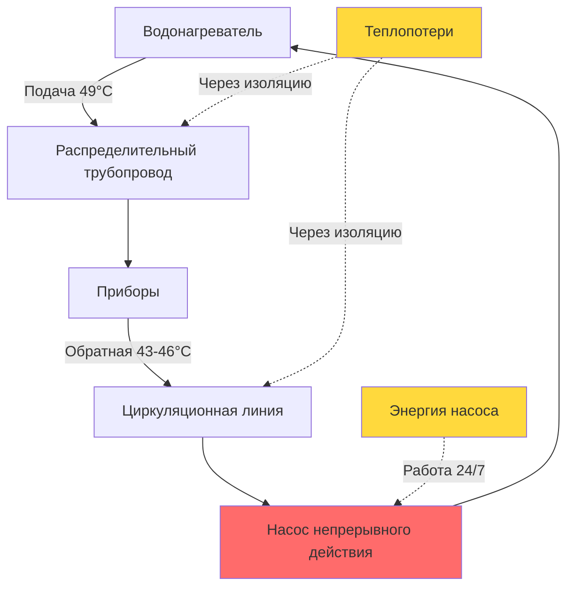
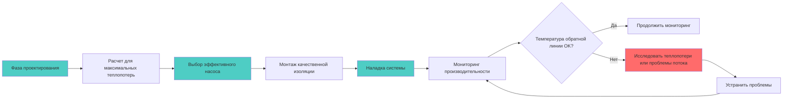

## Обзор

Циркуляционные насосы непрерывного действия обеспечивают бесперебойную циркуляцию горячей воды во всей системе распределения, гарантируя мгновенную подачу горячей воды ко всем приборам 24 часа в сутки, 7 дней в неделю. Данная конфигурация приоритизирует комфорт и удобство жильцов в ущерб максимальному энергопотреблению и теплопотерям из трубопроводных систем.

Непрерывное действие представляет собой самую простую стратегию управления, но несет наиболее высокие операционные затраты. Понимание физики непрерывной циркуляции имеет существенное значение для надлежащего проектирования системы, выбора размера насоса и определения обоснованности этого подхода.

## Физические принципы

### Механизмы теплопотерь

В системе циркуляции непрерывного действия тепло теряется тремя основными способами:

1. **Теплопроводность через изоляцию трубопровода** – основной путь теплопотерь
2. **Конвекция с открытых поверхностей трубопровода** – неизолированные фитинги, клапаны, хомуты
3. **Излучение с высокотемпературных поверхностей** – незначительный вклад при температурах ГВС

Стационарная теплопотеря из изолированного трубопровода рассчитывается следующим образом:

$$Q_{loss} = \frac{2\pi L k}{\ln(r_o/r_i)} (T_{pipe} - T_{ambient})$$

Где:
- $Q_{loss}$ = интенсивность теплопотерь (Вт)
- $L$ = длина трубопровода (м)
- $k$ = теплопроводность изоляции (Вт/м·K)
- $r_o$ = наружный радиус изоляции (м)
- $r_i$ = внутренний радиус изоляции (м)
- $T_{pipe}$ = температура поверхности трубопровода (°C)
- $T_{ambient}$ = температура окружающей среды (°C)

Для практического проектирования систем следует использовать упрощенные значения теплопотерь на единицу длины из справочника ASHRAE Handbook – HVAC Systems and Equipment, таблица 50.19.

### Энергопотребление насоса

Электрическая энергия, потребляемая при непрерывном действии, составляет:

$$E_{annual} = \frac{P_{pump} \times 8760}{1000}$$

Где:
- $E_{annual}$ = годовое потребление энергии (кВт·ч)
- $P_{pump}$ = мощность насоса (Вт)
- $8760$ = часов в году

Полное годовое энергетическое воздействие включает как энергию насоса, так и энергию для компенсации теплопотерь:

$$E_{total} = E_{pump} + \frac{Q_{loss} \times 8760}{\eta_{WH} \times 1000}$$

Где $\eta_{WH}$ – коэффициент полезного действия водонагревателя (десятичная дробь).

## Методология расчета насоса

### Определение расхода

Системы непрерывной циркуляции должны быть рассчитаны для поддержания приемлемого перепада температуры в обратной линии. Стандарт ASHRAE 90.1 требует, чтобы перепад температуры не превышал 5,6°C при расчетных условиях.

Требуемый расход при циркуляции составляет:

$$\dot{m} = \frac{Q_{loss}}{c_p \Delta T_{max}}$$

Где:
- $\dot{m}$ = массовый расход (кг/с)
- $c_p$ = удельная теплоемкость воды, 4,186 кДж/кг·K
- $\Delta T_{max}$ = максимально допустимый перепад температуры (K)

### Расчет перепада давления

Общий перепад давления в системе определяет требуемую напор насоса:

$$\Delta P_{total} = \Delta P_{pipe} + \Delta P_{fittings} + \Delta P_{valves} + \Delta P_{balancing}$$

Для турбулентного течения в трубопроводах:

$$\Delta P_{pipe} = f \frac{L}{D} \frac{\rho v^2}{2}$$

Где:
- $f$ = коэффициент трения Дарси
- $L$ = длина трубопровода (м)
- $D$ = диаметр трубопровода (м)
- $\rho$ = плотность жидкости (кг/м³)
- $v$ = скорость потока (м/с)

## Анализ энергопотребления

### Типичные энергетические воздействия

В следующей таблице показано типичное годовое энергопотребление систем непрерывного действия в жилых и малых коммерческих приложениях:

| Размер системы | Длина трубопровода | Мощность насоса | Годовая энергия насоса | Интенсивность теплопотерь | Годовые теплопотери | Полное годовое потребление энергии |
|---|---|---|---|---|---|---|
| Малая жилая | 30,5 м | 25 Вт | 219 кВт·ч | 586 Вт | 6 132 кВт·ч | 6 351 кВт·ч |
| Большая жилая | 61 м | 35 Вт | 307 кВт·ч | 1 172 Вт | 12 264 кВт·ч | 12 571 кВт·ч |
| Малая коммерческая | 152 м | 75 Вт | 657 кВт·ч | 2 930 Вт | 30 660 кВт·ч | 31 317 кВт·ч |
| Большая коммерческая | 305 м | 150 Вт | 1 314 кВт·ч | 5 860 Вт | 61 320 кВт·ч | 62 634 кВт·ч |

Допущения: изоляция R-0.53, температура окружающей среды 22°C, перепад температуры 5,6°C, КПД водонагревателя 0,95.

## Непрерывное действие в сравнении с управлением по требованию

| Параметр | Непрерывное действие | Управление по требованию |
|---|---|---|
| Время ожидания горячей воды | 0 секунд | 5-30 секунд |
| Годовое время работы насоса | 8 760 часов | 1 000-3 000 часов |
| Потребление энергии насосом | 100% | 11-34% |
| Энергия теплопотерь | 100% | 40-70% |
| Сложность управления | Минимальная | Средняя-высокая |
| Начальная стоимость | Наиболее низкая | На 15-40% выше |
| Операционные затраты | Наиболее высокие | На 30-70% ниже |
| Удовлетворение жильцов | Максимальное | Высокое |
| Соответствие нормам | Требует обоснования по ASHRAE 90.1 | Предпочтительный метод |
| Требования к обслуживанию | Низкие | Средние |

## Когда непрерывное действие уместно

Непрерывное действие следует рассматривать только в специфических обстоятельствах:

**Медицинские учреждения**
- Требования контроля инфекций предусматривают немедленную подачу горячей воды
- Безопасность пациентов имеет приоритет над энергетическими соображениями
- Протоколы контроля легионеллы могут требовать непрерывной циркуляции при температуре выше 51°C

**Критические технологические приложения**
- Фармацевтическое производство со строгим контролем температуры
- Пищевое обслуживание с требованиями органов здравоохранения относительно мгновенной подачи горячей воды
- Лабораторные приложения, требующие немедленного доступа к горячей воде

**Высокозаселенные объекты**
- Отели и курорты с высокими требованиями гостей
- Многоквартирные жилые здания с почти непрерывными режимами использования
- Объекты, в которых режимы использования оправдывают круглосуточную доступность

**Соответствие нормативным требованиям**

Стандарт ASHRAE 90.1-2019, раздел 7.4.4.3 требует автоматического управления для ограничения работы насоса периодами спроса, если не:

1. Система обслуживает отделения оказания медицинской помощи в медицинских учреждениях
2. Непрерывное действие требуется в целях здоровья или безопасности
3. Система не может управляться из-за физических ограничений

Калифорнийский Кодекс Title 24 и другие энергетические кодексы накладывают аналогичные ограничения, требуя управления по требованию как метода по умолчанию со специфическими исключениями.

## Рекомендации по проектированию системы

**Требования к изоляции трубопровода**
- Минимальная изоляция R-0.53 на всех циркуляционных трубопроводах в соответствии с ASHRAE 90.1
- R-0.70 или выше настоятельно рекомендуется для систем непрерывного действия
- Изолируйте все фитинги, клапаны и аксессуары для минимизации открытой площади поверхности

**Контроль температуры**
- Поддерживайте температуру подачи на уровне 49-52°C для бытового использования
- Более высокие температуры (60°C и выше), если существует риск легионеллы, с смесительными клапанами на приборах
- Контролируйте температуру обратной линии; чрезмерный перепад указывает на недостаточный размер насоса или чрезмерные теплопотери

**Выбор насоса**
- Используйте двигатели ECM или постоянные магниты для повышенной эффективности
- Выбирайте насосы с плоскими кривыми эффективности для поддержания производительности при различных режимах нагрузки
- Минимально увеличивайте размер; чрезмерный расход увеличивает энергию насоса без преимуществ

**Балансировка и наладка**
- Установите балансировочные клапаны на ветвевых цепях для обеспечения равномерного распределения потока
- Произведите наладку системы для проверки поддержания температуры во всей системе распределения
- Задокументируйте расходы и перепады давления для справки в будущем

## Мониторинг эксплуатации

Системы непрерывного действия следует контролировать на предмет:
- Температура обратной воды (должна оставаться в пределах 2,8-5,6°C от подачи)
- Мощность насоса (возрастающее потребление указывает на износ подшипников или загрязнение)
- Тенденции энергопотребления (сезонные колебания указывают на проблемы с управлением или изоляцией)

Датчики температуры у самого удаленного прибора служат проверкой того, что система поддерживает расчетные условия во всех сценариях эксплуатации.

## Заключение

Непрерывное действие циркуляции представляет подход с наиболее высоким энергопотреблением к распределению горячей воды для хозяйственных нужд, но обеспечивает максимальный комфорт жильцов благодаря мгновенной подаче горячей воды. Решение о внедрении непрерывного действия должно основываться на подлинных операционных требованиях, исключениях в соответствии с нормами или режимах занятости, оправдывающих энергетическое воздействие. В большинстве приложений управление по требованию или время-регулируемое действие обеспечивает превосходный баланс комфорта и эффективности.

Надлежащий расчет, высококачественная изоляция и эффективный выбор насоса имеют решающее значение для минимизации энергетического воздействия при выборе непрерывного действия. Проектировщики должны задокументировать обоснование непрерывного действия для демонстрации соответствия нормам и информирования будущих операционных решений.
