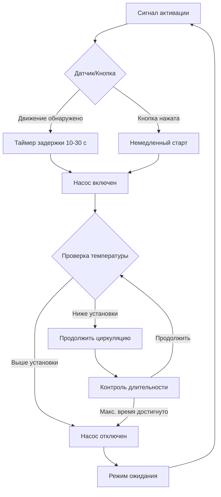

Системы рециркуляции с управлением по требованию активируют циркуляционный насос только при необходимости подачи горячей воды, что значительно снижает часы работы насоса и потери тепла в распределительной системе по сравнению с непрерывной работой. Эти системы используют кнопочные выключатели, датчики движения или триггеры на основе присутствия людей для инициирования циклов рециркуляции, обеспечивая экономию энергии при сохранении приемлемого времени ожидания подачи горячей воды.

## Принципы работы

Системы с управлением по требованию основаны на физическом принципе принудительной конвекции, инициируемой запросом пользователя. При активации насос создает перепад давления, который преодолевает сопротивление потоку в распределительном трубопроводе:

$$\Delta P = \rho g h + f \frac{L}{D} \frac{\rho V^2}{2}$$

где $\Delta P$ — требуемый подъем давления (Па), $\rho$ — плотность воды (кг/м³), $g$ — ускорение свободного падения (9,81 м/с²), $h$ — вертикальный подъем (м), $f$ — коэффициент трения, $L$ — длина трубопровода (м), $D$ — диаметр трубопровода (м), $V$ — скорость потока (м/с).

Насос работает до достижения установленного порога температуры на самом удаленном смесителе или по истечении установленного времени, после чего отключается. В периоды ожидания вода в распределительном контуре охлаждается за счет проводимости и конвективной теплопередачи через теплоизоляцию трубопровода.

## Методы активации

### Управление кнопкой

Проводные или беспроводные кнопки, установленные в местах подключения смесителей, обеспечивают ручную активацию. Пользователи нажимают кнопку за 30-90 секунд до необходимости горячей воды, что позволяет установить циркуляцию горячей воды у смесителя. Насос работает в течение запрограммированной длительности (обычно 3-10 минут) или до достижения датчиком температуры на обратной линии установленного значения.

**Требования к установке:**
- Низковольтная электропроводка (обычно 24 В) от кнопки к реле насоса
- Беспроводные системы используют работающие от батарей передатчики (433 МГц или 915 МГц)
- Несколько кнопок могут активировать один насос параллельно
- Светодиодный индикатор подтверждает статус активации

### Активация по датчику движения

Пассивные инфракрасные (ПИК) датчики обнаруживают присутствие людей в ванных комнатах или на кухне, триггеруя работу насоса до того, как пользователь достигнет смесителя. Размещение датчика требует тщательного рассмотрения зон обнаружения и типичных моделей использования.

**Физика обнаружения:**
ПИК датчики измеряют изменения инфракрасного излучения:

$$\Phi = \epsilon \sigma A T^4$$

где $\Phi$ — излучаемая мощность (Вт), $\epsilon$ — коэффициент излучения (0,95-0,98 для кожи человека), $\sigma$ — постоянная Стефана-Больцмана (5,67 × 10⁻⁸ Вт/м²·К⁴), $A$ — площадь поверхности (м²), $T$ — абсолютная температура (К).

Настройки чувствительности и задержки датчика предотвращают ложные срабатывания при обеспечении адекватного времени предварительной циркуляции.

### Интеллектуальные системы управления

Продвинутые системы интегрируют расписание присутствия, модели использования смесителей и мониторинг температуры:
- Алгоритмы машинного обучения предсказывают потребность на основе исторических паттернов
- Управление через приложение для смартфона удаленная активация
- Интеграция с платформами домашней автоматизации
- Адаптивное управление временем на основе измеренного времени подачи

## Анализ энергетической производительности

Годовое потребление энергии системами с управлением по требованию зависит от частоты активации и продолжительности цикла:

$$E_{annual} = P_{pump} \times N_{cycles} \times t_{cycle} \times \eta_{motor}^{-1} + Q_{dist}$$

где $E_{annual}$ — годовая энергия (кВт·ч), $P_{pump}$ — мощность насоса (Вт), $N_{cycles}$ — годовое количество активаций, $t_{cycle}$ — средняя продолжительность цикла (ч), $\eta_{motor}$ — эффективность двигателя, $Q_{dist}$ — потери тепла в распределительной системе при циркуляции (кВт·ч).

## Сравнительная производительность

| Стратегия управления | Часы работы насоса в день | Годовая энергия (кВт·ч) | Экономия энергии vs непрерывная | Время ожидания горячей воды |
|-----------------|----------------|---------------------|------------------------------|---------------------|
| Непрерывная работа | 24 | 175-350 | Базовое значение | 0 сек |
| Управление таймером | 8-12 | 70-150 | 50-65% | 0-180 сек |
| Управление по требованию | 2-6 | 25-90 | 70-85% | 30-90 сек |
| Интеллектуальное адаптивное | 1,5-4 | 20-60 | 80-90% | 15-60 сек |

*На основе типичной жилой установки, насос 0,37 кВт, длина контура 30 м, изоляция RSI 0,5*

## Конфигурации установки

### Выделенная обратная линия

Стандартная конфигурация с отдельным обратным трубопроводом от самого удаленного смесителя обратно к водонагревателю. Требует:
- Размер обратной линии 50-75% от диаметра линии подачи
- Датчик температуры на обратной линии рядом с входом насоса для обратной связи по температуре
- Обратный клапан для предотвращения гравитационной циркуляции во время ожидания
- Балансировочный клапан для регулировки потока

### Система перекрестной обратной линии

Использует холодную водопроводную линию в качестве обратного пути через перекрестный клапан на самом удаленном смесителе. Соображения при установке:
- Термостатический перекрестный клапан открывается, когда температура воды падает ниже установленного значения
- Исключает выделенный обратный трубопровод
- Может первоначально подавать теплую холодную воду в удаленные смесители
- Не подходит для зданий с отдельными холодными водопроводными стояками

### Конфигурация насоса у смесителя

Небольшой насос, установленный под самым удаленным смесителем, исключает необходимость в обратной линии:
- Центробежный насос 0,04-0,09 кВт
- Управление по таймеру или кнопке
- Возврат воды через холодную линию до повышения температуры
- Идеально подходит для модернизации существующих систем

## Требования кодов и стандартов

**ASHRAE 90.1-2019** раздел 7.4.4.4 требует:
- Автоматические средства управления для отключения циркуляционных насосов при отсутствии необходимости
- Управление с модуляцией температуры или управление по времени отключения
- Изоляция трубопровода согласно таблице 6.8.3

**California Title 24** предписывает управление по требованию для:
- Распределительных контуров более 15 м
- Жилых зданий со множественной единицей со спрос, использующих центральный нагрев воды
- Обязательны элементы управления на основе времени или требования

**International Energy Conservation Code (IECC)** C404.6:
- Циркуляционные системы должны иметь автоматическое управление, реагирующее на присутствие людей или запланированную работу
- Ручная активация соответствует требованиям кода

## Пример расчета энергии

Для жилой системы с контуром длиной 24 м в Южной Калифорнии:

**Непрерывная работа:**
- Мощность насоса: 25 Вт
- Часы работы: 24 × 365 = 8 760 ч/год
- Энергия насоса: 25 Вт × 8 760 ч = 219 кВт·ч/год
- Потери в распределительной системе (оценочно): 150 кВт·ч/год
- **Итого: 369 кВт·ч/год**

**Управление по требованию (12 активаций в день, 5 мин цикл):**
- Часы работы: 12 × 5/60 × 365 = 365 ч/год
- Энергия насоса: 25 Вт × 365 ч = 9,1 кВт·ч/год
- Потери в распределительной системе (сниженные): 25 кВт·ч/год
- **Итого: 34,1 кВт·ч/год**
- **Экономия: 335 кВт·ч/год (91%)**

При стоимости 0,18 доллара/кВт·ч годовая экономия составляет $60, обеспечивая простой период окупаемости менее 3 лет при типичных затратах на систему.

## Соображения при проектировании

**Размер насоса:**
Выбирайте насосы для достижения скорости 0,6-1,2 м/с в трубопроводе подачи с напорной способностью для преодоления потерь на трение и вертикального подъема. Насосы с ECM (электронно коммутируемым двигателем) обеспечивают возможность изменения скорости для оптимизированного использования энергии.

**Время отклика управления:**
Сбалансируйте время предварительной активации с принятием пользователем. Датчики движения требуют ведущее время 10-30 секунд для установления циркуляции до использования смесителя. Системы кнопочного управления обучают пользователей активировать кнопку за 30-60 секунд до душа.

**Системы с несколькими зонами:**
Крупные здания могут требовать нескольких насосов или зональных клапанов для обслуживания различных стояков или секций. Координируйте управление, чтобы предотвратить одновременную работу всех зон.

**Размещение датчика:**
Расположите датчики движения для обнаружения входа в ванные комнаты/кухни перед достижением пользователем смесителей. Избегайте размещения, когда обнаружение происходит после того, как пользователь уже ожидает горячей воды.

Управляемая по требованию рециркуляция представляет оптимальный баланс между удобством мгновенной подачи горячей воды и энергосбережением, достигая 70-90% экономии энергии по сравнению с непрерывной работой при сохранении приемлемого пользовательского опыта благодаря интеллектуальным стратегиям активации.
