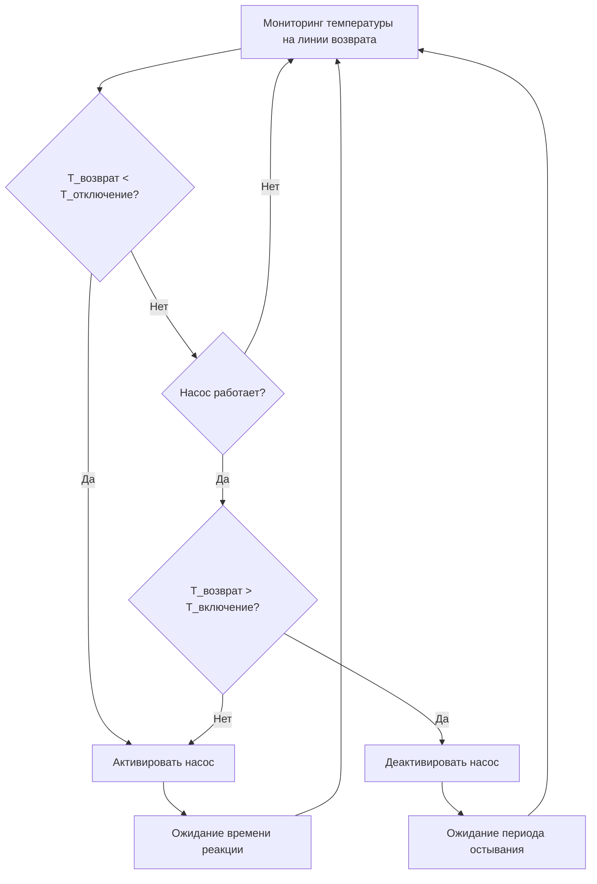

## Принцип работы

Насосы циркуляции с регулированием температуры используют аквастат или датчик температуры на линии возврата для активации циркуляции только при падении температуры воды ниже уставки. Такая работа по требованию сокращает время работы насоса на 40-60% по сравнению с непрерывной работой, при этом сохраняя минимальные требования к температуре во всей распределительной системе.

Логика регулирования активирует насос при падении температуры на линии возврата ниже уставки отключения и деактивирует его при повышении температуры до уставки включения. Это дифференциальное действие предотвращает короткие циклы и снижает термические нагрузки на компоненты системы.

## Логика регулирования и конфигурация уставок

### Зона нечувствительности уставки

Температурный перепад между уставками включения и отключения определяет зону нечувствительности регулирования. Правильный выбор предотвращает чрезмерное переключение при сохранении приемлемого температурного разброса.

**Критерии выбора зоны нечувствительности:**

| Тип системы | Диапазон зоны нечувствительности | Типовая уставка | Частота циклов |
|-------------|----------------------------------|-----------------|----------------|
| Жилая (< 76 л/мин) | 1,7-2,8°C | Отключение: 40,6°C, Включение: 43,3°C | 6-12 циклов/ч |
| Легкая коммерческая (76-300 л/мин) | 2,8-4,4°C | Отключение: 43,3°C, Включение: 47,8°C | 4-8 циклов/ч |
| Крупная коммерческая (> 300 л/мин) | 4,4-6,7°C | Отключение: 46,1°C, Включение: 51,7°C | 2-6 циклов/ч |
| Здравоохранение/критическое | 1,1-1,7°C | Отключение: 50,0°C, Включение: 51,7°C | 10-20 циклов/ч |

Узкие зоны нечувствительности обеспечивают более точное регулирование температуры, но повышают частоту циклов и износ насоса. Широкие зоны нечувствительности снижают потребление энергии, но допускают больший перепад температуры у удаленных приборов.

## Расчеты потерь тепла

Снижение температуры на линии возврата следует закону охлаждения Ньютона с учетом тепловой массы трубопровода:

$$Q_{loss} = UA(T_{avg} - T_{ambient})$$

где:
- $Q_{loss}$ = скорость потерь тепла (кДж/ч)
- $U$ = общий коэффициент теплопередачи (кДж/ч·м²·°C)
- $A$ = площадь поверхности трубопровода (м²)
- $T_{avg}$ = средняя температура воды (°C)
- $T_{ambient}$ = температура окружающей среды (°C)

**Скорость снижения температуры на линии возврата:**

$$\frac{dT}{dt} = -\frac{UA}{m c_p}(T - T_{ambient})$$

где:
- $m$ = масса воды в системе (кг)
- $c_p$ = удельная теплоемкость воды (4,19 кДж/кг·°C)

**Время достижения температуры отключения:**

$$t_{cutout} = \frac{m c_p}{UA} \ln\left(\frac{T_{initial} - T_{ambient}}{T_{cutout} - T_{ambient}}\right)$$

Это уравнение определяет длительность остановки насоса и устанавливает минимально допустимые уровни изоляции для предотвращения чрезмерного переключения.

## Стратегия размещения датчика

Расположение датчика критически влияет на точность регулирования и производительность системы. ASHRAE Guideline 12-2020 рекомендует установку датчика на линии возврата в точке, представляющей самую холодную ожидаемую температуру возврата.

**Иерархия оптимального размещения:**

1. **Основное расположение:** линия возврата непосредственно перед входом в водонагреватель, после последней ветви приборов
2. **Многозонные системы:** линия возврата в точке гидравлически удаленной зоны
3. **Несколько стояков:** датчик на стояке с самой холодной температурой возврата, при необходимости с смесительным вентилем
4. **Стратифицированные возвраты:** нижняя треть вертикального трубопровода возврата для избежания эффектов стратификации

**Требования к установке:**

- Установить в термически изолированном участке для измерения температуры воды, а не окружающей среды
- Минимум 6 диаметров трубопровода вниз по потоку от фитингов или вентилей
- Предпочтительнее использовать термальные колодцы вместо накладных датчиков для точности ±0,6°C
- Закрепить горизонтально в вертикальных трубопроводах для избежания ошибок датчика стратификации
- Обеспечить изолирующие вентили для замены датчика без слива системы

## Характеристики времени реакции

Время реакции системы включает тепловую инерцию датчика, задержку обработки регулирования и время гидравлического транспорта. Общее время реакции влияет на частоту циклов и стабильность температуры.

**Компоненты времени реакции:**

$$t_{total} = t_{sensor} + t_{control} + t_{hydraulic}$$

**Временная постоянная тепловой инерции датчика:**

$$\tau_{sensor} = \frac{m_{sensor} c_{p,sensor}}{h A_{sensor}}$$

Типовые значения:
- Иммерсионный термистор: 8-15 секунд
- Накладной датчик температуры: 25-45 секунд
- Датчик усреднения: 40-90 секунд

**Время гидравлического транспорта:**

$$t_{hydraulic} = \frac{V_{system}}{\dot{V}_{pump}}$$

где $V_{system}$ — общий объем трубопроводов (л), а $\dot{V}_{pump}$ — расход насоса (л/мин).

Быстрая реакция (< 30 сек в сумме) улучшает регулирование температуры, но может увеличить циклирование. Медленная реакция (> 120 сек) снижает циклирование, но допускает больший перепад температуры у приборов.

## Оптимизация энергии

Работа с регулированием температуры снижает потребление энергии тремя способами:

1. **Сокращение энергии на насос:** доля времени работы обычно 0,35-0,55 в сравнении с непрерывной работой
2. **Сокращение потерь в режиме ожидания:** более низкая средняя температура системы снижает потери тепла через трубопровод
3. **Сокращение потерь на тепловое расширение:** меньше циклов горячего-холодного снижает сброс предохранительного клапана

**Расчет годовой экономии энергии:**

$$E_{saved} = 8760 \times (1 - f_{runtime}) \times P_{pump} + Q_{standby,reduced}$$

где $f_{runtime}$ — доля времени работы насоса (типово 0,35-0,55).

**Сравнение годовых эксплуатационных затрат:**

| Тип регулирования | Доля времени работы | Годовое потребление энергии насосом (кВт·ч) | Годовые потери тепла (ГДж) | Итого годовых затрат* |
|-------------------|------------------|--------------------------------------|------------------------------|------------------------|
| Непрерывная | 1,00 | 2 190 | 153 | 3 150 |
| Температурная (2,8°C зона нечувствительности) | 0,45 | 985 | 104 | 1 850 |
| Температурная (4,4°C зона нечувствительности) | 0,38 | 832 | 92 | 1 650 |
| Таймер + температура | 0,28 | 613 | 79 | 1 350 |

*Предполагается: $0,12/кВт·ч электроэнергия, $90/ГДж газ, 76 м трубопровода возврата, медь диаметром 25 мм

## Рекомендации по проектированию

Согласно ASHRAE Standard 90.1-2022, регулирование температуры циркуляции обязательно для систем, обслуживающих приборы на расстоянии более 15 м от водонагревателя. Оптимальная реализация требует:

- Уставка отключения минимум 35,0°C для сохранения соответствия ASSE 1016 по защите от ожогов у приборов
- Зона нечувствительности 2,8-4,4°C для сбалансированного циклирования и регулирования температуры
- Постоянная времени датчика < 20 секунд для систем, требующих точного регулирования (±1,1°C)
- Минимальная изоляция трубопровода возврата RSI-0,53 для достижения доли времени работы 0,40-0,50
- Возможность отключения регулирования для периодической дезинфекции при высокой температуре (минимум 60,0°C)

Регулирование температуры обеспечивает превосходную энергоэффективность по сравнению с непрерывной работой при сохранении требуемых нормами минимальных температур во всей распределительной системе. Правильное размещение датчика и конфигурация зоны нечувствительности обеспечивают надежную работу и максимизацию экономии энергии.
