## Обзор

Таймерные циркуляционные насосы работают по заранее установленному расписанию, согласованному с периодами занятости здания и циклами потребления горячей воды. Эта стратегия управления снижает ненужную циркуляцию в периоды низкого или отсутствующего спроса, непосредственно минимизируя потери тепла в режиме ожидания и энергопотребление насоса, сохраняя при этом приемлемые характеристики подачи горячей воды в часы работы здания.

## Принципы работы

### Расписание по времени суток

Системы таймерного управления активируют циркуляционный насос только в запрограммированные интервалы, обычно соответствующие:

- Утренним пиковым периодам спроса (06:00–09:00 часов)
- Дневным окнам использования (11:00–13:00 часов)
- Вечерним периодам высокого спроса (17:00–22:00 часов)
- Ночному снижению или полному отключению (22:00–06:00 часов)

Насос включается и отключается в соответствии с установленным расписанием независимо от мгновенного спроса, что делает этот подход наиболее эффективным в объектах с предсказуемыми повторяющимися режимами занятости.

### Выравнивание по режимам занятости

Оптимальное программирование таймера требует анализа фактических картин использования горячей воды. Здания с согласованными расписаниями — офисные здания, школы, учреждения здравоохранения со сменными графиками работы — получают наибольшую пользу от таймерного управления. Объекты с нерегулярной или круглосуточной занятостью видят снижение эффективности.

```mermaid
gantt
    title Daily Recirculation Pump Schedule - Office Building
    dateFormat HH:mm
    axisFormat %H:%M

    section Pump Operation
    Morning Circulation    :active, 06:00, 3h
    Midday Circulation     :active, 11:00, 2h
    Evening Circulation    :active, 17:00, 5h
    Night Shutdown         :crit, 22:00, 8h

    section Demand Profile
    Peak Morning Demand    :done, 07:00, 2h
    Lunch Period Demand    :done, 12:00, 1h
    Peak Evening Demand    :done, 18:00, 3h
```

## Анализ энергосбережения

### Снижение потерь в режиме ожидания

Потери тепла в режиме ожидания от циркуляционных трубопроводов происходят непрерывно, когда система поддерживает циркуляцию. Таймерное управление снижает эти потери пропорционально снижению часов работы.

**Суточные потери тепла в режиме ожидания при непрерывной циркуляции:**

$$Q_{standby,continuous} = UA \cdot \Delta T \cdot 24$$

**Суточные потери тепла в режиме ожидания с таймерным управлением:**

$$Q_{standby,timer} = UA \cdot \Delta T \cdot t_{on}$$

**Энергосбережение:**

$$\Delta Q = UA \cdot \Delta T \cdot (24 - t_{on})$$

Где:
- $Q$ = потери тепла (кДж/день или кВт·ч/день)
- $U$ = общий коэффициент теплопередачи (Вт/м²·К)
- $A$ = площадь поверхности трубопровода (м²)
- $\Delta T$ = разность температур между водой и окружающей средой (К)
- $t_{on}$ = часы работы насоса в день (ч)

**Пример расчета:**

Для системы с 152 м медного трубопровода диаметром 2,54 см, изоляцией толщиной 2,54 см (RSI 0,58), температура воды 48,9°C, окружающая среда 21,1°C:

$$U = \frac{1}{RSI} = \frac{1}{0,58} = 1,724 \text{ Вт/м²·К}$$

$$A = \pi \cdot d \cdot L = 3,14 \cdot 0,0254 \cdot 152 = 12,08 \text{ м²}$$

$$Q_{standby,continuous} = 1,724 \cdot 12,08 \cdot 27,8 \cdot 24 = 13,25 \text{ кВт·ч/день}$$

При работе таймера 10 часов/день:

$$Q_{standby,timer} = 1,724 \cdot 12,08 \cdot 27,8 \cdot 10 = 5,52 \text{ кВт·ч/день}$$

$$\Delta Q = 7,73 \text{ кВт·ч/день} = 58,3\% \text{ снижение}$$

### Энергопотребление насоса

**Годовое энергопотребление насоса при непрерывной работе:**

$$E_{pump,continuous} = \frac{P_{pump} \cdot 8760}{\eta_{motor}}$$

**Годовое энергопотребление насоса с таймерным управлением:**

$$E_{pump,timer} = \frac{P_{pump} \cdot h_{annual}}{\eta_{motor}}$$

Где:
- $P_{pump}$ = мощность насоса (Вт)
- $h_{annual}$ = годовые часы работы (ч/год)
- $\eta_{motor}$ = КПД двигателя (в долях единицы)

## Сравнение производительности

| Параметр | Непрерывная циркуляция | Таймерное управление (10 ч/день) |
|----------|------------------------|----------------------------------|
| **Часы работы в день** | 24 | 10 |
| **Годовые часы работы** | 8 760 | 3 650 |
| **Потери в режиме ожидания (% от непрерывного)** | 100% | 41,7% |
| **Энергия насоса (% от непрерывного)** | 100% | 41,7% |
| **Доступность горячей воды** | 24/7 мгновенная | Только в установленные периоды |
| **Время ожидания (в периоды отключения)** | 0 секунд | 30–120 секунд |
| **Первоначальная стоимость** | Базовая | +$150–$400 |
| **Сложность обслуживания** | Низкая | Низкая–средняя |
| **Требуется ввод пользователя** | Нет | Периодическое перепрограммирование |

## Рассмотрение циклической работы насоса

### Циклы пуска-остановки

Таймерные насосы испытывают более частые пуски, чем непрерывно работающие насосы. Надлежащий расчет и выбор двигателя должны учитывать:

- Пусковой ток при запуске
- Механический износ от повторяющихся циклов
- Конструкцию двигателя, подходящую для частых пусков (минимум 10–20 пусков/день)

Стандарт ASHRAE 90.1 допускает таймерное управление в качестве пути соответствия для систем горячего водоснабжения при условии, что система поддерживает температуру выше 43,3°C на приборах в периоды занятости.

### Колебания температуры во время циклов отключения

Когда циркуляция прекращается, температуры трубопровода снижаются в соответствии с:

$$T(t) = T_{ambient} + (T_{initial} - T_{ambient}) \cdot e^{-\frac{UA}{mc}t}$$

Где:
- $T(t)$ = температура воды в трубопроводе в момент времени $t$ (°C)
- $m$ = масса воды в трубопроводе (кг)
- $c$ = удельная теплоемкость воды (4,187 кДж/кг·К)

Это снижение температуры определяет приемлемую длительность цикла отключения перед необходимостью повторного нагрева.

## Нормативные требования и стандарты

**Энергетический стандарт ASHRAE 90.1:**
- Допускает таймерное управление для циркуляционных систем
- Требует изоляцию согласно Таблице 6.8.3
- Требует автоматического отключения в периоды неиспользования

**Международный сантехнический кодекс (IPC):**
- Требует поддержания минимальной температуры 43,3°C на приборах
- Не требует непрерывной циркуляции
- Допускает стратегии управления на основе времени

**California Title 24:**
- Требует насосы с управлением по спросу или по таймеру в большинстве применений
- Запрещает непрерывную циркуляцию во многих типах зданий
- Устанавливает максимально допустимую мощность насоса

## Лучшие практики внедрения

**Программирование расписания:**

1. Проведение двухнедельного мониторинга использования горячей воды
2. Определение пиков спроса и периодов низкого использования
3. Программирование работы насоса за 30 минут до пика спроса
4. Продление работы на 30 минут после прекращения спроса
5. Проверка и корректировка ежеквартально на основе сезонных закономерностей

**Оптимизация конструкции системы:**

- Минимизация длины и объема циркуляционного контура
- Изоляция трубопроводов минимум RSI 0,7, предпочтительно RSI 1,4
- Расчет насоса на проектный расход, без переувеличения
- Установка запорных клапанов для балансировки контура
- Рассмотрение зонированной циркуляции для крупных объектов

**Интеграция управления:**

Таймерное управление может интегрироваться с системами автоматизации зданий для:
- Корректировок расписания выходных дней
- Сезонного перепрограммирования
- Дистанционного мониторинга и корректировки
- Отслеживания энергопотребления
- Интеграции с датчиками занятости

## Заключение

Таймерные циркуляционные насосы обеспечивают значительное энергосбережение — обычно 50–60% снижения в совокупности потерь в режиме ожидания и энергии насоса — в зданиях с предсказуемыми режимами занятости. Стратегия управления требует минимальных дополнительных инвестиций, простого программирования и периодической проверки расписания. Оптимальная производительность зависит от точного анализа занятости, надлежащего конструирования системы и адекватной изоляции трубопроводов для минимизации снижения температуры во время циклов отключения.
