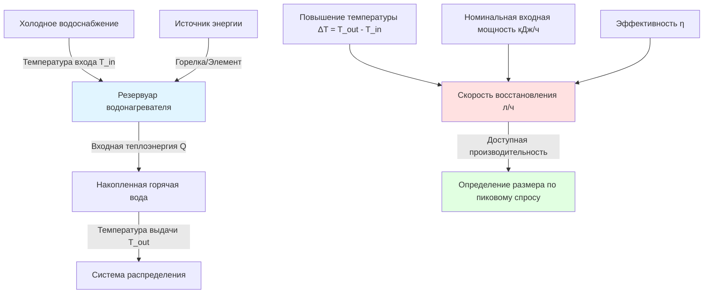
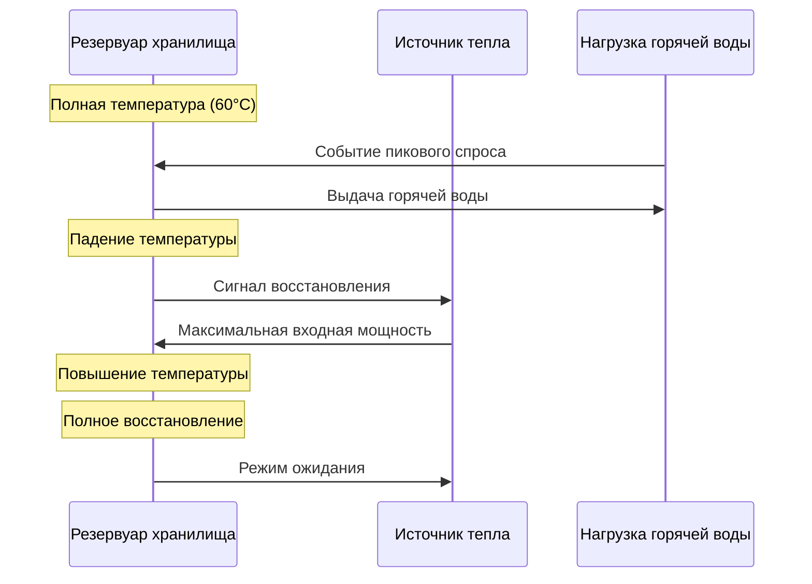

Расчеты времени восстановления определяют скорость, с которой водонагреватель может восстановить объем хранилища до желаемой температуры после потребления воды. Эти расчеты составляют основу правильного размера водонагревателя для жилых, коммерческих и промышленных приложений.

## Основные принципы теплопередачи

Производительность восстановления водонагревателя регулируется балансом энергии между теплоинпутом и накоплением энергии в воде. Количество тепла, необходимое для повышения температуры воды, следует уравнению чувствительного тепла:

$$Q = m \cdot c_p \cdot \Delta T$$

Где:
- $Q$ = тепловая энергия (кДж)
- $m$ = масса воды (кг)
- $c_p$ = удельная теплоемкость воды (4,18 кДж/кг·°C)
- $\Delta T$ = повышение температуры (°C)

Поскольку один литр воды весит приблизительно 1 кг при стандартных условиях, требуемая энергия на литр становится:

$$Q_{litr} = 1 \cdot 4.18 \cdot \Delta T = 4.18 \cdot \Delta T \text{ кДж/литр}$$

Эта постоянная (4,18 кДж/кг·°C) появляется во всех расчетах восстановления и представляет характеристику тепловой массы воды.

## Формула скорости восстановления

Скорость восстановления в литрах в час (л/ч) зависит от номинальной мощности горелки или нагревательного элемента, эффективности нагревателя и повышения температуры:

$$\text{л/ч} = \frac{\text{Input}_{\text{кДж/ч}} \times \eta}{4.18 \times \Delta T}$$

Где:
- $\text{Input}_{\text{кДж/ч}}$ = номинальная входная мощность горелки или элемента
- $\eta$ = тепловая эффективность (в долях)
- $\Delta T$ = повышение температуры (°C)

**Пример расчета:**

Для газового водонагревателя с входной мощностью 42 180 кДж/ч, эффективностью 80%, нагрев воды с 10°C до 60°C:

$$\Delta T = 60 - 10 = 50°C$$

$$\text{л/ч} = \frac{42,180 \times 0.80}{4.18 \times 50} = \frac{33,744}{209} = 161.4 \text{ л/ч}$$

Этот нагреватель восстанавливает приблизительно 161 литр в час при этих условиях.

## Расчеты требований к входной мощности

При проектировании для конкретной скорости восстановления требуемая входная мощность вычисляется путем переформатирования формулы восстановления:

$$\text{Input}_{\text{кДж/ч}} = \frac{\text{л/ч} \times 4.18 \times \Delta T}{\eta}$$

Это уравнение определяет минимальный размер горелки или элемента, необходимый для достижения целевой производительности восстановления.

**Пример определения размера:**

Коммерческое учреждение требует производительность восстановления 378 л/ч с повышением температуры 55°C и ожидаемой эффективностью 85%:

$$\text{Input}_{\text{кДж/ч}} = \frac{378 \times 4.18 \times 55}{0.85} = \frac{86,857}{0.85} = 102,185 \text{ кДж/ч}$$

Выберите горелку мощностью 105 500 кДж/ч, чтобы обеспечить адекватную производительность с запасом безопасности.

## Расчет времени восстановления

Время, необходимое для нагрева определенного объема от холодной воды до установленной температуры:

$$t_{\text{восстановления}} = \frac{V \times 4.18 \times \Delta T}{\text{Input}_{\text{кДж/ч}} \times \eta}$$

Где:
- $t_{\text{восстановления}}$ = время восстановления (часы)
- $V$ = объем танка (литры)

**Пример:**

Электрический водонагреватель объемом 189 литров с двумя нагревательными элементами по 4,5 кВт (15 330 кДж/ч всего) нагрев с 15°C до 60°C:

$$\Delta T = 60 - 15 = 45°C$$

$$t_{\text{восстановления}} = \frac{189 \times 4.18 \times 45}{15,330 \times 0.98} = \frac{35,506}{15,023} = 2.36 \text{ часов}$$

Резервуар требует приблизительно 2 часов и 22 минут для полного восстановления.

## Коэффициенты эффективности

Эффективность нагревателя значительно влияет на производительность восстановления:

| Тип нагревателя | Типичный диапазон эффективности | Влияние на восстановление |
|---|---|---|
| Газовое хранилище (атмосферное) | 75% - 82% | Умеренное восстановление |
| Газовое хранилище (принудительная вентиляция) | 80% - 86% | Улучшенное восстановление |
| Газовое конденсационное | 90% - 98% | Отличное восстановление |
| Электрическое сопротивление | 95% - 99% | Максимальная эффективность |
| Тепловой насос водонагреватель | 200% - 350% COP | Высокая эффективность, более медленное восстановление |

Водонагреватели с тепловым насосом показывают высокую энергетическую эффективность (COP 2,0–3,5), но более низкие скорости восстановления из-за ограниченной емкости теплопередачи (обычно эквивалент 4 000–5 000 кДж/ч).

## Рассмотрения пикового спроса

Скорость восстановления должна удовлетворять пиковому почасовому спросу плюс коэффициент безопасности. ASHRAE Handbook - HVAC Applications рекомендует:

$$\text{Требуемый расход л/ч} = \frac{\text{Спрос в часы пик (литры)}}{\text{Период восстановления (часы)}}$$

Для систем с хранилищем:

$$\text{Доступная горячая вода} = \text{Объем хранилища} + (\text{л/ч восстановления} \times \text{Продолжительность потребления})$$

**Стратегия проектирования:**

1. Рассчитайте максимальный почасовой спрос на горячую воду
2. Определите повышение температуры на основе температуры входящей воды в самом холодном месте
3. Выберите нагреватель со скоростью восстановления, отвечающей 80–100% пикового спроса
4. Добавьте объем хранилища для обработки скачков спроса

## Влияние сезонных вариаций

Температура входящей воды варьируется в зависимости от сезона, влияя на требования к восстановлению:

| Сезон | Типичная температура входа | ΔT к 60°C | Влияние на восстановление |
|---|---|---|---|
| Зима | 4°C - 10°C | 50°C - 56°C | Максимальная нагрузка |
| Весна/Осень | 10°C - 15°C | 45°C - 50°C | Умеренная нагрузка |
| Лето | 15°C - 21°C | 39°C - 45°C | Минимальная нагрузка |

Зимние условия требуют на 25–30% более высокой входной мощности по сравнению с летом для эквивалентных скоростей восстановления. Размер нагревателей следует устанавливать на основе наихудшей (зимней) температуры входящей воды.

## Непрерывное потребление и режим восстановления

Водонагреватели работают в двух отчетливых тепловых режимах:

**Непрерывное потребление:**

$$Q_{\text{непрерывное}} = \text{л/ч}_{\text{потребления}} \times 4.18 \times \Delta T \times \frac{1}{\eta}$$

Входная мощность должна быть равна или превышать потери тепла от непрерывного потребления для установившейся работы.

**Режим восстановления:**

После большого потребления нагреватель работает при полной входной мощности для восстановления температуры резервуара. Время восстановления зависит от используемого объема и доступной входной мощности:

$$t = \frac{V_{\text{использованный}} \times 4.18 \times \Delta T}{\text{Input} \times \eta}$$

## Определение размера для конкретных приложений

Различные приложения требуют различных подходов к восстановлению:

**Жилое:** Размер для утреннего пика (душевые) плюс посудомоечная машина/стирка. Типичные резервуары 150–190 литров с производительностью восстановления 114–151 л/ч.

**Коммерческая кухня:** Размер для непрерывного спроса во время обслуживания. Скорость восстановления должна быть равна или превышать пиковый расход л/ч.

**Промышленный процесс:** Рассчитайте на основе времени цикла партии и требований объема. Может потребоваться несколько нагревателей или конструкция непрерывного потока.

**Здравоохранение:** ASHRAE 170 требует выдачи 60°C для ухода за пациентом. Размер для непрерывного спроса на 24 часа с избыточностью.

## Рейтинг первого часа

Рейтинг первого часа (FHR) объединяет хранилище и восстановление:

$$FHR = 0.7 \times \text{Объем резервуара} + \text{л/ч восстановления}$$

Коэффициент 0,7 представляет используемое хранилище (70% объема резервуара при температуре выдачи). FHR должен соответствовать или превышать спрос в часы пик для правильного определения размера.

Стандарт ASHRAE 118.2 предоставляет стандартизированные процедуры тестирования для определения значений FHR в контролируемых условиях.

## Рекомендации по проектированию

1. **Рассчитайте наихудшие условия:** Используйте минимальную температуру входящей воды и максимальный спрос одновременно
2. **Применайте коэффициенты безопасности:** Размер для 120–130% расчетного пикового спроса
3. **Рассмотрите модуляцию:** Современные нагреватели с модулирующими горелками оптимизируют эффективность при различных нагрузках
4. **Учитывайте потери в распределении:** Добавьте 10–15% для систем циркуляции или длительных трубопроводов
5. **Проверьте соответствие нормам:** Соответствуйте минимальным скоростям восстановления в соответствии с местными сантехническими нормами

Надлежащие расчеты времени восстановления обеспечивают адекватное снабжение горячей водой, избегая при этом оборудования с завышенными размерами, которое тратит энергию в режиме ожидания. Баланс между объемом хранилища и скоростью восстановления определяет общую производительность системы и стоимость эксплуатации.
