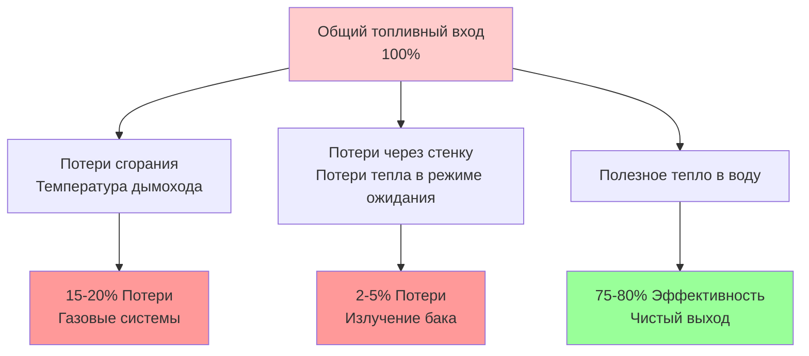

## Основной расчет требования кДж на входе

Требование кДж на входе определяет количество топлива или электрической энергии, необходимое для достижения требуемой мощности водяного отопления. В отличие от выходной мощности, номинальная входная мощность должна учитывать потери эффективности, присущие оборудованию и типу топлива.

### Основное уравнение теплопередачи

Основное требование энергии для нагрева воды:

$$Q = m \times c_p \times \Delta T$$

Где:
- $Q$ = Энергия теплоты (кДж)
- $m$ = Масса воды (кг)
- $c_p$ = Удельная теплоемкость воды (4.18 кДж/кг·°C)
- $\Delta T$ = Повышение температуры (°C)

### Преобразование в литры в час

Для практического подбора водонагревателя расчет переводит в объемный расход:

$$Q_{выход} = л/ч \times 1.0 \times \Delta T \times 4.18$$

Где:
- $л/ч$ = Скорость восстановления в литрах в час
- $1.0$ = Удельная масса воды (кг/л)
- $\Delta T$ = Повышение температуры (°C)

Это дает **выходную мощность** в кДж/ч.

## Расчет номинальной входной мощности с коэффициентом эффективности

Фактическое требование входной мощности компенсирует тепловые потери и неэффективность сгорания:

$$Q_{вход} = \frac{л/ч \times 1.0 \times \Delta T \times 4.18}{Эффективность}$$

Или выраженное как:

$$кДж_{вход} = \frac{л/ч \times 1.0 \times \Delta T \times 4.18}{\eta}$$

Где $\eta$ представляет тепловую эффективность в виде десятичной дроби (0.75 = 75%).

### Поток энергии через систему водонагревателя

## Коэффициенты эффективности по типу топлива

Различные типы водонагревателей демонстрируют отличающиеся характеристики эффективности:

| Тип топлива | Типичный диапазон эффективности | Коэффициент расчета входа |
|-----------|-------------------------|-------------------------|
| Природный газ (Стандартный) | 75% - 80% | Разделить выход на 0.75 - 0.80 |
| Природный газ (Высокоэффективный) | 90% - 95% | Разделить выход на 0.90 - 0.95 |
| Пропан (Стандартный) | 75% - 82% | Разделить выход на 0.75 - 0.82 |
| Мазут | 70% - 85% | Разделить выход на 0.70 - 0.85 |
| Электрическое сопротивление | 98% - 100% | Разделить выход на 0.98 - 1.00 |
| Тепловой насос (Электрический) | 200% - 350% COP | Умножить выход на обратное значение |

**Справочник ASHRAE:** ASHRAE Handbook—HVAC Applications Chapter 51 содержит подробные данные эффективности для различных типов оборудования водяного отопления.

## Примеры расчета подбора

### Пример 1: Подбор газового водонагревателя

**Требования:**
- Скорость восстановления: 190 л/ч
- Повышение температуры: 50°C (10°C на входе до 60°C установки)
- Оборудование: Стандартный атмосферный газовый нагреватель
- Эффективность: 78%

**Расчет:**

Требуемая выходная мощность:
$$Q_{выход} = 190 \times 1.0 \times 50 \times 4.18 = 39,710 \text{ кДж/ч}$$

Требуемая номинальная входная мощность:
$$Q_{вход} = \frac{39,710}{0.78} = 50,910 \text{ кДж/ч}$$

**Результат:** Укажите газовый водонагреватель с номинальной входной мощностью минимум 51,000 кДж/ч.

### Пример 2: Подбор электрического водонагревателя

**Требования:**
- Скорость восстановления: 95 л/ч
- Повышение температуры: 45°C
- Оборудование: Элементы электрического сопротивления
- Эффективность: 100%

**Расчет:**

Требуемая выходная мощность:
$$Q_{выход} = 95 \times 1.0 \times 45 \times 4.18 = 17,893 \text{ кДж/ч}$$

Требуемая номинальная входная мощность (кВ):
$$кВ = \frac{17,893}{3,600} = 4.97 \text{ кВ}$$

**Результат:** Укажите два элемента по 2.5 кВ или один элемент 5.0 кВ.

## Компоненты потерь эффективности

### Механизмы потерь

**Потери через дымоход (системы сгорания):**
- Горячие дымовые газы уносят энергию из системы
- Увеличиваются при избыточном воздухе (неправильное сгорание)
- Обычно 15-25% входной энергии

**Потери через стенку:**
- Потери излучением и конвекцией от поверхности бака
- Непрерывны в периоды режима ожидания
- Минимизированы изоляцией (RSI 2.1 - 4.2)

**Потери циклирования:**
- Охлаждение продувочного воздуха теплообменника (газовые установки)
- Потери тяги в выключенном режиме через дымоход
- Исключены в системах электрического сопротивления

## Номинальная мощность за первый час в сравнении с входной мощностью

Входная мощность определяет **скорость восстановления**, но объем хранилища определяет **номинальную мощность за первый час (FHR)**:

$$FHR = Объем\ бака \times 0.70 + Скорость\ восстановления$$

Где 0.70 представляет 70% используемой горячей воды из хранилища.

| Номинальная входная мощность | Скорость восстановления @ повышение 50°C | С баком 150 л (FHR) | С баком 190 л (FHR) |
|--------------|--------------------------|------------------------|------------------------|
| 30,000 кДж/ч | 115 л/ч | 220 л | 245 л |
| 40,000 кДж/ч | 152 л/ч | 281 л | 306 л |
| 50,000 кДж/ч | 190 л/ч | 338 л | 363 л |
| 75,000 кДж/ч | 286 л/ч | 488 л | 513 л |

## Требования кодексов и стандартов

**ASHRAE Standard 118.1** определяет процедуры тестирования эффективности для коммерческих водонагревателей, устанавливая минимальные требования к тепловой эффективности и потерям в режиме ожидания.

**ASHRAE Standard 90.1** предписывает минимальные коэффициенты энергии:
- Газовые накопительные водонагреватели: EF ≥ 0.67 - (0.0019 × Объем)
- Электрические накопительные водонагреватели: EF ≥ 0.97 - (0.00132 × Объем)

**Федеральные стандарты DOE** регулируют эффективность бытовых водонагревателей через метрики Uniform Energy Factor (UEF), заменяя старые рейтинги Energy Factor (EF).

## Практическая методология подбора

1. **Расчет тепловой нагрузки:** Определить требуемую выходную мощность, используя 1.0 × л/ч × ΔT × 4.18
2. **Выбрать тип топлива:** Учесть доступность, стоимость и характеристики эффективности
3. **Применить коэффициент эффективности:** Разделить выход на тепловую эффективность для определения входа
4. **Добавить коэффициент безопасности:** Увеличить на 10-15% на деградацию и безопасность
5. **Проверить соответствие кодексу:** Подтвердить соответствие минимальным стандартам эффективности
6. **Оценить номинальную мощность за первый час:** Обеспечить достаточность хранилища для пиковых требований

## Соображения по высокоэффективным системам

Конденсационные газовые водонагреватели достигают 90-98% эффективности путем восстановления скрытого тепла из дымовых газов. Расчет входной мощности значительно изменяется:

$$Q_{вход} = \frac{л/ч \times 1.0 \times \Delta T \times 4.18}{0.95}$$

Это снижает потребление топлива примерно на 20% по сравнению со стандартными атмосферными нагревателями, обеспечивая снижение эксплуатационных затрат несмотря на более высокие первоначальные инвестиции.

**Требования технологии конденсации:**
- Температура дымовых газов ниже 60°C
- Материалы, устойчивые к коррозии (нержавеющая сталь)
- Отвод конденсата и нейтрализация
- Дымоходы категории IV (допускается ПВХ или ХПВХ)

---

**Инженерное примечание:** Всегда проверяйте данные производителя производительности при конкретных условиях эксплуатации. Опубликованные рейтинги эффективности отражают условия стандартизированного тестирования, которые могут не представлять фактические условия установки. Учитывайте высоту над уровнем моря, вариации температуры входящей воды и схемы одновременного использования при окончательном выборе оборудования.
