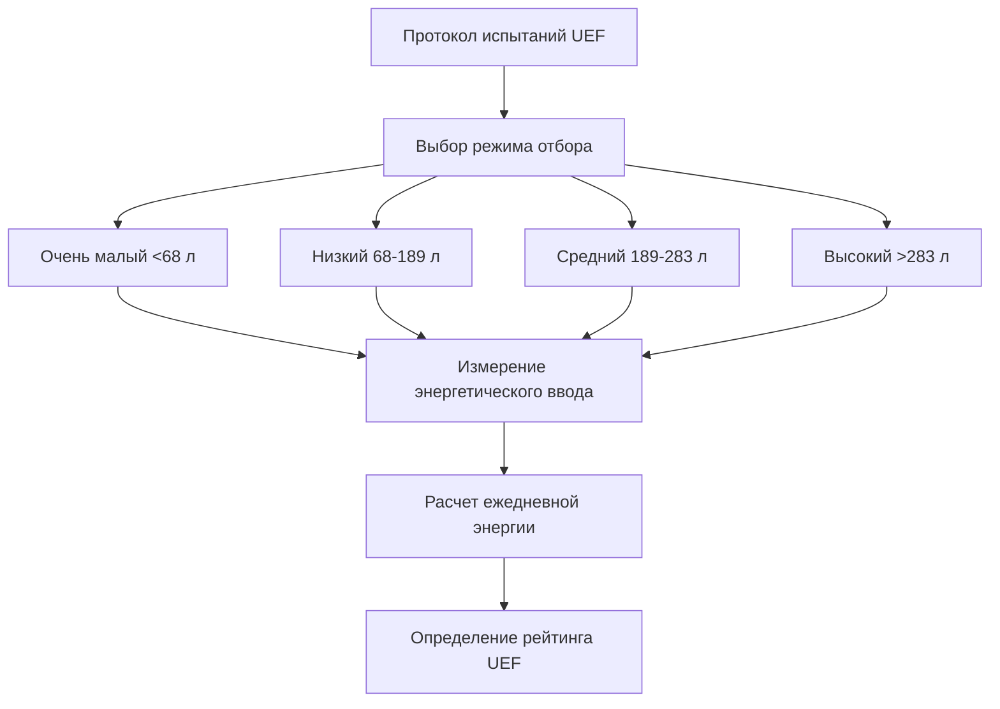
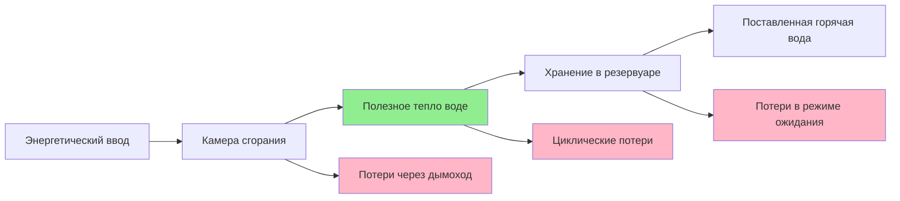

## Обзор

Эффективность водонагревателя охватывает множество метрик производительности, которые количественно определяют эффективность преобразования энергии, потери при тепловом хранении и поведение при рабочих циклах. Понимание этих факторов необходимо для точных расчетов времени восстановления и выбора системы.

## Тепловая эффективность

Тепловая эффективность представляет собой отношение полезного тепла, передаваемого воде, к общему энергетическому вводу во время активного нагрева. Эта метрика установившегося состояния исключает потери в режиме ожидания и циклические потери.

**Системы на газе:**

$$\eta_t = \frac{m \cdot c_p \cdot \Delta T}{Q_{input} \cdot t} \times 100\%$$

Где:
- $\eta_t$ = Тепловая эффективность (%)
- $m$ = Массовый расход воды (кг/с)
- $c_p$ = Удельная теплоемкость воды (4,186 кДж/кг·К)
- $\Delta T$ = Повышение температуры (К)
- $Q_{input}$ = Скорость подачи топлива (кВт)
- $t$ = Временной интервал (с)

**Системы электрического сопротивления:**

Электрические нагреватели сопротивления обычно достигают 98-100% тепловой эффективности, поскольку почти вся электрическая энергия преобразуется непосредственно в тепло внутри резервуара. Уравнение эффективности упрощается до:

$$\eta_t = \frac{P_{output}}{P_{input}} \times 100\%$$

## Эффективность сгорания

Для газовых и масляных водонагревателей эффективность сгорания измеряет, насколько эффективно энергия топлива преобразуется в тепло в камере сгорания до учета потерь через дымоход.

$$\eta_c = 100\% - \left(\frac{T_{flue} - T_{ambient}}{T_{flue}} \times K\right)$$

Где:
- $\eta_c$ = Эффективность сгорания (%)
- $T_{flue}$ = Температура дымовых газов (К)
- $T_{ambient}$ = Температура окружающего воздуха (К)
- $K$ = Константа, зависящая от топлива (0,5 для природного газа, 0,6 для пропана)

Типичные эффективности сгорания:

| Тип оборудования | Эффективность сгорания | Примечания |
|----------------|----------------------|-------|
| Атмосферный газ | 76-82% | Значительные потери через дымоход |
| Газ с принудительной вентиляцией | 82-88% | Сниженные потери через дымоход |
| Конденсационный газ | 90-98% | Рекуперация скрытого тепла |
| На масле | 80-88% | Зависит от настройки горелки |

## Коэффициент энергии (EF)

Коэффициент энергии представляет общую эффективность системы, включая эффективность восстановления, потери в режиме ожидания и циклические потери в условиях испытаний DOE. Эта метрика была основным рейтингом эффективности до 2017 года.

$$EF = \frac{Q_{delivered}}{Q_{consumed}}$$

**Компоненты расчета:**

$$EF = \frac{V \cdot \rho \cdot c_p \cdot \Delta T}{Q_{daily}}$$

Где:
- $V$ = Ежедневное потребление горячей воды (л)
- $\rho$ = Плотность воды (кг/л)
- $Q_{daily}$ = Общее ежедневное энергопотребление (кДж)

## Единый коэффициент энергии (UEF)

Единый коэффициент энергии заменил EF в 2017 году, обеспечивая более реалистичную оценку на основе обновленных процедур испытаний DOE. UEF учитывает четыре различных режима использования.

**Циклы испытаний UEF:**

$$UEF = \frac{E_{delivered}}{E_{input}} = \frac{\sum_{i=1}^{n} m_i \cdot c_p \cdot \Delta T_i}{Q_{total}}$$

**UEF по технологиям:**

| Технология | Типичный диапазон UEF | Эффективность восстановления |
|------------|-------------------|---------------------|
| Электрическое сопротивление | 0,90-0,95 | 98% |
| Газ атмосферный | 0,58-0,65 | 76-82% |
| Газ с принудительной вентиляцией | 0,62-0,68 | 82-88% |
| Газ конденсационный | 0,80-0,96 | 90-98% |
| Электрический тепловой насос | 2,0-4,0 | 200-400% COP |
| Солнечный с резервной системой | 1,5-3,0 | Зависит от инсоляции |

## Коэффициент потерь в режиме ожидания

Потери в режиме ожидания представляют рассеивание тепла из накопительного резервуара в окружающую среду во время простоя. Эта пассивная потеря напрямую влияет на расчеты времени восстановления.

**Коэффициент потерь в режиме ожидания:**

$$Q_{standby} = UA \cdot (T_{tank} - T_{ambient})$$

Где:
- $Q_{standby}$ = Скорость потерь тепла в режиме ожидания (Вт)
- $U$ = Общий коэффициент теплопередачи (Вт/м²·К)
- $A$ = Площадь поверхности резервуара (м²)

**Нормализованные потери в режиме ожидания:**

$$S = \frac{Q_{standby}}{Q_{storage}} \times 100\% \text{ в час}$$

ASHRAE 118.1 устанавливает максимальные процентные потери в режиме ожидания:

| Объем резервуара (л) | Максимальные потери в режиме ожидания (%/ч) |
|----------------|----------------------------|
| <190 | 3,0 |
| 190-270 | 2,5 |
| 270-450 | 2,0 |
| >450 | 1,5 |

## Циклические потери

Циклические потери возникают во время цикла нагрева в результате:
- Потери тепла через дымоход во время работы горелки
- Нарушение тепловой стратификации
- Поток воздуха после очистки (газовые системы)

**Влияние циклических потерь:**

$$\eta_{effective} = \eta_t - L_{cycling}$$

Где:
- $L_{cycling}$ = Энергия, потерянная на цикл, разделенная на полученную энергию

## Анализ энергетических потоков

Полный энергетический баланс для накопительного водонагревателя:

$$Q_{input} = Q_{useful} + Q_{flue} + Q_{standby} + Q_{cycling} + Q_{jacket}$$

**Соотношение эффективности:**

$$UEF = \frac{Q_{useful}}{Q_{input}} = \eta_c \cdot \eta_{transfer} \cdot (1 - L_{standby}) \cdot (1 - L_{cycling})$$

## Применение эффективности восстановления

При расчете времени восстановления применяйте соответствующий коэффициент эффективности:

**Для первоначального нагрева:**

$$t_{recovery} = \frac{V \cdot \rho \cdot c_p \cdot \Delta T}{P_{input} \cdot \eta_t}$$

**Для работающих систем:**

$$t_{effective} = \frac{V \cdot \rho \cdot c_p \cdot \Delta T}{P_{input} \cdot UEF}$$

Разница между $\eta_t$ и UEF может увеличить время восстановления на 15-40% в зависимости от типа системы и условий эксплуатации.

## Стандартные ссылки

**Стандарты ASHRAE:**
- ASHRAE 118.1: Метод испытания для оценки жилых водонагревателей
- ASHRAE 118.2: Метод испытания для оценки коммерческих водонагревателей

**Нормативные акты DOE:**
- 10 CFR Part 430, Subpart B, Appendix E: Унифицированный метод испытания для измерения энергопотребления
- Федеральные стандарты эффективности устанавливают минимальные значения UEF в зависимости от размера резервуара и типа топлива

## Практические соображения

**Факторы выбора системы:**

1. **Высокий спрос:** Приоритет тепловой эффективности ($\eta_t$) над UEF
2. **Низкое использование:** Минимизация потерь в режиме ожидания за счет улучшенной изоляции
3. **Частота циклов:** Конденсационные агрегаты значительно снижают циклические потери
4. **Стоимость жизненного цикла:** UEF обеспечивает наиболее точный прогноз затрат на энергию

**Деградация эффективности:**

Эффективность водонагревателя снижается с течением времени из-за:
- Накопления отложений на поверхностях теплообменника (снижение на 5-15%)
- Сжатия и деградации изоляции (увеличение потерь в режиме ожидания на 2-5%)
- Загрязнения системы сгорания (снижение эффективности на 3-8%)

Регулярное техническое обслуживание сохраняет расчетную эффективность и обеспечивает точные прогнозы времени восстановления.
